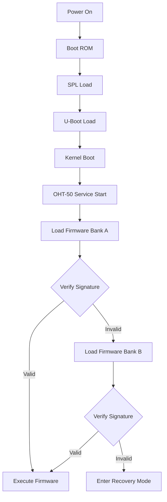

# Bootloader Layout & Secure Boot - OHT-50

## 📋 **Tổng quan**
Tài liệu mô tả layout bộ nhớ và cơ chế secure boot tối thiểu cho OHT-50 trên Orange Pi 5B (RK3588).

**Ngày tạo:** 2025-01-27  
**Phiên bản:** v1.0  
**Trạng thái:** Draft

---

## 🎯 **Mục tiêu**

### **Bootloader Layout**
- Định nghĩa layout bộ nhớ cho bootloader, firmware, và dữ liệu
- Hỗ trợ dual-bank firmware cho rollback an toàn
- Quản lý bộ nhớ hiệu quả cho embedded system

### **Secure Boot**
- Kiểm chứng tính toàn vẹn firmware
- Chống downgrade attack
- Cơ chế rollback an toàn

---

## 📊 **Memory Layout**

### **Flash Memory Map (eMMC/SD)**
```
0x00000000 - 0x00080000: Boot ROM (64KB)
0x00080000 - 0x00100000: SPL (Secondary Program Loader) (512KB)
0x00100000 - 0x00200000: U-Boot (1MB)
0x00200000 - 0x01000000: Kernel + DTB (14MB)
0x01000000 - 0x02000000: RootFS (16MB)
0x02000000 - 0x03000000: OHT-50 Firmware Bank A (16MB)
0x03000000 - 0x04000000: OHT-50 Firmware Bank B (16MB)
0x04000000 - 0x05000000: Configuration Data (16MB)
0x05000000 - 0x06000000: Log Data (16MB)
0x06000000 - 0x08000000: Reserved (32MB)
```

### **RAM Memory Map**
```
0x00000000 - 0x01000000: Kernel Space (256MB)
0x01000000 - 0x02000000: User Space (256MB)
0x02000000 - 0x02100000: OHT-50 Firmware Stack (1MB)
0x02100000 - 0x02200000: OHT-50 Firmware Heap (1MB)
0x02200000 - 0x02300000: Shared Memory (1MB)
0x02300000 - 0x02400000: DMA Buffers (1MB)
```

---

## 🔐 **Secure Boot Implementation**

### **1. Firmware Signing**
```bash
# Tạo key pair cho signing
openssl genrsa -out oht50_private.pem 2048
openssl rsa -in oht50_private.pem -pubout -out oht50_public.pem

# Sign firmware
openssl dgst -sha256 -sign oht50_private.pem -out firmware.sig firmware.bin
```

### **2. Firmware Structure**
```
[Header (64 bytes)]
├── Magic Number: "OHT50" (5 bytes)
├── Version: 4 bytes
├── Size: 4 bytes
├── CRC32: 4 bytes
├── Signature: 256 bytes (RSA-2048)
├── Reserved: 47 bytes

[Firmware Data]
├── Code Section
├── Data Section
├── BSS Section

[Footer (32 bytes)]
├── CRC32: 4 bytes
├── Size: 4 bytes
├── Reserved: 24 bytes
```

### **3. Boot Process**


---

## 🔧 **Implementation Details**

### **1. Bootloader Configuration**
```bash
# U-Boot environment variables
setenv bootcmd "run bootcmd_emmc"
setenv bootcmd_emmc "mmc dev 0; mmc read 0x02000000 0x800 0x7000; bootm 0x02000000"
setenv bootargs "console=ttyS2,115200 root=/dev/mmcblk0p2 rw rootwait"
```

### **2. Firmware Loading Script**
```bash
#!/bin/bash
# /usr/local/bin/load_oht50_firmware.sh

FIRMWARE_BANK_A="/dev/mmcblk0p3"
FIRMWARE_BANK_B="/dev/mmcblk0p4"
PUBLIC_KEY="/etc/oht50/oht50_public.pem"
CURRENT_BANK="A"

# Load and verify firmware
load_firmware() {
    local bank=$1
    local firmware_dev=$2
    
    echo "Loading firmware from bank $bank..."
    
    # Read firmware header
    dd if=$firmware_dev of=/tmp/firmware_header bs=64 count=1
    
    # Extract version and size
    VERSION=$(dd if=/tmp/firmware_header bs=4 count=1 skip=5 2>/dev/null | od -An -tu4)
    SIZE=$(dd if=/tmp/firmware_header bs=4 count=1 skip=6 2>/dev/null | od -An -tu4)
    
    echo "Firmware version: $VERSION, size: $SIZE bytes"
    
    # Verify signature
    if verify_signature $firmware_dev $SIZE; then
        echo "Firmware signature verified"
        return 0
    else
        echo "Firmware signature verification failed"
        return 1
    fi
}

# Verify RSA signature
verify_signature() {
    local firmware_dev=$1
    local size=$2
    
    # Extract signature
    dd if=$firmware_dev of=/tmp/firmware_sig bs=256 count=1 skip=1 2>/dev/null
    
    # Extract firmware data (skip header)
    dd if=$firmware_dev of=/tmp/firmware_data bs=64 skip=1 count=$((size/64)) 2>/dev/null
    
    # Verify with public key
    openssl dgst -sha256 -verify $PUBLIC_KEY -signature /tmp/firmware_sig /tmp/firmware_data
    
    return $?
}

# Main boot logic
main() {
    # Try bank A first
    if load_firmware "A" $FIRMWARE_BANK_A; then
        CURRENT_BANK="A"
        echo "Successfully loaded firmware from bank A"
    else
        echo "Bank A failed, trying bank B..."
        if load_firmware "B" $FIRMWARE_BANK_B; then
            CURRENT_BANK="B"
            echo "Successfully loaded firmware from bank B"
        else
            echo "Both banks failed, entering recovery mode"
            enter_recovery_mode
        fi
    fi
    
    # Start OHT-50 service
    systemctl start oht50-firmware
}

main
```

### **3. Recovery Mode**
```bash
#!/bin/bash
# /usr/local/bin/recovery_mode.sh

enter_recovery_mode() {
    echo "Entering recovery mode..."
    
    # Stop OHT-50 services
    systemctl stop oht50-firmware
    
    # Start recovery service
    systemctl start oht50-recovery
    
    # Enable network for firmware update
    systemctl start networking
    
    # Start firmware update server
    python3 /usr/local/bin/firmware_update_server.py
}
```

---

## 📋 **Security Checklist**

### **Bootloader Security**
- [ ] **Secure Boot**: RSA-2048 signature verification
- [ ] **Anti-Downgrade**: Version checking mechanism
- [ ] **Dual Bank**: Rollback capability
- [ ] **Recovery Mode**: Safe fallback mechanism

### **Firmware Security**
- [ ] **Code Signing**: All firmware signed with private key
- [ ] **Integrity Check**: CRC32 verification
- [ ] **Version Control**: Semantic versioning
- [ ] **Secure Storage**: Keys stored in secure location

### **Runtime Security**
- [ ] **Memory Protection**: Stack canaries, ASLR
- [ ] **Input Validation**: Sanitize all inputs
- [ ] **Secure Communication**: TLS for network communication
- [ ] **Logging**: Security event logging

---

## 🔄 **Firmware Update Process**

### **1. Update Preparation**
```bash
# Create update package
tar -czf oht50_firmware_v1.1.0.tar.gz \
    firmware.bin \
    firmware.sig \
    update_script.sh \
    rollback_script.sh
```

### **2. Update Execution**
```bash
#!/bin/bash
# update_script.sh

VERSION="1.1.0"
BACKUP_BANK="B"
ACTIVE_BANK="A"

# Backup current firmware
dd if=/dev/mmcblk0p3 of=/dev/mmcblk0p4 bs=1M

# Write new firmware
dd if=firmware.bin of=/dev/mmcblk0p3 bs=1M

# Verify new firmware
if verify_firmware /dev/mmcblk0p3; then
    echo "Update successful"
    # Update boot configuration
    echo "A" > /etc/oht50/active_bank
else
    echo "Update failed, rolling back"
    dd if=/dev/mmcblk0p4 of=/dev/mmcblk0p3 bs=1M
fi
```

---

## 📊 **Monitoring & Logging**

### **Boot Logging**
```bash
# /var/log/oht50_boot.log
2025-01-27 13:45:01 [INFO] OHT-50 Bootloader v1.0.0
2025-01-27 13:45:02 [INFO] Loading firmware from bank A
2025-01-27 13:45:03 [INFO] Firmware signature verified
2025-01-27 13:45:04 [INFO] Firmware version 1.0.0 loaded
2025-01-27 13:45:05 [INFO] OHT-50 service started
```

### **Security Events**
```bash
# /var/log/oht50_security.log
2025-01-27 13:45:03 [SECURITY] Firmware signature verified successfully
2025-01-27 13:45:04 [SECURITY] Firmware version check passed
2025-01-27 13:45:05 [SECURITY] Secure boot completed
```

---

## 🚨 **Error Handling**

### **Common Errors**
1. **Signature Verification Failed**
   - Cause: Corrupted firmware or invalid signature
   - Action: Try backup bank, enter recovery mode

2. **Version Downgrade Attempt**
   - Cause: Attempt to load older firmware
   - Action: Reject update, log security event

3. **CRC Mismatch**
   - Cause: Data corruption during transfer
   - Action: Retry transfer, verify source

### **Recovery Procedures**
1. **Automatic Recovery**: Try backup bank
2. **Manual Recovery**: Boot from recovery image
3. **Factory Reset**: Restore factory firmware

---

## 📚 **References**

- **RK3588 Technical Reference Manual**
- **U-Boot Documentation**
- **Linux Kernel Documentation**
- **OpenSSL Documentation**

---

**Changelog:**
- v1.0 (2025-01-27): Initial version with basic secure boot implementation
