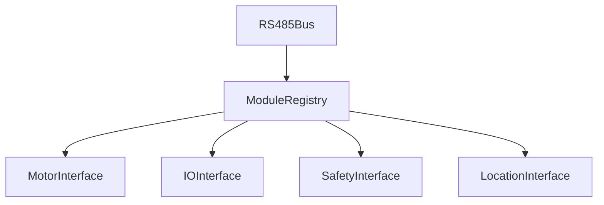

# 04) HAL Interfaces (motor, io, safety, location)

## Mục tiêu
- Cung cấp API ổn định cho Control/Services; ẩn chi tiết RS485.

## Kiến trúc


## Python skeleton (đề xuất)
```python
from dataclasses import dataclass
from typing import Optional, Dict, Any, List

class RS485Bus:
    def send(self, addr: int, cmd: int, payload: bytes) -> bytes: ...

class ModuleRegistry:
    def refresh(self) -> None: ...
    def get(self, addr: int) -> Dict[str, Any]: ...

@dataclass
class AxisLimits:
    v_max: float
    a_max: float
    j_max: float

class MotorInterface:
    def enable(self, addr: int) -> bool: ...
    def disable(self, addr: int) -> bool: ...
    def set_velocity(self, addr: int, v: float) -> bool: ...
    def set_position(self, addr: int, x: float) -> bool: ...
    def stop_ramp(self, addr: int, limit: float) -> bool: ...
    def read_feedback(self, addr: int) -> Dict[str, Any]: ...  # {pos, vel, current?, temp?, fault}

class IOInterface:
    def read_di(self, addr: int) -> int: ...  # bitmask
    def write_do(self, addr: int, mask: int) -> bool: ...
    def read_ai(self, addr: int) -> List[float]: ...
    def write_ao(self, addr: int, values: List[float]) -> bool: ...

class SafetyInterface:
    def read_status(self, addr: int) -> Dict[str, Any]: ...  # {estop, interlock, latched}
    def latch_reset(self, addr: int) -> bool: ...

class LocationInterface:
    def read_tag_event(self, addr: int) -> Optional[Dict[str, Any]]: ...  # {t, tag_id, rssi?}
    def read_encoder(self, addr: int) -> Dict[str, Any]: ...  # {count, vel}
    def reset_encoder(self, addr: int) -> bool: ...
```

## Lỗi & mã lỗi (đề xuất)
- TIMEOUT, CRC_FAIL, BUSY, NACK, INVALID_ARG, NOT_SUPPORTED.

## TBD
- Quy ước mã lệnh/cấu trúc payload theo `bus_rs485.md` cụ thể hoá.
