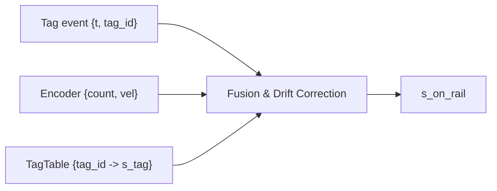

# 05) Hợp nhất vị trí (RFID + encoder)

## Mục tiêu
- Ước lượng `s_on_rail` bền vững từ sự kiện RFID và encoder incremental.

## Luồng xử lý

## Thuật toán (gợi ý)
- Biến trạng thái: `s_est`, `count_last`, `tag_last`.
- Mỗi tick `dt`:
  - Tính `ds` từ encoder: `ds = (count - count_last) * (2π r / ppr / gear)`.
  - Cập nhật `s_est += ds`.
  - Nếu có tag mới `tag_id`: đặt `s_est = s_tag + δ` (δ offset nhỏ nếu cần).
- Lọc: giới hạn tốc độ thay đổi; bỏ tag trùng nếu `|s_est - s_tag| < ε_min`.

## Xử lý lỗi
- Quá hành trình mà không gặp tag: raise warn, giảm tốc.
- Mất encoder: dựa vào tag + mô hình; giảm tốc/dừng.

## TBD
- `ppr`, `r`, `gear`, bảng tag từ `config/system.yaml`.
