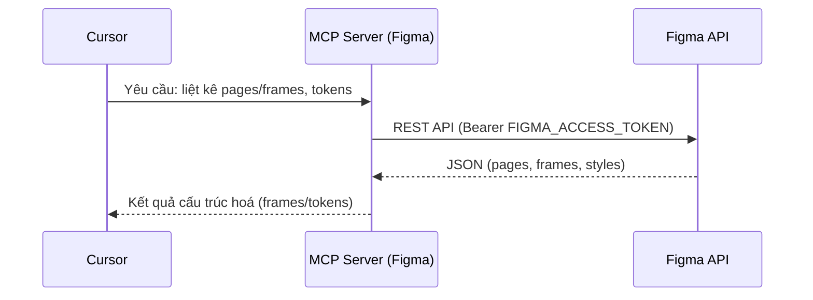

# 12) Kết nối MCP với Figma (Cursor, Windows/PowerShell)

## 1) Mục tiêu
- Cho phép Cursor truy cập thiết kế Figma qua MCP để lấy frame, tên trang, tokens và trình bày giao diện theo `11_ui_local_dashboard.md`.

## 2) Yêu cầu chuẩn bị
- Tài khoản Figma (được quyền xem file dự án).
- Personal Access Token (PAT) của Figma:
  - Figma → Profile → Settings → Personal access tokens → Tạo token.
  - Lưu token an toàn: `FIGMA_ACCESS_TOKEN`.
- Node.js LTS, `npm`/`npx` sẵn sàng.

## 3) Lựa chọn máy chủ MCP (chọn 1)
- Phương án A (khuyến nghị nhanh): máy chủ MCP do bên thứ ba (Composio) hỗ trợ Figma.
- Phương án B: máy chủ MCP cộng đồng dành cho Figma (chạy qua `npx`/`npm`).
- Phương án C: máy chủ SSE cục bộ (nếu Figma/tiện ích cung cấp), Cursor kết nối qua URL.

> Lưu ý: tên gói và lệnh có thể thay đổi theo phiên bản. Hãy kiểm tra README của máy chủ MCP đã chọn trước khi cài.

## 4) Cài đặt & cấu hình (Windows/PowerShell)

### 4.1 Đặt biến môi trường tạm (trong phiên PowerShell)
```powershell
$env:FIGMA_ACCESS_TOKEN = "<PAT_FIGMA>"
# Tuỳ chọn: khoá file cụ thể để giảm phạm vi truy vấn
$env:FIGMA_FILE_KEY = "<FILE_KEY_TU_LINK_FIGMA>"  # ví dụ: https://www.figma.com/file/<FILE_KEY>/...
```

### 4.2 Phương án A: MCP Figma qua Composio (ví dụ)
- Thiết lập nhanh máy chủ Figma cho Cursor:
```powershell
npx @composio/mcp@latest setup figma --client cursor
```
- Làm theo hướng dẫn hiển thị (nếu được hỏi thêm thông tin). Máy chủ sẽ được khai báo vào cấu hình MCP của Cursor.

### 4.3 Phương án B: MCP Figma cộng đồng (chạy lệnh cục bộ)
- Chạy server bằng `npx` (ví dụ tên gói minh hoạ `figma-context-mcp`; hãy thay theo README thực tế):
```powershell
npx -y figma-context-mcp
```
- Thêm cấu hình MCP vào Cursor (ví dụ tệp cấu hình người dùng của Cursor có key `mcpServers`):
```json
{
  "mcpServers": {
    "figma": {
      "command": "npx",
      "args": ["-y", "figma-context-mcp"],
      "env": {
        "FIGMA_ACCESS_TOKEN": "${FIGMA_ACCESS_TOKEN}",
        "FIGMA_FILE_KEY": "${FIGMA_FILE_KEY}"
      }
    }
  }
}
```

### 4.4 Phương án C: Kết nối qua SSE URL (nếu server cung cấp)
- Nếu máy chủ MCP Figma chạy dạng SSE ở cổng cục bộ (ví dụ `http://127.0.0.1:<port>/sse`), cấu hình trong Cursor dạng:
```json
{
  "mcpServers": {
    "figma": { "url": "http://127.0.0.1:<port>/sse" }
  }
}
```

## 5) Kiểm tra kết nối trong Cursor
- Mở Cursor → Kiểm tra MCP Servers có mục `figma` hiển thị trạng thái kết nối.
- Thử yêu cầu: “Liệt kê các trang/frame trong file Figma `<link>` và trích tên + id”.
- Nếu có lỗi 401/403: kiểm tra `FIGMA_ACCESS_TOKEN` và quyền truy cập file.

## 6) Quy trình sử dụng với `11_ui_local_dashboard.md`
1. Dán link Figma nguồn của UI Local Dashboard vào Cursor.
2. Yêu cầu MCP Figma trích:
   - Tên Page, danh sách Frame chính cho các tab: Overview, Motion, IO & Safety, Logs, Health.
   - Design tokens (màu/chữ/khoảng cách) nếu máy chủ hỗ trợ.
3. Đồng bộ schema UI → cập nhật mục 7 (Telemetry & Status schema) trong `11_ui_local_dashboard.md` nếu cần.
4. Xuất ảnh/đo kích thước tham chiếu (nếu server hỗ trợ) → phục vụ tạo wireframe HTML/CSS sau này.

## 7) Sơ đồ luồng


## 8) Sự cố thường gặp
- 401/403: Token sai/hết hạn hoặc không có quyền với file → tạo token mới, xin quyền truy cập file.
- 404: `FILE_KEY` không đúng → kiểm tra lại link Figma.
- Cursor không thấy server: kiểm tra tiến trình `npx ...` còn chạy và cổng/URL SSE.

## 9) Bảo mật
- Không commit token vào repo.
- Dùng biến môi trường và secret store hệ điều hành.
- Thu hẹp quyền token (scope) ở Figma nếu có tuỳ chọn.
