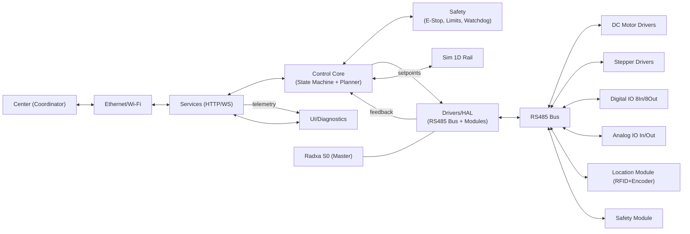
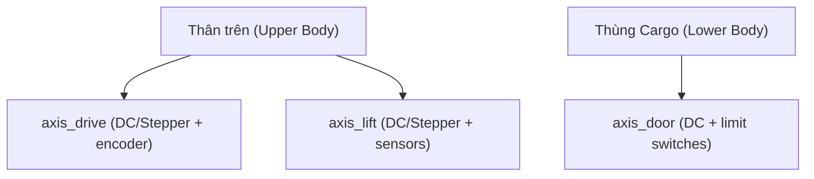
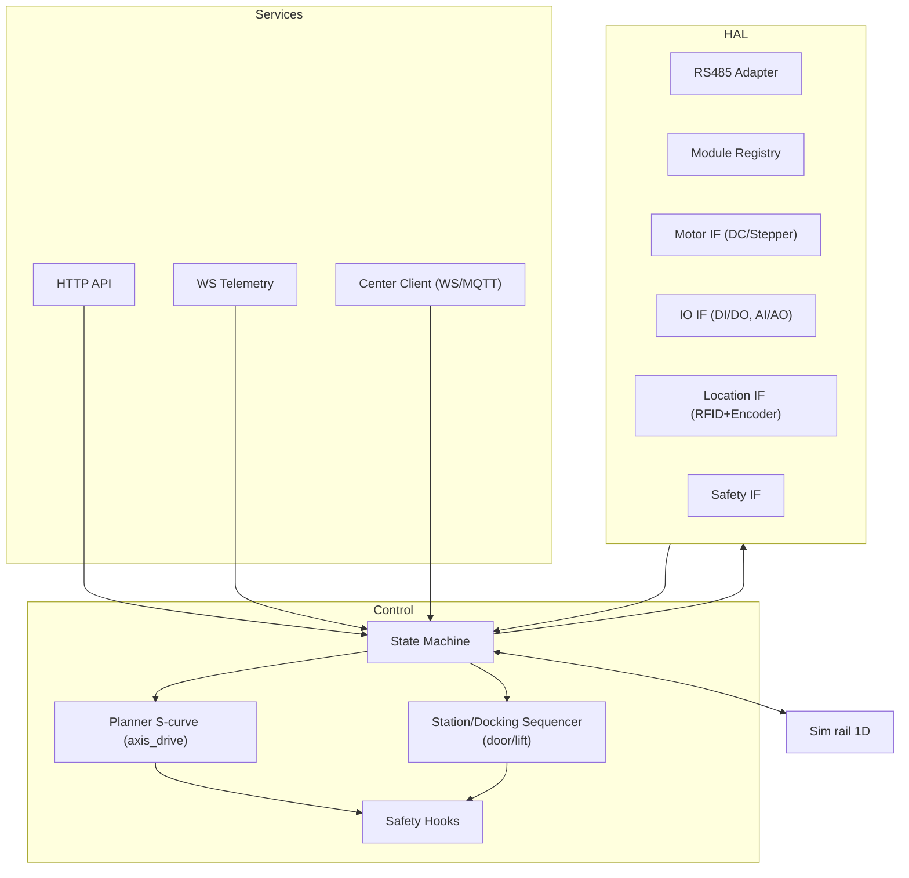

# Kiến trúc tổng thể OHT-50 (mức hệ thống)

## Mục tiêu
- Tách lớp rõ: UI/Services/Control/HAL/Sim/Tests.
- Giao diện ổn định, có khả năng chạy giả lập trước khi tích hợp thiết bị thật.

## Sơ đồ kiến trúc

## Cấu trúc cơ khí & trục điều khiển

## Phân rã module

## Luồng dữ liệu tóm tắt
- Center giao nhiệm vụ tới Services → `State Machine` → `Planner/Sequencer` → HAL.
- HAL qua RS485 điều khiển các trục/IO và thu nhận phản hồi (định vị RFID+encoder, encoder, IO); `Control` hợp nhất và phát telemetry tới UI/Center.
- `Safety` giám sát tốc độ/vùng cấm/E‑Stop và liên động cửa/nâng.

## Tham số hệ thống (TBD)
- `m_total`, `r`, ma sát/hiệu suất, dốc tối đa.
- `v_max`, `a_max`, `j_max`, chiều dài ray, dung sai dừng.
- Giới hạn trục phụ: tốc độ/nấc nâng, thời gian mở/đóng cửa.
- RS485: baudrate, địa chỉ, retry/timeout, termination.
- Kênh Center: WS/MQTT, heartbeat/permission/mission.
