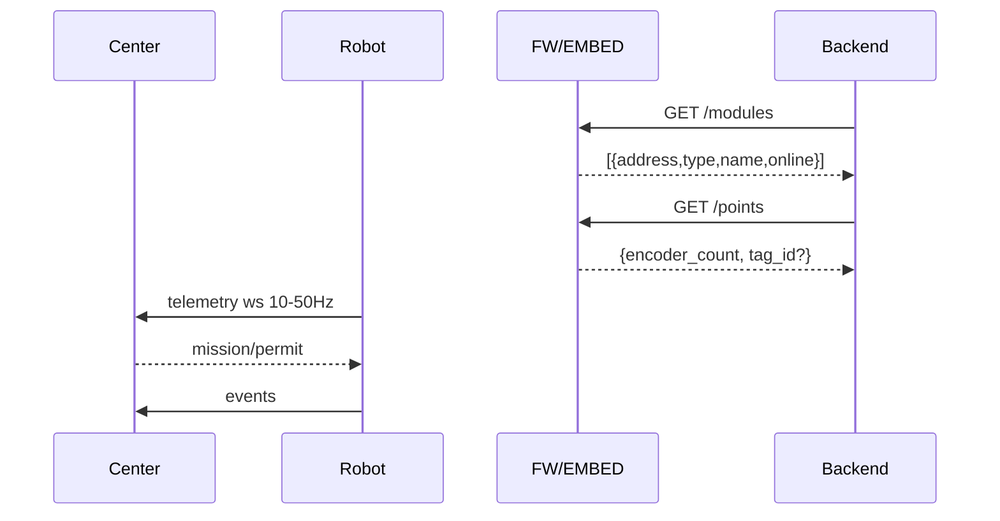

# Giao tiếp Center (điều phối)

## Mục tiêu
- Center điều phối nhiều robot, phân công nhiệm vụ (mission), quản lý dock/station, cập nhật cấu hình, OTA.
- Robot báo trạng thái/telemetry, sự kiện và yêu cầu quyền (permission) trước các hành vi nhạy cảm (mở cửa, thả hàng).

## Kênh giao tiếp
- Tuỳ chọn 1: HTTP + WebSocket (nội bộ LAN).
- Tuỳ chọn 2: MQTT (topic‑based), QoS≥1, retain cho cấu hình.

## Thông điệp chính
- Heartbeat: robot→center `{id, t, state, pose: {s_on_rail}, cargo: {present, locked}, faults}` (1–2 s).
- Telemetry: robot→center 10–50 Hz `{t, s_on_rail, tag_id?, encoder_count, axes, io, safety, mission?, perf?}`.
- Mission assign: center→robot `{mission_id, route: [station_id], actions: [...]}`.
- Permission: center→robot `{permit: {open_door, drop_cargo, enter_station}}`.
- Events: robot→center `{event: reached_station|door_opened|drop_done|fault, data}`.

## API/Center bổ sung cho RS485 (do FW expose cho BE)

- GET `/modules` → Danh sách module trên bus
  - Trả: `[{ address, type, name, online, last_seen_ts? }]`
- GET `/points` → Ảnh chụp điểm đo nhanh
  - Trả: `{ di_bitmask?, ai?: number[], motors?: [{address,pos_mm?,vel_mms?,current_a?,temperature_c?,fault?}], encoder_count?, tag_id?, rssi? }`
- (Tuỳ chọn) POST `/action` → Thao tác chẩn đoán an toàn (giới hạn theo role)
  - Body: `{ type: read_di|read_ai|read_fb|reset_encoder, address?, channel? }`

Ghi chú:
- Các endpoint trên có thể được expose bởi FW trên HTTP cục bộ hoặc đóng gói thành thông điệp Center; BE sẽ tích hợp theo kênh đã chọn.
- Quy ước schema chi tiết sẽ tuân thủ `docs/specs/telemetry_schema.md` và `docs/specs/bus_rs485.md` (opcode/payload do FW quyết định).

## Quy trình tiêu biểu

## Mất kết nối
- Nếu mất WS/MQTT > T_timeout (TBD):
  - Dừng ở trạng thái an toàn gần nhất (không mở cửa nếu chưa có permit).
  - Gửi lại heartbeat khi có kết nối; tiếp tục nếu còn hợp lệ.

## Bảo mật (tối thiểu)
- Auth token nội bộ LAN, whitelist MAC/IP (TBD).
- Ghi log các lệnh nhạy cảm kèm nguồn lệnh (center/robot).
