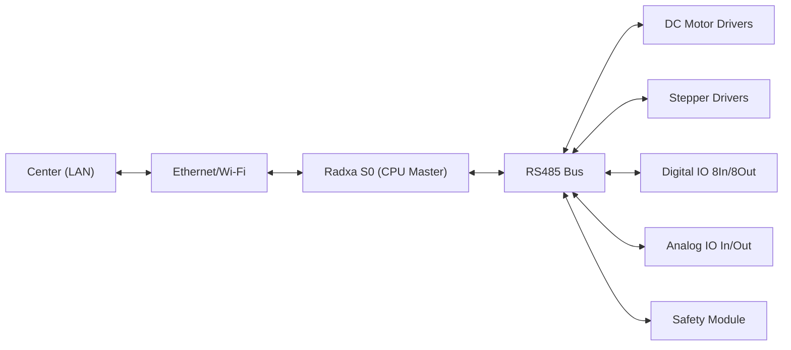

# Phần cứng & kết nối

## CPU Master
- Radxa S0 (TBD cấu hình RAM/flash/OS). Giao tiếp chính tới thiết bị: RS485 (half‑duplex, multi‑drop). Kết nối Center: Ethernet/Wi‑Fi (TBD).

## Cấu trúc robot theo 2 phần
- Thân trên (Upper body – di chuyển trên ray):
  - Truyền động dọc ray: motor DC hoặc stepper (`axis_drive`), encoder.
  - Cơ cấu thả/nâng thùng: motor DC/stepper (`axis_lift`), sensor hành trình/lực (analog).
  - Cảm biến: vị trí dock, chướng ngại, geofence (DI/AI), báo mở cửa.
- Thùng cargo (Lower body – module chứa hàng):
  - Cửa thùng: motor DC (`axis_door`) mở/đóng, công tắc hành trình (DI), cảm biến kẹp/chèn (safety).
  - Cảm biến analog: tải, hiện diện hàng, nhiệt độ (nếu cần).

## Sơ đồ kết nối mức cao

## Địa chỉ hoá & nguồn
- Mỗi module RS485 có địa chỉ duy nhất; phân nhóm theo phần Thân trên/Thùng cargo (TBD bảng mapping).
- RS485: baudrate, 8N1, termination, topology; chiều dài cáp (TBD).
- Nguồn: tách điều khiển/công suất; bảo vệ quá dòng/nhiễu; UPS mini (tùy chọn).

## Ánh xạ trục/thiết bị (khởi tạo)
- `axis_drive` → DC/Stepper + encoder.
- `axis_lift` → DC/Stepper + sensor hành trình.
- `axis_door` → DC + hành trình mở/đóng.
- DI/AI: dock sensor, obstacle, door_open_sw, cargo_present, load_cell, v.v. (TBD).
