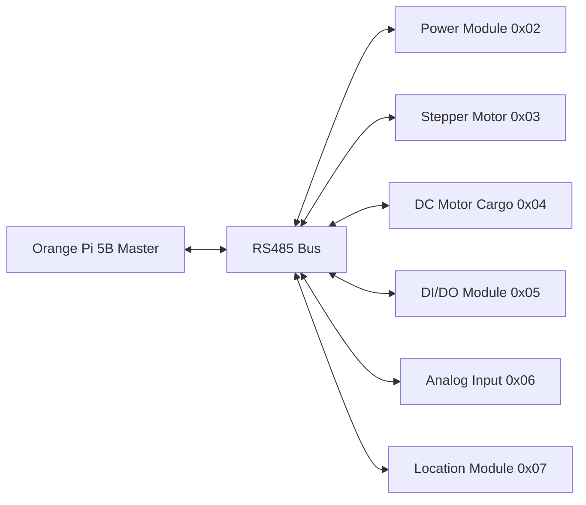

# Ánh xạ module theo địa chỉ RS485 - OHT-50

Mục tiêu: liệt kê module sử dụng, địa chỉ RS485, và chức năng theo thông tin thực tế từ hardware.

## Quy ước địa chỉ (Cập nhật theo thực tế)
- `0x02` **Module nguồn** - Quản lý pin, bộ charger, nguồn cấp động lực cho robot
- `0x03` **Module motor di chuyển** - Quản lý động cơ stepper cho di chuyển
- `0x04` **Module motor cargo** - Quản lý động cơ lister DC cho hạ lên xuống của cargo
- `0x05` **Module DI/DO** - CTHT, đèn hiệu, relay chức năng (8 DI và 8 DO)
- `0x06` **Module AI** - Cảm biến khoảng cách dạng analog an toàn
- `0x07` **Module location** - Quản lý RFID location, encoder, Lidar

## Chi tiết module

### 0x02 - Module nguồn (Power Management)
| Chức năng | Chi tiết | Ghi chú |
|---|---|---|
| Pin management | Quản lý pin lithium | SOC, SOH, temperature monitoring |
| Charger control | Bộ sạc pin | Charge current, voltage control |
| Power distribution | Nguồn cấp động lực | 12V/24V/48V cho motor, 5V/3.3V cho logic |
| Safety monitoring | Overcurrent, overvoltage protection | Emergency shutdown |

### 0x03 - Module motor di chuyển (Stepper Motor)
| Chức năng | Chi tiết | Ghi chú |
|---|---|---|
| Stepper control | Động cơ stepper cho di chuyển | Position, velocity, acceleration control |
| Encoder feedback | Position feedback | Absolute/relative position |
| Limit switches | End-of-travel detection | Safety limits |
| Current monitoring | Motor current sensing | Overcurrent protection |

### 0x04 - Module motor cargo (DC Motor)
| Chức năng | Chi tiết | Ghi chú |
|---|---|---|
| DC motor control | Động cơ lister DC | Lifting mechanism control |
| Position control | Up/down positioning | Cargo height control |
| Load sensing | Weight detection | Overload protection |
| Safety interlocks | Mechanical safety | Emergency stop |

### 0x05 - Module DI/DO (Digital I/O)
| Chức năng | Chi tiết | Ghi chú |
|---|---|---|
| Digital Inputs | 8 DI channels | CTHT, limit switches, sensors |
| Digital Outputs | 8 DO channels | Đèn hiệu, relay chức năng |
| Status indicators | LED indicators | Module status, communication |
| Emergency signals | E-stop, safety signals | High priority inputs |

### 0x06 - Module AI (Analog Input)
| Chức năng | Chi tiết | Ghi chú |
|---|---|---|
| Distance sensors | Cảm biến khoảng cách analog | Safety zone detection |
| Analog inputs | Multiple AI channels | 0-10V, 4-20mA support |
| Safety monitoring | Collision avoidance | Real-time distance monitoring |
| Calibration | Sensor calibration | Offset, scale adjustment |

### 0x07 - Module location (Location & Navigation)
| Chức năng | Chi tiết | Ghi chú |
|---|---|---|
| RFID reader | Location tags | Position identification |
| Encoder | Position tracking | Incremental/absolute encoder |
| Lidar | Distance mapping | Obstacle detection, navigation |
| Fusion algorithm | Position fusion | RFID + encoder + Lidar |

## Sơ đồ kết nối (Cập nhật)

## Protocol Commands (Cập nhật)

### Module 0x02 - Power Management
- `PING` - Health check
- `GET_INFO` - Module information
- `GET_BATTERY_STATUS` - Battery SOC, SOH, temperature
- `GET_CHARGER_STATUS` - Charger status, current, voltage
- `SET_CHARGE_MODE` - Enable/disable charging
- `GET_POWER_STATUS` - Power distribution status

### Module 0x03 - Stepper Motor
- `PING` - Health check
- `GET_INFO` - Module information
- `SET_POSITION` - Set target position
- `SET_VELOCITY` - Set velocity
- `GET_POSITION` - Get current position
- `GET_STATUS` - Motor status, error codes
- `ENABLE/DISABLE` - Enable/disable motor
- `STOP` - Emergency stop

### Module 0x04 - DC Motor Cargo
- `PING` - Health check
- `GET_INFO` - Module information
- `SET_POSITION` - Set lift position
- `SET_VELOCITY` - Set lift velocity
- `GET_POSITION` - Get current position
- `GET_LOAD` - Get current load
- `ENABLE/DISABLE` - Enable/disable motor
- `STOP` - Emergency stop

### Module 0x05 - DI/DO
- `PING` - Health check
- `GET_INFO` - Module information
- `READ_DI` - Read digital inputs
- `WRITE_DO` - Write digital outputs
- `GET_DI_STATUS` - Get DI status with timestamp
- `GET_DO_STATUS` - Get DO status
- `SET_DO_PATTERN` - Set output pattern

### Module 0x06 - Analog Input
- `PING` - Health check
- `GET_INFO` - Module information
- `READ_AI` - Read analog inputs
- `GET_AI_STATUS` - Get AI status with calibration
- `SET_CALIBRATION` - Set calibration parameters
- `GET_DISTANCE` - Get processed distance values

### Module 0x07 - Location
- `PING` - Health check
- `GET_INFO` - Module information
- `READ_TAG_ID` - Read RFID tag ID
- `READ_ENCODER` - Read encoder count
- `RESET_ENCODER` - Reset encoder counter
- `GET_LIDAR_DATA` - Get Lidar distance data
- `GET_POSITION` - Get fused position data

## Ghi chú cập nhật
- Địa chỉ module đã được cập nhật theo thông tin thực tế
- Protocol commands cần được implement theo từng module
- Cần test từng module riêng biệt trước khi tích hợp
- Safety features cần được ưu tiên cao nhất
