# Ánh xạ module theo phần (Upper/Cargo) & địa chỉ RS485

Mục tiêu: liệt kê module sử dụng, vị trí lắp (Thân trên/Thùng cargo), địa chỉ RS485, kênh và chức năng.

## Quy ước địa chỉ (ví dụ, có thể sửa)
- `0x10` Safety module
- `0x11` DIO Upper (8In/8Out)
- `0x12` AIO Upper
- `0x13` DC Motor Driver #1 (axis_drive)
- `0x14` Stepper Driver #1 (axis_drive alt)
- `0x15` DC Motor Driver #2 (axis_lift)
- `0x16` Stepper Driver #2 (axis_lift alt)
- `0x17` DIO Cargo (8In/8Out)
- `0x18` AIO Cargo
- `0x19` DC Motor Driver #3 (axis_door)
- `0x1A` Location Module (RFID + Encoder)

## Thân trên (Upper Body)
| Chức năng | Module | Địa chỉ | Kênh | Ghi chú |
|---|---|---:|---:|---|
| axis_drive | DC Motor Driver #1 hoặc Stepper Driver #1 | 0x13 / 0x14 | 1/2 | Chọn 1 loại; encoder: tích hợp/TBD |
| axis_lift | DC Motor Driver #2 hoặc Stepper Driver #2 | 0x15 / 0x16 | 1/2 | Hành trình/giới hạn qua sensor |
| Dock/Obstacle/Geofence | DIO Upper | 0x11 | 8In/8Out | Debounce, polarity cấu hình |
| Load/Force/Align analog | AIO Upper | 0x12 | AI/AO | Dải đo 0–10V/4–20mA (TBD) |
| E‑Stop/Interlock | Safety module | 0x10 | n/a | Kênh HW độc lập + RS485 giám sát |
| Location (RFID+Encoder) | Location Module | 0x1A | n/a | Tag + encoder count, phục vụ định vị |

## Thùng cargo (Lower Body)
| Chức năng | Module | Địa chỉ | Kênh | Ghi chú |
|---|---|---:|---:|---|
| axis_door | DC Motor Driver #3 | 0x19 | 1/2 | Mở/đóng; xác nhận limit open/close |
| Door limits/cargo_present | DIO Cargo | 0x17 | 8In/8Out | Door_open_sw, Door_close_sw, Lock_out |
| Cargo analog (tùy chọn) | AIO Cargo | 0x18 | AI/AO | Nhiệt độ/khối lượng (load cell) |

## Sơ đồ kết nối (tổng quan)

```mermaid
flowchart LR
  CPU["Radxa S0"]
  BUS["RS485"]
  U_DIO["DIO Upper 0x11"]
  U_AIO["AIO Upper 0x12"]
  DCM1["DC Driver 0x13"]
  STM1["Stepper 0x14"]
  DCM2["DC Driver 0x15"]
  STM2["Stepper 0x16"]
  C_DIO["DIO Cargo 0x17"]
  C_AIO["AIO Cargo 0x18"]
  DCM3["DC Driver 0x19"]
  SAFE["Safety 0x10"]
  LOC["Location 0x1A"]

  CPU <--> BUS
  BUS <--> SAFE
  BUS <--> U_DIO
  BUS <--> U_AIO
  BUS <--> DCM1
  BUS <--> STM1
  BUS <--> DCM2
  BUS <--> STM2
  BUS <--> C_DIO
  BUS <--> C_AIO
  BUS <--> DCM3
  BUS <--> LOC
```

## Ghi chú
- Địa chỉ chỉ là ví dụ; thực tế cấu hình theo DIP/flash của module.
- Nếu dùng Modbus RTU, địa chỉ có thể là `1..247` thay vì hex.
- Số kênh thực tế và dải đo xem `module_spec.md`.
