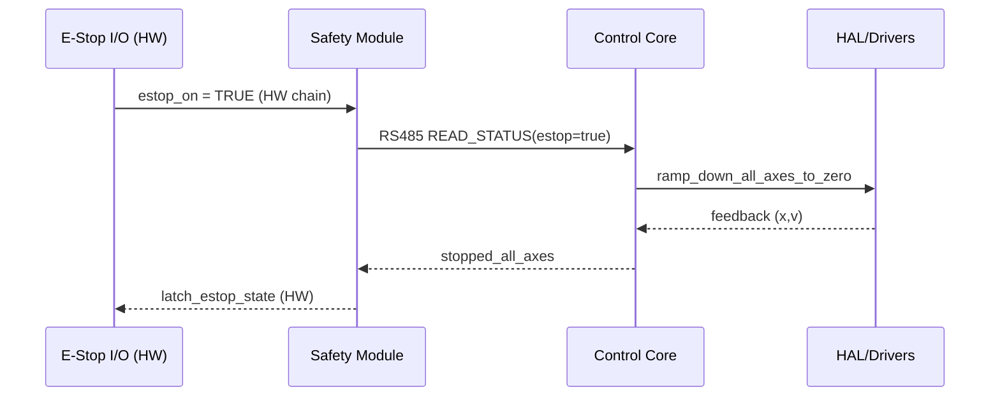

# An toàn & E‑Stop

## Mục tiêu
- Đạt trạng thái an toàn có kiểm chứng trong mọi tình huống khẩn.
- Ghi nhận và chẩn đoán nguyên nhân để cải thiện độ tin cậy.

## Kiến trúc an toàn đề xuất
- Safety module RS485 để báo trạng thái; kênh phần cứng cắt mạch lực độc lập.
- Liên động:
  - Không cho `axis_drive` chạy khi `axis_door` chưa đóng hoàn toàn.
  - Không cho `axis_lift` chạy khi cửa chưa mở và chưa có permit.
  - Giới hạn tốc độ trong vùng station; cấm chuyển động khi có cảm biến kẹp/chèn kích hoạt.

## Trình tự E‑Stop (mức logic)

## Mất kết nối Center
- Nếu mất `Center` > T_timeout (TBD): giữ/quay về trạng thái an toàn; không mở cửa/không thả hàng nếu chưa có permit.

## Tiêu chí & kiểm thử
- Đo khoảng cách dừng; xác minh liên động cửa/lift.
- Tiêm lỗi: mất RS485, mất Center, vượt tốc, trigger kẹp/chèn; hệ phải về an toàn.
