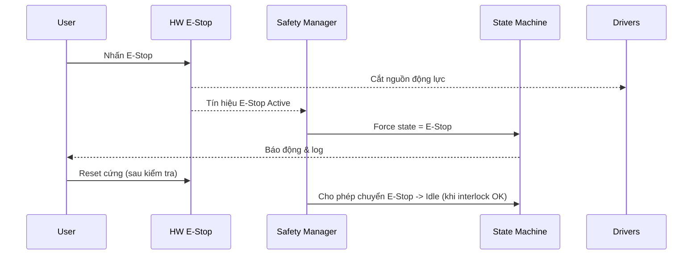

# E‑Stop phần cứng 2 lớp & Ma trận Interlock

Phiên bản: v1.0 (khởi tạo)

## 1) Kiến trúc E‑Stop 2 lớp
- Lớp 1 (Động lực): cắt nguồn driver/động cơ qua contactor/SSR.
- Lớp 2 (Điều khiển): tín hiệu E‑Stop vào Safety I/O, ép state machine vào `E‑Stop`, vô hiệu lệnh.
- Reset: yêu cầu xác nhận phần cứng + phần mềm, kiểm tra an toàn trước khi về `Idle`.

## 2) Ma trận interlock (rút gọn)
| Điều kiện | Cho phép Enable | Cho phép Move | Cho phép Dock |
|---|---|---|---|
| E‑Stop Active | No | No | No |
| Fault Active | No | No | No |
| Doors/Open Guards | No | No | No |
| Encoders Healthy | Yes | Yes | Yes |
| Obstacle Detected | Yes | No | Yes (tốc độ chậm) |

## 3) Hồi phục sau E‑Stop
- Kiểm tra biên an toàn (vùng cấm, cảm biến chướng ngại)
- Tái khởi động driver ở chế độ an toàn (tốc độ = 0)
- Chỉ cho phép lệnh khi tất cả interlock = OK

## 4) Nhật ký sự kiện an toàn
- Ghi timestamp, nguồn kích hoạt (nút, IO, watchdog), thời gian phản ứng
- Bắt buộc lưu trữ ít nhất N sự kiện gần nhất (cấu hình)
