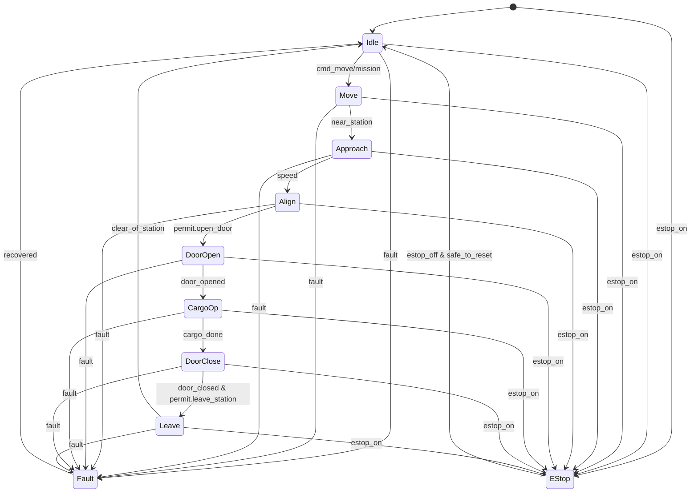

# Trạng thái hệ thống (State Machine)

## Danh mục trạng thái
- `Idle`: chờ lệnh/mission.
- `Move`: di chuyển trên ray theo quỹ đạo S‑curve.
- `Approach`: tiếp cận station (vùng giảm tốc).
- `Align`: canh chỉnh vị trí tại station bằng cảm biến.
- `DoorOpen`: mở cửa thùng.
- `CargoOp`: thao tác thả/nâng thùng (lift).
- `DoorClose`: đóng cửa.
- `Leave`: rời station, tăng tốc ra khỏi vùng.
- `Fault`: lỗi.
- `E-Stop`: dừng khẩn.

## Sơ đồ trạng thái

## Quy tắc ưu tiên & timeout
- `E-Stop` thắng mọi trạng thái.
- Timeout cho `Align`, `DoorOpen`, `CargoOp`, `DoorClose` (TBD) → vào `Fault`.
- Chỉ vào `Approach` khi có `permit.enter_station` từ Center.

## Log sự kiện bắt buộc
- Mission id, station id, thời gian từng bước, kết quả cảm biến, lỗi.

## Ghi chú cảm biến vị trí
- `Approach`: kích hoạt khi `s_on_rail` gần `s_station` (từ RFID/encoder), giảm tốc theo vùng cấu hình.
- `Align`: xác nhận `tag_id` của station; dùng encoder để tinh chỉnh đến vị trí dừng trước khi mở cửa.
