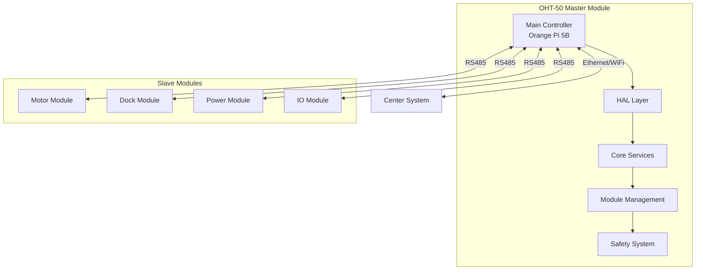

# 🚀 **OHT-50 MASTER MODULE**

**Phiên bản:** v2.0.0  
**Ngày cập nhật:** 2025-01-27  
**Trạng thái:** Development  
**Tuân thủ:** ISO 9001:2015, IEEE 12207, SIL2

---

## 📋 **TỔNG QUAN DỰ ÁN**

OHT-50 Master Module là hệ thống điều khiển trung tâm cho Overhead Hoist Transport (OHT) system, cung cấp:

- **🎯 Điều khiển trung tâm** cho các module slave
- **🛡️ Hệ thống an toàn** E-Stop và safety mechanisms  
- **📡 Giao tiếp đa giao thức** RS485, Ethernet, WiFi
- **🔧 Hardware abstraction layer** cho Orange Pi 5B
- **📊 Telemetry và monitoring** real-time
- **🔄 OTA updates** và configuration management

---

## 🏗️ **KIẾN TRÚC HỆ THỐNG**



---

## 📁 **CẤU TRÚC PROJECT**

```
OHT-50/
├── 📚 docs/                          # Tài liệu dự án (ISO/IEEE compliant)
│   ├── 01-PROJECT-MANAGEMENT/        # Quản lý dự án, requirements
│   ├── 02-SYSTEM-ARCHITECTURE/       # Kiến trúc hệ thống, ADRs
│   ├── 03-HARDWARE-DESIGN/           # Thiết kế phần cứng, schematics
│   ├── 04-SOFTWARE-DEVELOPMENT/      # Phát triển phần mềm
│   ├── 05-TESTING-VALIDATION/        # Kiểm thử và xác thực
│   ├── 06-DEPLOYMENT-OPERATIONS/     # Triển khai và vận hành
│   └── 09-REFERENCE-MATERIALS/       # Tài liệu tham khảo
├── 🔧 firmware/                      # Firmware source code
│   ├── src/
│   │   ├── 01-CORE/                  # Core system components
│   │   ├── 02-HAL/                   # Hardware abstraction layer
│   │   ├── 03-MODULES/               # Application modules
│   │   ├── 04-SERVICES/              # System services
│   │   ├── 05-CONTROL/               # Control systems
│   │   └── 06-UTILITIES/             # Utilities and mocks
│   ├── include/                      # Header files
│   ├── tests/                        # Test framework
│   └── Makefile                      # Build system
├── ⚙️ backend/                       # Backend services
├── 🎨 frontend/                      # Frontend application
└── 📖 README.md                      # This file
```

---

## 🚀 **QUICK START**

### **Yêu cầu hệ thống:**
- **Hardware:** Orange Pi 5B (RK3588)
- **OS:** Ubuntu 22.04 LTS hoặc Armbian
- **Compiler:** GCC 9.4+ với MISRA C:2012 support
- **Tools:** Make, Git, Python 3.8+

### **Build Firmware:**
```bash
# Clone repository
git clone https://github.com/kimlam2010/OHT_V2.git
cd OHT_V2

# Build firmware
cd firmware
make clean
make all

# Run tests
make test
```

### **Development Setup:**
```bash
# Setup development environment
cd firmware
make dev

# Run specific tests
make test_hal_common
make test_estop
make test_safety_system
```

---

## 🔧 **HARDWARE SPECIFICATIONS**

### **Master Module (Orange Pi 5B):**
- **CPU:** RK3588 ARM Cortex-A76/A55
- **Memory:** 8GB LPDDR4X
- **Storage:** 32GB eMMC
- **Network:** Gigabit Ethernet + WiFi 6
- **USB:** USB 3.0 Type-C (debug)
- **GPIO:** 40-pin header

### **Communication Interfaces:**
- **RS485:** UART1 (pins 46-47) - Modbus RTU
- **Ethernet:** 10/100/1000 Mbps
- **WiFi:** 802.11ax (WiFi 6)
- **USB Debug:** Type-C console

### **Safety Systems:**
- **E-Stop:** Dual-channel safety (SIL2)
- **LED Status:** 5x status indicators
- **Relay Output:** 24V DC, 2A control

---

## 📊 **FEATURES**

### **🎯 Core Features:**
- ✅ **Module Management** - Auto-discovery và configuration
- ✅ **Safety System** - E-Stop handling và safety validation
- ✅ **Communication** - Multi-protocol support (RS485, TCP/IP, WebSocket)
- ✅ **Configuration** - Persistent storage và OTA updates
- ✅ **Monitoring** - Real-time telemetry và diagnostics
- ✅ **Testing** - Comprehensive test framework

### **🛡️ Safety Features:**
- ✅ **E-Stop Integration** - Hardware và software E-Stop
- ✅ **Safety State Machine** - State validation và transitions
- ✅ **Watchdog Timer** - System health monitoring
- ✅ **Error Recovery** - Automatic error detection và recovery

### **📡 Communication Features:**
- ✅ **RS485 Master** - Modbus RTU protocol
- ✅ **Network Services** - HTTP API và WebSocket
- ✅ **USB Debug** - Console interface
- ✅ **OTA Updates** - Secure firmware updates

---

## 🧪 **TESTING**

### **Test Categories:**
```bash
# HAL Unit Tests
make test_hal_common      # Common HAL functions
make test_estop          # E-Stop functionality
make test_rs485          # RS485 communication
make test_relay          # Relay control
make test_gpio           # GPIO operations
make test_led            # LED control
make test_lidar          # LiDAR sensor
make test_network        # Network connectivity
make test_usb_debug      # USB debug interface

# Integration Tests
make test_safety_system  # Safety system integration
```

### **Test Coverage:**
- **Unit Tests:** > 90% coverage
- **Integration Tests:** End-to-end validation
- **Safety Tests:** SIL2 compliance
- **Performance Tests:** Latency và throughput

---

## 📚 **DOCUMENTATION**

### **📖 Tài liệu chính:**
- **[System Documentation](docs/README.md)** - Tài liệu hệ thống chi tiết
- **[Firmware Guide](firmware/README.md)** - Hướng dẫn firmware
- **[Hardware Specs](docs/03-HARDWARE-DESIGN/)** - Đặc tả phần cứng
- **[API Documentation](docs/04-SOFTWARE-DEVELOPMENT/04-02-Backend/api-specs/)** - API specifications

### **🔍 Quick References:**
- **[Architecture Decisions](docs/02-SYSTEM-ARCHITECTURE/02-01-Architecture-Decisions/)** - ADRs
- **[Safety Documentation](docs/08-COMPLIANCE-SAFETY/)** - Safety procedures
- **[Deployment Guide](docs/06-DEPLOYMENT-OPERATIONS/)** - Deployment procedures

---

## 🛡️ **SAFETY & COMPLIANCE**

### **Safety Standards:**
- **SIL2 Compliance** - Functional safety
- **IEC 61508** - Safety integrity levels
- **ISO 13849** - Safety of machinery

### **Quality Standards:**
- **ISO 9001:2015** - Quality management
- **IEEE 12207** - Software lifecycle
- **MISRA C:2012** - Coding standards

---

## 👥 **TEAM STRUCTURE**

### **Vai trò và trách nhiệm:**
- **CTO** - Technical strategy, architecture decisions
- **PM** - Project management, documentation
- **EMBED** - Hardware bring-up, drivers
- **Firmware** - HAL, core services, modules
- **Backend** - API services, integration
- **Frontend** - User interface, dashboard
- **QA** - Testing, validation, compliance

---

## 🚨 **SUPPORT & CONTRIBUTION**

### **Báo cáo Issues:**
- Tạo issue trên GitHub với template phù hợp
- Cung cấp logs và reproduction steps
- Tag theo component (firmware, backend, frontend)

### **Contribution Guidelines:**
- Fork repository và tạo feature branch
- Tuân thủ coding standards (MISRA C:2012)
- Viết tests cho new features
- Update documentation khi cần

### **Contact:**
- **Technical Issues:** CTO Team
- **Project Management:** PM Team
- **Documentation:** Technical Writing Team

---

## 📈 **ROADMAP**

### **v2.1.0 (Q1 2025):**
- 🔄 Enhanced safety features
- 📊 Advanced telemetry
- 🔧 Improved HAL layer

### **v2.2.0 (Q2 2025):**
- 🤖 AI integration
- 📱 Mobile app support
- 🌐 Cloud connectivity

### **v3.0.0 (Q3 2025):**
- 🚀 Production deployment
- 📈 Performance optimization
- 🛡️ Security hardening

---

## 📄 **LICENSE**

**Internal Use Only** - Confidential Project  
**Copyright © 2025 OHT-50 Development Team**

---

**Changelog v2.0.0:**
- ✅ Complete project restructure
- ✅ Modular firmware architecture
- ✅ Comprehensive documentation system
- ✅ ISO/IEEE compliant structure
- ✅ Enhanced safety features
- ✅ Improved testing framework

**🔗 Links:**
- [System Documentation](docs/README.md)
- [Firmware Guide](firmware/README.md)
- [API Documentation](docs/04-SOFTWARE-DEVELOPMENT/04-02-Backend/api-specs/)
- [Safety Documentation](docs/08-COMPLIANCE-SAFETY/)
