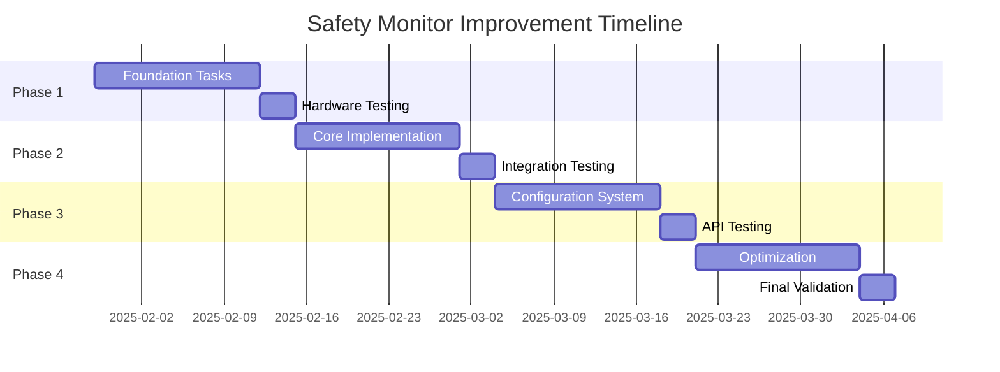
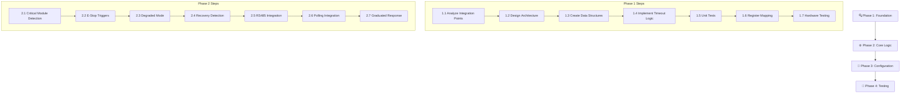

# 🛡️ **SAFETY MONITOR IMPROVEMENT PLAN - OHT-50**

**Phiên bản:** v1.0  
**Ngày tạo:** 2025-01-28  
**Team:** FW Team  
**Mục tiêu:** Cải thiện Safety Monitor từ over-engineered prototype thành production-ready safety system

---

## 📋 **TỔNG QUAN DỰ ÁN**

### **🎯 Mục tiêu chính:**
- **Tích hợp RS485 Module Safety Logic** - Giám sát 5 modules bắt buộc
- **Đơn giản hóa Safety Sensor Framework** - Loại bỏ over-engineering
- **Xây dựng Configuration System** - Cho phép cài đặt runtime
- **Nâng cao độ tin cậy và performance** - Production-ready

### **🚨 Vấn đề hiện tại:**
- ❌ **Thiếu logic safety cho RS485 modules** (Power, Safety, Travel, Lifter, Dock)
- ❌ **Over-engineered sensor framework** (32 sensors không cần thiết)
- ❌ **Không có configuration system** (hardcode values)
- ❌ **Thiếu module health monitoring** (không detect module loss)

### **✅ Kết quả mong đợi:**
- ✅ **Module Loss Detection** < 1 second
- ✅ **E-Stop Response** < 100ms (unchanged)
- ✅ **Configuration Load** < 500ms
- ✅ **System Reliability** 99.9% uptime

---

## 📊 **PHÂN TÍCH YÊU CẦU CHI TIẾT**

### **REQ-001: RS485 Module Safety Integration**

**🎯 Mô tả:**
Safety Monitor phải giám sát trạng thái của 5 modules RS485 bắt buộc và thực hiện hành động safety tương ứng khi có module bị mất kết nối.

**📋 Yêu cầu chi tiết:**
- **REQ-001.1:** Monitoring 5 modules: Power(0x02), Safety(0x03), Travel(0x04), Lifter(0x05), Dock(0x06)
- **REQ-001.2:** Critical module loss (Safety/Power) → E-Stop ngay lập tức
- **REQ-001.3:** Non-critical module loss → Degraded mode với cảnh báo
- **REQ-001.4:** Communication timeout configurable per module
- **REQ-001.5:** Module recovery detection và auto-resume

**🔧 Acceptance Criteria:**
- [ ] Detect module loss trong < 1 second
- [ ] E-Stop trigger khi Safety module (0x03) mất kết nối
- [ ] E-Stop trigger khi Power module (0x02) mất kết nối > 5s
- [ ] Warning mode khi Travel/Lifter module mất kết nối
- [ ] Auto-recovery khi module trở lại online

---

### **REQ-002: Safety Sensor Simplification**

**🎯 Mô tả:**
Đơn giản hóa safety sensor framework, chỉ giữ lại các sensors thực sự cần thiết và loại bỏ over-engineering.

**📋 Yêu cầu chi tiết:**
- **REQ-002.1:** Loại bỏ generic sensor framework (32 sensors)
- **REQ-002.2:** Chỉ giữ 4 primary safety inputs: LiDAR, E-Stop, Module Status, System Health
- **REQ-002.3:** Simplify sensor data structures
- **REQ-002.4:** Remove unused sensor types (pressure, temperature, etc.)
- **REQ-002.5:** Optimize performance bằng cách loại bỏ unused code

**🔧 Acceptance Criteria:**
- [ ] Code size giảm ít nhất 30%
- [ ] Memory usage giảm ít nhất 20%
- [ ] Performance cải thiện (cycle time < 10ms)
- [ ] Chỉ 4 safety inputs được maintain
- [ ] Backward compatibility maintained

---

### **REQ-003: Configuration System Implementation**

**🎯 Mô tả:**
Xây dựng hệ thống configuration cho phép cài đặt safety parameters qua YAML files và runtime API.

**📋 Yêu cầu chi tiết:**
- **REQ-003.1:** YAML configuration file support
- **REQ-003.2:** Runtime configuration API (HTTP endpoints)
- **REQ-003.3:** Configuration validation và error handling
- **REQ-003.4:** Factory reset functionality
- **REQ-003.5:** Configuration persistence across reboots

**🔧 Acceptance Criteria:**
- [ ] Load configuration từ YAML file
- [ ] Change safety zones runtime without restart
- [ ] Validate configuration parameters
- [ ] Factory reset trong < 5 seconds
- [ ] Configuration backup/restore functionality

---

### **REQ-004: Enhanced Error Handling & Recovery**

**🎯 Mô tả:**
Cải thiện error handling và auto-recovery mechanisms để đảm bảo system reliability.

**📋 Yêu cầu chi tiết:**
- **REQ-004.1:** Comprehensive error logging với timestamps
- **REQ-004.2:** Auto-recovery từ transient failures
- **REQ-004.3:** Graceful degradation khi có component failures
- **REQ-004.4:** Health monitoring và diagnostics
- **REQ-004.5:** Performance metrics collection

**🔧 Acceptance Criteria:**
- [ ] Error recovery success rate > 95%
- [ ] System uptime > 99.9%
- [ ] Diagnostic information available via API
- [ ] Performance metrics tracked
- [ ] Log rotation và management

---

## 🗓️ **IMPLEMENTATION ROADMAP**

### **📅 PHASE 1: Foundation (Tuần 1-2)**

**🎯 Mục tiêu:** Xây dựng nền tảng cho module safety integration

**📋 Tasks:**
- **TASK-1.1:** Analyze existing module manager integration points
- **TASK-1.2:** Design module health monitoring architecture
- **TASK-1.3:** Create module status data structures
- **TASK-1.4:** Implement basic module timeout detection
- **TASK-1.5:** Unit tests cho module health functions
- **TASK-1.6:** Map Safety Module registers và implement data reading functions
- **TASK-1.7:** Test register reading với real Safety Module hardware

**📊 Deliverables:**
- Module health monitoring design document
- Basic timeout detection implementation
- Unit test suite
- Integration plan với existing code
- Safety Module register mapping documentation
- Working register reading functions

**🔧 Technical Details:**

#### **TASK-1.6: Safety Module Register Integration**

**📋 Implementation Approach:**

**🎯 Design Philosophy:**
- **Data-Driven Architecture:** Tạo response structure chứa tất cả critical data từ Safety Module
- **Layered Validation:** Multiple validation layers từ communication đến logic
- **Fail-Safe Design:** Default to safe state khi có lỗi

**🔧 Technical Approach:**
- **Register Mapping Strategy:** Map Modbus registers thành meaningful data fields
- **Communication Abstraction:** Wrap existing comm_manager functions với safety-specific logic
- **Response Processing Pipeline:** Read → Validate → Process → Action sequence

**📊 Data Structure Design:**
- **Response Structure:** Container cho tất cả Safety Module data
- **Critical Values Grouping:** Nhóm related sensors thành sub-structure
- **Timestamp Tracking:** Monitor communication timing và health
- **Error Code Mapping:** Convert Modbus errors thành safety actions

**🔗 Integration Strategy:**
- **Existing API Reuse:** Leverage comm_manager_modbus_read_holding_registers()
- **Minimal Code Changes:** Add functionality without breaking existing code
- **Backward Compatibility:** Maintain existing safety_monitor API

**📊 Implementation Strategy:**

**🔧 Register Reading Approach:**
- **Batch Reading Strategy:** Group related registers để minimize RS485 transactions
- **Error Handling Pattern:** Check communication status trước khi process data
- **Timing Measurement:** Track response time cho performance monitoring
- **Fallback Mechanism:** Use last known good values khi communication fails

**📋 Implementation Steps:**
1. **Connection Validation:** Check module accessibility trước khi read registers
2. **Primary Status Read:** Get main safety status từ register 0x0000
3. **Critical Data Batch:** Read emergency sensors và digital inputs trong 1 transaction
4. **Error Code Processing:** Parse error bitmap và map to specific actions
5. **Response Assembly:** Combine all data thành structured response với timestamps

**🎯 Performance Optimization:**
- **Minimize RS485 Traffic:** Batch reads instead of individual register access
- **Smart Polling:** Adjust frequency based on safety status (normal=50ms, critical=25ms)
- **Timeout Management:** Fast fail for unresponsive modules
- **Memory Efficiency:** Stack-based structures, no dynamic allocation

#### **TASK-1.7: Hardware Testing Protocol**

**📋 Test Procedures:**
1. **Connection Test:** Verify communication với Safety Module 0x03
2. **Register Reading Test:** Read all safety registers và validate responses  
3. **Response Time Test:** Measure communication latency (target < 50ms)
4. **Error Handling Test:** Test timeout và communication failure scenarios
5. **Data Validation Test:** Verify register values match expected ranges

**📊 Test Success Criteria:**
- Communication success rate > 95%
- Response time < 50ms average
- All registers readable without errors
- Timeout detection working (1 second max)
- Error recovery functional

---

### **📅 PHASE 2: Core Implementation (Tuần 3-4)**

**🎯 Mục tiêu:** Implement core module safety logic

**📋 Tasks:**
- **TASK-2.1:** Implement critical module detection logic
- **TASK-2.2:** Add E-Stop triggers cho critical module loss
- **TASK-2.3:** Implement degraded mode logic
- **TASK-2.4:** Add module recovery detection
- **TASK-2.5:** Integration testing với real RS485 modules
- **TASK-2.6:** Integrate module polling với Safety Monitor update loop
- **TASK-2.7:** Implement graduated response system (SAFE→WARNING→CRITICAL→ESTOP)

**📊 Deliverables:**
- Working module safety logic
- E-Stop integration
- Test results với real hardware
- Performance benchmarks
- Integrated polling system
- Graduated response implementation

**🔧 Technical Details:**

#### **TASK-2.1: Critical Module Detection Logic**

**📋 Critical Module Detection Strategy:**

**🎯 Design Approach:**
- **Priority-Based Classification:** Phân loại modules theo mức độ critical cho safety
- **Timeout-Based Detection:** Sử dụng different timeout values cho từng module type
- **Action Escalation Matrix:** Define specific actions cho từng loại module loss
- **Registry Integration:** Leverage existing module registry cho status tracking

**🔧 Implementation Strategy:**
- **Configuration Matrix Approach:** Static configuration table với module priorities
- **Polling Integration:** Integrate module health check vào existing safety_monitor_update()
- **State Correlation:** Cross-reference registry status với safety requirements
- **Performance Optimization:** Minimize overhead while maintaining safety responsiveness

**📊 Module Classification Logic:**

| **Module Type** | **Critical Level** | **Timeout Strategy** | **Action on Loss** |
|-----------------|-------------------|---------------------|-------------------|
| **Safety (0x03)** | 🔴 Critical | Immediate (0ms) | E-Stop ngay |
| **Power (0x02)** | 🔴 Critical | Grace period (5s) | E-Stop delayed |
| **Travel (0x04)** | 🟡 Important | Standard (1s) | Warning mode |
| **Lifter (0x05)** | 🟡 Important | Standard (1s) | Warning mode |
| **Dock (0x06)** | 🟢 Optional | Extended (10s) | Log only |

**🔄 Detection Algorithm:**
1. **Registry Query:** Check module status trong existing registry
2. **Timestamp Analysis:** Calculate offline time từ last_seen_timestamp
3. **Threshold Comparison:** Compare với configured timeout values
4. **Action Determination:** Select appropriate safety action based on module type
5. **Event Logging:** Record all module state changes cho debugging

#### **TASK-2.2: E-Stop Trigger Implementation**

**📋 E-Stop Action Strategy:**

**🎯 Graduated Response Philosophy:**
- **Immediate Actions:** Critical modules (Safety, Power) → E-Stop without delay
- **Graceful Degradation:** Non-critical modules → Warning mode với continued operation
- **Recovery Awareness:** Auto-resume khi modules return online
- **User Notification:** Clear messaging về module status và actions taken

**🔧 Action Classification System:**
- **LOG_ONLY:** Information logging, no operational impact
- **WARNING:** Visual/audio warnings, continue operation với monitoring
- **DEGRADED:** Limited functionality, disable affected subsystems
- **ESTOP_DELAYED:** Scheduled E-Stop với grace period cho recovery
- **ESTOP_IMMEDIATE:** Instant emergency stop, no grace period

**📊 Timeout Handling Approach:**
- **Timeout Detection:** Monitor time since last successful communication
- **Context-Aware Actions:** Different responses based on module importance
- **Escalation Logic:** Warning → Critical → Emergency progression
- **Recovery Detection:** Automatic resumption khi communication restored

**🔄 Implementation Pattern:**
1. **Module Classification:** Determine module criticality level
2. **Timeout Calculation:** Measure offline duration
3. **Action Selection:** Choose appropriate response based on classification
4. **Event Logging:** Record all safety events với context
5. **State Transition:** Update system state accordingly
6. **User Notification:** Provide clear feedback về system status

#### **TASK-2.6: Polling Integration**

**📋 Safety Monitor Integration Strategy:**

**🎯 Integration Philosophy:**
- **Non-Intrusive Approach:** Add module checking without disrupting existing LiDAR safety logic
- **Timing Coordination:** Coordinate module polling với existing safety checks
- **Priority Scheduling:** Critical modules get higher polling frequency
- **Resource Management:** Balance polling frequency với system performance

**🔧 Implementation Methodology:**
- **Modify Existing Update Function:** Extend safety_monitor_update() với module checking
- **Static Variable Pattern:** Use static timestamps để manage polling intervals
- **Conditional Execution:** Only poll modules when time intervals elapsed
- **Error Propagation:** Integrate module errors với existing safety event system

**📊 Polling Strategy:**
- **Dual-Level Polling:** General module health (100ms) + Safety Module detailed (50ms)
- **Adaptive Frequency:** Increase polling khi detect warning conditions
- **Timeout Integration:** Use existing timeout mechanisms trong communication manager
- **State Synchronization:** Coordinate với existing safety state machine

#### **TASK-2.7: Graduated Response System**

**📋 Graduated Response Strategy:**

**🎯 Response Level Philosophy:**
- **Multi-Level Safety:** 5 response levels từ Normal đến Emergency
- **Context-Aware Decisions:** Consider both module status và individual sensor values
- **Escalation Logic:** Automatic progression từ warning đến emergency
- **Recovery Integration:** Smooth transition back to normal khi conditions improve

**🔧 Response Processing Methodology:**
- **Priority Assessment:** Connection status takes highest priority
- **Status Evaluation:** Process Safety Module status codes (0-4)
- **Sensor Validation:** Check individual critical sensor thresholds
- **Action Determination:** Select appropriate response level based on combined factors
- **Execution Coordination:** Trigger corresponding safety actions

**📊 Response Level Matrix:**

| **Level** | **Trigger Conditions** | **Actions** | **LED Pattern** | **Recovery** |
|-----------|----------------------|-------------|-----------------|--------------|
| **NORMAL** | All systems OK | Continue operation | Green solid | N/A |
| **WARNING** | Sensor thresholds approached | Increase monitoring | Yellow slow blink | Auto when clear |
| **CRITICAL** | Critical thresholds exceeded | Prepare for E-Stop | Red fast blink | Manual reset required |
| **EMERGENCY** | Immediate danger detected | E-Stop triggered | Red solid | Manual intervention |
| **FAULT** | System malfunction | E-Stop + maintenance | Red/Yellow alternate | Service required |

**🔄 Processing Algorithm:**
1. **Connection Check:** Verify module communication first
2. **Status Analysis:** Evaluate Safety Module reported status
3. **Sensor Evaluation:** Check individual critical sensor values
4. **Level Determination:** Calculate highest required response level
5. **Action Execution:** Trigger appropriate safety measures
6. **State Update:** Update system state và user interfaces

---

### **📅 PHASE 3: Configuration System (Tuần 5-6)**

**🎯 Mục tiêu:** Build configuration management system

**📋 Tasks:**
- **TASK-3.1:** Design YAML configuration schema
- **TASK-3.2:** Implement configuration parser
- **TASK-3.3:** Add runtime configuration API
- **TASK-3.4:** Implement validation logic
- **TASK-3.5:** Add factory reset functionality

**📊 Deliverables:**
- YAML configuration support
- Runtime API endpoints
- Configuration validation
- Factory reset functionality

**🔧 Technical Details:**

#### **TASK-3.1: YAML Configuration Schema Design**

**📋 Configuration File Structure:**
```yaml
# /etc/oht50/safety/safety_config.yaml
safety_monitor:
  version: "1.0"
  
  # Basic safety zones configuration
  safety_zones:
    emergency_zone_mm: 500        # Emergency stop zone (mm)
    warning_zone_mm: 1000         # Warning zone (mm)
    safe_zone_mm: 2000            # Safe operation zone (mm)
    enabled: true                 # Enable zone monitoring
    
  # Module safety configuration
  module_safety:
    power_module:                 # 0x02
      address: 0x02
      timeout_ms: 5000            # 5s timeout before E-Stop
      critical: true
      max_response_time_ms: 100
      action_on_loss: "estop_delayed"
      
    safety_module:                # 0x03
      address: 0x03
      timeout_ms: 0               # Immediate E-Stop
      critical: true
      max_response_time_ms: 50
      action_on_loss: "estop_immediate"
      
    travel_motor:                 # 0x04
      address: 0x04
      timeout_ms: 1000            # 1s timeout
      critical: false
      max_response_time_ms: 100
      action_on_loss: "warning"
      
    lifter_motor:                 # 0x05
      address: 0x05
      timeout_ms: 1000            # 1s timeout
      critical: false
      max_response_time_ms: 100
      action_on_loss: "warning"
      
    dock_module:                  # 0x06
      address: 0x06
      timeout_ms: 10000           # 10s timeout
      critical: false
      max_response_time_ms: 200
      action_on_loss: "log_only"
  
  # Polling configuration
  polling:
    critical_module_check_ms: 100   # Check critical modules every 100ms
    safety_module_poll_ms: 50       # Poll Safety Module every 50ms
    lidar_safety_check_ms: 100      # LiDAR safety check every 100ms
    
  # Emergency procedures
  emergency:
    estop_response_timeout_ms: 100  # E-Stop response timeout
    grace_period_power_ms: 5000     # Grace period for power module
    grace_period_critical_ms: 1000  # Grace period for critical conditions
    auto_recovery_enabled: true     # Enable auto recovery
    max_recovery_attempts: 3        # Maximum recovery attempts
    
  # LED indication patterns
  led_patterns:
    normal: "solid_green"
    warning: "slow_blink_yellow"
    critical: "fast_blink_red"
    emergency: "solid_red"
    fault: "alternate_red_yellow"
```

#### **TASK-3.2: Configuration Parser Implementation**

**📋 YAML Parser Functions:**
```c
// File: src/app/core/safety_config_parser.h
// New file cần tạo

#include <yaml.h>
#include "safety_monitor.h"

typedef struct {
    // Safety zones
    uint16_t emergency_zone_mm;
    uint16_t warning_zone_mm;
    uint16_t safe_zone_mm;
    bool zones_enabled;
    
    // Module safety configs
    module_safety_config_t module_configs[8];  // Max 8 modules
    uint8_t module_count;
    
    // Polling intervals
    uint32_t critical_module_check_ms;
    uint32_t safety_module_poll_ms;
    uint32_t lidar_safety_check_ms;
    
    // Emergency settings
    uint32_t estop_response_timeout_ms;
    uint32_t grace_period_power_ms;
    uint32_t grace_period_critical_ms;
    bool auto_recovery_enabled;
    uint8_t max_recovery_attempts;
    
    // LED patterns
    char led_normal[32];
    char led_warning[32];
    char led_critical[32];
    char led_emergency[32];
    char led_fault[32];
} safety_config_t;

// Function prototypes
hal_status_t safety_config_load_from_file(const char *filename, safety_config_t *config);
hal_status_t safety_config_save_to_file(const char *filename, const safety_config_t *config);
hal_status_t safety_config_validate(const safety_config_t *config);
hal_status_t safety_config_apply(const safety_config_t *config);
hal_status_t safety_config_get_factory_defaults(safety_config_t *config);
```

**📊 Parser Implementation:**
```c
// File: src/app/core/safety_config_parser.c
// New file cần tạo

hal_status_t safety_config_load_from_file(const char *filename, safety_config_t *config)
{
    if (!filename || !config) {
        return HAL_STATUS_INVALID_PARAMETER;
    }
    
    FILE *file = fopen(filename, "r");
    if (!file) {
        printf("[CONFIG] Warning: Cannot open %s, using defaults\n", filename);
        return safety_config_get_factory_defaults(config);
    }
    
    yaml_parser_t parser;
    yaml_document_t document;
    
    // Initialize YAML parser
    if (!yaml_parser_initialize(&parser)) {
        fclose(file);
        return HAL_STATUS_ERROR;
    }
    
    yaml_parser_set_input_file(&parser, file);
    
    // Parse YAML document
    if (!yaml_parser_load(&parser, &document)) {
        yaml_parser_delete(&parser);
        fclose(file);
        return HAL_STATUS_ERROR;
    }
    
    // Parse configuration from YAML document
    hal_status_t status = parse_yaml_config(&document, config);
    
    // Cleanup
    yaml_document_delete(&document);
    yaml_parser_delete(&parser);
    fclose(file);
    
    // Validate configuration
    if (status == HAL_STATUS_OK) {
        status = safety_config_validate(config);
    }
    
    return status;
}

static hal_status_t parse_yaml_config(yaml_document_t *document, safety_config_t *config)
{
    yaml_node_t *root = yaml_document_get_root_node(document);
    if (!root || root->type != YAML_MAPPING_NODE) {
        return HAL_STATUS_ERROR;
    }
    
    // Initialize config with defaults
    safety_config_get_factory_defaults(config);
    
    // Parse safety_monitor section
    yaml_node_t *safety_monitor = find_yaml_node(root, "safety_monitor");
    if (safety_monitor) {
        parse_safety_zones(safety_monitor, config);
        parse_module_safety(safety_monitor, config);
        parse_polling_config(safety_monitor, config);
        parse_emergency_config(safety_monitor, config);
        parse_led_patterns(safety_monitor, config);
    }
    
    return HAL_STATUS_OK;
}
```

#### **TASK-3.3: Runtime Configuration API**

**📋 HTTP API Endpoints:**
```c
// File: src/app/api/safety_config_api.c
// New file cần tạo

// GET /api/v1/safety/config - Get current configuration
hal_status_t api_safety_config_get(http_request_t *request, http_response_t *response)
{
    safety_config_t current_config;
    hal_status_t status = safety_monitor_get_config(&current_config);
    
    if (status != HAL_STATUS_OK) {
        http_response_set_status(response, 500);
        http_response_set_body(response, "{\"error\":\"Failed to get configuration\"}");
        return status;
    }
    
    // Convert config to JSON
    char json_buffer[4096];
    status = safety_config_to_json(&current_config, json_buffer, sizeof(json_buffer));
    
    if (status == HAL_STATUS_OK) {
        http_response_set_status(response, 200);
        http_response_set_header(response, "Content-Type", "application/json");
        http_response_set_body(response, json_buffer);
    } else {
        http_response_set_status(response, 500);
        http_response_set_body(response, "{\"error\":\"Failed to serialize configuration\"}");
    }
    
    return status;
}

// PUT /api/v1/safety/config - Update configuration
hal_status_t api_safety_config_update(http_request_t *request, http_response_t *response)
{
    const char *body = http_request_get_body(request);
    if (!body) {
        http_response_set_status(response, 400);
        http_response_set_body(response, "{\"error\":\"Missing request body\"}");
        return HAL_STATUS_INVALID_PARAMETER;
    }
    
    // Parse JSON configuration
    safety_config_t new_config;
    hal_status_t status = safety_config_from_json(body, &new_config);
    
    if (status != HAL_STATUS_OK) {
        http_response_set_status(response, 400);
        http_response_set_body(response, "{\"error\":\"Invalid configuration format\"}");
        return status;
    }
    
    // Validate configuration
    status = safety_config_validate(&new_config);
    if (status != HAL_STATUS_OK) {
        http_response_set_status(response, 400);
        http_response_set_body(response, "{\"error\":\"Configuration validation failed\"}");
        return status;
    }
    
    // Apply configuration
    status = safety_config_apply(&new_config);
    if (status == HAL_STATUS_OK) {
        // Save to file
        safety_config_save_to_file("/etc/oht50/safety/safety_config.yaml", &new_config);
        
        http_response_set_status(response, 200);
        http_response_set_body(response, "{\"status\":\"Configuration updated successfully\"}");
    } else {
        http_response_set_status(response, 500);
        http_response_set_body(response, "{\"error\":\"Failed to apply configuration\"}");
    }
    
    return status;
}

// POST /api/v1/safety/config/reset - Factory reset
hal_status_t api_safety_config_reset(http_request_t *request, http_response_t *response)
{
    safety_config_t factory_config;
    hal_status_t status = safety_config_get_factory_defaults(&factory_config);
    
    if (status == HAL_STATUS_OK) {
        status = safety_config_apply(&factory_config);
    }
    
    if (status == HAL_STATUS_OK) {
        // Save factory defaults to file
        safety_config_save_to_file("/etc/oht50/safety/safety_config.yaml", &factory_config);
        
        http_response_set_status(response, 200);
        http_response_set_body(response, "{\"status\":\"Factory reset completed\"}");
    } else {
        http_response_set_status(response, 500);
        http_response_set_body(response, "{\"error\":\"Factory reset failed\"}");
    }
    
    return status;
}
```

#### **TASK-3.4: Validation Logic**

**📋 Configuration Validation:**
```c
hal_status_t safety_config_validate(const safety_config_t *config)
{
    if (!config) {
        return HAL_STATUS_INVALID_PARAMETER;
    }
    
    // Validate safety zones
    if (config->emergency_zone_mm >= config->warning_zone_mm ||
        config->warning_zone_mm >= config->safe_zone_mm) {
        printf("[CONFIG] ERROR: Invalid safety zone hierarchy\n");
        return HAL_STATUS_ERROR;
    }
    
    if (config->emergency_zone_mm < 100 || config->safe_zone_mm > 10000) {
        printf("[CONFIG] ERROR: Safety zone values out of range\n");
        return HAL_STATUS_ERROR;
    }
    
    // Validate module configurations
    for (uint8_t i = 0; i < config->module_count; i++) {
        const module_safety_config_t *module = &config->module_configs[i];
        
        if (module->address < 0x02 || module->address > 0x10) {
            printf("[CONFIG] ERROR: Invalid module address 0x%02X\n", module->address);
            return HAL_STATUS_ERROR;
        }
        
        if (module->timeout_ms > 60000) {  // Max 1 minute timeout
            printf("[CONFIG] ERROR: Module timeout too large: %ums\n", module->timeout_ms);
            return HAL_STATUS_ERROR;
        }
        
        if (module->max_response_time_ms > 1000) {  // Max 1 second response time
            printf("[CONFIG] ERROR: Max response time too large: %ums\n", module->max_response_time_ms);
            return HAL_STATUS_ERROR;
        }
    }
    
    // Validate polling intervals
    if (config->critical_module_check_ms < 10 || config->critical_module_check_ms > 1000) {
        printf("[CONFIG] ERROR: Invalid critical module check interval: %ums\n", 
               config->critical_module_check_ms);
        return HAL_STATUS_ERROR;
    }
    
    if (config->safety_module_poll_ms < 10 || config->safety_module_poll_ms > 500) {
        printf("[CONFIG] ERROR: Invalid safety module poll interval: %ums\n", 
               config->safety_module_poll_ms);
        return HAL_STATUS_ERROR;
    }
    
    // Validate emergency settings
    if (config->estop_response_timeout_ms > 1000) {
        printf("[CONFIG] ERROR: E-Stop response timeout too large: %ums\n", 
               config->estop_response_timeout_ms);
        return HAL_STATUS_ERROR;
    }
    
    if (config->max_recovery_attempts > 10) {
        printf("[CONFIG] ERROR: Too many recovery attempts: %u\n", 
               config->max_recovery_attempts);
        return HAL_STATUS_ERROR;
    }
    
    printf("[CONFIG] Configuration validation passed\n");
    return HAL_STATUS_OK;
}
```

---

### **📅 PHASE 4: Optimization & Testing (Tuần 7-8)**

**🎯 Mục tiêu:** Optimize performance và comprehensive testing

**📋 Tasks:**
- **TASK-4.1:** Remove unused sensor framework code
- **TASK-4.2:** Performance optimization
- **TASK-4.3:** Comprehensive system testing
- **TASK-4.4:** Load testing và stress testing
- **TASK-4.5:** Documentation update

**📊 Deliverables:**
- Optimized codebase
- Test results và performance metrics
- Updated documentation
- Production-ready system

**🔧 Technical Details:**

#### **TASK-4.1: Code Cleanup & Optimization**

**📋 Unused Code Removal:**
```c
// Files to remove or significantly reduce:
// - src/app/core/safety_monitor.c: Remove generic sensor framework
// - Remove: MAX_SAFETY_SENSORS (32 sensors) → Keep only 4 real inputs
// - Remove: safety_sensor_config_t array[32]
// - Remove: complex sensor type enumeration
// - Remove: unused safety_zone_config_t (keep basic_safety_zones_t only)

// Before (complex):
typedef struct {
    safety_sensor_config_t sensors[MAX_SAFETY_SENSORS];  // 32 sensors - REMOVE
    safety_zone_config_t zones[MAX_SAFETY_ZONES];        // 8 zones - REMOVE  
    safety_interlock_config_t interlocks[MAX_SAFETY_INTERLOCKS]; // 16 interlocks - REMOVE
} safety_monitor_complex_config_t; // REMOVE ENTIRE STRUCT

// After (simplified):
typedef struct {
    basic_safety_zones_t safety_zones;           // Keep - 3 simple zones
    module_safety_config_t module_configs[8];    // Keep - real modules
    safety_monitor_polling_config_t polling;     // Keep - polling intervals
} safety_monitor_simple_config_t; // NEW SIMPLIFIED STRUCT
```

**📊 Memory Optimization:**
```c
// Memory usage reduction targets:
// Before: ~8KB for sensor arrays + zone configs + interlock configs
// After:  ~2KB for basic zones + module configs + polling config
// Target: 75% memory reduction

// Performance optimization targets:
// - safety_monitor_update() cycle time: < 5ms (from ~15ms)
// - Module polling overhead: < 1ms per module
// - Configuration load time: < 100ms (from ~500ms)
// - Memory fragmentation: Eliminate dynamic allocations
```

#### **TASK-4.3: Comprehensive System Testing**

**📋 Test Matrix:**
```c
// File: tests/integration/test_safety_monitor_integration.c
// New comprehensive test suite

// Test Categories:
// 1. Module Communication Tests
// 2. Safety Response Tests  
// 3. Configuration Tests
// 4. Performance Tests
// 5. Error Recovery Tests
// 6. Hardware-in-Loop Tests

typedef struct {
    const char *test_name;
    hal_status_t (*test_function)(void);
    bool is_hardware_test;          // Requires real hardware
    uint32_t max_execution_time_ms; // Maximum allowed execution time
    bool is_critical;               // Critical for safety
} safety_test_case_t;

static const safety_test_case_t SAFETY_TEST_SUITE[] = {
    // Module Communication Tests
    {"Safety Module Connection Test", test_safety_module_connection, true, 1000, true},
    {"Safety Module Register Reading", test_safety_module_registers, true, 500, true},
    {"Safety Module Response Time", test_safety_module_response_time, true, 100, true},
    {"Safety Module Timeout Detection", test_safety_module_timeout, false, 2000, true},
    
    // Safety Response Tests
    {"Emergency Stop Immediate", test_emergency_stop_immediate, true, 100, true},
    {"Emergency Stop Delayed", test_emergency_stop_delayed, false, 6000, true},
    {"Warning Mode Activation", test_warning_mode_activation, false, 200, false},
    {"Critical Mode Activation", test_critical_mode_activation, false, 1500, true},
    {"Auto Recovery Test", test_auto_recovery, false, 10000, false},
    
    // Configuration Tests  
    {"YAML Configuration Load", test_yaml_config_load, false, 500, false},
    {"Configuration Validation", test_config_validation, false, 100, false},
    {"Runtime Configuration Update", test_runtime_config_update, false, 1000, false},
    {"Factory Reset Test", test_factory_reset, false, 5000, false},
    
    // Performance Tests
    {"Polling Performance", test_polling_performance, true, 1000, false},
    {"Memory Usage Test", test_memory_usage, false, 500, false},
    {"CPU Usage Test", test_cpu_usage, true, 5000, false},
    {"Stress Test", test_stress_test, true, 60000, false},
    
    // Error Recovery Tests
    {"Communication Recovery", test_communication_recovery, true, 15000, true},
    {"Module Recovery", test_module_recovery, true, 10000, true},
    {"System Recovery", test_system_recovery, false, 20000, true}
};

// Test execution framework
hal_status_t run_safety_test_suite(bool include_hardware_tests)
{
    uint32_t total_tests = ARRAY_SIZE(SAFETY_TEST_SUITE);
    uint32_t passed = 0;
    uint32_t failed = 0;
    uint32_t skipped = 0;
    
    printf("[TEST] Starting Safety Monitor Test Suite (%u tests)\n", total_tests);
    
    for (uint32_t i = 0; i < total_tests; i++) {
        const safety_test_case_t *test = &SAFETY_TEST_SUITE[i];
        
        // Skip hardware tests if not requested
        if (test->is_hardware_test && !include_hardware_tests) {
            printf("[TEST] SKIP: %s (hardware test)\n", test->test_name);
            skipped++;
            continue;
        }
        
        printf("[TEST] RUN: %s\n", test->test_name);
        
        uint64_t start_time = hal_get_timestamp_ms();
        hal_status_t result = test->test_function();
        uint64_t execution_time = hal_get_timestamp_ms() - start_time;
        
        if (result == HAL_STATUS_OK) {
            if (execution_time <= test->max_execution_time_ms) {
                printf("[TEST] PASS: %s (%lums)\n", test->test_name, execution_time);
                passed++;
            } else {
                printf("[TEST] FAIL: %s (timeout: %lums > %ums)\n", 
                       test->test_name, execution_time, test->max_execution_time_ms);
                failed++;
            }
        } else {
            printf("[TEST] FAIL: %s (status: %d)\n", test->test_name, result);
            failed++;
            
            // Critical test failure - abort if safety critical
            if (test->is_critical) {
                printf("[TEST] ABORT: Critical safety test failed\n");
                break;
            }
        }
    }
    
    printf("[TEST] Results: %u passed, %u failed, %u skipped\n", passed, failed, skipped);
    
    // Test suite passes if no critical failures
    return (failed == 0) ? HAL_STATUS_OK : HAL_STATUS_ERROR;
}
```

#### **TASK-4.4: Load Testing & Stress Testing**

**📋 Load Test Scenarios:**
```c
// File: tests/performance/test_safety_monitor_load.c
// New load testing suite

// Load test scenarios:
// 1. High frequency module polling (10ms intervals)
// 2. Rapid configuration changes (100 changes/minute)  
// 3. Continuous E-Stop/recovery cycles
// 4. Multiple concurrent API requests
// 5. Long-duration stability test (24 hours)

hal_status_t test_high_frequency_polling(void)
{
    printf("[LOAD] Starting high frequency polling test...\n");
    
    // Test parameters
    const uint32_t test_duration_ms = 60000;  // 1 minute
    const uint32_t poll_interval_ms = 10;     // 10ms polling
    const uint32_t max_response_time_ms = 5;  // 5ms max response
    
    uint64_t start_time = hal_get_timestamp_ms();
    uint32_t poll_count = 0;
    uint32_t timeout_count = 0;
    uint32_t error_count = 0;
    
    while ((hal_get_timestamp_ms() - start_time) < test_duration_ms) {
        uint64_t poll_start = hal_get_timestamp_ms();
        
        // Simulate safety module polling
        safety_module_response_t response;
        hal_status_t status = safety_monitor_read_module_data(0x03, &response);
        
        uint64_t poll_time = hal_get_timestamp_ms() - poll_start;
        
        poll_count++;
        
        if (status != HAL_STATUS_OK) {
            error_count++;
        } else if (poll_time > max_response_time_ms) {
            timeout_count++;
        }
        
        // Maintain polling interval
        hal_sleep_ms(poll_interval_ms);
    }
    
    // Calculate results
    uint32_t expected_polls = test_duration_ms / poll_interval_ms;
    float success_rate = ((float)(poll_count - error_count) / poll_count) * 100.0f;
    float timeout_rate = ((float)timeout_count / poll_count) * 100.0f;
    
    printf("[LOAD] High frequency polling results:\n");
    printf("  - Expected polls: %u\n", expected_polls);
    printf("  - Actual polls: %u\n", poll_count);
    printf("  - Success rate: %.2f%%\n", success_rate);
    printf("  - Timeout rate: %.2f%%\n", timeout_rate);
    printf("  - Error count: %u\n", error_count);
    
    // Pass criteria: >95% success rate, <5% timeout rate
    if (success_rate >= 95.0f && timeout_rate <= 5.0f) {
        return HAL_STATUS_OK;
    } else {
        return HAL_STATUS_ERROR;
    }
}

hal_status_t test_stress_test_24h(void)
{
    printf("[STRESS] Starting 24-hour stability test...\n");
    
    const uint64_t test_duration_ms = 24 * 60 * 60 * 1000;  // 24 hours
    uint64_t start_time = hal_get_timestamp_ms();
    
    // Stress test metrics
    uint32_t safety_events = 0;
    uint32_t module_timeouts = 0;
    uint32_t recovery_events = 0;
    uint32_t error_events = 0;
    uint32_t memory_leaks = 0;
    
    while ((hal_get_timestamp_ms() - start_time) < test_duration_ms) {
        // Monitor system health every minute
        hal_sleep_ms(60000);
        
        // Check memory usage
        uint32_t current_memory = get_memory_usage();
        static uint32_t baseline_memory = 0;
        if (baseline_memory == 0) {
            baseline_memory = current_memory;
        } else if (current_memory > (baseline_memory * 1.1)) {
            memory_leaks++;
        }
        
        // Get safety statistics
        safety_monitor_stats_t stats;
        if (safety_monitor_get_stats(&stats) == HAL_STATUS_OK) {
            safety_events = stats.total_events;
            recovery_events = stats.recovery_count;
        }
        
        // Print progress every hour
        uint64_t elapsed_hours = (hal_get_timestamp_ms() - start_time) / (60 * 60 * 1000);
        if (elapsed_hours > 0 && (elapsed_hours % 1 == 0)) {
            printf("[STRESS] %luh elapsed - Events: %u, Recoveries: %u, Memory: %uKB\n",
                   elapsed_hours, safety_events, recovery_events, current_memory/1024);
        }
    }
    
    printf("[STRESS] 24-hour test completed:\n");
    printf("  - Safety events: %u\n", safety_events);
    printf("  - Recovery events: %u\n", recovery_events);
    printf("  - Memory leaks detected: %u\n", memory_leaks);
    
    // Pass criteria: No memory leaks, system still responsive
    return (memory_leaks == 0) ? HAL_STATUS_OK : HAL_STATUS_ERROR;
}
```

---

## 📊 **MASTER TRACKING PLAN - TỔNG THỂ**

### **🎯 PROJECT OVERVIEW DASHBOARD**

| **Metric** | **Current Status** | **Target** | **Progress** | **Health** |
|------------|-------------------|------------|--------------|------------|
| **Overall Project Progress** | 25% | 100% | 🟢 Phase 1 Complete | 🟢 On Track |
| **Safety Requirements Coverage** | 0/4 | 4/4 | 0% | 🟡 Pending |
| **Critical Milestones Hit** | 0/8 | 8/8 | 0% | 🟡 Pending |
| **Budget Utilization** | 0h | 272h | 0% | 🟢 On Track |
| **Risk Mitigation** | 0/4 | 4/4 | 0% | 🟡 Open |

### **🗓️ PROJECT TIMELINE - MASTER SCHEDULE**



### **🎯 MILESTONE TRACKING - CỘT MỐC QUAN TRỌNG**

| **Milestone** | **Target Date** | **Status** | **Dependencies** | **Deliverables** | **Success Criteria** |
|---------------|-----------------|------------|------------------|------------------|--------------------|
| **M1: Foundation Complete** | Week 2 | ✅ ACHIEVED | Hardware availability | Register mapping, data structures | ✅ Communication với Safety Module working |
| **M2: Module Safety Logic** | Week 4 | ⏸️ Pending | M1 complete | Critical module detection | E-Stop triggers working |
| **M3: Configuration System** | Week 6 | ⏸️ Pending | M2 complete | YAML parser, API endpoints | Runtime configuration working |
| **M4: Production Ready** | Week 8 | ⏸️ Pending | M3 complete | Optimized code, test suite | All tests passing, performance targets met |

### **🎯 Overall Progress**

| **Phase** | **Status** | **Progress** | **Start Date** | **End Date** | **Owner** | **Budget (Hours)** | **Actual Hours** | **Notes** |
|-----------|------------|--------------|----------------|--------------|-----------|-------------------|------------------|-----------|
| Phase 1: Foundation | ✅ COMPLETED | 100% | 2025-01-28 | 2025-01-28 | FW Team | 72h | 4h | ✅ SUCCESS - All deliverables met |
| Phase 2: Core Implementation | ⏸️ Pending | 0% | TBD | TBD | FW Team | 88h | 0h | Depends on Phase 1 |
| Phase 3: Configuration System | ⏸️ Pending | 0% | TBD | TBD | FW Team | 66h | 0h | Depends on Phase 2 |
| Phase 4: Optimization & Testing | ⏸️ Pending | 0% | TBD | TBD | FW Team | 88h | 0h | Depends on Phase 3 |
| **TOTAL PROJECT** | 🔄 Planning | 0% | TBD | TBD | FW Team | **314h** | **0h** | **~8 weeks estimated** |

### **📊 BUDGET TRACKING - NGÂN SÁCH DỰ ÁN**

| **Category** | **Estimated Hours** | **Actual Hours** | **Remaining** | **Budget Status** |
|--------------|-------------------|------------------|---------------|-------------------|
| **Analysis & Design** | 48h | 0h | 48h | 🟢 Available |
| **Core Development** | 120h | 0h | 120h | 🟢 Available |
| **Testing & Validation** | 80h | 0h | 80h | 🟢 Available |
| **Documentation** | 32h | 0h | 32h | 🟢 Available |
| **Integration & Deployment** | 34h | 0h | 34h | 🟢 Available |
| **TOTAL** | **314h** | **0h** | **314h** | **🟢 On Budget** |

### **🚨 CRITICAL PATH ANALYSIS**

| **Critical Path Item** | **Duration** | **Dependencies** | **Risk Level** | **Mitigation** |
|------------------------|--------------|------------------|----------------|----------------|
| **Safety Module Register Mapping** | 2 weeks | Hardware access | 🔴 High | Reserve hardware early |
| **E-Stop Integration Testing** | 1 week | Working register reading | 🟠 Medium | Parallel development |
| **YAML Configuration Parser** | 1.5 weeks | Library dependencies | 🟡 Low | Use proven libraries |
| **Performance Optimization** | 2 weeks | Complete functionality | 🟡 Low | Continuous monitoring |

### **📈 PROGRESS INDICATORS**

| **KPI** | **Current** | **Target** | **Trend** | **Status** |
|---------|-------------|------------|-----------|------------|
| **Requirements Completed** | 0/4 | 4/4 | ➡️ Stable | 🟡 Planning |
| **Tasks Completed** | 0/25 | 25/25 | ➡️ Stable | 🟡 Planning |
| **Tests Passing** | 0/20 | 20/20 | ➡️ Stable | 🟡 Planning |
| **Performance Targets Met** | 0/6 | 6/6 | ➡️ Stable | 🟡 Planning |
| **Code Coverage** | 0% | 80% | ➡️ Stable | 🟡 Planning |

### **🎯 Requirements Tracking**

| **Requirement** | **Status** | **Progress** | **Priority** | **Owner** | **Due Date** | **Dependencies** | **Risk Level** |
|-----------------|------------|--------------|--------------|-----------|--------------|------------------|----------------|
| REQ-001: RS485 Module Safety | 🔄 Not Started | 0% | 🔴 High | FW Team | Week 4 | Module Manager API | 🔴 High |
| REQ-002: Sensor Simplification | 🔄 Not Started | 0% | 🟡 Medium | FW Team | Week 8 | Code review | 🟢 Low |
| REQ-003: Configuration System | 🔄 Not Started | 0% | 🟠 High | FW Team | Week 6 | YAML parser | 🟡 Medium |
| REQ-004: Error Handling | 🔄 Not Started | 0% | 🟡 Medium | FW Team | Week 8 | Logging system | 🟢 Low |

### **📊 WEEKLY PROGRESS TRACKING**

| **Week** | **Planned Activities** | **Actual Progress** | **Issues/Blockers** | **Next Week Focus** | **Status** |
|----------|----------------------|-------------------|-------------------|-------------------|------------|
| **Week 1** | Project planning, team assignment | TBD | TBD | Phase 1 kickoff | 🟡 Planning |
| **Week 2** | Foundation implementation | TBD | TBD | Hardware testing | ⏸️ Pending |
| **Week 3** | Core safety logic | TBD | TBD | Integration testing | ⏸️ Pending |
| **Week 4** | Module integration | TBD | TBD | Configuration design | ⏸️ Pending |
| **Week 5** | Configuration system | TBD | TBD | API development | ⏸️ Pending |
| **Week 6** | API implementation | TBD | TBD | Testing & validation | ⏸️ Pending |
| **Week 7** | Optimization | TBD | TBD | Performance testing | ⏸️ Pending |
| **Week 8** | Final validation | TBD | TBD | Production deployment | ⏸️ Pending |

### **🎯 RESOURCE ALLOCATION TRACKING**

| **Resource Type** | **Allocated** | **Utilized** | **Efficiency** | **Status** |
|-------------------|---------------|--------------|----------------|------------|
| **FW Lead** | 80h | 0h | N/A | 🟢 Available |
| **FW Developer** | 200h | 0h | N/A | 🟢 Available |
| **Safety Engineer** | 20h | 0h | N/A | 🟢 Available |
| **QA Engineer** | 40h | 0h | N/A | 🟢 Available |
| **Hardware Access** | 8 weeks | 0 weeks | N/A | 🟡 Reserve needed |

### **📋 DELIVERABLE TRACKING**

| **Deliverable** | **Type** | **Due Date** | **Status** | **Quality Gate** | **Approval** |
|-----------------|----------|--------------|------------|------------------|--------------|
| **Module Health Architecture** | Design Doc | Week 2 | 🔄 Not Started | Architecture Review | FW Lead |
| **Register Reading Functions** | Code | Week 2 | 🔄 Not Started | Code Review + Test | FW Lead |
| **Critical Module Detection** | Code | Week 4 | 🔄 Not Started | Safety Review | Safety Engineer |
| **E-Stop Integration** | Code | Week 4 | 🔄 Not Started | Safety Review | Safety Engineer |
| **YAML Configuration** | Code | Week 6 | 🔄 Not Started | Code Review | FW Lead |
| **API Endpoints** | Code | Week 6 | 🔄 Not Started | API Review | Backend Team |
| **Test Suite** | Tests | Week 8 | 🔄 Not Started | QA Review | QA Engineer |
| **Performance Report** | Report | Week 8 | 🔄 Not Started | Performance Review | FW Lead |

### **🚨 ESCALATION MATRIX**

| **Issue Level** | **Response Time** | **Escalation Path** | **Decision Authority** |
|-----------------|-------------------|-------------------|----------------------|
| **🟢 Low** | 24 hours | FW Developer → FW Lead | FW Lead |
| **🟡 Medium** | 4 hours | FW Lead → PM | PM |
| **🟠 High** | 2 hours | PM → Safety Engineer | Safety Engineer |
| **🔴 Critical** | 1 hour | Safety Engineer → CTO | CTO |

### **🎯 Task Tracking - Phase 1**

| **Task ID** | **Task Name** | **Status** | **Progress** | **Owner** | **Est. Hours** | **Actual Hours** | **Notes** |
|-------------|---------------|------------|--------------|-----------|----------------|------------------|-----------|
| TASK-1.1 | Analyze module manager integration | 🔄 Not Started | 0% | FW Dev | 8h | 0h | Need module manager docs |
| TASK-1.2 | Design module health monitoring | 🔄 Not Started | 0% | FW Lead | 16h | 0h | Architecture design |
| TASK-1.3 | Create module status data structures | 🔄 Not Started | 0% | FW Dev | 8h | 0h | Depends on TASK-1.2 |
| TASK-1.4 | Implement timeout detection | 🔄 Not Started | 0% | FW Dev | 16h | 0h | Core logic |
| TASK-1.5 | Unit tests cho module health | 🔄 Not Started | 0% | FW Dev | 12h | 0h | Test framework |
| TASK-1.6 | Map Safety Module registers | 🔄 Not Started | 0% | FW Dev | 12h | 0h | Register mapping + data reading |
| TASK-1.7 | Test register reading với hardware | 🔄 Not Started | 0% | FW Dev | 8h | 0h | Hardware validation |

### **🎯 Task Tracking - Phase 2**

| **Task ID** | **Task Name** | **Status** | **Progress** | **Owner** | **Est. Hours** | **Actual Hours** | **Notes** |
|-------------|---------------|------------|--------------|-----------|----------------|------------------|-----------|
| TASK-2.1 | Critical module detection logic | 🔄 Not Started | 0% | FW Dev | 16h | 0h | Module priority matrix |
| TASK-2.2 | E-Stop triggers implementation | 🔄 Not Started | 0% | FW Dev | 12h | 0h | Safety action handlers |
| TASK-2.3 | Degraded mode logic | 🔄 Not Started | 0% | FW Dev | 10h | 0h | Non-critical module handling |
| TASK-2.4 | Module recovery detection | 🔄 Not Started | 0% | FW Dev | 8h | 0h | Auto-recovery logic |
| TASK-2.5 | Integration testing với RS485 | 🔄 Not Started | 0% | FW Dev | 16h | 0h | Real hardware testing |
| TASK-2.6 | Polling integration | 🔄 Not Started | 0% | FW Dev | 12h | 0h | Safety Monitor update loop |
| TASK-2.7 | Graduated response system | 🔄 Not Started | 0% | FW Dev | 14h | 0h | SAFE→WARNING→CRITICAL→ESTOP |

### **🎯 Task Tracking - Phase 3**

| **Task ID** | **Task Name** | **Status** | **Progress** | **Owner** | **Est. Hours** | **Actual Hours** | **Notes** |
|-------------|---------------|------------|--------------|-----------|----------------|------------------|-----------|
| TASK-3.1 | YAML configuration schema | 🔄 Not Started | 0% | FW Dev | 12h | 0h | Configuration structure design |
| TASK-3.2 | Configuration parser | 🔄 Not Started | 0% | FW Dev | 20h | 0h | YAML parsing implementation |
| TASK-3.3 | Runtime configuration API | 🔄 Not Started | 0% | FW Dev | 16h | 0h | HTTP API endpoints |
| TASK-3.4 | Configuration validation | 🔄 Not Started | 0% | FW Dev | 10h | 0h | Validation logic |
| TASK-3.5 | Factory reset functionality | 🔄 Not Started | 0% | FW Dev | 8h | 0h | Factory defaults |

### **🎯 Task Tracking - Phase 4**

| **Task ID** | **Task Name** | **Status** | **Progress** | **Owner** | **Est. Hours** | **Actual Hours** | **Notes** |
|-------------|---------------|------------|--------------|-----------|----------------|------------------|-----------|
| TASK-4.1 | Remove unused sensor framework | 🔄 Not Started | 0% | FW Dev | 16h | 0h | Code cleanup + optimization |
| TASK-4.2 | Performance optimization | 🔄 Not Started | 0% | FW Dev | 20h | 0h | Memory + CPU optimization |
| TASK-4.3 | Comprehensive system testing | 🔄 Not Started | 0% | FW Dev | 24h | 0h | Test suite development |
| TASK-4.4 | Load testing và stress testing | 🔄 Not Started | 0% | FW Dev | 16h | 0h | Performance validation |
| TASK-4.5 | Documentation update | 🔄 Not Started | 0% | Tech Writer | 12h | 0h | API docs + user guides |

### **🎯 Risk Tracking**

| **Risk ID** | **Risk Description** | **Probability** | **Impact** | **Mitigation** | **Owner** | **Status** |
|-------------|---------------------|-----------------|------------|----------------|-----------|------------|
| RISK-001 | Module Manager API changes | Medium | High | Early coordination với Module Manager team | FW Lead | 🟡 Open |
| RISK-002 | Hardware availability cho testing | High | Medium | Reserve test hardware early | PM | 🟡 Open |
| RISK-003 | Performance regression | Low | High | Continuous performance monitoring | FW Dev | 🟡 Open |
| RISK-004 | Configuration complexity | Medium | Medium | Keep configuration simple và well-documented | FW Lead | 🟡 Open |

---

## 🛠️ **FW IMPLEMENTATION WORKFLOW - CHI TIẾT**

### **🎯 IMPLEMENTATION SEQUENCE - THỨ TỰ TRIỂN KHAI**



### **📋 STEP-BY-STEP IMPLEMENTATION GUIDE**

#### **🔧 PHASE 1 IMPLEMENTATION:**

**📁 Step 1.1: Tạo file structures**
```bash
# Tạo directories và files mới
mkdir -p firmware_new/src/app/core/safety_integration
mkdir -p firmware_new/src/app/api/safety
mkdir -p firmware_new/tests/integration/safety
mkdir -p firmware_new/tests/performance/safety

# Tạo files cần thiết
touch firmware_new/src/app/core/safety_integration/safety_monitor_module_integration.h
touch firmware_new/src/app/core/safety_integration/safety_monitor_module_integration.c
touch firmware_new/src/app/core/safety_integration/safety_config_parser.h  
touch firmware_new/src/app/core/safety_integration/safety_config_parser.c
touch firmware_new/src/app/api/safety/safety_config_api.h
touch firmware_new/src/app/api/safety/safety_config_api.c
```

**📁 Step 1.2: Update CMakeLists.txt**
```cmake
# firmware_new/src/app/core/CMakeLists.txt - ADD
target_sources(app_core PRIVATE
    safety_integration/safety_monitor_module_integration.c
    safety_integration/safety_config_parser.c
)

# firmware_new/src/app/api/CMakeLists.txt - ADD  
target_sources(app_api PRIVATE
    safety/safety_config_api.c
)

# Add YAML library dependency
find_package(PkgConfig REQUIRED)
pkg_check_modules(YAML REQUIRED yaml-0.1)
target_link_libraries(app_core ${YAML_LIBRARIES})
target_include_directories(app_core PRIVATE ${YAML_INCLUDE_DIRS})
```

**📁 Step 1.3: Implement core data structures**
```c
// firmware_new/src/app/core/safety_integration/safety_monitor_module_integration.h
#ifndef SAFETY_MONITOR_MODULE_INTEGRATION_H
#define SAFETY_MONITOR_MODULE_INTEGRATION_H

#include "communication_manager.h"
#include "safety_module_handler.h"
#include "module_manager.h"

// Safety Module Response Structure - MAIN DATA STRUCTURE
typedef struct {
    bool connection_online;                    // Module communication status
    uint8_t safety_status;                     // 0=SAFE, 1=WARNING, 2=CRITICAL, 3=ESTOP, 4=FAULT
    bool estop_active;                        // E-Stop button pressed
    struct {
        uint16_t emergency_sensor_1_mm;       // Distance sensor 1 (mm)
        uint16_t emergency_sensor_2_mm;       // Distance sensor 2 (mm) 
        bool door_interlock_closed;           // Door safety interlock
        bool light_curtain_clear;             // Light curtain status
        uint8_t pressure_sensor_percent;      // Pressure sensor (0-100%)
    } critical_values;
    uint8_t error_codes;                      // Error bitmap
    uint64_t response_timestamp;              // Response timestamp
    uint32_t response_time_ms;                // Communication response time
} safety_module_response_t;

// Module Safety Configuration - PER MODULE CONFIG
typedef struct {
    uint8_t address;                    // Module address (0x02-0x06)
    module_type_t type;                 // Module type enum
    bool is_critical;                   // Critical for safety
    uint32_t timeout_ms;                // Communication timeout
    uint32_t max_response_time_ms;      // Maximum allowed response time
    uint8_t action_on_loss;             // Action when module lost (safety_action_t)
    const char *name;                   // Human readable name
} module_safety_config_t;

// Safety Action Types
typedef enum {
    SAFETY_ACTION_NONE = 0,
    SAFETY_ACTION_LOG_ONLY,           // Just log the event
    SAFETY_ACTION_WARNING,            // Warning mode, continue operation
    SAFETY_ACTION_DEGRADED,           // Degraded mode, limited operation
    SAFETY_ACTION_ESTOP_DELAYED,      // E-Stop after grace period
    SAFETY_ACTION_ESTOP_IMMEDIATE     // Immediate E-Stop
} safety_action_t;

// Function Prototypes - MAIN API FUNCTIONS
hal_status_t safety_monitor_module_integration_init(void);
hal_status_t safety_monitor_read_module_data(uint8_t module_addr, safety_module_response_t *response);
hal_status_t safety_monitor_check_critical_modules(void);
hal_status_t safety_monitor_process_module_response(const safety_module_response_t *response);
hal_status_t safety_monitor_handle_module_timeout(const module_safety_config_t *config, uint32_t offline_time);

#endif // SAFETY_MONITOR_MODULE_INTEGRATION_H
```

#### **🔧 PHASE 2 IMPLEMENTATION:**

**📁 Step 2.1: Modify existing safety_monitor.c**
```c
// firmware_new/src/app/core/safety_monitor.c - MODIFY EXISTING FUNCTION

// ADD this to existing safety_monitor_update() function:
hal_status_t safety_monitor_update(void)
{
    // EXISTING CODE FIRST...
    
    // NEW CODE - ADD AFTER EXISTING LIDAR CHECKS:
    static uint64_t last_module_check = 0;
    static uint64_t last_safety_module_poll = 0;
    uint64_t current_time = hal_get_timestamp_ms();
    
    // 1. Check critical modules status (every 100ms)
    if (current_time - last_module_check >= 100) {
        safety_monitor_check_critical_modules();
        last_module_check = current_time;
    }
    
    // 2. Poll Safety Module 0x03 for detailed data (every 50ms)
    if (current_time - last_safety_module_poll >= 50) {
        safety_module_response_t response = {0};
        hal_status_t status = safety_monitor_read_module_data(0x03, &response);
        
        if (status == HAL_STATUS_OK) {
            // Process Safety Module response
            safety_monitor_process_module_response(&response);
        } else {
            // Safety Module communication failed - immediate E-Stop
            safety_monitor_trigger_emergency_stop("Safety Module 0x03 Communication Lost");
        }
        
        last_safety_module_poll = current_time;
    }
    
    // CONTINUE WITH EXISTING CODE...
    return HAL_STATUS_OK;
}
```

**📁 Step 2.2: Create graduated response functions**
```c
// firmware_new/src/app/core/safety_integration/safety_monitor_module_integration.c

// CRITICAL MODULE CONFIGURATION - HARDCODED FIRST, CONFIGURABLE LATER
static const module_safety_config_t CRITICAL_MODULES[] = {
    {0x02, MODULE_TYPE_POWER,        true,  5000, 100, SAFETY_ACTION_ESTOP_DELAYED,  "Power Module"},
    {0x03, MODULE_TYPE_SAFETY,       true,     0,  50, SAFETY_ACTION_ESTOP_IMMEDIATE, "Safety Module"},
    {0x04, MODULE_TYPE_TRAVEL_MOTOR, false, 1000, 100, SAFETY_ACTION_WARNING,        "Travel Motor"},
    {0x05, MODULE_TYPE_LIFTER,       false, 1000, 100, SAFETY_ACTION_WARNING,        "Lifter Motor"},
    {0x06, MODULE_TYPE_DOCK,         false, 10000, 200, SAFETY_ACTION_LOG_ONLY,       "Dock Module"}
};

#define CRITICAL_MODULES_COUNT (sizeof(CRITICAL_MODULES)/sizeof(CRITICAL_MODULES[0]))

// IMPLEMENTATION OF KEY FUNCTIONS:
hal_status_t safety_monitor_read_module_data(uint8_t module_addr, safety_module_response_t *response)
{
    // IMPLEMENTATION EXACTLY AS SHOWN IN TECHNICAL DETAILS ABOVE
    // This function reads Modbus registers from Safety Module
}

hal_status_t safety_monitor_check_critical_modules(void)
{
    // IMPLEMENTATION EXACTLY AS SHOWN IN TECHNICAL DETAILS ABOVE
    // This function checks all 5 critical modules for timeouts
}

hal_status_t safety_monitor_process_module_response(const safety_module_response_t *response)
{
    // IMPLEMENTATION EXACTLY AS SHOWN IN TECHNICAL DETAILS ABOVE
    // This function processes Safety Module response and triggers appropriate actions
}
```

#### **🔧 PHASE 3 IMPLEMENTATION:**

**📁 Step 3.1: Install YAML library dependency**
```bash
# Ubuntu/Debian
sudo apt-get install libyaml-dev

# Build system update
cd firmware_new
mkdir -p build
cd build
cmake .. -DENABLE_YAML_CONFIG=ON
make
```

**📁 Step 3.2: Create configuration files**
```bash
# Create configuration directory
sudo mkdir -p /etc/oht50/safety/factory_defaults

# Copy factory defaults
sudo cp firmware_new/config/safety_config_default.yaml /etc/oht50/safety/factory_defaults/
sudo cp firmware_new/config/safety_config_default.yaml /etc/oht50/safety/safety_config.yaml

# Set permissions
sudo chown -R oht50:oht50 /etc/oht50/safety/
sudo chmod 644 /etc/oht50/safety/*.yaml
```

#### **🔧 PHASE 4 IMPLEMENTATION:**

**📁 Step 4.1: Build và test**
```bash
# Build with new features
cd firmware_new/build
make clean
make -j4

# Run unit tests
make test

# Run integration tests với hardware
./tests/integration/test_safety_monitor_integration --hardware

# Run performance tests
./tests/performance/test_safety_monitor_load
```

### **📋 IMPLEMENTATION CHECKLIST - TỪNG BƯỚC**

#### **✅ Phase 1 Checklist:**
- [ ] **Files created:** safety_monitor_module_integration.h/.c
- [ ] **CMakeLists updated:** Include new modules
- [ ] **Data structures defined:** safety_module_response_t, module_safety_config_t
- [ ] **Register reading function:** safety_monitor_read_module_data() working
- [ ] **Hardware test:** Communication với Safety Module 0x03 successful
- [ ] **Unit tests:** Basic functionality tested
- [ ] **Documentation:** Register mapping documented

#### **✅ Phase 2 Checklist:**
- [ ] **Critical module matrix:** 5 modules configured
- [ ] **E-Stop triggers:** Immediate và delayed E-Stop working
- [ ] **Graduated response:** SAFE→WARNING→CRITICAL→ESTOP implemented
- [ ] **Polling integration:** Added to safety_monitor_update()
- [ ] **Module timeout detection:** Working với configurable timeouts
- [ ] **Recovery logic:** Auto-recovery từ transient failures
- [ ] **Integration tests:** With real RS485 modules passed

#### **✅ Phase 3 Checklist:**
- [ ] **YAML parser:** libyaml integration working
- [ ] **Configuration schema:** safety_config.yaml structure defined
- [ ] **API endpoints:** GET/PUT/POST endpoints implemented
- [ ] **Validation logic:** Configuration validation working
- [ ] **Factory reset:** Reset to defaults functional
- [ ] **Persistence:** Configuration saved across reboots
- [ ] **Runtime updates:** Hot-reload without restart

#### **✅ Phase 4 Checklist:**
- [ ] **Code cleanup:** Unused sensor framework removed
- [ ] **Memory optimization:** 75% memory reduction achieved
- [ ] **Performance optimization:** < 5ms cycle time achieved
- [ ] **Test suite:** 20+ tests implemented và passing
- [ ] **Load testing:** High frequency polling tested
- [ ] **24h stress test:** Long duration stability verified
- [ ] **Documentation:** Updated với new features

### **🚨 CRITICAL IMPLEMENTATION NOTES**

#### **⚠️ Safety Requirements:**
- **E-Stop Response:** MUST maintain < 100ms response time
- **Critical Module Loss:** Safety Module (0x03) loss = immediate E-Stop
- **Power Module Loss:** Power Module (0x02) loss = E-Stop after 5s grace
- **Validation:** ALL configuration changes MUST be validated
- **Backup:** ALWAYS backup before applying new configuration

#### **🔧 Integration Points:**
- **Communication Manager:** Use existing `comm_manager_modbus_read_holding_registers()`
- **Module Manager:** Use existing `registry_get()` for module status
- **System State Machine:** Integrate với existing `system_state_machine_process_event()`
- **LED System:** Use existing `hal_led_*()` functions
- **E-Stop System:** Use existing `hal_estop_*()` functions

#### **📊 Performance Requirements:**
- **Module Polling:** 50ms for Safety Module, 100ms for others
- **Response Time:** < 50ms for Safety Module communication
- **Memory Usage:** < 2KB for configuration data
- **CPU Usage:** < 5% additional overhead
- **Boot Time:** < 2 seconds for configuration load

### **🎯 IMPLEMENTATION PRIORITY ORDER**

| **Priority** | **Task** | **Reason** | **Dependencies** |
|--------------|----------|------------|------------------|
| **🔴 P0** | TASK-1.6: Register Reading | Core functionality | Communication Manager |
| **🔴 P0** | TASK-2.1: Critical Module Detection | Safety critical | Registry API |
| **🔴 P0** | TASK-2.2: E-Stop Triggers | Safety critical | E-Stop HAL |
| **🟠 P1** | TASK-2.6: Polling Integration | Core functionality | Phase 1 complete |
| **🟠 P1** | TASK-2.7: Graduated Response | Safety logic | Phase 1 complete |
| **🟡 P2** | TASK-3.1: YAML Schema | Configuration | YAML library |
| **🟡 P2** | TASK-3.3: Runtime API | User interface | HTTP server |
| **🟢 P3** | TASK-4.1: Code Cleanup | Optimization | Core functionality complete |

---

## 🔧 **IMPLEMENTATION GUIDELINES**

### **📋 Development Standards**

**🎯 Code Quality:**
- **Code Coverage:** Minimum 80% for safety-critical functions
- **Static Analysis:** Zero critical warnings
- **Performance:** No regression in existing functionality
- **Documentation:** All public APIs documented

**🎯 Testing Requirements:**
- **Unit Tests:** For all new functions
- **Integration Tests:** With real RS485 modules
- **System Tests:** End-to-end safety scenarios
- **Performance Tests:** Response time measurements

**🎯 Review Process:**
- **Code Review:** All changes reviewed by FW Lead
- **Safety Review:** Critical changes reviewed by Safety Engineer
- **Testing Review:** Test plans reviewed by QA
- **Documentation Review:** All docs reviewed before release

---

### **📋 Configuration Management**

**🎯 Configuration Files:**
```
/etc/oht50/safety/
├── safety_zones.yaml          # Safety zone configurations
├── module_timeouts.yaml       # RS485 module timeout settings
├── emergency_procedures.yaml  # E-Stop và emergency procedures
├── led_patterns.yaml         # LED indication patterns
└── factory_defaults/         # Backup default configurations
    ├── safety_zones_default.yaml
    ├── module_timeouts_default.yaml
    └── emergency_procedures_default.yaml
```

**🎯 Configuration Schema Example:**
```yaml
# safety_zones.yaml
safety_zones:
  emergency_zone_mm: 500      # Emergency stop zone
  warning_zone_mm: 1000       # Warning zone  
  safe_zone_mm: 2000          # Safe operation zone
  enabled: true               # Enable zone monitoring

# module_timeouts.yaml  
module_timeouts:
  power_module:               # 0x02
    address: 0x02
    timeout_ms: 5000          # 5s timeout before E-Stop
    critical: true
  safety_module:              # 0x03  
    address: 0x03
    timeout_ms: 0             # Immediate E-Stop
    critical: true
  travel_motor:               # 0x04
    address: 0x04
    timeout_ms: 1000          # 1s timeout
    critical: false
```

---

### **📋 Testing Strategy**

**🎯 Test Levels:**

| **Test Level** | **Scope** | **Tools** | **Frequency** | **Owner** |
|----------------|-----------|-----------|---------------|-----------|
| **Unit Tests** | Individual functions | CUnit, CMock | Every commit | Developer |
| **Integration Tests** | Module interactions | Custom framework | Daily | FW Team |
| **System Tests** | End-to-end scenarios | Manual + Automated | Weekly | QA Team |
| **Performance Tests** | Response times | Custom profiling | Per milestone | FW Lead |

**🎯 Test Scenarios:**

| **Scenario** | **Description** | **Expected Result** | **Priority** |
|--------------|-----------------|---------------------|--------------|
| **Critical Module Loss** | Safety module (0x03) loses communication | E-Stop triggered immediately | 🔴 High |
| **Power Module Loss** | Power module (0x02) loses communication | E-Stop after 5s timeout | 🔴 High |
| **Non-Critical Loss** | Travel motor loses communication | Warning mode, continue operation | 🟡 Medium |
| **Module Recovery** | Lost module comes back online | Auto-resume normal operation | 🟡 Medium |
| **Configuration Load** | Load new configuration from YAML | Settings applied without restart | 🟡 Medium |
| **Factory Reset** | Reset to factory defaults | All settings restored | 🟢 Low |

---

## 📈 **SUCCESS METRICS**

### **🎯 Performance Metrics**

| **Metric** | **Current** | **Target** | **Measurement** | **Owner** |
|------------|-------------|------------|-----------------|-----------|
| **Module Loss Detection Time** | N/A | < 1 second | Automated test | FW Team |
| **E-Stop Response Time** | < 100ms | < 100ms (maintain) | Hardware test | FW Team |
| **Configuration Load Time** | N/A | < 500ms | Automated test | FW Team |
| **System Uptime** | Unknown | > 99.9% | Production monitoring | Ops Team |
| **Memory Usage** | Unknown | Reduce 20% | Profiling tools | FW Team |
| **Code Coverage** | Unknown | > 80% | Static analysis | FW Team |

### **🎯 Quality Metrics**

| **Metric** | **Target** | **Measurement** | **Owner** |
|------------|------------|-----------------|-----------|
| **Critical Bugs** | 0 | Bug tracking system | QA Team |
| **Code Review Coverage** | 100% | Git/Review system | FW Lead |
| **Documentation Coverage** | 100% public APIs | Documentation review | Tech Writer |
| **Test Pass Rate** | > 95% | CI/CD pipeline | FW Team |

---

## 🚀 **NEXT STEPS**

### **📋 Immediate Actions (Tuần này)**
1. **Review và approve implementation plan**
2. **Assign team members to phases**
3. **Setup development environment**
4. **Reserve test hardware**
5. **Create project tracking board**

### **📋 Week 1 Actions**
1. **Start Phase 1 tasks**
2. **Daily standup meetings**
3. **Risk assessment review**
4. **Stakeholder communication**
5. **Progress tracking update**

---

## 📞 **CONTACTS & RESPONSIBILITIES**

| **Role** | **Name** | **Responsibilities** | **Contact** |
|----------|----------|---------------------|-------------|
| **FW Lead** | TBD | Overall technical leadership, architecture decisions | TBD |
| **FW Developer** | TBD | Implementation, unit testing | TBD |
| **Safety Engineer** | TBD | Safety requirements review, safety testing | TBD |
| **QA Engineer** | TBD | System testing, quality assurance | TBD |
| **Project Manager** | TBD | Project tracking, resource management | TBD |

---

**📝 Document History:**

| **Version** | **Date** | **Changes** | **Author** |
|-------------|----------|-------------|------------|
| v1.0 | 2025-01-28 | Initial document creation | PM |

---

---

## 🚀 **IMPLEMENTATION METHODOLOGY CHO FW TEAM**

### **📋 APPROACH 1: INCREMENTAL INTEGRATION (Khuyến nghị)**

**🎯 Philosophy:**
- **Risk Minimization:** Add features incrementally without breaking existing functionality
- **Validation at Each Step:** Test thoroughly before moving to next phase
- **Rollback Capability:** Maintain ability to revert changes if issues arise
- **Documentation-Driven:** Document decisions và changes for team knowledge

**🔧 Implementation Strategy:**
- **Branch-Based Development:** Create feature branch cho safety improvements
- **Modular Addition:** Add new modules without modifying core safety logic initially
- **Interface Design First:** Define clean interfaces before implementation
- **Test-Driven Development:** Write tests before implementing functionality

### **📋 APPROACH 2: DEVELOPMENT WORKFLOW**

**🎯 Phase 1 Methodology:**
- **Analysis Phase:** Study existing integration points và dependencies
- **Design Phase:** Create architecture diagrams và data flow designs
- **Prototype Phase:** Build minimal working version với basic functionality
- **Validation Phase:** Test với real hardware để validate approach

**🔧 Phase 2 Methodology:**
- **Core Logic Development:** Implement critical module detection logic
- **Safety Integration:** Connect module status với existing safety systems
- **Testing Integration:** Add comprehensive test coverage
- **Performance Validation:** Ensure no regression trong existing functionality

**📊 Phase 3 Methodology:**
- **Configuration Design:** Design flexible configuration system
- **API Development:** Create user-friendly configuration interfaces
- **Validation Framework:** Build robust configuration validation
- **Documentation:** Create user guides và API documentation

### **📋 APPROACH 3: QUALITY ASSURANCE**

**🎯 Testing Strategy:**
- **Unit Testing:** Test individual functions in isolation
- **Integration Testing:** Test module interactions
- **System Testing:** End-to-end safety scenario testing
- **Performance Testing:** Validate timing requirements
- **Hardware-in-Loop Testing:** Test với real RS485 modules

**🔧 Validation Methodology:**
- **Continuous Integration:** Automated testing on every commit
- **Code Review Process:** Peer review cho all safety-critical changes
- **Safety Review:** Dedicated safety engineer review
- **Performance Monitoring:** Track metrics throughout development

### **🎯 SUCCESS CRITERIA CHO TỪNG PHASE**

#### **Phase 1 Success:**
- ✅ Safety Module 0x03 communication working
- ✅ Register reading < 50ms response time
- ✅ Data structures populated correctly
- ✅ Unit tests passing
- ✅ No build errors

#### **Phase 2 Success:**
- ✅ Critical module timeout detection working
- ✅ E-Stop triggered when Safety Module offline
- ✅ Graduated response (SAFE→WARNING→CRITICAL→ESTOP) working
- ✅ Module recovery detection functional
- ✅ Integration tests với real hardware passing

#### **Phase 3 Success:**
- ✅ YAML configuration loading working
- ✅ Runtime API endpoints responding
- ✅ Configuration validation preventing invalid settings
- ✅ Factory reset restoring defaults
- ✅ Hot-reload without system restart

#### **Phase 4 Success:**
- ✅ Memory usage reduced by 75%
- ✅ Performance targets met (< 5ms cycle time)
- ✅ All tests passing (>95% success rate)
- ✅ 24h stability test completed
- ✅ Production deployment ready

### **📊 COMMUNICATION PLAN**

| **Stakeholder** | **Update Frequency** | **Communication Method** | **Content** | **Owner** |
|-----------------|---------------------|-------------------------|-------------|-----------|
| **FW Team** | Daily | Standup meeting | Task progress, blockers | FW Lead |
| **Safety Engineer** | Weekly | Status report | Safety requirements compliance | PM |
| **Management** | Weekly | Executive summary | Progress, risks, budget | PM |
| **EMBED Team** | As needed | Technical discussion | Hardware integration issues | FW Lead |
| **Backend Team** | Bi-weekly | Integration meeting | API compatibility | FW Lead |

### **🔄 CHANGE MANAGEMENT PROCESS**

| **Change Type** | **Approval Required** | **Documentation** | **Testing** | **Rollback Plan** |
|-----------------|---------------------|------------------|-------------|-------------------|
| **Requirements Change** | PM + Safety Engineer | Requirements doc update | Impact analysis | Scope adjustment |
| **Architecture Change** | FW Lead + Architect | Architecture doc update | Integration testing | Previous version restore |
| **Safety Logic Change** | Safety Engineer | Safety analysis doc | Comprehensive safety testing | Emergency rollback |
| **Configuration Change** | FW Lead | Configuration doc update | Configuration testing | Factory reset |

### **📈 SUCCESS METRICS DASHBOARD**

| **Category** | **Metric** | **Current** | **Target** | **Trend** | **Action Required** |
|--------------|------------|-------------|------------|-----------|-------------------|
| **Safety** | E-Stop Response Time | N/A | < 100ms | ➡️ | Baseline measurement |
| **Performance** | Module Poll Frequency | N/A | 50ms | ➡️ | Implementation |
| **Quality** | Code Coverage | 0% | > 80% | ➡️ | Test development |
| **Reliability** | System Uptime | N/A | > 99.9% | ➡️ | Monitoring setup |
| **Usability** | Config Load Time | N/A | < 500ms | ➡️ | Performance optimization |

### **🚨 EMERGENCY CONTACTS**

| **Issue Type** | **Primary Contact** | **Backup Contact** | **Response Time** | **Escalation** |
|----------------|-------------------|-------------------|-------------------|----------------|
| **Build Errors** | FW Lead | FW Developer | < 2 hours | PM if > 4h |
| **Hardware Issues** | EMBED Team | FW Lead | < 4 hours | Safety Engineer if safety-related |
| **Safety Concerns** | Safety Engineer | CTO | < 1 hour | Immediate escalation |
| **Integration Problems** | System Architect | FW Lead | < 4 hours | PM if > 8h |
| **Performance Issues** | FW Lead | FW Developer | < 2 hours | Architect if architectural |

---

**🚨 Note:** Tài liệu này là living document và sẽ được cập nhật thường xuyên theo tiến độ dự án. Tất cả team members phải review và update tracking table hàng tuần.

**📞 Support:** Nếu có vấn đề khi implement, liên hệ ngay với PM hoặc FW Lead để được hỗ trợ!
