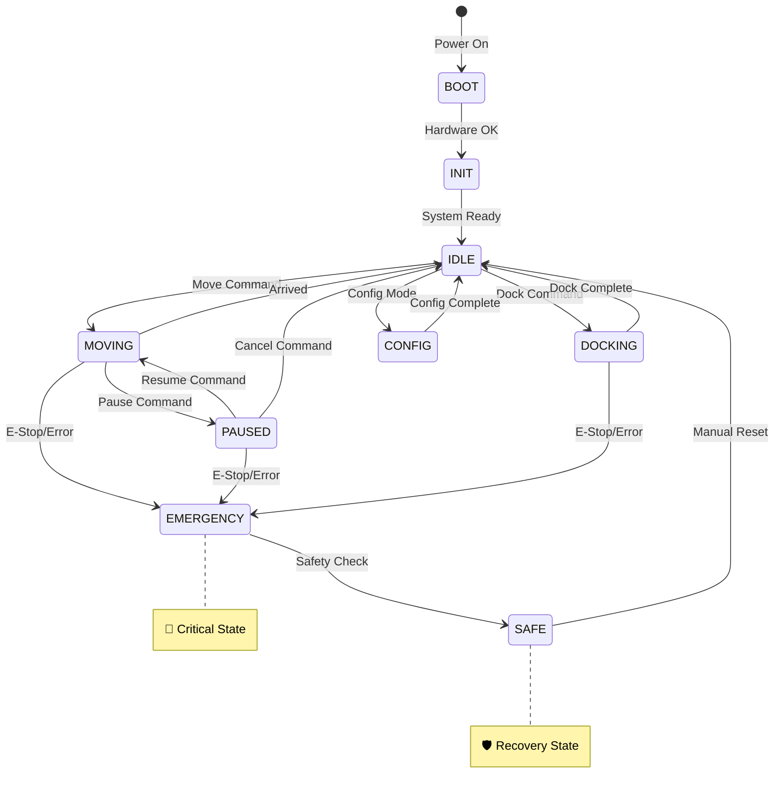

# 🔄 **SYSTEM STATE MACHINE - MÁY TRẠNG THÁI HỆ THỐNG OHT-50**

**📅 Ngày tạo:** 2025-01-28  
**👤 Người tạo:** CTO Analysis  
**🎯 Mục đích:** Giải thích chi tiết máy trạng thái hệ thống cho OHT-50

---

## 🎯 **MÁY TRẠNG THÁI LÀ GÌ?**

### 🔍 **Định nghĩa đơn giản:**
**Máy trạng thái** giống như **"bộ não điều khiển"** của robot:
- 🧠 **Biết robot đang làm gì** (đang đứng yên, đang di chuyển, đang sạc...)
- 🚦 **Quyết định robot có thể làm gì tiếp theo** (có thể di chuyển không? có thể dừng không?)
- 🛡️ **Bảo vệ robot** khỏi các lệnh nguy hiểm

### 🎭 **Ví dụ thực tế:**
Giống như **đèn giao thông**:
- 🔴 **Đỏ** → Dừng (không được đi)
- 🟡 **Vàng** → Chuẩn bị (sắp chuyển trạng thái)  
- 🟢 **Xanh** → Đi (được phép di chuyển)

---

## 🏗️ **CÁC TRẠNG THÁI CHÍNH CỦA OHT-50**

### 📊 **Sơ đồ tổng quan:**



---

## 🔍 **CHI TIẾT TỪNG TRẠNG THÁI**

### 🚀 **1. BOOT (Khởi động)**
```c
// Trạng thái: Robot đang khởi động
typedef enum {
    BOOT_POWER_CHECK,      // Kiểm tra nguồn điện
    BOOT_HARDWARE_INIT,    // Khởi tạo phần cứng  
    BOOT_SAFETY_CHECK,     // Kiểm tra hệ thống an toàn
    BOOT_COMMUNICATION,    // Thiết lập giao tiếp
    BOOT_COMPLETE         // Khởi động hoàn tất
} boot_state_t;
```

**🔧 Firmware làm gì:**
- ✅ Kiểm tra nguồn điện (24V, 12V, 5V)
- ✅ Khởi tạo GPIO (LED, Relay, E-Stop)
- ✅ Thiết lập RS485/UART
- ✅ Kiểm tra E-Stop có hoạt động không
- ✅ Bật LED_POWER = ON

**⏱️ Thời gian:** 2-5 giây  
**🚨 Lỗi có thể xảy ra:** Hardware fault, Power failure

---

### ⚙️ **2. INIT (Khởi tạo hệ thống)**
```c
typedef enum {
    INIT_MOTORS,           // Khởi tạo động cơ
    INIT_SENSORS,          // Khởi tạo cảm biến
    INIT_CALIBRATION,      // Hiệu chỉnh hệ thống
    INIT_READY            // Sẵn sàng hoạt động
} init_state_t;
```

**🔧 Firmware làm gì:**
- ✅ Gửi lệnh khởi tạo xuống motor controller
- ✅ Đọc vị trí hiện tại từ encoder
- ✅ Kiểm tra giới hạn hành trình
- ✅ Hiệu chỉnh home position
- ✅ Bật LED_SYSTEM = ON

**⏱️ Thời gian:** 3-10 giây  
**🚨 Lỗi có thể xảy ra:** Motor không phản hồi, Encoder lỗi

---

### 🟢 **3. IDLE (Sẵn sàng)**
```c
typedef struct {
    position_t current_position;    // Vị trí hiện tại
    battery_level_t battery;       // Mức pin
    bool estop_active;            // Trạng thái E-Stop
    communication_status_t comm;   // Trạng thái giao tiếp
} idle_state_data_t;
```

**🔧 Firmware làm gì:**
- 📊 **Monitoring liên tục:** vị trí, pin, nhiệt độ
- 📡 **Gửi telemetry** về Backend mỗi 100ms
- 👂 **Lắng nghe lệnh** từ Backend/User
- 💡 **LED Status:** SYSTEM=ON, COMM=Blinking

**✅ Lệnh được phép:**
- `MOVE_TO(x, y)` → Chuyển sang MOVING
- `DOCK()` → Chuyển sang DOCKING  
- `CONFIG_MODE()` → Chuyển sang CONFIG
- `STATUS_REQUEST()` → Trả về trạng thái

**❌ Lệnh bị từ chối:** Không có (IDLE là trạng thái an toàn nhất)

---

### 🏃 **4. MOVING (Đang di chuyển)**
```c
typedef struct {
    target_position_t target;      // Điểm đích
    current_velocity_t velocity;   // Vận tốc hiện tại
    movement_profile_t profile;    // Profile chuyển động (S-curve)
    safety_zone_t safety_zone;     // Vùng an toàn
    uint32_t start_time;          // Thời gian bắt đầu
} moving_state_data_t;
```

**🔧 Firmware làm gì:**
- 🎯 **Điều khiển chuyển động:** PID controller, S-curve profile
- 🛡️ **Giám sát an toàn:** tốc độ, gia tốc, vùng cấm
- 📊 **Cập nhật vị trí:** mỗi 10ms
- 💡 **LED Status:** SYSTEM=Blinking, COMM=ON

**✅ Lệnh được phép:**
- `PAUSE()` → Chuyển sang PAUSED
- `STOP()` → Dừng và về IDLE  
- `UPDATE_TARGET(x, y)` → Cập nhật điểm đích
- `E_STOP()` → Chuyển sang EMERGENCY

**❌ Lệnh bị từ chối:**
- `MOVE_TO()` khác → "Robot đang di chuyển"
- `CONFIG_MODE()` → "Không thể config khi đang di chuyển"

**⚠️ Điều kiện chuyển trạng thái:**
```c
// Đến đích
if (distance_to_target < POSITION_TOLERANCE) {
    state = IDLE;
    led_system = ON;  // Không nhấp nháy nữa
}

// Gặp chướng ngại vật
if (obstacle_detected) {
    state = PAUSED;
    send_alert("Obstacle detected");
}

// E-Stop được kích hoạt
if (estop_pressed) {
    state = EMERGENCY;
    stop_all_motors();
}
```

---

### ⏸️ **5. PAUSED (Tạm dừng)**
```c
typedef struct {
    position_t pause_position;     // Vị trí tạm dừng
    target_position_t original_target;  // Điểm đích ban đầu
    pause_reason_t reason;         // Lý do tạm dừng
    uint32_t pause_time;          // Thời gian tạm dừng
} paused_state_data_t;
```

**🔧 Firmware làm gì:**
- 🛑 **Dừng chuyển động** (không tắt motor)
- 💾 **Lưu trạng thái** để có thể resume
- 👂 **Chờ lệnh** resume hoặc cancel
- 💡 **LED Status:** SYSTEM=Slow Blink, ERROR=OFF

**✅ Lệnh được phép:**
- `RESUME()` → Tiếp tục di chuyển (MOVING)
- `CANCEL()` → Hủy và về IDLE
- `MOVE_TO(x, y)` → Di chuyển đến vị trí mới
- `E_STOP()` → Chuyển sang EMERGENCY

---

### 🔌 **6. DOCKING (Đang dock/sạc)**
```c
typedef struct {
    dock_position_t dock_target;   // Vị trí dock
    docking_phase_t phase;         // Giai đoạn dock
    alignment_data_t alignment;    // Dữ liệu căn chỉnh
    charging_status_t charging;    // Trạng thái sạc
} docking_state_data_t;

typedef enum {
    DOCK_APPROACH,     // Tiếp cận dock
    DOCK_ALIGN,        // Căn chỉnh vị trí
    DOCK_CONNECT,      // Kết nối sạc
    DOCK_CHARGING      // Đang sạc
} docking_phase_t;
```

**🔧 Firmware làm gì:**
- 🎯 **Di chuyển chính xác** đến vị trí dock
- ⚡ **Kết nối sạc:** bật RELAY1 để kết nối
- 🔋 **Giám sát sạc:** điện áp, dòng điện
- 💡 **LED Status:** NETWORK=ON (đang kết nối dock)

---

### ⚙️ **7. CONFIG (Chế độ cấu hình)**
```c
typedef struct {
    config_type_t type;           // Loại cấu hình
    config_data_t new_config;     // Cấu hình mới
    config_data_t backup_config;  // Backup cấu hình cũ
    bool config_applied;          // Đã áp dụng chưa
} config_state_data_t;
```

**🔧 Firmware làm gì:**
- 💾 **Backup cấu hình cũ** (để rollback nếu lỗi)
- ⚙️ **Áp dụng cấu hình mới** từng bước
- ✅ **Validate cấu hình** (kiểm tra tính hợp lệ)
- 🔄 **Rollback nếu lỗi**

**🛡️ Cơ chế an toàn:**
```c
// Áp dụng cấu hình an toàn
bool apply_config_safely(config_data_t* new_config) {
    // 1. Backup cấu hình hiện tại
    backup_current_config();
    
    // 2. Validate cấu hình mới
    if (!validate_config(new_config)) {
        return false;
    }
    
    // 3. Áp dụng từng bước
    if (!apply_config_step_by_step(new_config)) {
        // Rollback nếu lỗi
        restore_backup_config();
        return false;
    }
    
    return true;
}
```

---

### 🚨 **8. EMERGENCY (Khẩn cấp)**
```c
typedef struct {
    emergency_reason_t reason;     // Lý do khẩn cấp
    position_t emergency_position; // Vị trí khi xảy ra sự cố
    uint32_t emergency_time;      // Thời gian xảy ra
    safety_action_t actions_taken; // Hành động đã thực hiện
} emergency_state_data_t;

typedef enum {
    EMERGENCY_ESTOP,          // E-Stop được nhấn
    EMERGENCY_OVERCURRENT,    // Quá dòng
    EMERGENCY_OVERHEAT,       // Quá nhiệt
    EMERGENCY_COMMUNICATION,  // Mất liên lạc
    EMERGENCY_SENSOR_FAULT,   // Lỗi cảm biến
    EMERGENCY_COLLISION       // Va chạm
} emergency_reason_t;
```

**🔧 Firmware làm gì:**
- 🛑 **DỪNG TẤT CẢ** ngay lập tức (< 100ms)
- 🔴 **Bật LED_ERROR** = ON
- 📢 **Gửi cảnh báo** về Backend/User
- 💾 **Log sự kiện** để phân tích sau
- 🔒 **Khóa tất cả lệnh** (chỉ cho phép reset)

**🚨 Hành động khẩn cấp:**
```c
void enter_emergency_state(emergency_reason_t reason) {
    // 1. Dừng tất cả motor NGAY LẬP TỨC
    stop_all_motors_immediately();
    
    // 2. Cập nhật LED
    set_led(LED_ERROR, ON);
    set_led(LED_SYSTEM, FAST_BLINK);
    
    // 3. Tắt tất cả relay
    set_relay(RELAY1, OFF);
    set_relay(RELAY2, OFF);
    
    // 4. Log sự kiện
    log_emergency_event(reason, get_current_time(), get_current_position());
    
    // 5. Gửi cảnh báo
    send_emergency_alert(reason);
    
    // 6. Chuyển trạng thái
    system_state = EMERGENCY;
}
```

---

### 🛡️ **9. SAFE (Trạng thái an toàn)**
```c
typedef struct {
    safety_check_result_t checks;  // Kết quả kiểm tra an toàn
    bool manual_reset_required;    // Cần reset thủ công
    uint32_t safe_entry_time;     // Thời gian vào trạng thái safe
} safe_state_data_t;
```

**🔧 Firmware làm gì:**
- 🔍 **Kiểm tra toàn bộ hệ thống**
- 🛠️ **Chờ reset thủ công** từ người vận hành
- 📊 **Báo cáo tình trạng** hệ thống
- 🔄 **Chuẩn bị quay về IDLE**

---

## ⚡ **TRANSITION LOGIC - LOGIC CHUYỂN TRẠNG THÁI**

### 🔄 **Ma trận chuyển trạng thái:**

| Từ trạng thái | Đến trạng thái | Điều kiện | Thời gian |
|---------------|----------------|-----------|-----------|
| BOOT | INIT | Hardware OK | < 5s |
| INIT | IDLE | System Ready | < 10s |
| IDLE | MOVING | Move Command + Safety OK | < 100ms |
| MOVING | IDLE | Arrived at target | Variable |
| MOVING | PAUSED | Pause Command/Obstacle | < 200ms |
| PAUSED | MOVING | Resume Command | < 100ms |
| ANY | EMERGENCY | E-Stop/Critical Error | < 100ms |
| EMERGENCY | SAFE | Safety Assessment | 1-5s |
| SAFE | IDLE | Manual Reset + All OK | < 1s |

### 🛡️ **Safety Guards - Bảo vệ chuyển trạng thái:**

```c
// Kiểm tra điều kiện an toàn trước khi chuyển trạng thái
bool can_transition_to_moving(void) {
    // 1. E-Stop không được kích hoạt
    if (is_estop_active()) {
        return false;
    }
    
    // 2. Hệ thống không có lỗi
    if (has_system_error()) {
        return false;
    }
    
    // 3. Target position hợp lệ
    if (!is_target_position_valid()) {
        return false;
    }
    
    // 4. Đủ pin để di chuyển
    if (battery_level < MIN_BATTERY_FOR_MOVEMENT) {
        return false;
    }
    
    return true;
}
```

---

## 📊 **STATE MONITORING - GIÁM SÁT TRẠNG THÁI**

### 📈 **Telemetry Data:**
```json
{
  "timestamp": "2025-01-28T10:30:00Z",
  "system_state": {
    "current_state": "MOVING",
    "previous_state": "IDLE",
    "state_duration": 1250,
    "transition_count": 15
  },
  "state_data": {
    "target_position": {"x": 100, "y": 200},
    "current_position": {"x": 85, "y": 180},
    "velocity": {"vx": 0.5, "vy": 0.3},
    "progress_percent": 75
  },
  "safety_status": {
    "estop_active": false,
    "safety_zone_clear": true,
    "emergency_stops_today": 0
  }
}
```

### 📊 **State Statistics:**
```c
typedef struct {
    uint32_t time_in_idle;        // Thời gian ở IDLE
    uint32_t time_in_moving;      // Thời gian di chuyển
    uint32_t time_in_docking;     // Thời gian dock
    uint32_t emergency_count;     // Số lần emergency
    uint32_t total_transitions;   // Tổng số lần chuyển trạng thái
} state_statistics_t;
```

---

## 🧪 **TESTING STATE MACHINE**

### 🔬 **Unit Tests:**
```c
// Test chuyển trạng thái cơ bản
void test_basic_state_transitions() {
    // Test BOOT → INIT
    assert(system_state == BOOT);
    trigger_hardware_ready();
    assert(system_state == INIT);
    
    // Test INIT → IDLE
    trigger_system_ready();
    assert(system_state == IDLE);
    
    // Test IDLE → MOVING
    send_move_command(100, 200);
    assert(system_state == MOVING);
}

// Test Emergency transitions
void test_emergency_transitions() {
    // Từ bất kỳ trạng thái nào
    set_system_state(MOVING);
    trigger_estop();
    assert(system_state == EMERGENCY);
    assert(led_error == ON);
}
```

### 🎭 **Scenario Tests:**
```c
// Kịch bản: Di chuyển bình thường
void test_normal_movement_scenario() {
    // 1. Khởi động hệ thống
    boot_system();
    wait_for_state(IDLE, 10000);  // Chờ 10s
    
    // 2. Gửi lệnh di chuyển
    send_move_command(100, 200);
    assert(system_state == MOVING);
    
    // 3. Chờ đến đích
    wait_for_state(IDLE, 30000);  // Chờ 30s
    
    // 4. Kiểm tra vị trí
    position_t pos = get_current_position();
    assert(abs(pos.x - 100) < 2);  // Sai số < 2mm
    assert(abs(pos.y - 200) < 2);
}
```

---

## 🚨 **ERROR HANDLING - XỬ LÝ LỖI**

### 🛠️ **Lỗi thường gặp và cách xử lý:**

#### **1. Communication Timeout:**
```c
void handle_communication_timeout() {
    if (system_state == MOVING) {
        // Dừng an toàn
        state = PAUSED;
        pause_reason = COMM_TIMEOUT;
        
        // Thử kết nối lại
        retry_communication();
    }
}
```

#### **2. Sensor Fault:**
```c
void handle_sensor_fault(sensor_id_t sensor) {
    if (sensor == POSITION_ENCODER) {
        // Lỗi encoder vị trí - NGUY HIỂM
        enter_emergency_state(EMERGENCY_SENSOR_FAULT);
    } else if (sensor == TEMPERATURE_SENSOR) {
        // Lỗi cảm biến nhiệt độ - cảnh báo
        send_warning("Temperature sensor fault");
    }
}
```

#### **3. Power Issues:**
```c
void handle_power_issues() {
    if (battery_level < CRITICAL_BATTERY_LEVEL) {
        // Pin yếu - về dock sạc
        if (system_state != DOCKING) {
            send_dock_command();
        }
    }
    
    if (power_supply_fault) {
        // Lỗi nguồn - emergency
        enter_emergency_state(EMERGENCY_POWER_FAULT);
    }
}
```

---

## 🎯 **TẠI SAO STATE MACHINE QUAN TRỌNG?**

### 🛡️ **1. An toàn (Safety):**
- **Ngăn chặn** các lệnh nguy hiểm
- **Đảm bảo** robot luôn ở trạng thái có thể kiểm soát
- **Phản ứng nhanh** với các tình huống khẩn cấp

### 🧠 **2. Logic rõ ràng (Clear Logic):**
- **Biết chính xác** robot đang làm gì
- **Dự đoán được** robot sẽ phản ứng như thế nào
- **Dễ debug** khi có vấn đề

### 🔄 **3. Reliability (Độ tin cậy):**
- **Xử lý lỗi** một cách có hệ thống
- **Recovery** từ các tình huống bất thường
- **Logging** đầy đủ để phân tích

### ⚡ **4. Performance (Hiệu suất):**
- **Chỉ xử lý** các lệnh cần thiết ở mỗi trạng thái
- **Tối ưu** resource usage
- **Real-time response** cho các sự kiện quan trọng

---

## 💡 **TÓM TẮT CHO NGƯỜI KHÔNG BIẾT GÌ**

### 🎭 **State Machine giống như "kịch bản diễn xuất":**

1. **🎬 Robot như một diễn viên** - chỉ được phép làm những gì kịch bản cho phép
2. **📜 Mỗi trạng thái là một cảnh** - robot biết mình đang ở cảnh nào
3. **🎯 Chỉ được chuyển cảnh** khi có "tín hiệu đạo diễn" (điều kiện)
4. **🚨 Có "cảnh khẩn cấp"** - khi có sự cố thì nhảy ngay vào cảnh này

### 🛡️ **Ví dụ thực tế:**
- **Robot đang di chuyển** → Không được nhận lệnh "cấu hình"
- **Robot đang sạc** → Không được nhận lệnh "di chuyển"  
- **Có người nhấn E-Stop** → Dù đang làm gì cũng phải dừng ngay

### 🎯 **Lợi ích:**
- ✅ **Robot an toàn** - không bao giờ làm việc nguy hiểm
- ✅ **Dễ hiểu** - biết chính xác robot đang làm gì
- ✅ **Ổn định** - xử lý lỗi một cách có hệ thống
- ✅ **Dễ maintain** - thêm tính năng mới dễ dàng

**🚨 Nhớ:** State Machine là **"luật an toàn"** của robot - không có nó thì robot sẽ rất nguy hiểm!

---

## 📚 **TÀI LIỆU THAM KHẢO**

1. **IEC 61508** - Functional Safety Standards
2. **ISO 13849** - Safety of Machinery
3. **Finite State Machine Design Patterns**
4. **Real-time Systems Design**
5. **Embedded Safety Systems**

---

**📝 Changelog:**
- v1.0: Tạo tài liệu phân tích State Machine chi tiết
- Bao gồm: Định nghĩa, các trạng thái, logic chuyển đổi, xử lý lỗi, testing
- Có sơ đồ Mermaid và code examples minh họa
- Giải thích dễ hiểu cho người không chuyên

**🎯 Mục đích:** Giúp team hiểu rõ State Machine để implement Firmware an toàn và ổn định.
