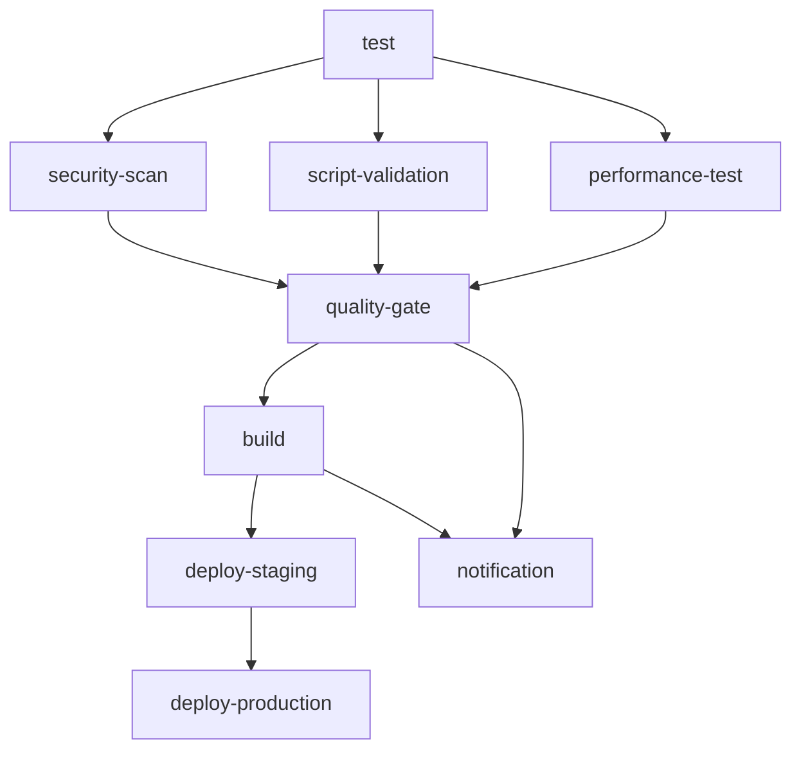

# 🔄 CI/CD Pipeline Update Summary

**Phiên bản:** 1.1  
**Ngày cập nhật:** 2025-01-28  
**Tác giả:** Backend Team  
**Trạng thái:** Updated  

---

## 🎯 **MỤC TIÊU**
Cập nhật CI/CD pipeline để tương thích với cấu trúc mới sau khi dọn dẹp backend.

## 📋 **THAY ĐỔI THỰC HIỆN**

### **🔧 Fixed Paths**
- **Line 47 & 117:** `python setup_database.py` → `python scripts/setup/setup_database.py`
- **Reason:** File đã được di chuyển vào `scripts/setup/` folder

### **🆕 New Job: Script Validation**
- **Job Name:** `script-validation`
- **Purpose:** Validate tất cả scripts sau khi tổ chức lại
- **Dependencies:** `needs: test`

#### **Script Validation Steps:**
1. **Setup test database** - `python scripts/setup/setup_database.py`
2. **Validate setup scripts:**
   - `python scripts/setup/check_db.py`
   - `python scripts/setup/check_admin.py`
   - `python scripts/setup/check_users.py`
3. **Run script tests:**
   - `python scripts/test/test_admin_privileges.py`
   - `python scripts/test/test_jwt.py`
   - `python scripts/test/test_simple_auth.py`
4. **Script validation summary**

### **🔄 Updated Dependencies**
- **Quality Gate:** `needs: [test, security-scan, performance-test, script-validation]`
- **Reason:** Bao gồm script validation trong quality gate

### **📊 Updated Messages**
- **Quality Gate:** Thêm "✅ Scripts: VALIDATED"
- **Notification:** Thêm "🛠️ Scripts validated and organized"

## 🚀 **PIPELINE FLOW MỚI**

## 📊 **VALIDATION COVERAGE**

### **Setup Scripts**
- ✅ Database setup
- ✅ Database health check
- ✅ Admin user validation
- ✅ User management check

### **Test Scripts**
- ✅ Admin privileges testing
- ✅ JWT authentication testing
- ✅ Simple authentication testing

### **System Health**
- ✅ Database connectivity
- ✅ User authentication
- ✅ System permissions
- ✅ Script functionality

## 🔄 **CHANGELOG**
- **v1.1 (2025-01-28):** Cập nhật CI/CD pipeline cho cấu trúc mới
- **v1.0 (2025-01-28):** CI/CD pipeline ban đầu

---

**📅 Last Updated:** 2025-01-28  
**📁 Location:** `backend/.github/workflows/ci-cd.yml`  
**🔗 Related:** [Backend README](../../README.md)
