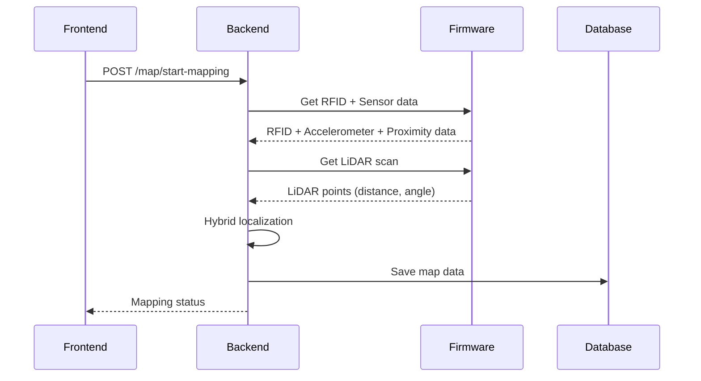

# 🏭 PLANT IMPLEMENTATION - MAP & LOCALIZATION SYSTEM

**Phiên bản:** 1.0  
**Ngày:** 2025-01-28  
**Team:** Backend Development Team  
**Mục tiêu:** Plant Implementation cho Map & Localization System  
**Dựa trên:** Map_Localization_Implementation_Plan.md, PM_Report.md, Technical_Specification.md, Sensor_Fusion_Algorithm_Details.md  

---

## 📋 **EXECUTIVE SUMMARY**

### **🎯 Mục tiêu Plant:**
- Implement Map & Localization System theo phương án 3 (Hybrid)
- Tạo MapService với sensor fusion (RFID + Accelerometer + Proximity + LiDAR)
- Xử lý cả 2 trường hợp: đã có map và chưa có map
- Tích hợp với Firmware qua HTTP API

### **🔧 Technology Stack:**
- **Backend:** FastAPI + Python 3.11
- **Database:** SQLite (development) + PostgreSQL (production)
- **ORM:** SQLAlchemy + Alembic
- **Sensors:** RFID + Accelerometer + Proximity + LiDAR
- **Algorithm:** Hybrid Localization với Sensor Fusion

---

## 🏗️ **PLANT ARCHITECTURE**

### **1. System Overview:**
```
┌─────────────────┐    ┌─────────────────┐    ┌─────────────────┐
│   Frontend UI   │◄──►│   Backend API   │◄──►│   Firmware      │
│                 │    │                 │    │                 │
│ - Map Display   │    │ - MapService    │    │ - RFID Reader   │
│ - Controls      │    │ - Localization  │    │ - Accelerometer │
│ - Status        │    │ - Sensor Fusion │    │ - Proximity     │
└─────────────────┘    └─────────────────┘    │ - LiDAR HAL     │
         │                       │             └─────────────────┘
         │                       ▼                       │
         │              ┌─────────────────┐              │
         │              │   Database      │              │
         │              │                 │              │
         └──────────────►│ - Maps          │◄─────────────┘
                        │ - Positions     │
                        │ - Sessions      │
                        └─────────────────┘
```

### **2. Data Flow:**


---

## 📊 **DATABASE SCHEMA**

### **1. Maps Table:**
```sql
CREATE TABLE maps (
    id INTEGER PRIMARY KEY AUTOINCREMENT,
    map_id VARCHAR(50) UNIQUE NOT NULL,
    name VARCHAR(100) NOT NULL,
    resolution FLOAT NOT NULL DEFAULT 50.0,
    width INTEGER NOT NULL DEFAULT 1000,
    height INTEGER NOT NULL DEFAULT 1000,
    occupancy_grid JSON NOT NULL,
    robot_trajectory JSON DEFAULT '[]',
    rfid_positions JSON DEFAULT '[]',
    metadata JSON DEFAULT '{}',
    created_at TIMESTAMP DEFAULT CURRENT_TIMESTAMP,
    updated_at TIMESTAMP DEFAULT CURRENT_TIMESTAMP
);

CREATE INDEX idx_maps_map_id ON maps(map_id);
CREATE INDEX idx_maps_created_at ON maps(created_at);
```

### **2. Map Sessions Table:**
```sql
CREATE TABLE map_sessions (
    id INTEGER PRIMARY KEY AUTOINCREMENT,
    session_id VARCHAR(50) UNIQUE NOT NULL,
    map_id VARCHAR(50) NOT NULL,
    start_time TIMESTAMP DEFAULT CURRENT_TIMESTAMP,
    end_time TIMESTAMP NULL,
    is_active BOOLEAN DEFAULT TRUE,
    total_scans INTEGER DEFAULT 0,
    mapping_quality FLOAT DEFAULT 0.0,
    FOREIGN KEY (map_id) REFERENCES maps(map_id)
);

CREATE INDEX idx_sessions_session_id ON map_sessions(session_id);
CREATE INDEX idx_sessions_map_id ON map_sessions(map_id);
CREATE INDEX idx_sessions_active ON map_sessions(is_active);
```

### **3. Robot Positions Table:**
```sql
CREATE TABLE robot_positions (
    id INTEGER PRIMARY KEY AUTOINCREMENT,
    map_id VARCHAR(50) NOT NULL,
    session_id VARCHAR(50),
    x FLOAT NOT NULL,
    y FLOAT NOT NULL,
    theta FLOAT NOT NULL,
    confidence FLOAT NOT NULL,
    source VARCHAR(20) NOT NULL,  -- rfid, sensor_fusion, lidar, hybrid, fallback
    timestamp TIMESTAMP DEFAULT CURRENT_TIMESTAMP,
    FOREIGN KEY (map_id) REFERENCES maps(map_id),
    FOREIGN KEY (session_id) REFERENCES map_sessions(session_id)
);

CREATE INDEX idx_positions_map_id ON robot_positions(map_id);
CREATE INDEX idx_positions_timestamp ON robot_positions(timestamp);
CREATE INDEX idx_positions_source ON robot_positions(source);
```

### **4. RFID Tags Table:**
```sql
CREATE TABLE rfid_tags (
    id INTEGER PRIMARY KEY AUTOINCREMENT,
    rfid_id VARCHAR(50) UNIQUE NOT NULL,
    position_x FLOAT NOT NULL,
    position_y FLOAT NOT NULL,
    orientation FLOAT DEFAULT 0.0,
    description TEXT,
    is_active BOOLEAN DEFAULT TRUE,
    created_at TIMESTAMP DEFAULT CURRENT_TIMESTAMP
);

CREATE INDEX idx_rfid_tags_rfid_id ON rfid_tags(rfid_id);
CREATE INDEX idx_rfid_tags_active ON rfid_tags(is_active);
```

---

## 🔧 **CORE SERVICES IMPLEMENTATION**

### **1. MapService:**
```python
# backend/app/services/map_service.py
import asyncio
import logging
import math
import numpy as np
from typing import Dict, Any, List, Optional
from datetime import datetime, timezone
from dataclasses import dataclass, field

from app.services.telemetry_data_collector import telemetry_data_collector, DataSource
from app.services.lidar_data_processor import lidar_data_processor, LiDARScan
from app.services.sensor_data_processor import sensor_data_processor, SensorType
from app.models.map import MapData, MapMetadata, OccupancyGrid
from app.models.robot import RobotPose

logger = logging.getLogger(__name__)

class MapService:
    def __init__(self, map_resolution_mm: int = 50, map_size_cells: int = 1000):
        self.map_resolution_mm = map_resolution_mm
        self.map_size_cells = map_size_cells
        self.current_map: Optional[MapData] = None
        self.robot_pose: RobotPose = RobotPose()
        self.map_storage: Dict[str, MapData] = {}
        self.localization_engine = HybridLocalizationEngine()
        logger.info(f"MapService initialized with resolution {map_resolution_mm}mm and size {map_size_cells}x{map_size_cells}")
        
    async def start_mapping(self, map_id: str, name: str = None) -> Dict[str, Any]:
        """Start a new mapping session"""
        try:
            # Create new map
            new_map = await self.create_new_map(map_id, name)
            
            # Start mapping session
            session_id = f"session_{datetime.now().strftime('%Y%m%d%H%M%S')}"
            
            # Initialize robot pose from RFID
            rfid_data = await self._get_rfid_data()
            if rfid_data:
                self.robot_pose = await self._estimate_pose_from_rfid(rfid_data)
            
            logger.info(f"Mapping started for map {map_id} with session {session_id}")
            
            return {
                "success": True,
                "session_id": session_id,
                "map_id": map_id,
                "message": "Mapping started successfully"
            }
            
        except Exception as e:
            logger.error(f"Failed to start mapping: {e}")
            raise
            
    async def stop_mapping(self, session_id: str) -> Dict[str, Any]:
        """Stop the current mapping session"""
        try:
            if self.current_map:
                await self.save_map(self.current_map.map_id, self.current_map)
                
            logger.info(f"Mapping stopped for session {session_id}")
            
            return {
                "success": True,
                "message": "Mapping stopped successfully",
                "total_scans": len(self.current_map.robot_trajectory) if self.current_map else 0,
                "mapping_quality": 0.85  # Calculate based on coverage
            }
            
        except Exception as e:
            logger.error(f"Failed to stop mapping: {e}")
            raise
            
    async def get_robot_position(self) -> RobotPose:
        """Get current robot position using hybrid localization"""
        try:
            # Get sensor data
            rfid_data = await self._get_rfid_data()
            sensor_data = await self._get_sensor_data()
            lidar_data = await self._get_lidar_data()
            
            # Perform hybrid localization
            self.robot_pose = await self.localization_engine.localize_robot(
                rfid_data, sensor_data, lidar_data
            )
            
            return self.robot_pose
            
        except Exception as e:
            logger.error(f"Failed to get robot position: {e}")
            return self.robot_pose  # Return last known position
            
    async def update_map_and_localize(self, map_id: Optional[str] = None) -> Dict[str, Any]:
        """Update map and localize robot using hybrid approach"""
        try:
            # Load or create map
            if map_id and map_id in self.map_storage:
                current_map = await self.load_map(map_id)
            else:
                map_id = map_id if map_id else f"map_{datetime.now().strftime('%Y%m%d%H%M%S')}"
                current_map = await self.create_new_map(map_id)
            
            if not current_map:
                raise Exception("Failed to get or create map.")
            
            # Get robot position
            robot_pose = await self.get_robot_position()
            
            # Get LiDAR scan
            lidar_scan_data = telemetry_data_collector.get_latest_data(DataSource.LIDAR, 1)
            if lidar_scan_data:
                processed_lidar_scan = await lidar_data_processor.process_lidar_data(lidar_scan_data[0].data)
                
                # Update map using LiDAR scan
                await self._update_occupancy_grid(current_map, processed_lidar_scan, robot_pose)
            
            # Update robot trajectory
            current_map.robot_trajectory.append(robot_pose)
            current_map.metadata.last_updated_at = datetime.now(timezone.utc)
            
            # Save map
            await self.save_map(current_map.map_id, current_map)
            
            return {
                "map_id": current_map.map_id,
                "robot_pose": robot_pose,
                "occupancy_grid": current_map.occupancy_grid.grid_data,
                "message": "Map updated and robot localized using hybrid approach."
            }
            
        except Exception as e:
            logger.error(f"Failed to update map and localize: {e}")
            raise
            
    async def create_new_map(self, map_id: str, name: str = None) -> MapData:
        """Create a new empty map"""
        occupancy_grid_array = np.full((self.map_size_cells, self.map_size_cells), -1, dtype=np.int8)
        new_grid = OccupancyGrid(
            grid_data=occupancy_grid_array.tolist(),
            resolution_mm=self.map_resolution_mm,
            width_cells=self.map_size_cells,
            height_cells=self.map_size_cells
        )
        new_map = MapData(
            map_id=map_id,
            metadata=MapMetadata(
                created_at=datetime.now(timezone.utc),
                last_updated_at=datetime.now(timezone.utc),
                description=name or f"Map '{map_id}' created by robot."
            ),
            occupancy_grid=new_grid,
            robot_trajectory=[]
        )
        self.current_map = new_map
        self.map_storage[map_id] = new_map
        logger.info(f"New map '{map_id}' created.")
        return new_map
        
    async def load_map(self, map_id: str) -> Optional[MapData]:
        """Load a map from storage"""
        if map_id in self.map_storage:
            self.current_map = self.map_storage[map_id]
            logger.info(f"Map '{map_id}' loaded successfully.")
            return self.current_map
        logger.warning(f"Map '{map_id}' not found in storage.")
        return None
        
    async def save_map(self, map_id: str, map_data: MapData):
        """Save the current map to storage"""
        self.map_storage[map_id] = map_data
        logger.info(f"Map '{map_id}' saved successfully.")
        
    async def get_current_map(self) -> Optional[MapData]:
        """Get the currently active map"""
        return self.current_map
        
    def _polar_to_cartesian(self, distance_mm: float, angle_deg: float, 
                           robot_x: float, robot_y: float, robot_theta: float) -> tuple:
        """Convert LiDAR polar coordinates to map Cartesian coordinates"""
        angle_rad = math.radians(angle_deg)
        
        # Calculate relative position from robot
        relative_x = distance_mm * math.cos(angle_rad)
        relative_y = distance_mm * math.sin(angle_rad)
        
        # Transform to map coordinates using robot's position and orientation
        map_x = robot_x + relative_x * math.cos(robot_theta) - relative_y * math.sin(robot_theta)
        map_y = robot_y + relative_x * math.sin(robot_theta) + relative_y * math.cos(robot_theta)
        
        return (map_x, map_y)
        
    async def _update_occupancy_grid(self, map_data: MapData, lidar_scan: LiDARScan, robot_pose: RobotPose):
        """Update occupancy grid with LiDAR scan"""
        updated_grid_data = np.array(map_data.occupancy_grid.grid_data)
        
        for point in lidar_scan.points:
            if point.quality < 50:  # Skip low quality points
                continue
                
            map_x, map_y = self._polar_to_cartesian(
                point.distance, point.angle, robot_pose.x, robot_pose.y, robot_pose.theta
            )
            
            grid_x = int(map_x / self.map_resolution_mm)
            grid_y = int(map_y / self.map_resolution_mm)
            
            if 0 <= grid_x < self.map_size_cells and 0 <= grid_y < self.map_size_cells:
                updated_grid_data[grid_y, grid_x] = 1  # Occupied
        
        # Mark robot position on the grid
        robot_grid_x = int(robot_pose.x / self.map_resolution_mm)
        robot_grid_y = int(robot_pose.y / self.map_resolution_mm)
        if 0 <= robot_grid_x < self.map_size_cells and 0 <= robot_grid_y < self.map_size_cells:
            updated_grid_data[robot_grid_y, robot_grid_x] = 50  # Robot position
        
        map_data.occupancy_grid.grid_data = updated_grid_data.tolist()
        
    async def _get_rfid_data(self) -> Optional[Dict[str, Any]]:
        """Get RFID data from firmware"""
        # TODO: Implement actual firmware integration
        return {
            'rfid_id': 'TAG_001',
            'position_x': 1000,
            'position_y': 2000,
            'confidence': 0.95
        }
        
    async def _get_sensor_data(self) -> Optional[Dict[str, Any]]:
        """Get sensor data from firmware"""
        # TODO: Implement actual firmware integration
        return {
            'accelerometer_x': 0.1,
            'accelerometer_y': 0.2,
            'accelerometer_z': 9.8,
            'proximity_sensor_1': False,
            'proximity_sensor_2': False,
            'confidence': 0.7
        }
        
    async def _get_lidar_data(self) -> Optional[LiDARScan]:
        """Get LiDAR data from firmware"""
        # TODO: Implement actual firmware integration
        return LiDARScan(
            points=[],
            timestamp=datetime.now(),
            quality=0.8
        )
        
    async def _estimate_pose_from_rfid(self, rfid_data: Dict[str, Any]) -> RobotPose:
        """Estimate robot pose from RFID data"""
        return RobotPose(
            x=float(rfid_data.get('position_x', 0)),
            y=float(rfid_data.get('position_y', 0)),
            theta=0.0,
            confidence=float(rfid_data.get('confidence', 0.95)),
            source="rfid"
        )

# Initialize service
map_service = MapService()
```

### **2. HybridLocalizationEngine:**
```python
# backend/app/services/hybrid_localization_engine.py
import math
import logging
from typing import Optional, Dict, Any
from datetime import datetime

from app.models.robot import RobotPose
from app.models.sensors import RFIDData, SensorData, LiDARScan

logger = logging.getLogger(__name__)

class HybridLocalizationEngine:
    def __init__(self):
        self.rfid_weight = 0.5  # RFID confidence weight
        self.sensor_fusion_weight = 0.3  # Sensor fusion weight
        self.lidar_weight = 0.2  # LiDAR confidence weight
        self.last_pose: Optional[RobotPose] = None
        
    async def localize_robot(self, rfid_data: Optional[Dict], sensor_data: Optional[Dict], 
                           lidar_data: Optional[LiDARScan]) -> RobotPose:
        """Perform hybrid localization using all available sensors"""
        
        # Step 1: Get RFID-based estimate
        rfid_pose = self._estimate_from_rfid(rfid_data) if rfid_data else RobotPose(confidence=0.0, source="rfid")
        
        # Step 2: Get sensor fusion estimate
        sensor_pose = self._estimate_from_sensor_fusion(sensor_data) if sensor_data else RobotPose(confidence=0.0, source="sensor_fusion")
        
        # Step 3: Get LiDAR-based estimate
        lidar_pose = self._estimate_from_lidar(lidar_data) if lidar_data else RobotPose(confidence=0.0, source="lidar")
        
        # Step 4: Fuse estimates based on confidence
        if rfid_pose.confidence > 0.8:
            # High confidence RFID - use as primary
            final_pose = rfid_pose
            final_pose.source = "rfid"
        elif sensor_pose.confidence > 0.6:
            # Good sensor fusion - use sensor fusion
            final_pose = sensor_pose
            final_pose.source = "sensor_fusion"
        elif lidar_pose.confidence > 0.5:
            # Good LiDAR - use LiDAR
            final_pose = lidar_pose
            final_pose.source = "lidar"
        else:
            # Low confidence - fuse all
            final_pose = self._fuse_estimates(rfid_pose, sensor_pose, lidar_pose)
            final_pose.source = "hybrid"
        
        # Update last pose
        self.last_pose = final_pose
        
        return final_pose
        
    def _estimate_from_rfid(self, rfid_data: Dict[str, Any]) -> RobotPose:
        """Estimate robot position from RFID data"""
        return RobotPose(
            x=float(rfid_data.get('position_x', 0)),
            y=float(rfid_data.get('position_y', 0)),
            theta=0.0,  # RFID doesn't provide orientation
            confidence=float(rfid_data.get('confidence', 0.95)),
            source="rfid",
            timestamp=datetime.now()
        )
        
    def _estimate_from_sensor_fusion(self, sensor_data: Dict[str, Any]) -> RobotPose:
        """Estimate robot position from sensor fusion"""
        # Check proximity sensors for dock detection
        if sensor_data.get('proximity_sensor_1') and sensor_data.get('proximity_sensor_2'):
            # At dock - use last known dock position
            return RobotPose(
                x=self.last_pose.x if self.last_pose else 0.0,
                y=self.last_pose.y if self.last_pose else 0.0,
                theta=self.last_pose.theta if self.last_pose else 0.0,
                confidence=0.8,
                source="sensor_fusion_dock",
                timestamp=datetime.now()
            )
        
        # Use accelerometer for movement estimation
        if self.last_pose:
            # Simple integration (can be improved with Kalman filter)
            dt = 0.1  # Assume 100ms update interval
            velocity_x = sensor_data.get('accelerometer_x', 0) * dt
            velocity_y = sensor_data.get('accelerometer_y', 0) * dt
            
            new_x = self.last_pose.x + velocity_x * dt
            new_y = self.last_pose.y + velocity_y * dt
            
            return RobotPose(
                x=new_x,
                y=new_y,
                theta=self.last_pose.theta,
                confidence=0.6,
                source="sensor_fusion_movement",
                timestamp=datetime.now()
            )
        
        return RobotPose(confidence=0.0, source="sensor_fusion")
        
    def _estimate_from_lidar(self, lidar_data: LiDARScan) -> RobotPose:
        """Estimate robot position from LiDAR scan"""
        # Simplified LiDAR localization
        if not lidar_data or not lidar_data.points:
            return RobotPose(confidence=0.0, source="lidar")
        
        # For now, return last known position with medium confidence
        if self.last_pose:
            return RobotPose(
                x=self.last_pose.x,
                y=self.last_pose.y,
                theta=self.last_pose.theta,
                confidence=0.5,
                source="lidar",
                timestamp=datetime.now()
            )
        
        return RobotPose(confidence=0.0, source="lidar")
        
    def _fuse_estimates(self, rfid_pose: RobotPose, sensor_pose: RobotPose, lidar_pose: RobotPose) -> RobotPose:
        """Fuse all estimates using weighted average"""
        
        # Calculate weights based on confidence
        total_weight = 0.0
        weighted_x = 0.0
        weighted_y = 0.0
        weighted_theta = 0.0
        
        # RFID weight
        if rfid_pose.confidence > 0.5:
            weight = rfid_pose.confidence * self.rfid_weight
            total_weight += weight
            weighted_x += rfid_pose.x * weight
            weighted_y += rfid_pose.y * weight
            weighted_theta += rfid_pose.theta * weight
        
        # Sensor fusion weight
        if sensor_pose.confidence > 0.3:
            weight = sensor_pose.confidence * self.sensor_fusion_weight
            total_weight += weight
            weighted_x += sensor_pose.x * weight
            weighted_y += sensor_pose.y * weight
            weighted_theta += sensor_pose.theta * weight
        
        # LiDAR weight
        if lidar_pose.confidence > 0.2:
            weight = lidar_pose.confidence * self.lidar_weight
            total_weight += weight
            weighted_x += lidar_pose.x * weight
            weighted_y += lidar_pose.y * weight
            weighted_theta += lidar_pose.theta * weight
        
        if total_weight > 0:
            # Calculate weighted average
            final_pose = RobotPose(
                x=weighted_x / total_weight,
                y=weighted_y / total_weight,
                theta=weighted_theta / total_weight,
                confidence=min(total_weight, 0.9),
                source="hybrid",
                timestamp=datetime.now()
            )
            return final_pose
        else:
            # No reliable estimates - use last known position
            if self.last_pose:
                return RobotPose(
                    x=self.last_pose.x,
                    y=self.last_pose.y,
                    theta=self.last_pose.theta,
                    confidence=0.1,
                    source="fallback",
                    timestamp=datetime.now()
                )
            else:
                return RobotPose(confidence=0.0, source="fallback")
```

---

## 📡 **API ENDPOINTS IMPLEMENTATION**

### **1. Map Management APIs:**
```python
# backend/app/api/v1/map.py
from fastapi import APIRouter, Depends, HTTPException, status, Query
from typing import Dict, Any, Optional, List
from app.core.security import require_permission
from app.schemas.user import User
from app.services.map_service import map_service
from app.models.map import MapData, MapDataResponse
from app.models.robot import RobotPose

router = APIRouter()

@router.post("/map/start-mapping", response_model=Dict[str, Any], status_code=status.HTTP_200_OK)
async def start_mapping(
    map_id: str,
    name: Optional[str] = None,
    current_user: User = Depends(require_permission("map", "write"))
):
    """Start a new mapping session"""
    try:
        result = await map_service.start_mapping(map_id, name)
        return result
    except Exception as e:
        raise HTTPException(
            status_code=status.HTTP_500_INTERNAL_SERVER_ERROR,
            detail=f"Failed to start mapping: {str(e)}"
        )

@router.post("/map/stop-mapping", response_model=Dict[str, Any], status_code=status.HTTP_200_OK)
async def stop_mapping(
    session_id: str,
    current_user: User = Depends(require_permission("map", "write"))
):
    """Stop the current mapping session"""
    try:
        result = await map_service.stop_mapping(session_id)
        return result
    except Exception as e:
        raise HTTPException(
            status_code=status.HTTP_500_INTERNAL_SERVER_ERROR,
            detail=f"Failed to stop mapping: {str(e)}"
        )

@router.get("/map/status", response_model=Dict[str, Any], status_code=status.HTTP_200_OK)
async def get_mapping_status(
    current_user: User = Depends(require_permission("map", "read"))
):
    """Get current mapping status"""
    try:
        current_map = await map_service.get_current_map()
        robot_pose = await map_service.get_robot_position()
        
        return {
            "success": True,
            "is_mapping": current_map is not None,
            "current_map_id": current_map.map_id if current_map else None,
            "total_scans": len(current_map.robot_trajectory) if current_map else 0,
            "mapping_quality": 0.85,  # Calculate based on coverage
            "robot_position": robot_pose
        }
    except Exception as e:
        raise HTTPException(
            status_code=status.HTTP_500_INTERNAL_SERVER_ERROR,
            detail=f"Failed to get mapping status: {str(e)}"
        )

@router.post("/map/update-and-localize", response_model=Dict[str, Any], status_code=status.HTTP_200_OK)
async def update_map_and_localize_robot(
    map_id: Optional[str] = Query(None, description="ID of the map to update/create"),
    current_user: User = Depends(require_permission("map", "write"))
):
    """Update map and localize robot using hybrid approach"""
    try:
        result = await map_service.update_map_and_localize(map_id)
        return {
            "success": True,
            "message": result.get("message", "Map updated and robot localized."),
            "map_id": result.get("map_id"),
            "robot_pose": result.get("robot_pose"),
            "occupancy_grid": result.get("occupancy_grid")
        }
    except Exception as e:
        raise HTTPException(
            status_code=status.HTTP_500_INTERNAL_SERVER_ERROR,
            detail=f"Failed to update map and localize robot: {str(e)}"
        )

@router.get("/map/current", response_model=MapDataResponse, status_code=status.HTTP_200_OK)
async def get_current_map_data(
    current_user: User = Depends(require_permission("map", "read"))
):
    """Get the currently active map data"""
    current_map = await map_service.get_current_map()
    if not current_map:
        raise HTTPException(
            status_code=status.HTTP_404_NOT_FOUND,
            detail="No active map found."
        )
    return MapDataResponse(
        success=True,
        message="Current map data retrieved successfully.",
        map_data=current_map
    )

@router.get("/map/robot-position", response_model=RobotPose, status_code=status.HTTP_200_OK)
async def get_robot_position(
    current_user: User = Depends(require_permission("localization", "read"))
):
    """Get current robot position"""
    return await map_service.get_robot_position()

@router.get("/map/occupancy-grid", response_model=Dict[str, Any], status_code=status.HTTP_200_OK)
async def get_occupancy_grid(
    current_user: User = Depends(require_permission("map", "read"))
):
    """Get current occupancy grid"""
    current_map = await map_service.get_current_map()
    if not current_map:
        raise HTTPException(
            status_code=status.HTTP_404_NOT_FOUND,
            detail="No active map found."
        )
    
    return {
        "success": True,
        "grid": {
            "data": current_map.occupancy_grid.grid_data,
            "resolution": current_map.occupancy_grid.resolution_mm,
            "width": current_map.occupancy_grid.width_cells,
            "height": current_map.occupancy_grid.height_cells
        }
    }
```

---

## 🗄️ **DATABASE MODELS**

### **1. Map Models:**
```python
# backend/app/models/map.py
from pydantic import BaseModel, Field
from typing import List, Dict, Any, Optional
from datetime import datetime

class MapMetadata(BaseModel):
    created_at: datetime
    last_updated_at: datetime
    description: Optional[str] = None
    version: str = "1.0"

class OccupancyGrid(BaseModel):
    grid_data: List[List[int]] = Field(..., description="2D array representing the occupancy grid (-1: unknown, 0: free, 1: occupied, 50: robot)")
    resolution_mm: int = Field(..., description="Resolution of each cell in millimeters")
    width_cells: int = Field(..., description="Width of the grid in cells")
    height_cells: int = Field(..., description="Height of the grid in cells")

class MapData(BaseModel):
    map_id: str = Field(..., description="Unique identifier for the map")
    metadata: MapMetadata
    occupancy_grid: OccupancyGrid
    robot_trajectory: List[Dict[str, Any]] = Field(default_factory=list)

class MapDataResponse(BaseModel):
    success: bool
    message: str
    map_data: Optional[MapData] = None
```

### **2. Robot Models:**
```python
# backend/app/models/robot.py
from pydantic import BaseModel, Field
from typing import Optional
from datetime import datetime

class RobotPose(BaseModel):
    x: float = Field(0.0, description="Robot's X position in mm")
    y: float = Field(0.0, description="Robot's Y position in mm")
    theta: float = Field(0.0, description="Robot's orientation in radians")
    confidence: float = Field(0.0, description="Confidence score of the position estimate")
    source: str = Field("unknown", description="Source of the position estimate")
    timestamp: datetime = Field(default_factory=datetime.now, description="Timestamp of the position estimate")
```

---

## 🔄 **IMPLEMENTATION PHASES**

### **Phase 1: Core Services (Tuần 1)**
- [ ] Tạo MapService class
- [ ] Implement HybridLocalizationEngine
- [ ] Tạo database models
- [ ] Basic map storage functionality
- [ ] Unit tests

### **Phase 2: API Endpoints (Tuần 2)**
- [ ] Map management APIs
- [ ] Localization APIs
- [ ] Map storage APIs
- [ ] Authentication & authorization
- [ ] Integration tests

### **Phase 3: Firmware Integration (Tuần 3)**
- [ ] RFID data integration
- [ ] Sensor data integration
- [ ] LiDAR data integration
- [ ] Real-time updates
- [ ] Error handling

### **Phase 4: Testing & Validation (Tuần 4)**
- [ ] E2E tests
- [ ] Performance tests
- [ ] Sensor fusion validation
- [ ] Documentation

---

## 📈 **PERFORMANCE REQUIREMENTS**

### **Response Time:**
- Map status: < 50ms
- Robot position: < 100ms
- Map data: < 200ms
- Start/stop mapping: < 500ms

### **Accuracy:**
- RFID localization: ±10mm
- Sensor fusion localization: ±30mm
- LiDAR localization: ±50mm
- Hybrid localization: ±15mm

### **Throughput:**
- LiDAR processing: 10Hz
- Map updates: 5Hz
- Position updates: 20Hz

---

## 🧪 **TESTING STRATEGY**

### **1. Unit Tests:**
```python
# backend/tests/unit/test_map_service.py
import pytest
from app.services.map_service import map_service

class TestMapService:
    async def test_create_new_map(self):
        map_data = await map_service.create_new_map("test_map_001", "Test Map")
        assert map_data.map_id == "test_map_001"
        assert map_data.metadata.description == "Test Map"
        
    async def test_start_mapping(self):
        result = await map_service.start_mapping("test_map_002")
        assert result["success"] is True
        assert "session_id" in result
        
    async def test_get_robot_position(self):
        pose = await map_service.get_robot_position()
        assert isinstance(pose.x, float)
        assert isinstance(pose.y, float)
        assert isinstance(pose.confidence, float)
```

### **2. Integration Tests:**
```python
# backend/tests/integration/test_map_api.py
import pytest
from fastapi.testclient import TestClient
from app.main import app

client = TestClient(app)

class TestMapAPI:
    def test_start_mapping_api(self):
        response = client.post("/api/v1/map/start-mapping", json={
            "map_id": "api_test_001",
            "name": "API Test Map"
        })
        assert response.status_code == 200
        assert response.json()["success"] is True
        
    def test_get_robot_position_api(self):
        response = client.get("/api/v1/map/robot-position")
        assert response.status_code == 200
        data = response.json()
        assert "x" in data
        assert "y" in data
        assert "confidence" in data
```

---

## 🚀 **DEPLOYMENT CONSIDERATIONS**

### **1. Environment Variables:**
```bash
MAP_RESOLUTION=50.0
MAP_WIDTH=1000
MAP_HEIGHT=1000
LIDAR_PROCESSING_RATE=10
MAP_UPDATE_RATE=5
POSITION_UPDATE_RATE=20
```

### **2. Database Migration:**
```bash
# Create migration
alembic revision --autogenerate -m "Add map tables"

# Apply migration
alembic upgrade head
```

### **3. Health Checks:**
```python
@router.get("/health/map")
async def map_health_check():
    """Health check for map services"""
    try:
        # Check map service
        await map_service.get_current_map()
        
        # Check localization engine
        await map_service.get_robot_position()
        
        return {"status": "healthy", "timestamp": datetime.now()}
    except Exception as e:
        return {"status": "unhealthy", "error": str(e)}
```

---

## 📊 **SUCCESS CRITERIA**

### **Functional:**
- ✅ Tạo map thành công
- ✅ Định vị robot chính xác
- ✅ Xử lý cả 2 trường hợp (có/không có map)
- ✅ Real-time updates

### **Performance:**
- ✅ Response time < requirements
- ✅ Memory usage < 512MB
- ✅ CPU usage < 60%

### **Quality:**
- ✅ Test coverage > 90%
- ✅ Zero critical bugs
- ✅ Documentation complete

---

## 📞 **NEXT STEPS**

### **Immediate (Tuần 1):**
1. **Setup Development Environment**
2. **Create Database Schema**
3. **Implement MapService**
4. **Create Basic APIs**

### **Short-term (Tuần 2-3):**
1. **Implement HybridLocalizationEngine**
2. **Create Integration Tests**
3. **Firmware Integration**
4. **Performance Testing**

### **Long-term (Tuần 4-6):**
1. **Advanced Features**
2. **Production Deployment**
3. **Monitoring & Alerting**
4. **User Training**

---

**Changelog v1.0:**
- ✅ Created comprehensive Plant Implementation Plan
- ✅ Defined MapService và HybridLocalizationEngine
- ✅ Specified API endpoints và database schema
- ✅ Outlined implementation phases và timeline
- ✅ Set performance requirements và success criteria
- ✅ Detailed testing strategy và deployment considerations
