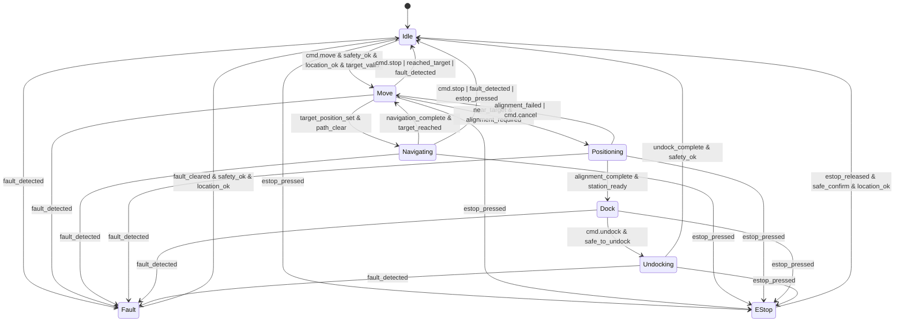
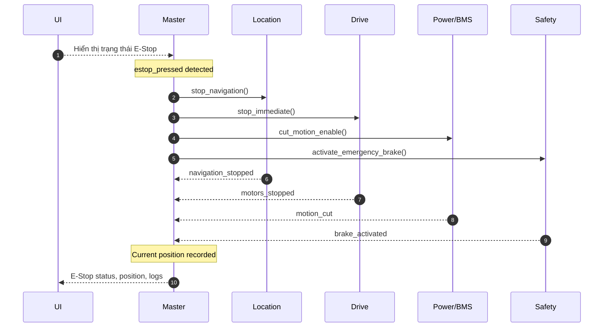

# State Machine hệ thống OHT-50 (Phiên bản 2.0)

**Phiên bản:** 2.0  
**Ngày cập nhật:** 2025-01-27  
**Trạng thái:** Updated với location requirements

---

## 🎯 **MỤC TIÊU**

### **Yêu cầu hệ thống:**
- Định nghĩa trạng thái hệ thống và chuyển tiếp giữa các trạng thái cho Master Module
- Tích hợp location-based safety và navigation requirements
- Đảm bảo an toàn với positioning system bắt buộc

---

## 🔄 **TRẠNG THÁI HỆ THỐNG**

### **Core States:**
- **Idle:** Chờ lệnh, hệ an toàn OK, location system ready
- **Move:** Di chuyển theo lệnh (profile v‑a‑j), giám sát an toàn liên tục, navigation active
- **Dock:** Quy trình docking/charging, interlock sạc, position alignment
- **Fault:** Lỗi có thể khôi phục; cần xác nhận/clear để quay về Idle
- **E‑Stop:** Khẩn cấp; dừng ngay, chỉ thoát khi xác nhận an toàn

### **Navigation States:**
- **Navigating:** Đang di chuyển đến target position
- **Positioning:** Đang align với target position
- **Docking:** Đang thực hiện docking procedure
- **Undocking:** Đang thực hiện undocking procedure

---

## 🗺️ **SƠ ĐỒ TRẠNG THÁI (Mermaid)**



---

## 🔍 **SỰ KIỆN & ĐIỀU KIỆN CANH GÁC (GUARDS)**

### **Command Events:**
- `cmd.move` - Lệnh di chuyển
- `cmd.stop` - Lệnh dừng
- `cmd.dock` - Lệnh docking
- `cmd.undock` - Lệnh undocking
- `cmd.cancel` - Lệnh hủy bỏ

### **Safety Events:**
- `safety_ok` - Hệ thống an toàn OK
- `estop_pressed` - E-Stop được nhấn
- `estop_released` - E-Stop được thả
- `safe_confirm` - Xác nhận an toàn

### **Location Events:**
- `location_ok` - Hệ thống location hoạt động
- `target_valid` - Target position hợp lệ
- `target_position_set` - Target position được set
- `path_clear` - Đường đi không có chướng ngại
- `near_target` - Gần target position
- `alignment_required` - Cần align với target
- `alignment_complete` - Alignment hoàn thành
- `target_reached` - Đã đến target position

### **System Events:**
- `fault_detected` - Phát hiện lỗi
- `fault_cleared` - Lỗi được clear
- `station_ready` - Station sẵn sàng
- `safe_to_undock` - An toàn để undock

---

## ⏱️ **YÊU CẦU THỜI GIAN THỰC**

### **Critical Response Times:**
- **Phát hiện E‑Stop:** Tức thời (< 1ms)
- **Phản hồi dừng:** < 100ms (mục tiêu)
- **Location update:** < 50ms
- **Navigation response:** < 200ms
- **Safety monitoring:** Continuous (100Hz)

### **Performance Requirements:**
- **Position accuracy:** ±10mm
- **Orientation accuracy:** ±1°
- **Docking accuracy:** ±5mm
- **Navigation speed:** 0.5-2.0 m/s

---

## 🔒 **SAFETY INTEGRATION**

### **Location-Based Safety:**
```c
// Safety conditions requiring location
- Zone-based speed limits
- Restricted area detection
- Safe docking procedures
- Emergency stop positioning
- Collision avoidance
```

### **Safety Monitoring:**
```c
// Continuous safety monitoring
- E-Stop status (dual-channel)
- Light curtain status
- Safety mat status
- Door sensor status
- Location-based safety zones
- Obstacle detection
```

---

## 🧭 **NAVIGATION INTEGRATION**

### **Navigation Requirements:**
```c
// Navigation system requirements
- Real-time position tracking
- Path planning và optimization
- Obstacle detection và avoidance
- Station approach procedures
- Docking alignment
- Undocking procedures
```

### **Location System Requirements:**
```c
// Location system requirements
- IMU data (pitch, roll, yaw)
- Magnetic sensor data
- RFID station identification
- Dock alignment sensors
- Position accuracy monitoring
- Orientation tracking
```

---

## 📊 **TRÌNH TỰ E‑STOP (CẬP NHẬT)**



---

## 🔧 **IMPLEMENTATION REQUIREMENTS**

### **State Machine Implementation:**
```c
// State machine structure
typedef enum {
    SYSTEM_STATE_IDLE = 0,
    SYSTEM_STATE_MOVE = 1,
    SYSTEM_STATE_NAVIGATING = 2,
    SYSTEM_STATE_POSITIONING = 3,
    SYSTEM_STATE_DOCK = 4,
    SYSTEM_STATE_UNDOCKING = 5,
    SYSTEM_STATE_FAULT = 6,
    SYSTEM_STATE_ESTOP = 7
} system_state_t;

// State transition function
system_state_t system_state_transition(system_state_t current_state, system_event_t event);
```

### **Safety Integration:**
```c
// Safety check function
bool safety_check_ok(void) {
    return (estop_status == ESTOP_NORMAL &&
            light_curtain_status == CURTAIN_CLEAR &&
            safety_mats_status == MATS_CLEAR &&
            door_status == DOOR_CLOSED &&
            location_safety_ok());
}
```

### **Location Integration:**
```c
// Location check function
bool location_check_ok(void) {
    return (location_system_status == LOCATION_OK &&
            position_accuracy <= POSITION_ACCURACY_MAX &&
            orientation_accuracy <= ORIENTATION_ACCURACY_MAX);
}
```

---

## 📋 **TESTING REQUIREMENTS**

### **State Transition Testing:**
- Test tất cả state transitions
- Test guard conditions
- Test timeout conditions
- Test error conditions

### **Safety Testing:**
- Test E-Stop response time
- Test location-based safety
- Test emergency procedures
- Test fault recovery

### **Navigation Testing:**
- Test navigation accuracy
- Test docking procedures
- Test obstacle avoidance
- Test path planning

---

**Changelog:**
- v2.0 (2025-01-27): Updated với location requirements và navigation states
- v1.0 (2025-01-27): Initial state machine definition

**Status:** Updated với location requirements  
**Next Steps:** Implementation theo new requirements


