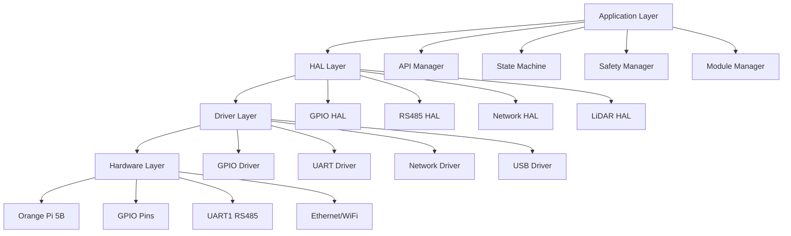
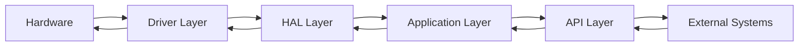

# ⚙️ REQ_FW_Architecture - Yêu cầu kiến trúc Firmware

**Mục đích:** Định nghĩa yêu cầu kiến trúc Firmware cho OHT-50 Master Module

---

## 📋 **Thông tin tài liệu:**
- **Phiên bản:** v1.1
- **Ngày tạo:** 2025-01-24
- **Ngày cập nhật:** 2025-01-28
- **Người tạo:** PM Team
- **Trạng thái:** Updated for Simplified Architecture

---

## 🎯 **Mục tiêu:**

### **Yêu cầu chính:**
1. **Real-time Operation** - Hoạt động thời gian thực
2. **Basic Safety Compliance** - Tuân thủ tiêu chuẩn an toàn cơ bản
3. **Hardware Abstraction** - Trừu tượng hóa phần cứng
4. **Reliable Communication** - Giao tiếp tin cậy
5. **Fault Tolerance** - Chịu lỗi cao

---

## 📊 **BẢNG MAPPING - TÀI LIỆU NÀY:**

| **Phần** | **Mục đích** | **Đối tượng đọc** | **Liên quan đến** | **Trạng thái** |
|----------|--------------|-------------------|-------------------|----------------|
| **Kiến trúc tổng thể** | Định nghĩa 4 layer chính | Architect, FW Lead | System Design | ✅ Hoàn thành |
| **Application Layer** | Yêu cầu ứng dụng cao cấp | FW Developer | Mission, Safety | ✅ Hoàn thành |
| **HAL Layer** | Trừu tượng hóa phần cứng | HAL Developer | Hardware | ✅ Hoàn thành |
| **Driver Layer** | Driver cho thiết bị | Driver Developer | Sensors, Motors | ✅ Hoàn thành |
| **Hardware Layer** | Thông số phần cứng | HW Engineer | Orange Pi 5B | ✅ Hoàn thành |
| **Real-time Requirements** | Yêu cầu thời gian thực | System Engineer | Performance | ✅ Hoàn thành |
| **Basic Safety Requirements** | Yêu cầu an toàn cơ bản | Safety Engineer | Single-channel E-Stop | ✅ Hoàn thành |
| **Communication Requirements** | Yêu cầu giao tiếp | Network Engineer | RS485, Modbus | ✅ Hoàn thành |
| **Performance Requirements** | Yêu cầu hiệu suất | Performance Engineer | CPU, Memory | ✅ Hoàn thành |
| **Data Flow** | Luồng dữ liệu | System Architect | Data Architecture | ✅ Hoàn thành |
| **Basic Safety & Reliability** | An toàn và tin cậy cơ bản | Safety Engineer | Fault Tolerance | ✅ Hoàn thành |

---

## 🏗️ **KIẾN TRÚC TỔNG THỂ**

### **4-Layer Architecture:**

---

## 🔧 **APPLICATION LAYER**

### **Core Components:**

#### **1. API Manager**
- **Chức năng:** REST API và WebSocket server
- **Endpoints:** System, Modules, Safety, Configuration
- **Authentication:** Basic authentication
- **Real-time:** WebSocket telemetry

#### **2. State Machine**
- **States:** IDLE, MOVE, DOCK, FAULT, ESTOP
- **Navigation States:** Navigating, Positioning, Docking, Undocking
- **Transitions:** State transition logic
- **Events:** Command processing

#### **3. Safety Manager**
- **Basic Safety:** Single-channel E-Stop monitoring
- **Safety Levels:** Normal, Warning, Critical, Emergency
- **Fault Detection:** Basic fault detection
- **Emergency Procedures:** Emergency stop handling

#### **4. Module Manager**
- **Auto-discovery:** Module discovery protocol
- **Registry:** Module registry management
- **Health Monitoring:** Module health checks
- **Hot-swap:** Module hot-swap support

---

## ⚙️ **HAL LAYER**

### **Hardware Abstraction Components:**

#### **1. GPIO HAL**
- **LED Control:** 5 LED management
- **E-Stop:** Single-channel E-Stop
- **Relay Control:** 2 relay outputs
- **Pin Management:** GPIO pin abstraction

#### **2. RS485 HAL**
- **Communication:** Modbus RTU protocol
- **Auto-discovery:** Module discovery
- **Error Handling:** CRC, retry, timeout
- **Hot-swap:** Module hot-swap support

#### **3. Network HAL**
- **Ethernet:** 10/100/1000 Mbps
- **WiFi:** 5G/2.4G backup
- **Redundancy:** Network failover
- **Security:** Basic network security

#### **4. LiDAR HAL**
- **USB Integration:** RPLIDAR A1M8
- **Data Processing:** Point cloud processing
- **Mapping:** Basic mapping functionality
- **Localization:** Position estimation

---

## 🚗 **DRIVER LAYER**

### **Device Drivers:**

#### **1. GPIO Driver**
- **Pin Configuration:** GPIO pin setup
- **Interrupt Handling:** GPIO interrupts
- **Debouncing:** Input debouncing
- **Output Control:** Digital output control

#### **2. UART Driver**
- **RS485 Communication:** UART1 configuration
- **Modbus Protocol:** Modbus RTU implementation
- **Error Handling:** Communication errors
- **Buffer Management:** Data buffering

#### **3. Network Driver**
- **Ethernet Driver:** Network interface
- **WiFi Driver:** Wireless interface
- **TCP/IP Stack:** Network protocols
- **Security:** Network security

#### **4. USB Driver**
- **LiDAR Interface:** USB device management
- **Data Transfer:** USB data transfer
- **Device Enumeration:** USB device detection
- **Driver Management:** USB driver handling

---

## 🔌 **HARDWARE LAYER**

### **Hardware Specifications:**

#### **1. Orange Pi 5B Platform**
- **CPU:** RK3588 quad-core ARM
- **Memory:** 4GB/8GB LPDDR4
- **Storage:** eMMC/SD card
- **GPIO:** 40-pin GPIO header

#### **2. GPIO Pin Mapping**
- **LED Pins:** GPIO1_D6, GPIO1_A3, GPIO0_D4, GPIO0_D5, GPIO1_D2
- **E-Stop Pin:** GPIO1_D3 (single-channel)
- **Relay Pins:** GPIO1_D3, GPIO1_D2
- **RS485 Pins:** UART1 (TX/RX)

#### **3. Communication Interfaces**
- **RS485:** UART1 với Modbus RTU
- **Ethernet:** 10/100/1000 Mbps
- **WiFi:** 5G/2.4G dual-band
- **USB:** USB 2.0 cho LiDAR

---

## ⏱️ **REAL-TIME REQUIREMENTS**

### **Timing Constraints:**

#### **1. Response Time**
- **E-Stop Response:** < 100ms
- **Command Processing:** < 50ms
- **Telemetry Update:** < 100ms
- **State Transition:** < 25ms

#### **2. Communication Latency**
- **RS485 Communication:** < 10ms
- **Network Communication:** < 50ms
- **WebSocket Update:** < 100ms
- **API Response:** < 200ms

#### **3. System Performance**
- **CPU Usage:** < 80%
- **Memory Usage:** < 80%
- **Network Bandwidth:** < 10Mbps
- **Storage Usage:** < 70%

---

## 🛡️ **BASIC SAFETY REQUIREMENTS**

### **Safety System:**

#### **1. Single-channel E-Stop**
- **Hardware:** Single-channel E-Stop button
- **Software:** E-Stop monitoring
- **Response Time:** < 100ms
- **Debounce:** 50ms debounce time

#### **2. Safety Levels**
- **Normal:** Hoạt động bình thường
- **Warning:** Cảnh báo
- **Critical:** Nguy hiểm
- **Emergency:** Khẩn cấp

#### **3. Fault Detection**
- **Communication Faults:** RS485 communication errors
- **Hardware Faults:** GPIO, sensor faults
- **System Faults:** Memory, CPU faults
- **Safety Faults:** E-Stop, safety sensor faults

#### **4. Emergency Procedures**
- **Emergency Stop:** Immediate system stop
- **Fault Recovery:** Automatic fault recovery
- **Safe State:** Transition to safe state
- **Manual Override:** Manual control override

---

## 📡 **COMMUNICATION REQUIREMENTS**

### **Communication Protocols:**

#### **1. RS485/Modbus RTU**
- **Protocol:** Modbus RTU standard
- **Baud Rate:** 115200 bps
- **Address Range:** 0x00 - 0x1F
- **Function Codes:** Read/Write coils, registers
- **Error Handling:** CRC, retry, timeout

#### **2. Network Communication**
- **HTTP Server:** REST API endpoints
- **WebSocket Server:** Real-time communication
- **Authentication:** Basic authentication
- **Security:** SSL/TLS encryption

#### **3. Module Communication**
- **Auto-discovery:** Module discovery protocol
- **Health Monitoring:** Module health checks
- **Command Processing:** Module command handling
- **Data Exchange:** Module data exchange

---

## 📊 **PERFORMANCE REQUIREMENTS**

### **Performance Metrics:**

#### **1. System Performance**
- **Uptime:** 99.9%
- **Response Time:** < 100ms
- **Throughput:** 1000 commands/second
- **Latency:** < 50ms

#### **2. Memory Management**
- **Memory Usage:** < 80%
- **Memory Leaks:** Zero memory leaks
- **Garbage Collection:** Efficient memory management
- **Buffer Management:** Proper buffer handling

#### **3. CPU Performance**
- **CPU Usage:** < 80%
- **Load Average:** < 2.0
- **Context Switching:** Minimal context switching
- **Interrupt Handling:** Efficient interrupt handling

---

## 🔄 **DATA FLOW**

### **Data Flow Architecture:**

### **Data Flow Components:**

#### **1. Input Data Flow**
- **Hardware Inputs:** GPIO, sensors, communication
- **Driver Processing:** Raw data processing
- **HAL Abstraction:** Hardware abstraction
- **Application Processing:** Business logic processing

#### **2. Output Data Flow**
- **Application Commands:** System commands
- **HAL Commands:** Hardware commands
- **Driver Commands:** Device commands
- **Hardware Outputs:** GPIO, actuators, communication

---

## 🛡️ **BASIC SAFETY & RELIABILITY**

### **Safety Features:**

#### **1. Fault Tolerance**
- **Redundancy:** Basic redundancy
- **Error Detection:** Error detection mechanisms
- **Error Recovery:** Automatic error recovery
- **Graceful Degradation:** System degradation handling

#### **2. Reliability**
- **MTBF:** Mean Time Between Failures
- **MTTR:** Mean Time To Repair
- **Availability:** System availability
- **Maintainability:** System maintainability

#### **3. Security**
- **Authentication:** Basic authentication
- **Authorization:** Access control
- **Data Protection:** Data encryption
- **Network Security:** Network protection

---

## 📋 **IMPLEMENTATION GUIDELINES**

### **Development Guidelines:**

#### **1. Code Standards**
- **Coding Style:** Consistent coding style
- **Documentation:** Comprehensive documentation
- **Testing:** Unit testing, integration testing
- **Code Review:** Peer code review

#### **2. Architecture Principles**
- **Modularity:** Modular design
- **Scalability:** Scalable architecture
- **Maintainability:** Maintainable code
- **Extensibility:** Extensible design

#### **3. Quality Assurance**
- **Testing:** Comprehensive testing
- **Validation:** System validation
- **Verification:** Requirements verification
- **Certification:** Basic safety certification

---

**Changelog v1.1:**
- ✅ Removed USB Debug interface requirements
- ✅ Removed Config Persistence requirements
- ✅ Simplified Location-based Safety to Basic Safety
- ✅ Changed Dual-channel E-Stop to Single-channel E-Stop
- ✅ Updated architecture for simplified requirements
- ✅ Updated safety requirements for basic compliance
- ✅ Updated performance requirements for simplified system

**Status:** Updated for Simplified Architecture v2.1 - Ready for Implementation
