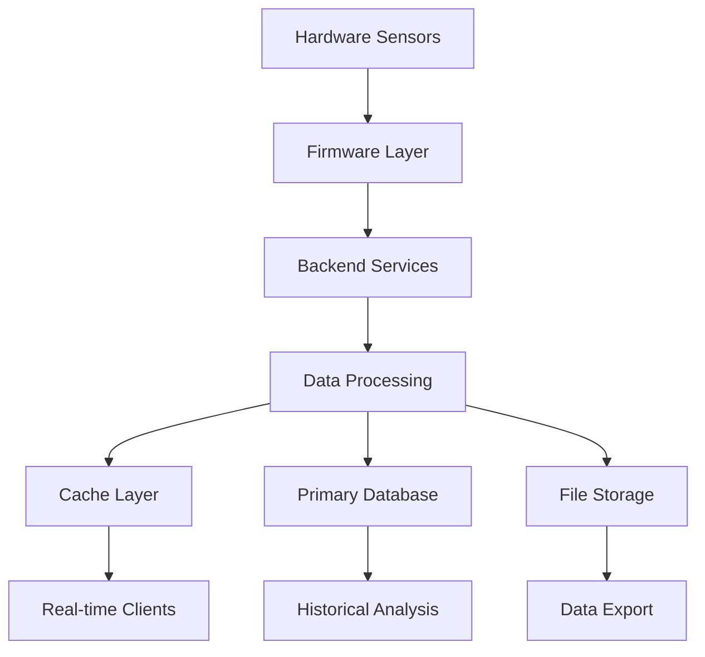

# REQ_BE_07 - Detailed Architecture Requirements

**Document ID:** REQ_BE_07  
**Version:** 1.0  
**Date:** 2025-01-28  
**Status:** Draft  
**Classification:** Internal  
**Author:** CTO Team  
**Standard Reference:** ISO/IEC/IEEE 29148:2018

---

## 1. DOCUMENT INFORMATION

### 1.1 Document Control
- **Document Title:** Detailed Architecture Requirements
- **Document Type:** Requirements Specification
- **Standard Reference:** ISO/IEC/IEEE 29148:2018, ISO/IEC 25010:2011
- **Project:** OHT-50 Industrial Robot Control System
- **Component:** Backend Architecture Design

### 1.2 Revision History
| Version | Date | Author | Changes |
|---------|------|--------|---------|
| 1.0 | 2025-01-28 | CTO Team | Initial creation |

---

## 2. ARCHITECTURE OVERVIEW

### 2.1 Architecture Principles
The Backend System architecture follows these core principles:
- **Modularity:** Independent, loosely coupled services
- **Scalability:** Horizontal and vertical scaling capabilities
- **Reliability:** High availability and fault tolerance
- **Security:** Defense in depth approach
- **Performance:** Real-time response requirements
- **Maintainability:** Clear separation of concerns

### 2.2 Architecture Patterns
```
Architecture Patterns:
├── Layered Architecture
│   ├── Presentation Layer (API Gateway)
│   ├── Business Logic Layer (Services)
│   ├── Data Access Layer (Repositories)
│   └── Infrastructure Layer (External Systems)
├── Microservices Pattern
│   ├── Service Decomposition
│   ├── Service Communication
│   └── Service Discovery
├── Event-Driven Architecture
│   ├── Event Sourcing
│   ├── CQRS Pattern
│   └── Event Streaming
└── CQRS Pattern
    ├── Command Side
    ├── Query Side
    └── Event Store
```

---

## 3. SERVICE ARCHITECTURE

### 3.1 Core Services Design
```yaml
Core Services:
  API Gateway Service:
    Purpose: "Single entry point for all client requests"
    Responsibilities:
      - "Request routing and load balancing"
      - "Authentication and authorization"
      - "Rate limiting and throttling"
      - "Request/response transformation"
      - "API documentation (Swagger/OpenAPI)"
    
  Robot Control Service:
    Purpose: "Central robot control and command execution"
    Responsibilities:
      - "Movement control and path planning"
      - "Safety system integration"
      - "Emergency stop handling"
      - "Command validation and execution"
      - "Real-time control feedback"
    
  Telemetry Service:
    Purpose: "Real-time data collection and processing"
    Responsibilities:
      - "Sensor data collection"
      - "Data aggregation and filtering"
      - "Real-time data streaming"
      - "Historical data storage"
      - "Performance metrics calculation"
    
  Safety Service:
    Purpose: "Safety monitoring and emergency response"
    Responsibilities:
      - "Safety zone monitoring"
      - "Obstacle detection and avoidance"
      - "Emergency stop coordination"
      - "Safety violation handling"
      - "Safety system diagnostics"
    
  LiDAR Processing Service:
    Purpose: "LiDAR sensor data processing and analysis"
    Responsibilities:
      - "Point cloud processing"
      - "Obstacle detection and classification"
      - "Map generation and updates"
      - "Path planning integration"
      - "Safety zone calculation"
    
  Configuration Service:
    Purpose: "System configuration management"
    Responsibilities:
      - "Configuration storage and retrieval"
      - "Configuration validation"
      - "Dynamic configuration updates"
      - "Configuration versioning"
      - "Configuration backup and restore"
```

### 3.2 Service Communication Patterns
```python
# Synchronous Communication (REST API)
class APIGatewayService:
    async def route_request(self, request: Request) -> Response:
        """Route requests to appropriate services"""
        service = self.service_discovery.get_service(request.path)
        return await service.handle_request(request)

# Asynchronous Communication (Event Bus)
class EventBusService:
    async def publish_event(self, event: Event):
        """Publish events to event bus"""
        await self.event_store.store(event)
        await self.notify_subscribers(event)
    
    async def subscribe_to_events(self, event_type: str, handler: Callable):
        """Subscribe to specific event types"""
        self.subscribers[event_type].append(handler)

# Real-time Communication (WebSocket)
class WebSocketService:
    async def broadcast_telemetry(self, telemetry_data: Dict):
        """Broadcast telemetry data to connected clients"""
        for client in self.connected_clients:
            await client.send(telemetry_data)
```

---

## 4. DATA ARCHITECTURE

### 4.1 Data Storage Strategy
```yaml
Data Storage Strategy:
  Primary Database (SQLite):
    Purpose: "Local data storage for robot operations"
    Data Types:
      - "Configuration data"
      - "User authentication"
      - "System logs"
      - "Historical telemetry"
    Requirements:
      - "ACID compliance"
      - "Local persistence"
      - "Fast read/write operations"
      - "Automatic backup"
  
  Cache Layer (Redis):
    Purpose: "High-speed data caching and real-time data"
    Data Types:
      - "Session data"
      - "Real-time telemetry"
      - "Frequently accessed data"
      - "Temporary calculations"
    Requirements:
      - "Sub-millisecond response times"
      - "Data expiration policies"
      - "Memory optimization"
      - "Persistence options"
  
  File Storage:
    Purpose: "Large file storage and data export"
    Data Types:
      - "LiDAR scan data"
      - "System logs"
      - "Configuration backups"
      - "Export files"
    Requirements:
      - "Efficient file operations"
      - "Compression support"
      - "Backup and recovery"
      - "Access control"
```

### 4.2 Data Flow Architecture


---

## 5. SECURITY ARCHITECTURE

### 5.1 Security Layers
```yaml
Security Architecture:
  Network Security:
    - "TLS 1.3 encryption for all communications"
    - "Firewall configuration"
    - "Network segmentation"
    - "Intrusion detection"
  
  Application Security:
    - "Input validation and sanitization"
    - "SQL injection prevention"
    - "Cross-site scripting protection"
    - "Authentication and authorization"
  
  Data Security:
    - "Data encryption at rest"
    - "Data encryption in transit"
    - "Access control and audit logging"
    - "Data backup and recovery"
  
  Operational Security:
    - "Regular security updates"
    - "Vulnerability scanning"
    - "Security monitoring"
    - "Incident response procedures"
```

### 5.2 Authentication and Authorization
```python
class SecurityService:
    def __init__(self):
        self.jwt_secret = os.getenv("JWT_SECRET")
        self.token_expiry = 3600  # 1 hour
    
    async def authenticate_user(self, credentials: Dict) -> Optional[str]:
        """Authenticate user and return JWT token"""
        user = await self.validate_credentials(credentials)
        if user:
            return self.generate_jwt_token(user)
        return None
    
    async def authorize_request(self, token: str, resource: str, action: str) -> bool:
        """Authorize user action on specific resource"""
        user = self.validate_jwt_token(token)
        if not user:
            return False
        
        return await self.check_permissions(user, resource, action)
```

---

## 6. PERFORMANCE ARCHITECTURE

### 6.1 Performance Requirements
```yaml
Performance Requirements:
  Response Time:
    API Requests: "< 50ms for 95% of requests"
    WebSocket Events: "< 20ms for real-time events"
    Database Queries: "< 10ms for simple queries"
    File Operations: "< 100ms for typical operations"
  
  Throughput:
    Concurrent Users: "Support 5-10 simultaneous operators"
    API Requests: "1000+ requests per minute"
    WebSocket Connections: "10+ concurrent connections"
    Data Processing: "1000+ telemetry points per second"
  
  Scalability:
    Horizontal Scaling: "Support multiple service instances"
    Vertical Scaling: "Utilize available system resources"
    Load Balancing: "Distribute load across instances"
    Auto-scaling: "Automatic scaling based on demand"
```

### 6.2 Caching Strategy
```python
class CachingService:
    def __init__(self):
        self.redis_client = redis.Redis()
        self.cache_ttl = {
            "telemetry": 300,      # 5 minutes
            "configuration": 3600, # 1 hour
            "user_session": 1800,  # 30 minutes
            "static_data": 86400   # 24 hours
        }
    
    async def get_cached_data(self, key: str) -> Optional[Dict]:
        """Retrieve data from cache"""
        cached_data = await self.redis_client.get(key)
        if cached_data:
            return json.loads(cached_data)
        return None
    
    async def set_cached_data(self, key: str, data: Dict, ttl: int = None):
        """Store data in cache with TTL"""
        if ttl is None:
            ttl = self.cache_ttl.get(key.split(":")[0], 300)
        
        await self.redis_client.setex(
            key, 
            ttl, 
            json.dumps(data)
        )
```

---

## 7. MONITORING AND OBSERVABILITY

### 7.1 Monitoring Architecture
```yaml
Monitoring Architecture:
  Application Monitoring:
    - "Service health checks"
    - "Performance metrics collection"
    - "Error tracking and alerting"
    - "Request tracing"
  
  Infrastructure Monitoring:
    - "System resource monitoring"
    - "Network connectivity monitoring"
    - "Database performance monitoring"
    - "Storage capacity monitoring"
  
  Business Monitoring:
    - "Robot operation metrics"
    - "Safety violation tracking"
    - "User activity monitoring"
    - "System utilization tracking"
```

### 7.2 Logging Strategy
```python
class LoggingService:
    def __init__(self):
        self.log_levels = {
            "DEBUG": 10,
            "INFO": 20,
            "WARNING": 30,
            "ERROR": 40,
            "CRITICAL": 50
        }
        self.log_format = "%(asctime)s - %(name)s - %(levelname)s - %(message)s"
    
    async def log_event(self, level: str, service: str, message: str, context: Dict = None):
        """Log application events with structured data"""
        log_entry = {
            "timestamp": datetime.utcnow().isoformat(),
            "level": level,
            "service": service,
            "message": message,
            "context": context or {}
        }
        
        # Store in database
        await self.store_log_entry(log_entry)
        
        # Send to monitoring system
        await self.send_to_monitoring(log_entry)
```

---

## 8. DEPLOYMENT ARCHITECTURE

### 8.1 Deployment Strategy
```yaml
Deployment Strategy:
  Containerization:
    Platform: "Docker containers"
    Orchestration: "Docker Compose for single instance"
    Image Management: "Multi-stage builds"
    Security: "Non-root user execution"
  
  Environment Management:
    Development: "Local Docker environment"
    Testing: "Staging environment with test data"
    Production: "Production environment with real data"
    Configuration: "Environment-specific configuration files"
  
  Service Discovery:
    Method: "Static configuration for single instance"
    Load Balancing: "Nginx reverse proxy"
    Health Checks: "HTTP health check endpoints"
    Failover: "Automatic service restart"
```

### 8.2 Configuration Management
```python
class ConfigurationService:
    def __init__(self):
        self.config_path = "/etc/oht50/backend/"
        self.environment = os.getenv("ENVIRONMENT", "development")
    
    async def load_configuration(self) -> Dict:
        """Load configuration from files and environment"""
        config = {}
        
        # Load base configuration
        base_config = await self.load_file(f"{self.config_path}/base.yaml")
        config.update(base_config)
        
        # Load environment-specific configuration
        env_config = await self.load_file(f"{self.config_path}/{self.environment}.yaml")
        config.update(env_config)
        
        # Override with environment variables
        config.update(self.load_environment_variables())
        
        return config
    
    async def validate_configuration(self, config: Dict) -> bool:
        """Validate configuration schema"""
        schema = self.load_configuration_schema()
        try:
            jsonschema.validate(config, schema)
            return True
        except jsonschema.ValidationError:
            return False
```

---

## 9. INTEGRATION ARCHITECTURE

### 9.1 External System Integration
```yaml
Integration Architecture:
  Firmware Integration:
    Protocol: "Modbus RTU over RS485"
    Communication: "Synchronous request/response"
    Error Handling: "Retry mechanism with exponential backoff"
    Monitoring: "Connection health monitoring"
  
  Hardware Integration:
    Platform: "Orange Pi 5B"
    Interfaces: "GPIO, UART, Ethernet, WiFi"
    Control: "Direct hardware control through HAL"
    Monitoring: "Hardware status monitoring"
  
  Frontend Integration:
    Protocol: "HTTP/HTTPS and WebSocket"
    API: "RESTful API with OpenAPI specification"
    Real-time: "WebSocket for live data streaming"
    Security: "JWT-based authentication"
```

### 9.2 API Design Patterns
```python
class APIDesignService:
    def __init__(self):
        self.api_version = "v1"
        self.base_url = f"/api/{self.api_version}"
    
    def define_endpoints(self) -> Dict:
        """Define API endpoints with OpenAPI specification"""
        return {
            "openapi": "3.0.0",
            "info": {
                "title": "OHT-50 Backend API",
                "version": "1.0.0",
                "description": "API for OHT-50 robot control system"
            },
            "paths": {
                f"{self.base_url}/robot/status": {
                    "get": {
                        "summary": "Get robot status",
                        "responses": {
                            "200": {
                                "description": "Robot status information",
                                "content": {
                                    "application/json": {
                                        "schema": {"$ref": "#/components/schemas/RobotStatus"}
                                    }
                                }
                            }
                        }
                    }
                }
            }
        }
```

---

## 10. TESTING ARCHITECTURE

### 10.1 Testing Strategy
```yaml
Testing Strategy:
  Unit Testing:
    Coverage: "> 90% code coverage"
    Framework: "pytest for Python services"
    Mocking: "Mock external dependencies"
    Automation: "Automated test execution"
  
  Integration Testing:
    Scope: "Service-to-service communication"
    Database: "Test database integration"
    API: "Test API endpoints"
    External: "Test external system integration"
  
  Performance Testing:
    Load Testing: "Simulate expected load"
    Stress Testing: "Test system limits"
    Endurance Testing: "Long-running tests"
    Scalability Testing: "Test scaling behavior"
  
  Security Testing:
    Vulnerability Scanning: "Automated security scans"
    Penetration Testing: "Manual security testing"
    Code Analysis: "Static code analysis"
    Dependency Scanning: "Third-party dependency scanning"
```

---

## 11. REFERENCES

### 11.1 Related Documents
- REQ_BE_01: System Overview
- REQ_BE_02: API Specifications
- REQ_BE_03: Database Design
- REQ_BE_04: Security Requirements
- REQ_BE_05: Integration Specifications
- REQ_BE_06: LiDAR Integration
- Firmware Integration Guide
- Hardware Specifications

### 11.2 Standards References
- ISO/IEC/IEEE 29148:2018 - Requirements Engineering
- ISO/IEC 25010:2011 - Software Quality Requirements
- IEEE 830-1998 - Software Requirements Specifications
- IEC 61508:2010 - Functional Safety

---

## 12. APPROVAL

| Role | Name | Date | Signature |
|------|------|------|-----------|
| CTO | [Name] | [Date] | [Signature] |
| Technical Lead | [Name] | [Date] | [Signature] |
| Quality Assurance | [Name] | [Date] | [Signature] |

---

**Document End**
