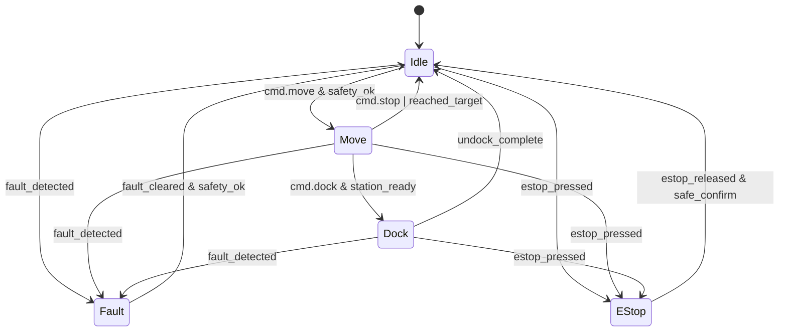
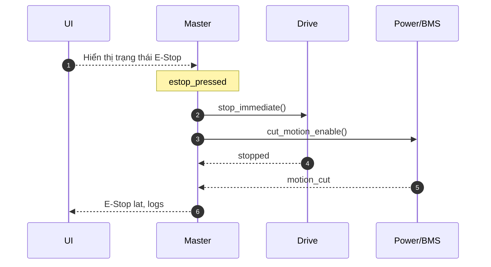

# State Machine hệ thống OHT-50 (Phiên bản 1.0)

## Mục tiêu
- Định nghĩa trạng thái hệ thống và chuyển tiếp giữa các trạng thái cho Master.

## Trạng thái
- Idle: chờ lệnh, hệ an toàn OK.
- Move: di chuyển theo lệnh (profile v‑a‑j), giám sát an toàn liên tục.
- Dock: quy trình docking/charging, interlock sạc.
- Fault: lỗi có thể khôi phục; cần xác nhận/clear để quay về Idle.
- E‑Stop: khẩn cấp; dừng ngay, chỉ thoát khi xác nhận an toàn.

## Sơ đồ trạng thái (Mermaid)

## Sự kiện & điều kiện canh gác (guards)
- cmd.move, cmd.stop, cmd.dock, undock_complete
- safety_ok, station_ready, fault_detected, fault_cleared
- estop_pressed, estop_released, safe_confirm

## Yêu cầu thời gian thực
- Phát hiện E‑Stop: tức thời; phản hồi dừng < 100ms (mục tiêu).
- Giám sát lỗi: quá dòng, quá nhiệt, mất encoder, mất truyền thông.

## Trình tự E‑Stop (rút gọn)

## Changelog
- 1.0: Khởi tạo tài liệu, sơ đồ trạng thái và trình tự E‑Stop.

