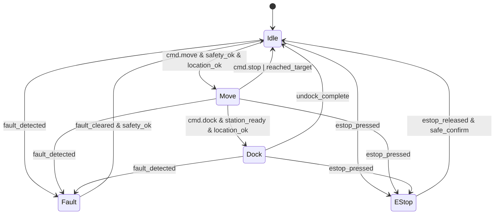

# Kiến trúc hệ thống OHT-50 (Phiên bản 2.0)

**Phiên bản:** 2.0  
**Ngày cập nhật:** 2025-01-27  
**Trạng thái:** Revised Architecture  

---

## 🎯 **MỤC TIÊU KIẾN TRÚC**

### **Yêu cầu hệ thống:**
- **5 Module bắt buộc:** Power, Safety, Travel Motor, Dock & Location, Master Control
- **Module tùy chọn:** Lifter Motor, Cargo Door, Safety Extended
- **Module mở rộng:** RFID, Camera, Environmental Sensor, Custom modules
- **Plug-and-Play:** Auto-discovery và hot-swap capability
- **Industrial Safety:** SIL2 compliance với location-based safety

---

## 🏗️ **KIẾN TRÚC TỔNG THỂ**

### **Hệ thống Master-Slave với RS485 Bus:**
```
┌─────────────────────────────────────────────────────────┐
│                    MASTER MODULE                        │
│              (Orange Pi 5B - RK3588)                   │
├─────────────────────────────────────────────────────────┤
│  • UART1 RS485 (Modbus RTU Master)                     │
│  • Ethernet 1G + WiFi 2.4/5G                           │
│  • USB-C Debug Interface                               │
│  • 5x Status LEDs + 2x E-Stop + 2x Relay               │
│  • State Machine + Safety System                       │
│  • Navigation Control + Mission Planning               │
└─────────────────────────────────────────────────────────┘
                              │
                              │ RS485 Bus (Modbus RTU)
                              │ Baud: 115200, Address: 1-32
                              │ Auto-Discovery + Hot-Swap
                              │
    ┌─────────────┬─────────────┬─────────────┬─────────────┐
    │             │             │             │             │
    ▼             ▼             ▼             ▼             ▼
┌─────────┐ ┌─────────┐ ┌─────────┐ ┌─────────┐ ┌─────────┐
│ POWER   │ │ SAFETY  │ │ TRAVEL  │ │ DOCK    │ │ LIFTER  │
│ (ID:2)  │ │ (ID:3)  │ │ (ID:4)  │ │ (ID:5)  │ │ (ID:6)  │
│ BẮT BUỘC│ │ BẮT BUỘC│ │ BẮT BUỘC│ │ BẮT BUỘC│ │ TÙY CHỌN│
└─────────┘ └─────────┘ └─────────┘ └─────────┘ └─────────┘
    │             │             │             │             │
    ▼             ▼             ▼             ▼             ▼
┌─────────┐ ┌─────────┐ ┌─────────┐ ┌─────────┐ ┌─────────┐
│ CARGO   │ │ SAFETY  │ │ RFID    │ │ CAMERA  │ │ ENV     │
│ DOOR    │ │ EXTENDED│ │ READER  │ │ MODULE  │ │ SENSOR  │
│ (ID:7)  │ │ (ID:8)  │ │ (ID:9)  │ │ (ID:10) │ │ (ID:11) │
│ TÙY CHỌN│ │ TÙY CHỌN│ │ PLUG-PLAY│ │ PLUG-PLAY│ │ PLUG-PLAY│
└─────────┘ └─────────┘ └─────────┘ └─────────┘ └─────────┘
```

---

## 🔧 **CHI TIẾT MODULE BẮT BUỘC**

### **1. POWER MODULE (ID: 0x02) - BẮT BUỘC**
```c
// Chức năng chính
- LiFePO4 battery management (24V/50Ah)
- AC/DC conversion (220V → 24V)
- MPPT charging system
- Power distribution (24V, 12V, 5V)
- UPS function với battery backup
- Power monitoring và protection

// Register Map (0x0000-0x00FF)
0x0000: Battery Voltage (V × 10)
0x0001: Battery Current (A × 10)
0x0002: Battery SOC (%)
0x0003: Charging Status (0=Idle, 1=Charging, 2=Full)
0x0004: Power Output Status (24V, 12V, 5V)
0x0005: Temperature (°C)
0x0006: Fault Status
0x0007: System Status
```

### **2. SAFETY MODULE (ID: 0x03) - BẮT BUỘC**
```c
// Chức năng chính
- E-Stop dual-channel monitoring
- Light curtain protection
- Safety mats (4x pressure sensors)
- Door sensors (2x magnetic switches)
- Emergency brake control
- Safety logic processing

// Register Map (0x0000-0x00FF)
0x0000: E-Stop Status (0=Normal, 1=Pressed)
0x0001: Light Curtain Status (0=Clear, 1=Blocked)
0x0002: Safety Mat Status (16-bit bitfield)
0x0003: Door Status (0=Closed, 1=Open)
0x0004: Emergency Brake Status
0x0005: Safety System Status
0x0006: Fault Status
0x0007: System Status
```

### **3. TRAVEL MOTOR MODULE (ID: 0x04) - BẮT BUỘC**
```c
// Chức năng chính
- 2x DC motors cho differential drive
- Encoder feedback (2000 PPR)
- Speed control (0-3000 RPM)
- Position control (±5mm accuracy)
- PID control với configurable gains
- Safety monitoring

// Register Map (0x0000-0x00FF)
0x0000: Motor 1 Control Mode (1=ONOFF, 2=LINEAR, 3=PID)
0x0001: Motor 1 Enable (0=Disable, 1=Enable)
0x0002: Motor 1 Target Speed (RPM)
0x0003: Motor 1 Actual Speed (RPM)
0x0004: Motor 1 Position (mm × 100)
0x0005: Motor 1 Current (mA)
0x0006: Motor 1 Temperature (°C)
0x0007: Motor 1 Status
0x0010-0x0017: Motor 2 (tương tự)
```

### **4. DOCK & LOCATION MODULE (ID: 0x05) - BẮT BUỘC**
```c
// Chức năng chính - BẮT BUỘC CHO POSITIONING
- IMU (MPU6050) - pitch, roll, yaw
- Magnetic sensors cho position tracking
- Dock alignment sensors
- RFID reader integration
- GPS/GNSS (optional)
- SLAM capability với LiDAR
- Position accuracy: ±10mm
- Orientation accuracy: ±1°

// Register Map (0x0000-0x00FF)
0x0000: Location System Status (0=OK, 1=Error, 2=Calibrating)
0x0001: Current Position X (mm × 10)
0x0002: Current Position Y (mm × 10)
0x0003: Current Position Z (mm × 10)
0x0004: Target Position X (mm × 10)
0x0005: Target Position Y (mm × 10)
0x0006: Target Position Z (mm × 10)
0x0007: Position Accuracy (mm × 10)

// IMU Data
0x0010: Pitch Angle (deg × 100)
0x0011: Roll Angle (deg × 100)
0x0012: Yaw Angle (deg × 100)
0x0013: Acceleration X (m/s² × 100)
0x0014: Acceleration Y (m/s² × 100)
0x0015: Acceleration Z (m/s² × 100)

// Dock & RFID
0x0020: Dock Alignment Status (0=Not Aligned, 1=Aligned)
0x0021: Dock Distance (mm)
0x0022: Dock Angle (deg × 100)
0x0023: RFID Tag ID Low (32-bit)
0x0024: RFID Tag ID High (32-bit)
0x0025: RFID Signal Strength (RSSI)
0x0026: Current Station ID
0x0027: Target Station ID

// Navigation
0x0030: Navigation Status (0=Idle, 1=Navigating, 2=Arrived)
0x0031: Path Progress (%)
0x0032: Distance to Target (mm)
0x0033: Estimated Time to Target (seconds)
0x0034: Obstacle Detected (0=No, 1=Yes)
0x0035: Obstacle Distance (mm)
0x0036: Obstacle Angle (deg × 100)
0x0037: Navigation Error Code
```

### **5. MASTER CONTROL MODULE (ID: 0x01) - BẮT BUỘC**
```c
// Chức năng chính
- System coordination và control
- State machine management
- Safety system coordination
- Navigation control
- Mission planning
- Communication management

// Register Map (0x0000-0x00FF)
0x0000: System State (0=Idle, 1=Move, 2=Dock, 3=Fault, 4=EStop)
0x0001: Mission Status (0=Idle, 1=Running, 2=Complete, 3=Error)
0x0002: Safety Status (0=Safe, 1=Warning, 2=Danger)
0x0003: Navigation Status (0=Idle, 1=Navigating, 2=Arrived)
0x0004: Communication Status (0=OK, 1=Error)
0x0005: System Health Score (0-100%)
0x0006: Active Modules Count
0x0007: System Error Code
```

---

## 🔌 **MODULE TÙY CHỌN VÀ MỞ RỘNG**

### **LIFTER MOTOR MODULE (ID: 0x06) - TÙY CHỌN**
```c
// Chức năng chính
- Linear actuator control
- Load capacity: 50kg
- Stroke: 500mm
- Speed: 50mm/s
- Position accuracy: ±2mm
- Load cell monitoring
- Safety limits
```

### **CARGO DOOR MODULE (ID: 0x07) - TÙY CHỌN**
```c
// Chức năng chính
- Cargo door actuator control
- Door position feedback
- Safety interlocks
- Cargo presence detection
- Door lock mechanism
- Emergency release
```

### **SAFETY EXTENDED MODULE (ID: 0x08) - TÙY CHỌN**
```c
// Chức năng chính
- Additional safety sensors
- Zone monitoring
- Advanced safety logic
- Safety network integration
- Emergency lighting
- Audio warnings
```

### **RFID READER MODULE (ID: 0x09) - PLUG-AND-PLAY**
```c
// Chức năng chính
- RFID tag reading
- Station identification
- Cargo tracking
- Access control
- Inventory management
```

### **CAMERA MODULE (ID: 0x0A) - PLUG-AND-PLAY**
```c
// Chức năng chính
- Vision system
- Object detection
- Quality inspection
- Documentation
- Remote monitoring
```

### **ENVIRONMENTAL SENSOR MODULE (ID: 0x0B) - PLUG-AND-PLAY**
```c
// Chức năng chính
- Temperature monitoring
- Humidity sensing
- Air quality measurement
- Environmental alerts
- Data logging
```

---

## 🔄 **STATE MACHINE**

### **System States:**


---

## 🔒 **SAFETY ARCHITECTURE**

### **Location-Based Safety:**
```c
// Safety features requiring location
- Zone-based safety monitoring
- Speed limits based on location
- Restricted area detection
- Emergency stop positioning
- Safe docking procedures
```

### **Safety Integration:**
```c
// Safety system integration
- All modules report safety status
- Master module coordinates safety actions
- Safety network for redundancy
- Emergency stop overrides all operations
```

---

## 📡 **COMMUNICATION PROTOCOLS**

### **Master ↔ Slave (RS485/Modbus RTU):**
- **Function Codes:** 0x03 (Read), 0x06 (Write), 0x10 (Write Multiple)
- **Register Map:** 256 registers per module (0x0000-0x00FF)
- **Auto-Discovery:** Module identification registers (0x00F0-0x00FF)
- **Error Handling:** CRC validation, timeout, retry mechanism

### **Master ↔ Center (Ethernet/WiFi):**
- **HTTP API:** RESTful endpoints cho configuration
- **WebSocket:** Real-time telemetry và status updates
- **Security:** TLS encryption + token authentication
- **OTA Updates:** Firmware updates với rollback capability

---

## 🎯 **PERFORMANCE SPECIFICATIONS**

### **System Performance:**
- **Response Time:** < 100ms cho critical operations
- **Uptime:** > 99.5%
- **Error Rate:** < 0.1%
- **Recovery Time:** < 30s

### **Navigation Performance:**
- **Position Accuracy:** ±10mm
- **Orientation Accuracy:** ±1°
- **Docking Accuracy:** ±5mm
- **Navigation Speed:** 0.5-2.0 m/s

### **Safety Performance:**
- **E-Stop Response:** < 10ms
- **Safety Monitoring:** Continuous
- **Fault Detection:** < 100ms
- **Emergency Stop:** < 100ms

---

## 🔧 **IMPLEMENTATION STATUS**

### **✅ Hoàn thành:**
- Master Module hardware setup
- RS485 communication protocol
- Basic safety system
- 4/5 module integrations (thiếu Dock & Location)

### **🔄 Đang phát triển:**
- Dock & Location Module (BẮT BUỘC)
- Advanced safety features
- Navigation algorithms

### **📋 Kế hoạch:**
- Module tùy chọn và mở rộng
- Advanced diagnostics
- Predictive maintenance

---

**Changelog:**
- v2.0 (2025-01-27): Revised architecture với 5 module bắt buộc
- v1.0 (2025-01-27): Initial architecture

**Status:** Ready for implementation  
**Next Steps:** Dock & Location Module development


