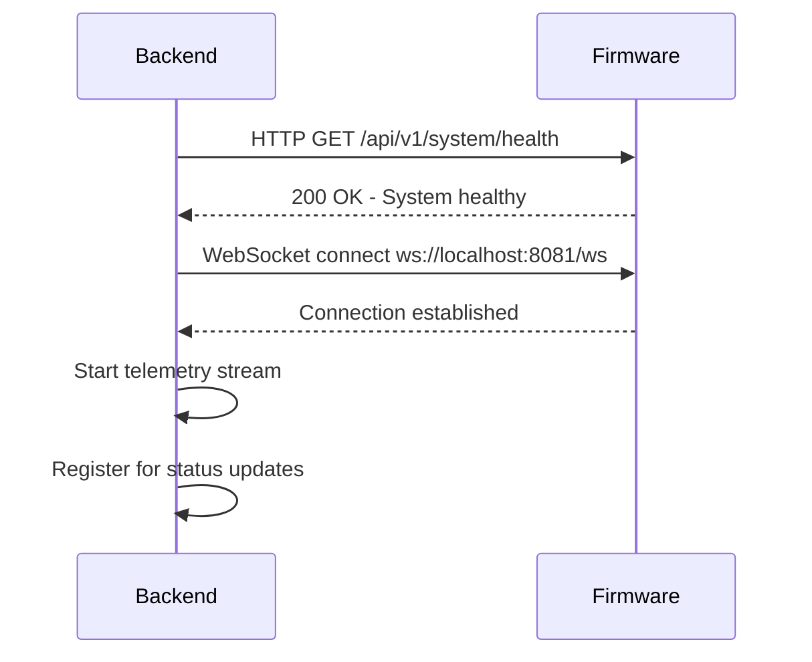
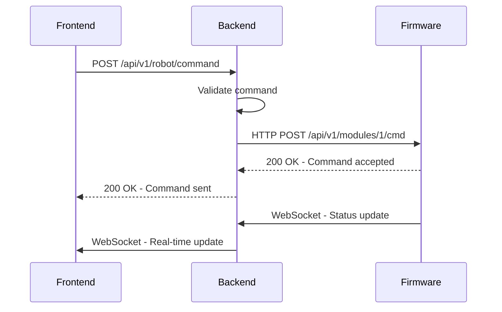
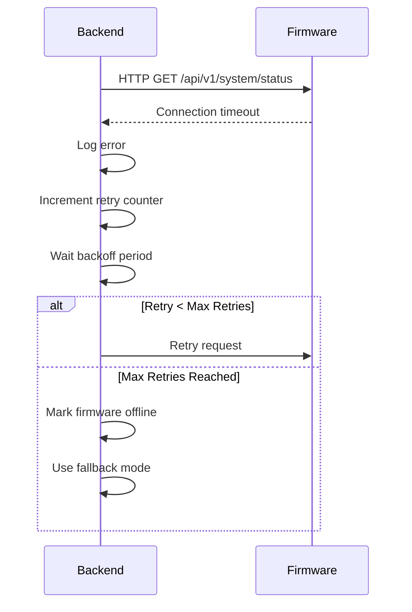

# 🔗 **BACKEND-FIRMWARE INTEGRATION ARCHITECTURE - OHT-50**

**Phiên bản:** 1.0  
**Ngày cập nhật:** 2025-01-28  
**Mục tiêu:** Định nghĩa kiến trúc tích hợp Backend-Firmware cho OHT-50

---

## 🎯 **TỔNG QUAN KIẾN TRÚC**

### **Kiến trúc tổng thể:**
```
┌─────────────────────────────────────┐
│           Backend (Port 8000)       │
│  ┌─────────────────────────────────┐│
│  │     HTTP/REST API Endpoints     ││
│  │  ┌─────────────────────────────┐││
│  │  │   Firmware Integration      │││
│  │  │        Service              │││
│  │  └─────────────────────────────┘││
│  │  ┌─────────────────────────────┐││
│  │  │     FW Client Library       │││
│  │  │   (HTTP + WebSocket)        │││
│  │  └─────────────────────────────┘││
│  └─────────────────────────────────┘│
└─────────────────┬───────────────────┘
                  │ HTTP/REST API
    ┌─────────────▼─────────────┐
    │      Firmware (Port 8080) │
    │  ┌───────────────────────┐│
    │  │   HTTP API Server     ││
    │  │  - System Status      ││
    │  │  - Module Control     ││
    │  │  - Safety Management  ││
    │  │  - Configuration      ││
    │  └───────────────────────┘│
    │  ┌───────────────────────┐│
    │  │  WebSocket Server     ││
    │  │    (Port 8081)        ││
    │  │  - Real-time Updates  ││
    │  │  - Telemetry Stream   ││
    │  └───────────────────────┘│
    └───────────────────────────┘
```

---

## 🔧 **COMPONENT ARCHITECTURE**

### **1. Backend Integration Layer**

#### **Firmware Integration Service**
```python
class FirmwareIntegrationService:
    """
    Main service for Backend-Firmware integration
    
    Responsibilities:
    - HTTP API communication với Firmware
    - WebSocket real-time communication
    - Connection management và health monitoring
    - Error handling và recovery
    - Authentication và security
    """
    
    def __init__(self, firmware_url: str = "http://localhost:8080"):
        self.firmware_url = firmware_url
        self.http_client = httpx.AsyncClient()
        self.ws_client = WebSocketClient()
        self.connection_manager = ConnectionManager()
        
    async def get_system_status(self) -> Dict[str, Any]:
        """Get firmware system status via HTTP API"""
        
    async def send_module_command(self, module_id: int, command: Dict) -> bool:
        """Send command to firmware module"""
        
    async def get_telemetry_stream(self) -> AsyncGenerator:
        """Get real-time telemetry via WebSocket"""
```

#### **FW Client Library**
```python
class FWClient:
    """
    Low-level client library for firmware communication
    
    Features:
    - HTTP REST API client
    - WebSocket client
    - Connection pooling
    - Retry mechanisms
    - Authentication support
    """
    
    def __init__(self, config: FWConfig):
        self.config = config
        self.http_session = aiohttp.ClientSession()
        self.ws_session = None
        
    async def connect(self) -> bool:
        """Establish connection to firmware"""
        
    async def disconnect(self) -> None:
        """Close connection to firmware"""
        
    async def get(self, endpoint: str) -> Dict[str, Any]:
        """HTTP GET request"""
        
    async def post(self, endpoint: str, data: Dict) -> Dict[str, Any]:
        """HTTP POST request"""
        
    async def websocket_send(self, message: Dict) -> None:
        """Send WebSocket message"""
```

---

## 🌐 **COMMUNICATION PROTOCOLS**

### **HTTP REST API (Port 8080)**
```yaml
Base URL: http://localhost:8080

Endpoints:
  System:
    GET  /api/v1/system/status     # System status
    GET  /api/v1/system/health     # Health check
    
  Modules:
    GET  /api/v1/modules           # List modules
    GET  /api/v1/modules/{id}      # Module info
    POST /api/v1/modules/{id}/cmd  # Send command
    
  Safety:
    GET  /api/v1/safety/status     # Safety status
    POST /api/v1/safety/estop      # Emergency stop
    
  Configuration:
    GET  /api/v1/config            # Get config
    PUT  /api/v1/config            # Update config
    
  Diagnostics:
    GET  /api/v1/diagnostics       # System diagnostics
```

### **WebSocket API (Port 8081)**
```yaml
WebSocket URL: ws://localhost:8081/ws

Message Types:
  telemetry:     # Real-time telemetry data
  status:        # Status updates
  alerts:        # Alert notifications
  commands:      # Command responses
  
Example:
  {
    "type": "telemetry",
    "data": {
      "timestamp": "2025-01-28T10:30:00Z",
      "robot_position": {"x": 150.5, "y": 200.3},
      "battery_level": 87,
      "temperature": 42.5
    }
  }
```

---

## 🔄 **INTEGRATION FLOW**

### **1. Initialization Flow**


### **2. Command Execution Flow**


### **3. Error Handling Flow**


---

## 🔒 **SECURITY ARCHITECTURE**

### **Authentication**
```yaml
HTTP API:
  Type: Bearer Token
  Header: Authorization: Bearer <token>
  Token: JWT token with firmware-specific claims
  
WebSocket:
  Type: Token in connection URL
  URL: ws://localhost:8081/ws?token=<jwt_token>
```

### **Authorization**
```yaml
Permissions:
  read_system:    # Read system status
  read_modules:   # Read module information
  control_modules: # Send commands to modules
  safety_control: # Emergency stop operations
  config_manage:  # Configuration management
```

---

## 📊 **MONITORING & HEALTH CHECKS**

### **Connection Health Monitoring**
```python
class ConnectionHealthMonitor:
    """
    Monitor firmware connection health
    
    Metrics:
    - Connection status (connected/disconnected)
    - Response time (avg/max/min)
    - Error rate (errors per minute)
    - Throughput (requests per second)
    """
    
    async def check_health(self) -> HealthStatus:
        """Check firmware health"""
        
    async def get_metrics(self) -> Dict[str, Any]:
        """Get connection metrics"""
```

### **Health Check Endpoints**
```yaml
Backend Health:
  GET /api/v1/health/firmware     # Firmware connection health
  GET /api/v1/health/integration  # Integration service health
  
Firmware Health:
  GET /api/v1/system/health       # Firmware system health
  GET /api/v1/system/status       # Detailed status
```

---

## 🚨 **ERROR HANDLING & RECOVERY**

### **Error Categories**
```yaml
Connection Errors:
  - Network timeout
  - Connection refused
  - DNS resolution failed
  
Protocol Errors:
  - Invalid JSON response
  - HTTP error status codes
  - WebSocket connection lost
  
Business Logic Errors:
  - Invalid command parameters
  - Module not found
  - Safety violations
```

### **Recovery Strategies**
```python
class ErrorRecoveryManager:
    """
    Manage error recovery strategies
    
    Strategies:
    1. Retry with exponential backoff
    2. Circuit breaker pattern
    3. Fallback to cached data
    4. Graceful degradation
    5. Alert operators
    """
    
    async def handle_connection_error(self, error: Exception) -> bool:
        """Handle connection errors"""
        
    async def handle_protocol_error(self, error: Exception) -> bool:
        """Handle protocol errors"""
        
    async def handle_business_error(self, error: Exception) -> bool:
        """Handle business logic errors"""
```

---

## 🧪 **TESTING STRATEGY**

### **Unit Testing**
```python
# Test firmware client
async def test_fw_client_connection():
    client = FWClient(FWConfig(host="localhost", port=8080))
    connected = await client.connect()
    assert connected == True

# Test integration service
async def test_integration_service():
    service = FirmwareIntegrationService()
    status = await service.get_system_status()
    assert status["success"] == True
```

### **Integration Testing**
```python
# Test with real firmware
async def test_end_to_end_communication():
    # Start firmware server
    # Connect backend
    # Send commands
    # Verify responses
    pass
```

### **Mock Testing**
```python
# Test with mock firmware
@pytest.fixture
def mock_firmware():
    return MockFirmwareServer(port=8080)
```

---

## 📈 **PERFORMANCE REQUIREMENTS**

### **Response Time Targets**
```yaml
HTTP API:
  System Status:     < 100ms
  Module Commands:   < 200ms
  Configuration:     < 150ms
  
WebSocket:
  Connection Time:   < 2 seconds
  Message Latency:   < 50ms
  Throughput:        > 100 msg/sec
```

### **Reliability Targets**
```yaml
Availability:        > 99.9%
Error Rate:          < 0.1%
Recovery Time:       < 5 seconds
Connection Timeout:  < 10 seconds
```

---

## 🔄 **DEPLOYMENT ARCHITECTURE**

### **Development Environment**
```yaml
Backend:
  Host: localhost
  Port: 8000
  Config: development
  
Firmware:
  Host: localhost
  HTTP Port: 8080
  WS Port: 8081
  Config: development
```

### **Production Environment**
```yaml
Backend:
  Host: backend.oht50.local
  Port: 8000
  Config: production
  SSL: enabled
  
Firmware:
  Host: firmware.oht50.local
  HTTP Port: 8080
  WS Port: 8081
  Config: production
  SSL: enabled
```

---

## 📚 **IMPLEMENTATION CHECKLIST**

### **Phase 1: Core Integration**
- [ ] FW Client Library implementation
- [ ] HTTP API client
- [ ] WebSocket client
- [ ] Connection management
- [ ] Basic error handling

### **Phase 2: Integration Service**
- [ ] FirmwareIntegrationService implementation
- [ ] REST API endpoints
- [ ] Authentication support
- [ ] Health monitoring
- [ ] Configuration management

### **Phase 3: Advanced Features**
- [ ] Error recovery mechanisms
- [ ] Performance optimization
- [ ] Security hardening
- [ ] Monitoring & metrics
- [ ] Documentation

### **Phase 4: Testing & Validation**
- [ ] Unit tests
- [ ] Integration tests
- [ ] Performance tests
- [ ] Security tests
- [ ] End-to-end validation

---

## 🎯 **SUCCESS CRITERIA**

### **Functional Requirements**
- [x] HTTP API communication working
- [x] WebSocket real-time communication
- [x] Connection management functional
- [x] Error handling implemented
- [x] Authentication support

### **Performance Requirements**
- [ ] Response time < 100ms (HTTP)
- [ ] WebSocket latency < 50ms
- [ ] Support 10+ concurrent connections
- [ ] 99.9% availability
- [ ] Auto-recovery < 5 seconds

### **Quality Requirements**
- [ ] 90%+ test coverage
- [ ] Comprehensive error handling
- [ ] Security compliance
- [ ] Complete documentation
- [ ] Production ready

---

**Changelog v1.0:**
- ✅ Created comprehensive Backend-Firmware integration architecture
- ✅ Defined component architecture và communication protocols
- ✅ Added security, monitoring, và error handling strategies
- ✅ Included testing strategy và performance requirements
- ✅ Added implementation checklist và success criteria

**🚨 Lưu ý:** Architecture này phải được implement theo đúng specification để đảm bảo Backend-Firmware integration hoạt động ổn định và đáng tin cậy.
