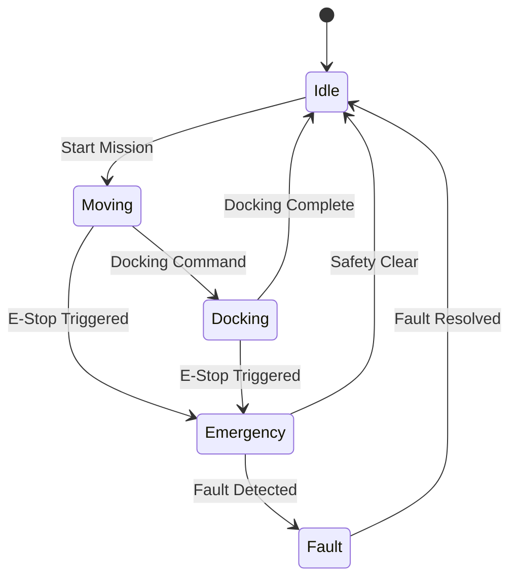

# ADR-005: Safety Architecture Decision

## Status
**APPROVED** - 2024-08-21

## Context
OHT-50 Master Module cần hệ thống an toàn đáp ứng:
- SIL2 safety standards compliance
- Emergency stop functionality
- Collision avoidance
- Safety-critical communication
- Fault detection và recovery
- Safety audit logging
- Hardware safety integration

## Decision
**Chọn Multi-Layer Safety Architecture với Hardware-Software Integration**

### Safety Architecture:
```
┌─────────────────────────────────────┐
│         Safety Layer                │
└─────────────────┬───────────────────┘
                  │
    ┌─────────────┼─────────────┐
    │             │             │
┌───▼───┐   ┌────▼────┐   ┌────▼────┐
│Hardware│   │Software │   │Emergency│
│ Safety │   │ Safety  │   │  Stop   │
└───────┘   └─────────┘   └─────────┘
    │             │             │
┌───▼───┐   ┌────▼────┐   ┌────▼────┐
│E-Stop │   │Collision│   │Fault    │
│Button │   │Detection│   │Recovery │
└───────┘   └─────────┘   └─────────┘
```

### Safety State Machine:


## Consequences

### Positive:
- **SIL2 Compliance**: Meets safety standards
- **Redundancy**: Multiple safety layers
- **Real-time Response**: Immediate safety actions
- **Audit Trail**: Complete safety logging
- **Hardware Integration**: Physical safety controls
- **Fault Tolerance**: Graceful failure handling

### Negative:
- **Complexity**: Multi-layer safety system
- **Performance Overhead**: Safety checks impact performance
- **Testing Complexity**: Safety validation requirements
- **Certification**: Safety certification process

### Risks:
- **False Positives**: Unnecessary safety stops
- **False Negatives**: Missed safety hazards
- **System Overhead**: Performance impact
- **Certification Delays**: Safety approval process

## Mitigation Strategies:
1. **Redundant Sensors**: Multiple safety sensors
2. **Voting Logic**: Consensus-based safety decisions
3. **Performance Optimization**: Efficient safety algorithms
4. **Comprehensive Testing**: Safety validation procedures
5. **Documentation**: Complete safety documentation

## Safety Requirements:

### Hardware Safety:
```yaml
hardware_safety:
  e_stop:
    type: "Dual-channel safety"
    response_time: "< 100ms"
    hardware_redundancy: true
    
  sensors:
    collision_detection:
      type: "Multiple sensors"
      coverage: "360 degrees"
      response_time: "< 50ms"
    
    position_encoders:
      type: "Dual encoders"
      redundancy: "Cross-checking"
      accuracy: "±1mm"
```

### Software Safety:
```python
# Safety Configuration
SAFETY_CONFIG = {
    "e_stop_timeout": 100,  # milliseconds
    "collision_threshold": 0.5,  # meters
    "velocity_limit": 1000,  # mm/s
    "acceleration_limit": 500,  # mm/s²
    "safety_margin": 0.2,  # meters
    
    # Safety checks frequency
    "check_interval": 10,  # milliseconds
    
    # Fault detection
    "fault_timeout": 5000,  # milliseconds
    "max_retry_attempts": 3
}

class SafetyManager:
    def __init__(self):
        self.safety_state = SafetyState.IDLE
        self.e_stop_active = False
        self.collision_detected = False
        self.fault_detected = False
        
    async def check_safety(self):
        """Continuous safety monitoring"""
        while True:
            # Check E-Stop status
            if self.check_e_stop():
                await self.trigger_emergency_stop()
            
            # Check collision sensors
            if self.check_collision():
                await self.trigger_collision_stop()
            
            # Check velocity limits
            if self.check_velocity_limits():
                await self.trigger_velocity_stop()
            
            # Check system health
            if self.check_system_health():
                await self.trigger_fault_mode()
            
            await asyncio.sleep(SAFETY_CONFIG["check_interval"] / 1000)
    
    async def trigger_emergency_stop(self):
        """Trigger emergency stop procedure"""
        self.safety_state = SafetyState.EMERGENCY
        self.e_stop_active = True
        
        # Stop all motion
        await self.stop_all_motors()
        
        # Activate safety brakes
        await self.activate_safety_brakes()
        
        # Log safety event
        await self.log_safety_event("emergency_stop", "E-Stop triggered")
        
        # Notify operators
        await self.notify_operators("EMERGENCY_STOP")
```

## Performance Impact Assessment:
- **Safety Check Overhead**: < 1ms per check
- **E-Stop Response Time**: < 100ms
- **Collision Detection**: < 50ms
- **System Performance**: < 5% overhead
- **Memory Usage**: < 10MB cho safety system

## Safety Validation:
```python
# Safety Test Cases
SAFETY_TESTS = {
    "e_stop_functionality": {
        "description": "Test E-Stop button functionality",
        "test_cases": [
            "E-Stop button press",
            "E-Stop button release",
            "E-Stop timeout",
            "E-Stop redundancy"
        ]
    },
    
    "collision_detection": {
        "description": "Test collision detection system",
        "test_cases": [
            "Obstacle detection",
            "False positive prevention",
            "Detection range",
            "Response time"
        ]
    },
    
    "velocity_limits": {
        "description": "Test velocity limit enforcement",
        "test_cases": [
            "Maximum velocity",
            "Acceleration limits",
            "Deceleration limits",
            "Emergency deceleration"
        ]
    }
}
```

## Compliance Requirements:
- **SIL2 Standards**: IEC 61508 compliance
- **Safety Functions**: Emergency stop, collision avoidance
- **Fault Detection**: Automatic fault detection
- **Audit Trail**: Complete safety event logging
- **Documentation**: Safety manual và procedures

## Monitoring & Metrics:
```python
# Safety Metrics
SAFETY_METRICS = {
    "e_stop_events_total": Counter("e_stop_events_total", ["trigger_type"]),
    "collision_events_total": Counter("collision_events_total", ["severity"]),
    "safety_check_duration": Histogram("safety_check_duration_seconds"),
    "fault_detection_time": Histogram("fault_detection_time_seconds"),
    "safety_system_uptime": Gauge("safety_system_uptime_seconds")
}
```

## Alternatives Considered:
1. **Single Safety Layer**: Insufficient redundancy
2. **Software-Only Safety**: No hardware backup
3. **External Safety System**: Complex integration
4. **Minimal Safety**: Non-compliant approach

## Review Schedule:
- **Daily**: Safety system health checks
- **Weekly**: Safety test execution
- **Monthly**: Safety audit review
- **Quarterly**: Safety certification review

---

**Approved by:** CTO  
**Date:** 2024-08-21  
**Next Review:** 2024-09-21
