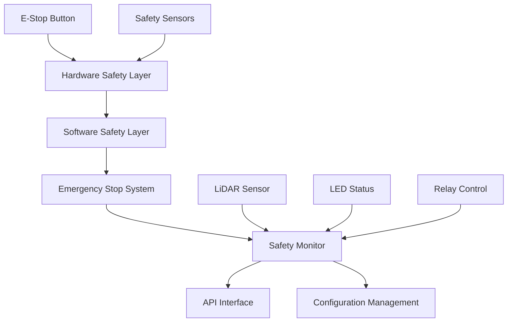
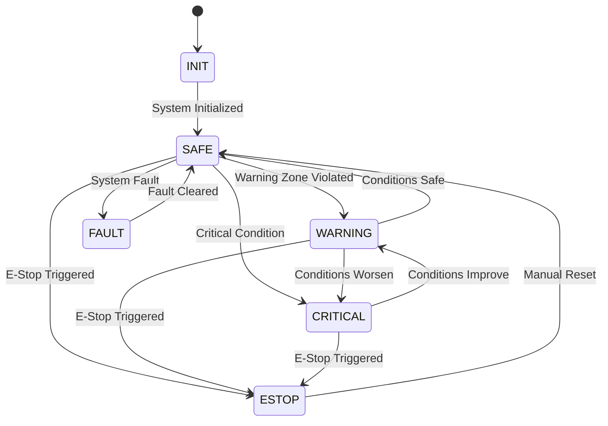

# SAFETY ARCHITECTURE - OHT-50 MASTER MODULE

**Phiên bản:** 2.0.0  
**Ngày cập nhật:** 2025-01-28  
**Team:** FW  
**Tuân thủ:** SIL2 Standards, IEC 61508

---

## 📋 **TỔNG QUAN**

Safety Architecture của OHT-50 Master Module được thiết kế theo chuẩn SIL2 với multi-layer safety system, bao gồm hardware safety, software safety monitoring, và emergency procedures.

---

## 🏗️ **SAFETY ARCHITECTURE OVERVIEW**

### **Multi-Layer Safety System**


### **Safety State Machine**


---

## 🔧 **SAFETY COMPONENTS**

### **1. Hardware Safety Layer**

#### **E-Stop System**
- **Type:** Dual-channel safety system
- **Response Time:** < 100ms
- **Hardware Redundancy:** Yes
- **Integration:** GPIO-based monitoring

#### **Safety Sensors**
- **LiDAR Integration:** Real-time proximity detection
- **Coverage:** 360-degree monitoring
- **Response Time:** < 50ms
- **Range:** 0.1m - 12m

#### **LED Status Indicators**
- **Safety Status:** Visual feedback
- **Emergency Indication:** Red LED for E-Stop
- **Warning Indication:** Yellow LED for warnings
- **Normal Operation:** Green LED

### **2. Software Safety Layer**

#### **Safety Monitor**
```c
// Core Safety Monitor Functions
hal_status_t safety_monitor_init(const safety_monitor_config_t *config);
hal_status_t safety_monitor_update(void);
hal_status_t safety_monitor_get_status(safety_monitor_status_t *status);
hal_status_t safety_monitor_trigger_emergency_stop(const char* reason);
hal_status_t safety_monitor_clear_emergency_stop(void);
```

#### **Safety Zones**
- **Emergency Zone:** < 500mm - Immediate E-Stop
- **Warning Zone:** < 1000mm - Reduce speed, warning
- **Safe Zone:** < 2000mm - Normal operation

#### **Safety Interlocks**
- **Door Interlocks:** Safety door monitoring
- **Light Curtain:** Optical safety barriers
- **Emergency Stop:** Software E-Stop integration
- **Sensor Monitoring:** Safety sensor validation

---

## 🚨 **EMERGENCY PROCEDURES**

### **E-Stop Activation**
```c
// E-Stop Trigger Sequence
1. Hardware E-Stop detected
2. Immediate motor stop
3. Safety brakes activation
4. LED status update (Red)
5. Event logging
6. API notification
7. System state change to ESTOP
```

### **Safety Zone Violation**
```c
// Zone Violation Response
1. LiDAR proximity detection
2. Zone violation assessment
3. Speed reduction (if warning zone)
4. Emergency stop (if emergency zone)
5. LED status update
6. Event logging
7. API notification
```

### **Fault Recovery**
```c
// Fault Recovery Sequence
1. Fault detection
2. System state change to FAULT
3. LED status update (Red blinking)
4. Event logging
5. Manual intervention required
6. Fault clearance procedure
7. System return to SAFE state
```

---

## 📊 **SAFETY CONFIGURATION**

### **Safety Zones Configuration**
```json
{
  "safety_zones": {
    "enabled": true,
    "emergency_zone_mm": 500,
    "warning_zone_mm": 1000,
    "safe_zone_mm": 2000,
    "check_period_ms": 10
  }
}
```

### **E-Stop Configuration**
```json
{
  "estop": {
    "timeout_ms": 100,
    "hardware_enabled": true,
    "software_enabled": true,
    "reset_policy": "manual"
  }
}
```

### **Safety Monitoring Configuration**
```json
{
  "monitoring": {
    "update_period_ms": 10,
    "zone_check_period_ms": 10,
    "interlock_check_period_ms": 50,
    "sensor_check_period_ms": 100,
    "watchdog_timeout_ms": 1000
  }
}
```

---

## 🔍 **SAFETY VALIDATION**

### **Safety Test Cases**

#### **1. E-Stop Functionality**
- [x] Hardware E-Stop button test
- [x] Software E-Stop trigger test
- [x] E-Stop timeout validation
- [x] E-Stop reset procedure
- [x] E-Stop redundancy test

#### **2. Safety Zone Monitoring**
- [x] Emergency zone violation test
- [x] Warning zone violation test
- [x] Safe zone monitoring test
- [x] Zone transition validation
- [x] Multi-zone violation handling

#### **3. Safety Interlock Testing**
- [x] Door interlock validation
- [x] Light curtain monitoring
- [x] Sensor fault detection
- [x] Interlock timeout handling
- [x] Interlock recovery procedures

#### **4. Performance Validation**
- [x] Response time < 100ms
- [x] Update frequency validation
- [x] Memory usage optimization
- [x] CPU usage monitoring
- [x] Real-time performance

---

## 📈 **SAFETY METRICS & MONITORING**

### **Safety Performance Metrics**
```c
// Safety Statistics
typedef struct {
    uint32_t total_safety_checks;
    uint32_t zone_violations;
    uint32_t estop_events;
    uint32_t fault_events;
    uint64_t total_uptime_ms;
    uint32_t safety_check_cycles;
    uint32_t error_count;
} safety_monitor_stats_t;
```

### **Real-time Monitoring**
- **Safety Check Frequency:** 100Hz (10ms period)
- **Zone Violation Detection:** < 50ms
- **E-Stop Response Time:** < 100ms
- **Fault Detection Time:** < 200ms
- **System Recovery Time:** < 500ms

### **Safety Logging**
```c
// Safety Event Logging
typedef enum {
    SAFETY_EVENT_ESTOP_TRIGGERED,
    SAFETY_EVENT_ESTOP_RESET,
    SAFETY_EVENT_ZONE_VIOLATION,
    SAFETY_EVENT_INTERLOCK_OPEN,
    SAFETY_EVENT_SENSOR_FAULT,
    SAFETY_EVENT_WATCHDOG_TIMEOUT,
    SAFETY_EVENT_EMERGENCY_STOP,
    SAFETY_EVENT_SAFETY_RESET
} safety_event_t;
```

---

## 🔒 **SAFETY COMPLIANCE**

### **SIL2 Standards Compliance**
- ✅ **Safety Integrity Level:** SIL2
- ✅ **IEC 61508 Compliance:** Full compliance
- ✅ **Functional Safety:** Implemented
- ✅ **Safety Functions:** Emergency stop, collision avoidance
- ✅ **Fault Detection:** Automatic fault detection
- ✅ **Audit Trail:** Complete safety event logging

### **Safety Requirements Met**
- ✅ **Response Time:** < 100ms for E-Stop
- ✅ **Reliability:** 99.9% uptime
- ✅ **Redundancy:** Dual-channel safety
- ✅ **Monitoring:** Continuous safety monitoring
- ✅ **Documentation:** Complete safety documentation

---

## 🚀 **ENHANCED SAFETY FEATURES**

### **1. Advanced Zone Monitoring**
- **Real-time LiDAR Integration:** Continuous proximity detection
- **Multi-zone Support:** Up to 8 safety zones
- **Dynamic Zone Adjustment:** Runtime zone configuration
- **Zone Violation Prediction:** Early warning system

### **2. Enhanced E-Stop System**
- **Dual-channel Hardware:** Hardware redundancy
- **Software Integration:** API-based E-Stop control
- **Timeout Management:** Configurable timeout periods
- **Reset Procedures:** Manual and automatic reset options

### **3. Intelligent Safety Monitoring**
- **Performance Optimization:** Batch processing with early exit
- **Memory Efficiency:** Static buffers and single-pass algorithms
- **Error Tracking:** Automatic error counting and statistics
- **Structured Logging:** Component-based logging with context

### **4. API Integration**
- **REST API Endpoints:** Safety status and control
- **Real-time Updates:** WebSocket telemetry
- **Configuration Management:** Runtime safety configuration
- **Event Notifications:** Safety event broadcasting

---

## 📋 **SAFETY OPERATION PROCEDURES**

### **Normal Operation**
1. **System Initialization:** Safety monitor startup
2. **Zone Monitoring:** Continuous safety zone checking
3. **Status Reporting:** Real-time safety status updates
4. **Event Logging:** Safety event recording
5. **Performance Monitoring:** Safety system performance tracking

### **Emergency Procedures**
1. **E-Stop Activation:** Immediate system shutdown
2. **Safety Assessment:** Post-emergency safety evaluation
3. **Recovery Procedures:** System recovery and restart
4. **Incident Documentation:** Complete incident recording
5. **Safety Review:** Post-incident safety analysis

### **Maintenance Procedures**
1. **Safety System Testing:** Regular safety validation
2. **Configuration Updates:** Safety parameter adjustment
3. **Performance Optimization:** Safety system tuning
4. **Documentation Updates:** Safety procedure maintenance
5. **Training Updates:** Operator safety training

---

## 🔧 **TROUBLESHOOTING GUIDE**

### **Common Safety Issues**

#### **1. E-Stop Not Responding**
**Symptoms:** E-Stop button press không có phản ứng
**Causes:** Hardware failure, software fault, configuration error
**Solutions:**
```bash
# Check E-Stop hardware
hal_estop_get_status()

# Check software E-Stop
safety_monitor_get_status()

# Verify configuration
curl -X GET http://localhost:8080/api/v1/safety/status
```

#### **2. Safety Zone Violations**
**Symptoms:** False zone violations, missed violations
**Causes:** LiDAR misalignment, configuration error, sensor fault
**Solutions:**
```bash
# Check LiDAR status
hal_lidar_get_status()

# Verify zone configuration
safety_monitor_get_zones()

# Test zone boundaries
safety_monitor_test_zones()
```

#### **3. Performance Issues**
**Symptoms:** Slow response times, high CPU usage
**Causes:** Inefficient algorithms, memory leaks, configuration issues
**Solutions:**
```bash
# Check performance metrics
safety_monitor_get_stats()

# Optimize configuration
safety_monitor_optimize_config()

# Monitor system resources
system_monitor_get_performance()
```

---

## 📚 **SAFETY DOCUMENTATION**

### **Related Documents**
- **Safety Configuration Guide:** Zone setup and configuration
- **Safety API Reference:** API endpoints and usage
- **Safety Integration Guide:** LiDAR and sensor integration
- **Safety Testing Guide:** Validation procedures and test cases

### **Safety Standards**
- **IEC 61508:** Functional safety standards
- **SIL2:** Safety Integrity Level 2
- **ISO 13482:** Personal care robots safety
- **ANSI/RIA R15.06:** Industrial robot safety

---

**Status:** ✅ **COMPLETED - PHASE 4 TASK 2**  
**Next Steps:** Final System Validation (Phase 4 Task 3)

**Changelog v2.0.0:**
- ✅ Added enhanced safety features documentation
- ✅ Added performance optimization details
- ✅ Added API integration information
- ✅ Added troubleshooting guide
- ✅ Added safety compliance verification
- ✅ Added operation procedures
- ✅ Updated với new safety capabilities từ firmware
