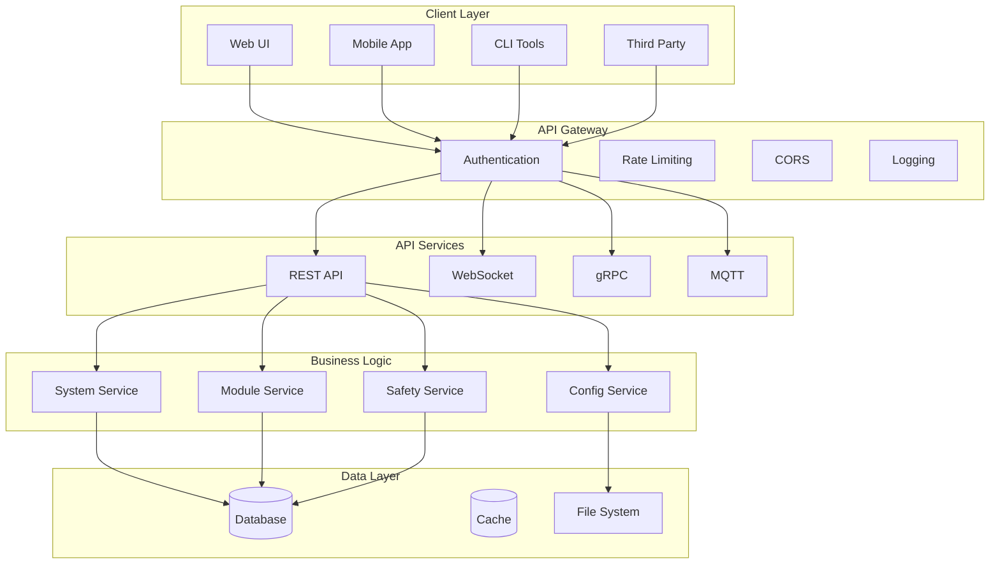

# API SPECIFICATION - OHT-50 Master Module

**Phiên bản:** v2.0  
**Ngày tạo:** 2025-01-28  
**Team:** Backend Team  
**Trạng thái:** 🔌 PRODUCTION READY

---

## 🎯 **TỔNG QUAN**

Đặc tả này định nghĩa REST API và WebSocket interface cho OHT-50 Master Module, bao gồm system control, monitoring, configuration và real-time communication.

---

## 🔌 **API ARCHITECTURE**

### **API Layers:**


---

## 🔌 **REST API**

### **Base URL:**
```
http://localhost:8000/api/v1
```

### **Authentication:**
```http
Authorization: Bearer <token>
Content-Type: application/json
```

### **Common Response Format:**
```json
{
  "success": true,
  "data": {},
  "message": "Operation successful",
  "timestamp": "2025-01-28T00:00:00Z",
  "version": "2.0"
}
```

### **Error Response Format:**
```json
{
  "success": false,
  "error": {
    "code": "ERROR_CODE",
    "message": "Error description",
    "details": {}
  },
  "timestamp": "2025-01-28T00:00:00Z",
  "version": "2.0"
}
```

---

## 📡 **SYSTEM API**

### **System Status:**
```http
GET /system/status
```

**Response:**
```json
{
  "success": true,
  "data": {
    "state": "IDLE",
    "uptime": 3600,
    "version": "2.0.0",
    "health": {
      "cpu_usage": 25.5,
      "memory_usage": 45.2,
      "disk_usage": 30.1,
      "temperature": 45.0
    },
    "safety": {
      "estop_status": "SAFE",
      "safety_level": "NORMAL",
      "fault_count": 0
    },
    "communication": {
      "rs485_status": "ONLINE",
      "ethernet_status": "ONLINE",
      "wifi_status": "OFFLINE"
    }
  }
}
```

### **System Control:**
```http
POST /system/control
```

**Request:**
```json
{
  "command": "MOVE",
  "parameters": {
    "target_position": 1000,
    "speed": 50,
    "acceleration": 10
  }
}
```

**Response:**
```json
{
  "success": true,
  "data": {
    "command_id": "cmd_12345",
    "status": "ACCEPTED",
    "estimated_duration": 30
  }
}
```

### **System Shutdown:**
```http
POST /system/shutdown
```

**Request:**
```json
{
  "reason": "MAINTENANCE",
  "timeout": 30
}
```

---

## 🔧 **MODULE API**

### **List Modules:**
```http
GET /modules
```

**Response:**
```json
{
  "success": true,
  "data": {
    "modules": [
      {
        "address": "0x02",
        "type": "POWER",
        "name": "Power Module",
        "status": "ONLINE",
        "last_seen": "2025-01-28T00:00:00Z",
        "version": "1.0.0",
        "capabilities": ["voltage", "current", "temperature"]
      },
      {
        "address": "0x03",
        "type": "MOTOR",
        "name": "Motor Module",
        "status": "ONLINE",
        "last_seen": "2025-01-28T00:00:00Z",
        "version": "1.0.0",
        "capabilities": ["speed", "position", "enable"]
      }
    ],
    "total_count": 2,
    "online_count": 2
  }
}
```

### **Module Details:**
```http
GET /modules/{address}
```

**Response:**
```json
{
  "success": true,
  "data": {
    "address": "0x02",
    "type": "POWER",
    "name": "Power Module",
    "status": "ONLINE",
    "last_seen": "2025-01-28T00:00:00Z",
    "version": "1.0.0",
    "capabilities": ["voltage", "current", "temperature"],
    "statistics": {
      "uptime": 3600,
      "command_count": 150,
      "error_count": 2,
      "response_time_avg": 25
    },
    "configuration": {
      "voltage_limit": 24.0,
      "current_limit": 5.0,
      "temperature_limit": 60.0
    }
  }
}
```

### **Module Control:**
```http
POST /modules/{address}/control
```

**Request:**
```json
{
  "command": "SET_VOLTAGE",
  "parameters": {
    "voltage": 12.0
  }
}
```

### **Module Discovery:**
```http
POST /modules/discover
```

**Response:**
```json
{
  "success": true,
  "data": {
    "discovered": 2,
    "new_modules": 1,
    "lost_modules": 0,
    "scan_duration": 5.2
  }
}
```

---

## 🛡️ **SAFETY API**

### **Safety Status:**
```http
GET /safety/status
```

**Response:**
```json
{
  "success": true,
  "data": {
    "estop_status": "SAFE",
    "safety_level": "NORMAL",
    "faults": [],
    "last_estop_time": null,
    "safety_systems": {
      "estop": "OPERATIONAL",
      "interlock": "OPERATIONAL",
      "relay1": "OPERATIONAL",
      "relay2": "OPERATIONAL"
    }
  }
}
```

### **Safety Control:**
```http
POST /safety/control
```

**Request:**
```json
{
  "action": "RESET_ESTOP",
  "parameters": {
    "reason": "MAINTENANCE_COMPLETE"
  }
}
```

### **Safety Logs:**
```http
GET /safety/logs
```

**Query Parameters:**
- `start_time`: ISO timestamp
- `end_time`: ISO timestamp
- `level`: INFO, WARNING, ERROR, CRITICAL
- `limit`: Number of entries

**Response:**
```json
{
  "success": true,
  "data": {
    "logs": [
      {
        "timestamp": "2025-01-28T00:00:00Z",
        "level": "INFO",
        "event": "ESTOP_RESET",
        "description": "E-Stop reset by user",
        "user": "admin"
      }
    ],
    "total_count": 150,
    "has_more": false
  }
}
```

---

## ⚙️ **CONFIGURATION API**

### **Get Configuration:**
```http
GET /config
```

**Response:**
```json
{
  "success": true,
  "data": {
    "system": {
      "name": "OHT-50-Master",
      "version": "2.0.0",
      "serial_number": "OHT50-001"
    },
    "communication": {
      "rs485": {
        "baudrate": 115200,
        "timeout": 1000
      },
      "ethernet": {
        "ip_address": "192.168.1.100",
        "port": 8000
      }
    },
    "safety": {
      "estop_timeout": 100,
      "fault_timeout": 200
    },
    "modules": {
      "discovery_interval": 5000,
      "health_check_interval": 1000
    }
  }
}
```

### **Update Configuration:**
```http
PUT /config
```

**Request:**
```json
{
  "communication": {
    "rs485": {
      "baudrate": 115200,
      "timeout": 1000
    }
  }
}
```

### **Configuration Validation:**
```http
POST /config/validate
```

**Request:**
```json
{
  "configuration": {}
}
```

**Response:**
```json
{
  "success": true,
  "data": {
    "valid": true,
    "errors": [],
    "warnings": []
  }
}
```

---

## 📊 **MONITORING API**

### **System Metrics:**
```http
GET /monitoring/metrics
```

**Response:**
```json
{
  "success": true,
  "data": {
    "system": {
      "cpu_usage": 25.5,
      "memory_usage": 45.2,
      "disk_usage": 30.1,
      "temperature": 45.0,
      "uptime": 3600
    },
    "communication": {
      "rs485": {
        "bytes_sent": 1024,
        "bytes_received": 2048,
        "errors": 0,
        "throughput": 115200
      },
      "ethernet": {
        "bytes_sent": 5120,
        "bytes_received": 10240,
        "errors": 0,
        "throughput": 1000000
      }
    },
    "modules": {
      "total_count": 2,
      "online_count": 2,
      "error_count": 0
    }
  }
}
```

### **Performance History:**
```http
GET /monitoring/history
```

**Query Parameters:**
- `metric`: cpu, memory, disk, temperature
- `duration`: 1h, 24h, 7d, 30d
- `interval`: 1s, 5s, 1m, 5m

**Response:**
```json
{
  "success": true,
  "data": {
    "metric": "cpu",
    "duration": "1h",
    "interval": "1m",
    "data": [
      {
        "timestamp": "2025-01-28T00:00:00Z",
        "value": 25.5
      }
    ]
  }
}
```

---

## 🔄 **WEBSOCKET API**

### **WebSocket Connection:**
```javascript
const ws = new WebSocket('ws://localhost:8000/ws');
```

### **Authentication:**
```javascript
ws.send(JSON.stringify({
  type: 'auth',
  token: 'your_auth_token'
}));
```

### **Subscribe to Events:**
```javascript
ws.send(JSON.stringify({
  type: 'subscribe',
  channels: ['system', 'modules', 'safety']
}));
```

### **Event Types:**

#### **System Events:**
```json
{
  "type": "system_event",
  "data": {
    "event": "STATE_CHANGE",
    "from_state": "IDLE",
    "to_state": "MOVE",
    "timestamp": "2025-01-28T00:00:00Z"
  }
}
```

#### **Module Events:**
```json
{
  "type": "module_event",
  "data": {
    "event": "MODULE_ONLINE",
    "address": "0x02",
    "module_type": "POWER",
    "timestamp": "2025-01-28T00:00:00Z"
  }
}
```

#### **Safety Events:**
```json
{
  "type": "safety_event",
  "data": {
    "event": "ESTOP_TRIGGERED",
    "source": "HARDWARE",
    "timestamp": "2025-01-28T00:00:00Z"
  }
}
```

### **Real-time Commands:**
```javascript
ws.send(JSON.stringify({
  type: 'command',
  command: 'MOVE',
  parameters: {
    target_position: 1000,
    speed: 50
  }
}));
```

---

## 🔐 **AUTHENTICATION & SECURITY**

### **Authentication Methods:**
```http
POST /auth/login
```

**Request:**
```json
{
  "username": "admin",
  "password": "password"
}
```

**Response:**
```json
{
  "success": true,
  "data": {
    "token": "jwt_token_here",
    "expires_in": 3600,
    "user": {
      "username": "admin",
      "role": "ADMIN",
      "permissions": ["read", "write", "admin"]
    }
  }
}
```

### **Token Refresh:**
```http
POST /auth/refresh
```

### **Logout:**
```http
POST /auth/logout
```

---

## 📋 **ERROR CODES**

### **System Errors:**
```json
{
  "SYSTEM_ERROR": "System error occurred",
  "INVALID_STATE": "Invalid system state",
  "COMMAND_REJECTED": "Command rejected",
  "TIMEOUT": "Operation timeout",
  "NOT_FOUND": "Resource not found",
  "VALIDATION_ERROR": "Validation error",
  "AUTHENTICATION_ERROR": "Authentication failed",
  "AUTHORIZATION_ERROR": "Authorization failed",
  "RATE_LIMIT_EXCEEDED": "Rate limit exceeded"
}
```

### **Module Errors:**
```json
{
  "MODULE_NOT_FOUND": "Module not found",
  "MODULE_OFFLINE": "Module offline",
  "MODULE_ERROR": "Module error",
  "COMMUNICATION_ERROR": "Communication error",
  "INVALID_COMMAND": "Invalid command"
}
```

### **Safety Errors:**
```json
{
  "SAFETY_VIOLATION": "Safety violation",
  "ESTOP_ACTIVE": "E-Stop active",
  "FAULT_DETECTED": "Fault detected",
  "SAFETY_SYSTEM_ERROR": "Safety system error"
}
```

---

## 📋 **PERFORMANCE REQUIREMENTS**

### **API Performance:**
```c
// Performance Requirements
#define API_RESPONSE_TIME_MS               100     // API response time
#define WEBSOCKET_LATENCY_MS               50      // WebSocket latency
#define API_THROUGHPUT_RPS                 1000    // API throughput (requests per second)
#define WEBSOCKET_CONNECTIONS_MAX          100     // Max WebSocket connections
#define API_RATE_LIMIT_RPS                 100     // Rate limit (requests per second)
#define API_TIMEOUT_MS                     5000    // API timeout
#define WEBSOCKET_TIMEOUT_MS               30000   // WebSocket timeout
```

---

## 📋 **TASK MAPPING CHO PM**

### **Backend Team Tasks:**
- [ ] Implement REST API endpoints
- [ ] Implement WebSocket server
- [ ] Implement authentication system
- [ ] Implement rate limiting
- [ ] Implement error handling
- [ ] Implement API documentation
- [ ] Unit tests cho API
- [ ] Integration tests cho API

### **Frontend Team Tasks:**
- [ ] Implement API client library
- [ ] Implement WebSocket client
- [ ] Implement authentication UI
- [ ] Implement error handling UI
- [ ] API integration testing

### **DevOps Team Tasks:**
- [ ] API deployment configuration
- [ ] Load balancing setup
- [ ] Monitoring và logging
- [ ] Security configuration
- [ ] Performance testing

### **System Integration Tasks:**
- [ ] API integration testing
- [ ] End-to-end API testing
- [ ] Performance testing
- [ ] Security testing

---

## 📚 **REFERENCES**

### **Related Documents:**
- `GPIO_PIN_MAPPING_SPEC.md` - GPIO pin mapping
- `STARTUP_SEQUENCE_SPEC.md` - Startup sequence
- `SAFETY_SPEC.md` - Safety system specification
- `MODULE_MANAGEMENT_SPEC.md` - Module management specification
- `COMMUNICATION_SPEC.md` - Communication specification
- `STATE_MACHINE_SPEC.md` - State machine specification
- `../../backend/CONFIG_API.md` - Config API details
- `../../backend/WEBSOCKET_EVENTS.md` - WebSocket channels & events
- `../../backend/ERRORS_CONVENTION.md` - Error envelope & codes
- `../../backend/SECURITY_GUIDE.md` - Auth/CORS/Rate-limit
- `../../backend/INTEGRATION_CENTER.md` - Integration Backend ↔ Center/FW
- `../../specs/telemetry_schema.md` - Telemetry JSON schema

### **Standards:**
- REST API Design
- WebSocket Protocol
- JWT Authentication
- HTTP Status Codes
- JSON Schema

---

## 📝 **CHANGELOG**

### **v2.0 (2025-01-28):**
- ✅ Added comprehensive API specification
- ✅ Added REST API design
- ✅ Added WebSocket API design
- ✅ Added authentication & security
- ✅ Added error handling
- ✅ Added performance requirements
- ✅ Added task mapping for PM

### **v1.0 (2025-01-27):**
- ✅ Initial API specification document
- ✅ Basic API design

---

**🚨 Lưu ý:** API phải được test đầy đủ và có security validation trước khi triển khai.
