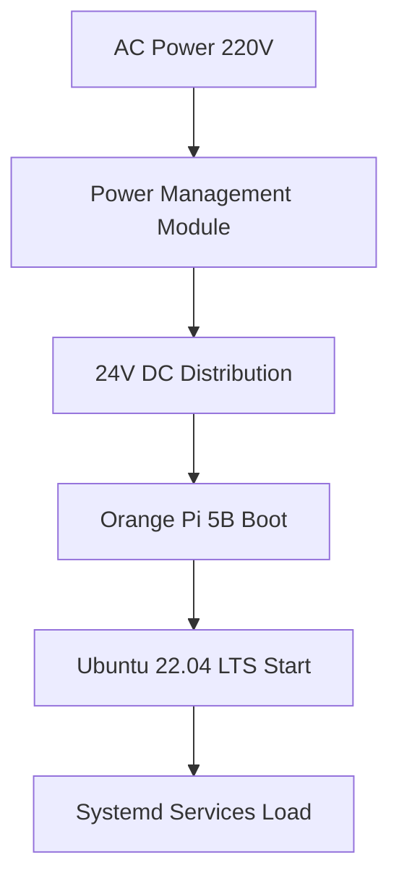

# OHT-50 Startup Sequence Guide
## Quy Trình Khởi Động Hệ Thống OHT-50

**Phiên bản:** v2.0  
**Ngày tạo:** 2025-01-28  
**Team:** FW Team  
**Trạng thái:** Production Ready  

---

## 🎯 **TỔNG QUAN**

Tài liệu này mô tả quy trình khởi động chi tiết của hệ thống OHT-50 khi cấp nguồn, bao gồm các giai đoạn từ hardware boot đến system ready.

---

## ⚡ **PHASE 1: HARDWARE BOOT (0-30 giây)**

### **1.1 Power-On Sequence**


### **1.2 Hardware Initialization**
```bash
# 1. Orange Pi 5B boot sequence
U-Boot → Linux Kernel → Ubuntu 22.04 LTS

# 2. Device tree overlays load
uart1_46_47.dtbo → UART1 enabled (chân 46, 47)
gpio overlays → GPIO pins configured

# 3. Hardware interfaces ready
/dev/ttyS1 → RS485 communication
/dev/gpiochip* → GPIO control
eth0/wlan0 → Network interfaces
```

### **1.3 GPIO Pin Configuration (Updated v2.0)**
```bash
# LED pins (Production Ready v2.0)
GPIO 54 (GPIO1_D6) → Power LED (Green)
GPIO 35 (GPIO1_A3) → System LED (Blue)
GPIO 28 (GPIO0_D4) → Comm LED (Yellow)
GPIO 29 (GPIO0_D5) → Network LED (Green)
GPIO 58 (GPIO1_D2) → Error LED (Red)

# E-Stop & Relay pins (Updated v2.0)
GPIO 59 (GPIO1_D3) → E-Stop (Single channel)
GPIO 131 (GPIO4_A3) → Relay 1 (24V DC)
GPIO 132 (GPIO4_A4) → Relay 2 (24V DC)

# UART1 RS485
GPIO 46 (GPIO1_D1) → UART1 TX
GPIO 47 (GPIO1_D0) → UART1 RX
```

---

## 🔧 **PHASE 2: SYSTEMD SERVICES START (30-60 giây)**

### **2.1 Service Configuration**
```ini
# /etc/systemd/system/oht50.service
[Unit]
Description=OHT-50 Main Service
After=network-online.target
Requires=network-online.target

[Service]
Type=simple
User=oht
WorkingDirectory=/opt/oht50
Environment="VIRTUAL_ENV=/opt/oht50/venv"
Environment="PATH=/opt/oht50/venv/bin:/usr/bin"
ExecStart=/opt/oht50/venv/bin/python -m oht50.main --config /opt/oht50/config/system.yaml
Restart=always
RestartSec=3

[Install]
WantedBy=multi-user.target
```

### **2.2 Service Startup Order**
```bash
# 1. Network services
systemd-networkd → eth0/wlan0 online

# 2. Hardware services  
udev → device detection
opwiring → GPIO/UART configuration

# 3. OHT-50 services
oht50.service → Main application
oht50-center.service → Center communication
```

### **2.3 Service Status Check**
```bash
# Check service status
sudo systemctl status oht50.service

# Expected output:
# ● oht50.service - OHT-50 Main Service
#      Loaded: loaded (/etc/systemd/system/oht50.service; enabled)
#      Active: active (running) since ...
#      Main PID: 1234 (python)
#      Status: "OHT-50 system ready"
```

---

## 🚀 **PHASE 3: APPLICATION INITIALIZATION (60-90 giây)**

### **3.1 System State Machine (Updated v2.0)**
```c
// firmware/src/app/system_state_machine.c
SYSTEM_STATE_INIT → SYSTEM_STATE_IDLE

// Initialization sequence:
1. HAL modules init (E-Stop single-channel, LED, RS485)
2. Safety system init (single-channel E-Stop monitoring)
3. Communication init (RS485/Modbus RTU)
4. Module discovery (auto-detect modules)
5. State transition: INIT → IDLE
```

### **3.2 LED Status Patterns (Updated v2.0)**
```c
// Initial LED pattern (SYSTEM_STATE_INIT)
Power LED: BLINK_SLOW (initializing)
System LED: BLINK_SLOW (initializing)  
Comm LED: OFF (no communication yet)
Network LED: OFF (no network yet)
Error LED: OFF (no errors)

// Ready LED pattern (SYSTEM_STATE_IDLE)
Power LED: ON (power stable)
System LED: ON (system ready)
Comm LED: BLINK_SLOW (communication active)
Network LED: ON (network connected)
Error LED: OFF (no errors)
```

### **3.3 Module Auto-Discovery (Updated v2.0)**
```bash
# RS485 bus scan sequence
1. Send discovery broadcast
2. Scan addresses 0x02-0x07
3. Register found modules:
   - 0x02: Power Management Module
   - 0x03: Stepper Motor Module  
   - 0x04: DC Motor Module
   - 0x05: DI/DO Module
   - 0x06: AI Module
   - 0x07: Location Module

# Discovery commands
./module_cli discover
./module_cli list
./module_cli ping --addr 0x02
```

---

## ✅ **PHASE 4: SYSTEM READY (90-120 giây)**

### **4.1 Ready State Indicators (Updated v2.0)**
```c
// System ready indicators
System State: SYSTEM_STATE_IDLE
Safety Status: SAFETY_LEVEL_NORMAL (single-channel E-Stop)
Communication: RS485/Modbus RTU active
Network: Ethernet/WiFi connected
Modules: All discovered modules ready
```

### **4.2 Service Status Verification**
```bash
# Check network connectivity
ping 8.8.8.8  # Internet connectivity
ping center-server  # Center server connectivity

# Check module communication
./module_cli ping --addr 0x02  # Power module
./module_cli ping --addr 0x03  # Motor module
./module_cli ping --addr 0x04  # DC motor module
./module_cli ping --addr 0x05  # DI/DO module

# Check system status
curl http://localhost:8000/health/  # Backend health
curl http://localhost:8000/api/v1/status  # System status
```

### **4.3 Performance Metrics (Updated v2.0)**
```bash
# System performance check
uptime  # System uptime
free -h  # Memory usage
df -h  # Disk usage
top  # CPU usage

# Expected metrics:
# - Memory usage: < 512MB
# - CPU usage: < 80%
# - Disk usage: < 70%
# - Network latency: < 50ms
# - E-Stop response time: < 100ms
```

---

## 🚨 **SAFETY CONSIDERATIONS (Updated v2.0)**

### **4.1 E-Stop Priority (Single-Channel)**
```c
// E-Stop được ưu tiên cao nhất (single-channel)
if (estop_triggered) {
    system_state_machine_process_event(SYSTEM_EVENT_ESTOP_TRIGGERED);
    // Immediate transition to ESTOP state
    // All motors stopped
    // Safety systems activated
    // Error LED ON
    // Response time < 100ms
}
```

### 4.1.1 Latency Measurement (Thực địa)
```bash
# Đo latency E‑Stop bằng journalctl markers
bash deploy/scripts/estop_latency_test.sh
# Kết quả được lưu: /opt/oht50/logs/estop_latency_results.log
# Expected: < 100ms response time
```

### **4.2 Fault Detection**
```c
// Fault detection trong startup
if (hardware_fault_detected) {
    system_state_machine_process_event(SYSTEM_EVENT_FAULT_DETECTED);
    // Transition to FAULT state
    // Error LED BLINK_FAST
    // System not ready
    // Log fault details
}
```

### 4.2.1 RS485 Fault Injection (CRC/Timeout)
```bash
# Kiểm tra timeout/CRC (ghi nhận số liệu từ logs)
bash deploy/scripts/rs485_fault_test.sh
# Kết quả được lưu: /opt/oht50/logs/rs485_fault_results.log
```

### **4.3 Recovery Procedures**
```bash
# Manual recovery nếu startup fail
sudo systemctl restart oht50.service

# Check logs
sudo journalctl -u oht50.service -f

# Hardware reset nếu cần
sudo reboot

# Emergency procedures
# 1. Press E-Stop button
# 2. Check power supply
# 3. Check network connectivity
# 4. Check module connections
```

---

## 📊 **STARTUP TIMELINE (Updated v2.0)**

### **Timeline chi tiết:**
```
0s     → AC Power On
10s    → Orange Pi 5B Boot
30s    → Ubuntu 22.04 LTS Ready
45s    → Network Interfaces Up
60s    → Systemd Services Start
75s    → OHT-50 Application Init
90s    → HAL Modules Ready (Single-channel E-Stop)
105s   → Module Discovery Complete
120s   → System Ready (IDLE State)
```

### **Critical Path:**


---

## 🔧 **TROUBLESHOOTING**

### **5.1 Common Startup Issues**

#### **Network Issues:**
```bash
# Check network configuration
ip addr show
ping 8.8.8.8

# Fix network issues
sudo systemctl restart networking
sudo systemctl restart wpa_supplicant
```

#### **Hardware Issues:**
```bash
# Check GPIO pins (Updated v2.0)
ls /sys/class/gpio/
cat /sys/class/gpio/gpio54/value  # Power LED
cat /sys/class/gpio/gpio59/value  # E-Stop

# Check UART1
ls -la /dev/ttyS1
sudo python3 test_uart1_pins_46_47.py
```

#### **Service Issues:**
```bash
# Check service status
sudo systemctl status oht50.service

# Check service logs
sudo journalctl -u oht50.service -n 50

# Restart service
sudo systemctl restart oht50.service
```

### **5.2 Diagnostic Commands**
```bash
# System diagnostics
./module_cli health --addr 0x02
./module_cli stats --addr 0x02
./module_cli logs --addr 0x02

# Hardware diagnostics (FW-maintained unit tests)
sudo ./firmware/build/test_rs485
sudo ./firmware/build/test_network
```

---

## 📋 **CHECKLIST KHỞI ĐỘNG (Updated v2.0)**

### **Pre-Startup Checklist:**
- [ ] Power supply connected (220V AC)
- [ ] All modules connected to RS485 bus
- [ ] Network cables connected
- [ ] E-Stop button accessible (single-channel)
- [ ] Safety area cleared

### **Startup Verification:**
- [ ] Orange Pi 5B boots successfully
- [ ] Network interfaces are up
- [ ] OHT-50 service starts
- [ ] All modules discovered
- [ ] System state is IDLE
- [ ] All LEDs show correct patterns (v2.0)
- [ ] E-Stop single-channel working
- [ ] No error messages in logs

### **Post-Startup Verification:**
- [ ] System responds to commands
- [ ] Safety systems functional (single-channel)
- [ ] Communication with Center server
- [ ] All modules operational
- [ ] Performance metrics within limits
- [ ] E-Stop response time < 100ms

---

## 🎯 **KẾT LUẬN**

### **✅ Startup Sequence Summary (v2.0):**
1. **Hardware boot** (30s) - Orange Pi 5B, Ubuntu OS
2. **Systemd services** (30s) - Network, hardware drivers
3. **Application init** (30s) - State machine, safety (single-channel), communication
4. **Module discovery** (30s) - Auto-detect RS485 modules
5. **System ready** (120s total) - IDLE state, ready for commands

### **✅ First Programs:**
1. **Backend service** - FastAPI application
2. **System state machine** - State management
3. **Safety manager** - Single-channel E-Stop monitoring
4. **Module manager** - Auto-discovery
5. **Communication manager** - RS485/Modbus RTU

### **✅ Success Criteria (v2.0):**
- **Total startup time:** 2 phút
- **Safety systems:** Fully operational (single-channel E-Stop)
- **Communication:** All modules discovered
- **Network:** Connected to Center server
- **Performance:** Within specified limits
- **E-Stop response:** < 100ms

---

**Changelog:**
- v2.0 (2025-01-28): Updated for single-channel E-Stop, GPIO v2.0, performance metrics
- v1.0 (2025-01-27): Initial startup sequence guide
