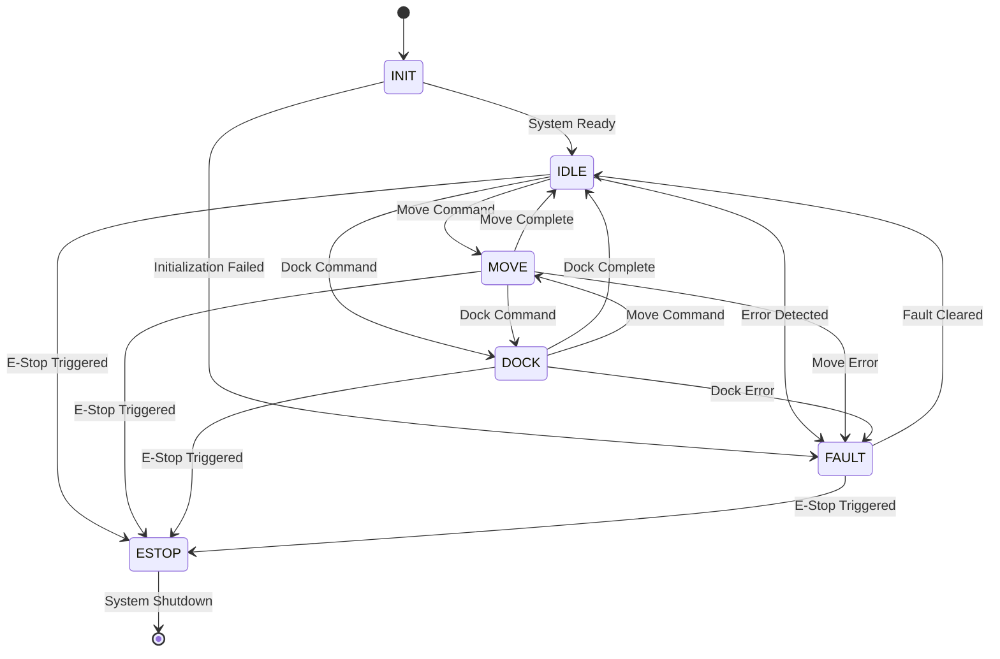

# STATE MACHINE SPECIFICATION - OHT-50 Master Module

**Phiên bản:** v2.0  
**Ngày tạo:** 2025-01-28  
**Team:** FW Team  
**Trạng thái:** 🔄 PRODUCTION READY

---

## 🎯 **TỔNG QUAN**

Đặc tả này định nghĩa behavior của state machine cho OHT-50 Master Module, bao gồm state transitions, event handling, và state-specific actions.

---

## 🔄 **STATE MACHINE ARCHITECTURE**

### **System State Machine:**


---

## 📡 **SYSTEM STATES**

### **State Definitions:**
```c
// System States
typedef enum {
    SYSTEM_STATE_INIT = 0,      // System initialization
    SYSTEM_STATE_IDLE = 1,      // Ready for commands
    SYSTEM_STATE_MOVE = 2,      // Movement in progress
    SYSTEM_STATE_DOCK = 3,      // Docking operation
    SYSTEM_STATE_FAULT = 4,     // Error condition
    SYSTEM_STATE_ESTOP = 5      // Emergency stop
} system_state_t;

// State Names
static const char* STATE_NAMES[] = {
    "INIT",
    "IDLE", 
    "MOVE",
    "DOCK",
    "FAULT",
    "ESTOP"
};
```

### **State Descriptions:**
```c
// State Descriptions
typedef struct {
    system_state_t state;       // State identifier
    char name[16];             // State name
    char description[64];      // State description
    uint8_t is_terminal;       // Terminal state flag
    uint32_t timeout_ms;       // State timeout
} state_description_t;

// State Descriptions
static const state_description_t STATE_DESCRIPTIONS[] = {
    {SYSTEM_STATE_INIT, "INIT", "System initialization", 0, 30000},
    {SYSTEM_STATE_IDLE, "IDLE", "Ready for commands", 0, 0},
    {SYSTEM_STATE_MOVE, "MOVE", "Movement in progress", 0, 60000},
    {SYSTEM_STATE_DOCK, "DOCK", "Docking operation", 0, 45000},
    {SYSTEM_STATE_FAULT, "FAULT", "Error condition", 0, 0},
    {SYSTEM_STATE_ESTOP, "ESTOP", "Emergency stop", 1, 0}
};
```

---

## 📡 **EVENT SYSTEM**

### **System Events:**
```c
// System Events
typedef enum {
    EVENT_INIT_COMPLETE = 0,    // Initialization complete
    EVENT_INIT_FAILED = 1,      // Initialization failed
    EVENT_MOVE_COMMAND = 2,     // Move command received
    EVENT_DOCK_COMMAND = 3,     // Dock command received
    EVENT_MOVE_COMPLETE = 4,    // Move operation complete
    EVENT_DOCK_COMPLETE = 5,    // Dock operation complete
    EVENT_FAULT_DETECTED = 6,   // Fault detected
    EVENT_FAULT_CLEARED = 7,    // Fault cleared
    EVENT_ESTOP_TRIGGERED = 8,  // E-Stop triggered
    EVENT_ESTOP_RESET = 9,      // E-Stop reset
    EVENT_TIMEOUT = 10,         // Operation timeout
    EVENT_EMERGENCY = 11        // Emergency condition
} system_event_t;

// Event Names
static const char* EVENT_NAMES[] = {
    "INIT_COMPLETE",
    "INIT_FAILED", 
    "MOVE_COMMAND",
    "DOCK_COMMAND",
    "MOVE_COMPLETE",
    "DOCK_COMPLETE",
    "FAULT_DETECTED",
    "FAULT_CLEARED",
    "ESTOP_TRIGGERED",
    "ESTOP_RESET",
    "TIMEOUT",
    "EMERGENCY"
};
```

### **Event Structure:**
```c
// Event Structure
typedef struct {
    system_event_t type;        // Event type
    uint32_t timestamp;         // Event timestamp
    uint32_t source;            // Event source
    void *data;                 // Event data
    uint16_t data_size;         // Data size
} system_event_t;
```

---

## 🔄 **STATE TRANSITION TABLE**

### **Transition Matrix:**
```c
// State Transition Table
typedef struct {
    system_state_t current_state;   // Current state
    system_event_t event;           // Triggering event
    system_state_t next_state;      // Next state
    int (*condition)(void *data);   // Transition condition
    int (*action)(void *data);      // Transition action
} state_transition_t;

// Transition Table
static const state_transition_t TRANSITION_TABLE[] = {
    // INIT State Transitions
    {SYSTEM_STATE_INIT, EVENT_INIT_COMPLETE, SYSTEM_STATE_IDLE, NULL, init_to_idle_action},
    {SYSTEM_STATE_INIT, EVENT_INIT_FAILED, SYSTEM_STATE_FAULT, NULL, init_to_fault_action},
    
    // IDLE State Transitions
    {SYSTEM_STATE_IDLE, EVENT_MOVE_COMMAND, SYSTEM_STATE_MOVE, validate_move_command, idle_to_move_action},
    {SYSTEM_STATE_IDLE, EVENT_DOCK_COMMAND, SYSTEM_STATE_DOCK, validate_dock_command, idle_to_dock_action},
    {SYSTEM_STATE_IDLE, EVENT_FAULT_DETECTED, SYSTEM_STATE_FAULT, NULL, idle_to_fault_action},
    {SYSTEM_STATE_IDLE, EVENT_ESTOP_TRIGGERED, SYSTEM_STATE_ESTOP, NULL, idle_to_estop_action},
    
    // MOVE State Transitions
    {SYSTEM_STATE_MOVE, EVENT_MOVE_COMPLETE, SYSTEM_STATE_IDLE, NULL, move_to_idle_action},
    {SYSTEM_STATE_MOVE, EVENT_DOCK_COMMAND, SYSTEM_STATE_DOCK, validate_dock_command, move_to_dock_action},
    {SYSTEM_STATE_MOVE, EVENT_FAULT_DETECTED, SYSTEM_STATE_FAULT, NULL, move_to_fault_action},
    {SYSTEM_STATE_MOVE, EVENT_ESTOP_TRIGGERED, SYSTEM_STATE_ESTOP, NULL, move_to_estop_action},
    {SYSTEM_STATE_MOVE, EVENT_TIMEOUT, SYSTEM_STATE_FAULT, NULL, move_timeout_action},
    
    // DOCK State Transitions
    {SYSTEM_STATE_DOCK, EVENT_DOCK_COMPLETE, SYSTEM_STATE_IDLE, NULL, dock_to_idle_action},
    {SYSTEM_STATE_DOCK, EVENT_MOVE_COMMAND, SYSTEM_STATE_MOVE, validate_move_command, dock_to_move_action},
    {SYSTEM_STATE_DOCK, EVENT_FAULT_DETECTED, SYSTEM_STATE_FAULT, NULL, dock_to_fault_action},
    {SYSTEM_STATE_DOCK, EVENT_ESTOP_TRIGGERED, SYSTEM_STATE_ESTOP, NULL, dock_to_estop_action},
    {SYSTEM_STATE_DOCK, EVENT_TIMEOUT, SYSTEM_STATE_FAULT, NULL, dock_timeout_action},
    
    // FAULT State Transitions
    {SYSTEM_STATE_FAULT, EVENT_FAULT_CLEARED, SYSTEM_STATE_IDLE, validate_fault_clear, fault_to_idle_action},
    {SYSTEM_STATE_FAULT, EVENT_ESTOP_TRIGGERED, SYSTEM_STATE_ESTOP, NULL, fault_to_estop_action},
    
    // ESTOP State Transitions (Terminal State)
    {SYSTEM_STATE_ESTOP, EVENT_ESTOP_RESET, SYSTEM_STATE_INIT, validate_estop_reset, estop_reset_action}
};
```

---

## 🔧 **STATE MACHINE IMPLEMENTATION**

### **State Machine Structure:**
```c
// State Machine Context
typedef struct {
    system_state_t current_state;           // Current state
    system_state_t previous_state;          // Previous state
    uint32_t state_entry_time;              // State entry timestamp
    uint32_t state_duration;                // State duration
    uint32_t event_count;                   // Event count
    uint32_t transition_count;              // Transition count
    system_event_t last_event;              // Last processed event
    void *state_data;                       // State-specific data
    uint8_t state_data_size;                // State data size
} state_machine_context_t;

// State Machine Functions
int state_machine_init(state_machine_context_t *context);
int state_machine_process_event(state_machine_context_t *context, system_event_t *event);
int state_machine_get_state(state_machine_context_t *context, system_state_t *state);
int state_machine_set_state(state_machine_context_t *context, system_state_t state);
int state_machine_validate_transition(state_machine_context_t *context, system_event_t *event);
```

### **State Entry/Exit Actions:**
```c
// State Action Functions
typedef int (*state_action_t)(state_machine_context_t *context);

// State Entry Actions
static state_action_t state_entry_actions[] = {
    init_entry_action,      // INIT
    idle_entry_action,      // IDLE
    move_entry_action,      // MOVE
    dock_entry_action,      // DOCK
    fault_entry_action,     // FAULT
    estop_entry_action      // ESTOP
};

// State Exit Actions
static state_action_t state_exit_actions[] = {
    init_exit_action,       // INIT
    idle_exit_action,       // IDLE
    move_exit_action,       // MOVE
    dock_exit_action,       // DOCK
    fault_exit_action,      // FAULT
    estop_exit_action       // ESTOP
};
```

---

## 📊 **STATE MONITORING & LOGGING**

### **State Monitoring:**
```c
// State Monitoring Data
typedef struct {
    system_state_t state;                   // Current state
    uint32_t state_duration_ms;             // State duration
    uint32_t event_count;                   // Event count
    uint32_t transition_count;              // Transition count
    system_event_t last_event;              // Last event
    uint32_t uptime_ms;                     // System uptime
    float cpu_usage;                        // CPU usage
    float memory_usage;                     // Memory usage
} state_monitoring_data_t;

// State Monitoring Functions
int state_monitor_init(void);
int state_monitor_start(void);
int state_monitor_stop(void);
int state_monitor_get_data(state_monitoring_data_t *data);
int state_monitor_set_callback(void (*callback)(state_monitoring_data_t *));
```

### **State Logging:**
```c
// State Log Entry
typedef struct {
    uint32_t timestamp;                     // Timestamp
    system_state_t from_state;              // From state
    system_state_t to_state;                // To state
    system_event_t trigger_event;           // Triggering event
    uint32_t state_duration_ms;             // State duration
    char description[64];                   // Description
} state_log_entry_t;

// State Logging Functions
int state_log_init(void);
int state_log_write(state_log_entry_t *entry);
int state_log_get_entries(state_log_entry_t *entries, uint16_t count);
int state_log_clear(void);
int state_log_export(const char *filename);
```

---

## 🔍 **STATE VALIDATION & ERROR HANDLING**

### **State Validation:**
```c
// State Validation Functions
int state_validate_init(state_machine_context_t *context);
int state_validate_idle(state_machine_context_t *context);
int state_validate_move(state_machine_context_t *context);
int state_validate_dock(state_machine_context_t *context);
int state_validate_fault(state_machine_context_t *context);
int state_validate_estop(state_machine_context_t *context);

// State Validation Structure
typedef struct {
    system_state_t state;                   // State to validate
    int (*validator)(state_machine_context_t *context); // Validation function
    uint32_t timeout_ms;                    // Validation timeout
    uint8_t retry_count;                    // Retry count
} state_validator_t;
```

### **Error Handling:**
```c
// Error Types
typedef enum {
    ERROR_TYPE_NONE = 0,
    ERROR_TYPE_INVALID_TRANSITION = 1,      // Invalid state transition
    ERROR_TYPE_TIMEOUT = 2,                 // Operation timeout
    ERROR_TYPE_VALIDATION_FAILED = 3,       // State validation failed
    ERROR_TYPE_EVENT_QUEUE_FULL = 4,        // Event queue full
    ERROR_TYPE_MEMORY_ALLOCATION = 5        // Memory allocation failed
} state_error_type_t;

// Error Handling Functions
int state_error_init(void);
int state_error_handle(state_error_type_t error_type, void *error_data);
int state_error_get_last_error(state_error_type_t *error_type, void *error_data);
int state_error_clear(void);
```

---

## ⏱️ **TIMING & TIMEOUT MANAGEMENT**

### **State Timeouts:**
```c
// State Timeout Configuration
typedef struct {
    system_state_t state;                   // State
    uint32_t timeout_ms;                    // Timeout duration
    system_event_t timeout_event;           // Timeout event
    uint8_t auto_transition;                // Auto transition on timeout
} state_timeout_config_t;

// State Timeout Configuration
static const state_timeout_config_t STATE_TIMEOUTS[] = {
    {SYSTEM_STATE_INIT, 30000, EVENT_INIT_FAILED, 1},      // 30s init timeout
    {SYSTEM_STATE_MOVE, 60000, EVENT_TIMEOUT, 1},          // 60s move timeout
    {SYSTEM_STATE_DOCK, 45000, EVENT_TIMEOUT, 1},          // 45s dock timeout
    {SYSTEM_STATE_FAULT, 0, EVENT_NONE, 0},                // No timeout for fault
    {SYSTEM_STATE_ESTOP, 0, EVENT_NONE, 0}                 // No timeout for estop
};
```

### **Timeout Management:**
```c
// Timeout Management Functions
int timeout_manager_init(void);
int timeout_manager_start_timer(system_state_t state);
int timeout_manager_stop_timer(system_state_t state);
int timeout_manager_reset_timer(system_state_t state);
int timeout_manager_get_remaining_time(system_state_t state, uint32_t *remaining_ms);
```

---

## 🔄 **EVENT QUEUE MANAGEMENT**

### **Event Queue:**
```c
// Event Queue Configuration
#define EVENT_QUEUE_SIZE 32                 // Event queue size
#define EVENT_PRIORITY_LEVELS 4             // Priority levels

// Event Queue Entry
typedef struct {
    system_event_t event;                   // Event
    uint8_t priority;                       // Event priority
    uint32_t timestamp;                     // Queue timestamp
    uint8_t processed;                      // Processed flag
} event_queue_entry_t;

// Event Queue
typedef struct {
    event_queue_entry_t entries[EVENT_QUEUE_SIZE]; // Queue entries
    uint8_t head;                           // Queue head
    uint8_t tail;                           // Queue tail
    uint8_t count;                          // Entry count
    uint8_t overflow_count;                 // Overflow count
} event_queue_t;
```

### **Event Queue Functions:**
```c
// Event Queue Functions
int event_queue_init(event_queue_t *queue);
int event_queue_push(event_queue_t *queue, system_event_t *event, uint8_t priority);
int event_queue_pop(event_queue_t *queue, system_event_t *event);
int event_queue_is_empty(event_queue_t *queue);
int event_queue_is_full(event_queue_t *queue);
int event_queue_clear(event_queue_t *queue);
```

---

## 📋 **PERFORMANCE REQUIREMENTS**

### **Performance Metrics:**
```c
// Performance Requirements
#define STATE_TRANSITION_TIME_MS           10      // State transition time
#define EVENT_PROCESSING_TIME_MS           5       // Event processing time
#define TIMEOUT_CHECK_INTERVAL_MS          100     // Timeout check interval
#define EVENT_QUEUE_PROCESSING_RATE_HZ     100     // Event queue processing rate
#define STATE_VALIDATION_TIMEOUT_MS        1000    // State validation timeout
#define MAX_EVENT_QUEUE_SIZE               32      // Max event queue size
#define MAX_STATE_HISTORY_SIZE             100     // Max state history size
```

---

## 📋 **TASK MAPPING CHO PM**

### **Firmware Team Tasks:**
- [ ] Implement state machine core
- [ ] Implement state transition table
- [ ] Implement state entry/exit actions
- [ ] Implement event queue management
- [ ] Implement timeout management
- [ ] Implement state validation
- [ ] Implement error handling
- [ ] Unit tests cho state machine

### **Backend Team Tasks:**
- [ ] Implement state monitoring API
- [ ] Implement state logging API
- [ ] Implement state validation API
- [ ] Implement error handling API
- [ ] State machine integration testing

### **Frontend Team Tasks:**
- [ ] Implement state visualization
- [ ] Implement state monitoring UI
- [ ] Implement state history display
- [ ] Real-time state updates

### **System Integration Tasks:**
- [ ] State machine integration testing
- [ ] End-to-end state flow testing
- [ ] Performance testing
- [ ] Stress testing

---

## 📚 **REFERENCES**

### **Related Documents:**
- `GPIO_PIN_MAPPING_SPEC.md` - GPIO pin mapping
- `STARTUP_SEQUENCE_SPEC.md` - Startup sequence
- `SAFETY_SPEC.md` - Safety system specification
- `MODULE_MANAGEMENT_SPEC.md` - Module management specification
- `COMMUNICATION_SPEC.md` - Communication specification
- `../02_ARCHITECTURE/state_machine.md` - State machine architecture

### **Design Patterns:**
- State Machine Pattern
- Event-Driven Architecture
- Observer Pattern
- Command Pattern

---

## 📝 **CHANGELOG**

### **v2.0 (2025-01-28):**
- ✅ Added comprehensive state machine specification
- ✅ Added system states and events
- ✅ Added state transition table
- ✅ Added state monitoring & logging
- ✅ Added timeout management
- ✅ Added event queue management
- ✅ Added error handling
- ✅ Added performance requirements
- ✅ Added task mapping for PM

### **v1.0 (2025-01-27):**
- ✅ Initial state machine specification document
- ✅ Basic state definitions

---

**🚨 Lưu ý:** State machine phải được test đầy đủ và validate tất cả transitions trước khi triển khai.
