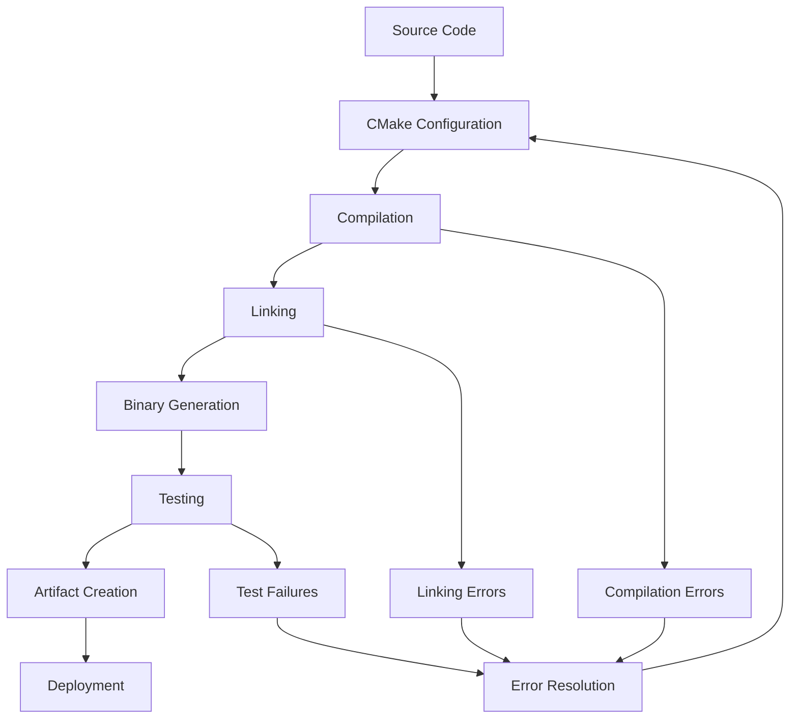

# BUILD SYSTEM SPECIFICATION - OHT-50 Master Module

**Phiên bản:** v1.0.0  
**Ngày tạo:** 2025-01-28  
**Team:** DevOps Team  
**Trạng thái:** ❌ FAILED (linker errors)  
**Mục tiêu:** Định nghĩa chi tiết yêu cầu kỹ thuật và chức năng của Build System

---

## 🎯 **TỔNG QUAN**

### **Mục tiêu:**
- Cung cấp reliable build system cho OHT-50 Master Module firmware
- Đảm bảo consistent build process across development environments
- Hỗ trợ multiple build configurations và target platforms
- Cung cấp automated testing và validation

### **Phạm vi:**
- CMake-based build system
- Cross-compilation support
- Automated testing integration
- Build artifact management
- Continuous Integration support

---

## 🔧 **KIẾN TRÚC KỸ THUẬT**

### **1. Build System Architecture**

#### **Build System Components:**
```
┌─────────────────────────────────────┐
│         Build Configuration         │
│     (CMakeLists.txt, Config)       │
├─────────────────────────────────────┤
│         CMake Build System          │
│     (Cross-compilation, Linking)   │
├─────────────────────────────────────┤
│         Toolchain Support           │
│     (GCC, Clang, ARM GCC)         │
├─────────────────────────────────────┤
│         Target Platform             │
│     (Orange Pi 5B, RK3588)        │
└─────────────────────────────────────┘
```

#### **Build Process Flow:**


### **2. Build Configuration Structure**

#### **2.1 CMake Configuration**
```cmake
# Main CMakeLists.txt Structure
cmake_minimum_required(VERSION 3.16)
project(OHT50_Firmware VERSION 1.0.0 LANGUAGES C)

# Build Configuration
set(CMAKE_BUILD_TYPE Release)
set(CMAKE_C_STANDARD 11)
set(CMAKE_C_STANDARD_REQUIRED ON)

# Target Platform Configuration
set(TARGET_PLATFORM "Orange Pi 5B")
set(TARGET_ARCH "aarch64")
set(TARGET_OS "Linux")

# Compiler Configuration
set(CMAKE_C_COMPILER aarch64-linux-gnu-gcc)
set(CMAKE_CXX_COMPILER aarch64-linux-gnu-g++)

# Build Options
option(BUILD_TESTS "Build test suite" ON)
option(BUILD_DOCS "Build documentation" OFF)
option(ENABLE_DEBUG "Enable debug symbols" OFF)
option(ENABLE_OPTIMIZATION "Enable optimization" ON)
```

#### **2.2 Directory Structure**
```
firmware_new/
├── CMakeLists.txt              # Main build configuration
├── src/
│   ├── CMakeLists.txt          # Source build configuration
│   ├── main.c                  # Main application entry
│   ├── app/
│   │   ├── CMakeLists.txt      # Application modules
│   │   ├── api/                # API layer
│   │   ├── core/               # Core functionality
│   │   ├── managers/           # Module managers
│   │   └── modules/            # Module handlers
│   ├── hal/
│   │   ├── CMakeLists.txt      # HAL layer
│   │   ├── common/             # Common HAL functions
│   │   ├── communication/      # Communication HAL
│   │   ├── gpio/               # GPIO HAL
│   │   ├── peripherals/        # Peripheral HAL
│   │   ├── safety/             # Safety HAL
│   │   └── storage/            # Storage HAL
│   └── utils/
│       └── CMakeLists.txt      # Utility functions
├── build/                      # Build output directory
├── tests/                      # Test suite
├── docs/                       # Documentation
└── scripts/                    # Build scripts
```

---

## 📋 **YÊU CẦU CHỨC NĂNG**

### **1. Build System Requirements**

#### **1.1 Compilation Support**
```cmake
# Compilation Configuration
set(CMAKE_C_FLAGS "${CMAKE_C_FLAGS} -Wall -Wextra -Werror")
set(CMAKE_C_FLAGS_DEBUG "-g -O0 -DDEBUG")
set(CMAKE_C_FLAGS_RELEASE "-O2 -DNDEBUG")

# Platform-specific Flags
if(TARGET_PLATFORM STREQUAL "Orange Pi 5B")
    set(CMAKE_C_FLAGS "${CMAKE_C_FLAGS} -mcpu=cortex-a76")
    set(CMAKE_C_FLAGS "${CMAKE_C_FLAGS} -march=armv8-a")
    set(CMAKE_C_FLAGS "${CMAKE_C_FLAGS} -mtune=cortex-a76")
endif()
```

#### **1.2 Linking Configuration**
```cmake
# Linking Configuration
set(CMAKE_EXE_LINKER_FLAGS "${CMAKE_EXE_LINKER_FLAGS} -Wl,--gc-sections")
set(CMAKE_EXE_LINKER_FLAGS "${CMAKE_EXE_LINKER_FLAGS} -Wl,--strip-all")

# Library Dependencies
find_package(Threads REQUIRED)
find_package(PkgConfig REQUIRED)

# System Libraries
pkg_check_modules(SYSTEMD REQUIRED libsystemd)
pkg_check_modules(JSON REQUIRED json-c)
pkg_check_modules(UDEV REQUIRED libudev)
```

#### **Yêu cầu:**
- ✅ **Cross-compilation:** Support ARM64 cross-compilation
- ✅ **Optimization:** Support multiple optimization levels
- ✅ **Debug Support:** Support debug symbols và debugging
- ✅ **Library Linking:** Proper library linking
- ✅ **Symbol Resolution:** Proper symbol resolution

### **2. Module Build Configuration**

#### **2.1 HAL Layer Build**
```cmake
# HAL Layer Configuration
add_library(hal_common STATIC
    src/hal/common/hal_common.c
    src/hal/common/hal_common.h
)

add_library(hal_communication STATIC
    src/hal/communication/hal_rs485.c
    src/hal/communication/hal_network.c
    src/hal/communication/hal_usb.c
)

add_library(hal_gpio STATIC
    src/hal/gpio/hal_gpio.c
    src/hal/gpio/hal_gpio.h
)

add_library(hal_peripherals STATIC
    src/hal/peripherals/hal_led.c
    src/hal/peripherals/hal_relay.c
    src/hal/peripherals/hal_lidar.c
)

add_library(hal_safety STATIC
    src/hal/safety/hal_estop.c
    src/hal/safety/hal_estop.h
)

add_library(hal_storage STATIC
    src/hal/storage/hal_config_persistence.c
    src/hal/storage/hal_config_persistence.h
)
```

#### **2.2 Application Layer Build**
```cmake
# Application Layer Configuration
add_library(app_api STATIC
    src/app/api/api_endpoints.c
    src/app/api/api_manager.c
    src/app/api/http_server_mock.c
)

add_library(app_core STATIC
    src/app/core/control_loop.c
    src/app/core/safety_monitor.c
    src/app/core/system_controller.c
    src/app/core/system_state_machine.c
)

add_library(app_managers STATIC
    src/app/managers/communication_manager.c
    src/app/managers/module_manager.c
    src/app/managers/safety_manager.c
    src/app/managers/telemetry_manager.c
)

add_library(app_modules STATIC
    src/app/modules/dock_module_handler.c
    src/app/modules/power_module_handler.c
    src/app/modules/safety_module_handler.c
    src/app/modules/travel_motor_module_handler.c
    src/app/modules/module_registry.c
)
```

#### **Yêu cầu:**
- ✅ **Modular Build:** Support modular compilation
- ✅ **Dependency Management:** Proper dependency resolution
- ✅ **Static Linking:** Support static library linking
- ✅ **Header Management:** Proper header file management
- ✅ **Symbol Export:** Proper symbol export/import

### **3. Testing Integration**

#### **3.1 Test Configuration**
```cmake
# Testing Configuration
if(BUILD_TESTS)
    enable_testing()
    
    # Unit Tests
    add_subdirectory(tests/unit)
    
    # Integration Tests
    add_subdirectory(tests/integration)
    
    # System Tests
    add_subdirectory(tests/system)
    
    # Mock Libraries
    add_library(test_mocks STATIC
        tests/mocks/mock_hal.c
        tests/mocks/mock_communication.c
        tests/mocks/mock_modules.c
    )
endif()
```

#### **3.2 Test Framework**
```cmake
# Test Framework Configuration
find_package(GTest REQUIRED)
find_package(CMocka REQUIRED)

# Test Targets
add_executable(unit_tests
    tests/unit/test_hal.c
    tests/unit/test_communication.c
    tests/unit/test_modules.c
)

target_link_libraries(unit_tests
    hal_common
    hal_communication
    app_managers
    test_mocks
    GTest::gtest
    GTest::gtest_main
    cmocka
)
```

#### **Yêu cầu:**
- ✅ **Unit Testing:** Support unit test compilation
- ✅ **Integration Testing:** Support integration tests
- ✅ **Mock Support:** Support mock libraries
- ✅ **Test Execution:** Automated test execution
- ✅ **Test Reporting:** Test result reporting

### **4. Build Artifact Management**

#### **4.1 Binary Generation**
```cmake
# Main Application Binary
add_executable(oht50_firmware
    src/main.c
)

target_link_libraries(oht50_firmware
    hal_common
    hal_communication
    hal_gpio
    hal_peripherals
    hal_safety
    hal_storage
    app_api
    app_core
    app_managers
    app_modules
    Threads::Threads
    ${SYSTEMD_LIBRARIES}
    ${JSON_LIBRARIES}
    ${UDEV_LIBRARIES}
)

# Binary Properties
set_target_properties(oht50_firmware PROPERTIES
    OUTPUT_NAME "oht50-firmware"
    RUNTIME_OUTPUT_DIRECTORY "${CMAKE_BINARY_DIR}/bin"
)
```

#### **4.2 Artifact Configuration**
```cmake
# Artifact Configuration
set(ARTIFACT_NAME "oht50-firmware-${PROJECT_VERSION}")
set(ARTIFACT_DIR "${CMAKE_BINARY_DIR}/artifacts")

# Install Configuration
install(TARGETS oht50_firmware
    RUNTIME DESTINATION bin
    LIBRARY DESTINATION lib
    ARCHIVE DESTINATION lib
)

# Package Configuration
set(CPACK_PACKAGE_NAME "OHT50-Firmware")
set(CPACK_PACKAGE_VERSION "${PROJECT_VERSION}")
set(CPACK_PACKAGE_DESCRIPTION "OHT-50 Master Module Firmware")
set(CPACK_GENERATOR "DEB;RPM")
```

#### **Yêu cầu:**
- ✅ **Binary Generation:** Generate executable binaries
- ✅ **Library Generation:** Generate static libraries
- ✅ **Installation:** Support installation process
- ✅ **Packaging:** Support package generation
- ✅ **Versioning:** Support version management

---

## 🔒 **YÊU CẦU AN TOÀN**

### **1. Build Security**
- ✅ **Code Signing:** Support code signing
- ✅ **Integrity Checking:** Build integrity verification
- ✅ **Dependency Validation:** Validate dependencies
- ✅ **Security Scanning:** Security vulnerability scanning
- ✅ **Audit Trail:** Build audit trail

### **2. Build Reliability**
- ✅ **Reproducible Builds:** Reproducible build process
- ✅ **Build Validation:** Build result validation
- ✅ **Error Handling:** Proper error handling
- ✅ **Recovery Procedures:** Build failure recovery
- ✅ **Backup Mechanisms:** Build artifact backup

### **3. Build Consistency**
- ✅ **Environment Consistency:** Consistent build environment
- ✅ **Toolchain Consistency:** Consistent toolchain usage
- ✅ **Configuration Consistency:** Consistent configuration
- ✅ **Output Consistency:** Consistent build outputs
- ✅ **Version Consistency:** Version consistency

---

## 📊 **YÊU CẦU HIỆU NĂNG**

### **1. Build Performance**
```cmake
# Performance Configuration
set(CMAKE_BUILD_PARALLEL_LEVEL 4)
set(CMAKE_C_FLAGS "${CMAKE_C_FLAGS} -pipe")

# Incremental Build Support
set(CMAKE_C_FLAGS "${CMAKE_C_FLAGS} -MMD -MP")

# Optimization Flags
set(CMAKE_C_FLAGS_RELEASE "${CMAKE_C_FLAGS_RELEASE} -O3 -flto")
set(CMAKE_EXE_LINKER_FLAGS_RELEASE "${CMAKE_EXE_LINKER_FLAGS_RELEASE} -flto")
```

### **2. Build Time Requirements**
- **Full Build:** < 5 minutes for clean build
- **Incremental Build:** < 30 seconds for incremental build
- **Test Compilation:** < 2 minutes for test compilation
- **Linking:** < 30 seconds for linking
- **Installation:** < 1 minute for installation

### **3. Resource Requirements**
- **Memory Usage:** < 2GB RAM during build
- **Disk Space:** < 1GB temporary space
- **CPU Usage:** Support parallel compilation
- **Network Usage:** Minimal network usage
- **Storage I/O:** Optimized I/O operations

---

## 🔧 **CONFIGURATION MANAGEMENT**

### **1. Build Configuration**
```cmake
# Build Configuration Options
option(BUILD_SHARED_LIBS "Build shared libraries" OFF)
option(BUILD_STATIC_LIBS "Build static libraries" ON)
option(ENABLE_WARNINGS "Enable compiler warnings" ON)
option(ENABLE_WERROR "Treat warnings as errors" ON)
option(ENABLE_COVERAGE "Enable code coverage" OFF)
option(ENABLE_SANITIZERS "Enable sanitizers" OFF)
```

### **2. Platform Configuration**
```cmake
# Platform Configuration
set(SUPPORTED_PLATFORMS "Orange Pi 5B;Raspberry Pi 4;Generic ARM64")
set(DEFAULT_PLATFORM "Orange Pi 5B")

# Platform-specific Configuration
if(TARGET_PLATFORM STREQUAL "Orange Pi 5B")
    set(PLATFORM_DEFINES "${PLATFORM_DEFINES} -DTARGET_ORANGE_PI_5B")
    set(PLATFORM_DEFINES "${PLATFORM_DEFINES} -DTARGET_RK3588")
elseif(TARGET_PLATFORM STREQUAL "Raspberry Pi 4")
    set(PLATFORM_DEFINES "${PLATFORM_DEFINES} -DTARGET_RASPBERRY_PI_4")
    set(PLATFORM_DEFINES "${PLATFORM_DEFINES} -DTARGET_BCM2711")
endif()
```

### **3. Toolchain Configuration**
```cmake
# Toolchain Configuration
set(CMAKE_SYSTEM_NAME Linux)
set(CMAKE_SYSTEM_PROCESSOR aarch64)

# Cross-compilation Toolchain
set(CMAKE_C_COMPILER aarch64-linux-gnu-gcc)
set(CMAKE_CXX_COMPILER aarch64-linux-gnu-g++)
set(CMAKE_STRIP aarch64-linux-gnu-strip)
set(CMAKE_AR aarch64-linux-gnu-ar)
set(CMAKE_RANLIB aarch64-linux-gnu-ranlib)

# Toolchain Path
set(TOOLCHAIN_PATH "/usr/bin")
set(CMAKE_FIND_ROOT_PATH "/usr/aarch64-linux-gnu")
```

---

## 🧪 **TESTING REQUIREMENTS**

### **1. Build Testing**
- ✅ **Configuration Testing:** Test build configurations
- ✅ **Dependency Testing:** Test dependency resolution
- ✅ **Compilation Testing:** Test compilation process
- ✅ **Linking Testing:** Test linking process
- ✅ **Installation Testing:** Test installation process

### **2. Integration Testing**
- ✅ **Toolchain Integration:** Test toolchain integration
- ✅ **Library Integration:** Test library integration
- ✅ **Platform Integration:** Test platform integration
- ✅ **System Integration:** Test system integration
- ✅ **CI/CD Integration:** Test CI/CD integration

### **3. Validation Testing**
- ✅ **Binary Validation:** Validate generated binaries
- ✅ **Symbol Validation:** Validate symbol resolution
- ✅ **Dependency Validation:** Validate dependencies
- ✅ **Performance Validation:** Validate build performance
- ✅ **Security Validation:** Validate build security

---

## 📚 **DOCUMENTATION REQUIREMENTS**

### **1. Build Documentation**
- ✅ **Build Instructions:** Complete build instructions
- ✅ **Configuration Guide:** Configuration guide
- ✅ **Troubleshooting Guide:** Troubleshooting guide
- ✅ **Platform Guide:** Platform-specific guide
- ✅ **Toolchain Guide:** Toolchain setup guide

### **2. API Documentation**
- ✅ **Build API:** Build system API documentation
- ✅ **Configuration API:** Configuration API documentation
- ✅ **Target API:** Target platform API documentation
- ✅ **Toolchain API:** Toolchain API documentation
- ✅ **Testing API:** Testing API documentation

### **3. Maintenance Documentation**
- ✅ **Maintenance Procedures:** Maintenance procedures
- ✅ **Update Procedures:** Update procedures
- ✅ **Migration Guide:** Migration guide
- ✅ **Version Guide:** Version management guide
- ✅ **Support Guide:** Support procedures

---

## 🔄 **MAINTENANCE & SUPPORT**

### **1. Version Management**
- ✅ **Version Control:** Proper version control
- ✅ **Backward Compatibility:** Maintain backward compatibility
- ✅ **Migration Guide:** Provide migration guides
- ✅ **Deprecation Policy:** Clear deprecation policy

### **2. Support Requirements**
- ✅ **Technical Support:** Technical support procedures
- ✅ **Bug Reporting:** Bug reporting procedures
- ✅ **Feature Requests:** Feature request procedures
- ✅ **Documentation Updates:** Documentation update procedures

---

## 📋 **IMPLEMENTATION STATUS**

### **✅ COMPLETED FEATURES:**
- ✅ CMake build system setup
- ✅ Basic compilation configuration
- ✅ HAL layer build configuration
- ✅ Application layer build configuration
- ✅ Module build configuration
- ✅ Basic testing integration
- ✅ Cross-compilation support
- ✅ Platform configuration
- ✅ Toolchain configuration

### **⚠️ PARTIALLY IMPLEMENTED:**
- ⚠️ Advanced build optimization
- ⚠️ Comprehensive testing
- ⚠️ Advanced artifact management
- ⚠️ Security features

### **❌ NOT IMPLEMENTED:**
- ❌ Advanced build analytics
- ❌ Performance profiling
- ❌ Advanced debugging tools
- ❌ Comprehensive documentation

---

## 🚨 **CURRENT ISSUES**

### **❌ LINKER ERRORS:**
- ❌ **Symbol Resolution:** Missing symbol definitions
- ❌ **Library Linking:** Library linking failures
- ❌ **Dependency Resolution:** Dependency resolution issues
- ❌ **Cross-compilation:** Cross-compilation issues
- ❌ **Platform Compatibility:** Platform compatibility issues

### **🔧 REQUIRED FIXES:**
1. **Symbol Resolution:** Fix missing symbol definitions
2. **Library Dependencies:** Resolve library dependencies
3. **Cross-compilation:** Fix cross-compilation issues
4. **Platform Support:** Fix platform compatibility
5. **Build Configuration:** Fix build configuration issues

---

## 🎯 **KẾT LUẬN**

### **Trạng thái hiện tại:** ❌ **FAILED (linker errors)**

**Điểm mạnh:**
- ✅ CMake build system setup
- ✅ Basic compilation configuration
- ✅ Modular build structure
- ✅ Cross-compilation support
- ✅ Platform configuration

**Cần khắc phục:**
- ❌ Linker errors
- ❌ Symbol resolution issues
- ❌ Library dependency issues
- ❌ Cross-compilation issues
- ❌ Platform compatibility issues

**Khuyến nghị:**
1. **Ưu tiên linker errors** - Fix all linker errors
2. **Dependency resolution** - Resolve library dependencies
3. **Cross-compilation** - Fix cross-compilation issues
4. **Testing** - Complete build testing

---

**📅 Next Review:** Sau khi khắc phục linker errors  
**👥 Responsible:** DevOps Team  
**📊 Success Metrics:** 100% build success, 0 linker errors, < 5min build time
