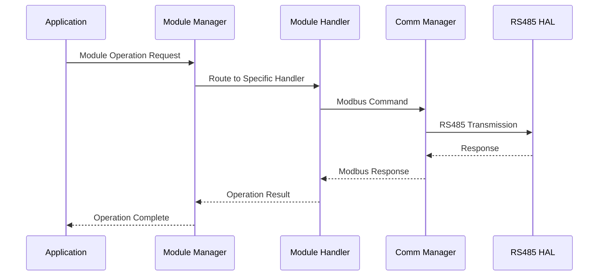

# MODULE MANAGEMENT SYSTEM SPECIFICATION - OHT-50 Master Module

**Phiên bản:** v1.0.0  
**Ngày tạo:** 2025-01-28  
**Team:** FW Team  
**Trạng thái:** ✅ IMPLEMENTED (cơ bản)  
**Mục tiêu:** Định nghĩa chi tiết yêu cầu kỹ thuật và chức năng của Module Management system

---

## 🎯 **TỔNG QUAN**

### **Mục tiêu:**
- Quản lý tổng thể tất cả slave modules trong hệ thống OHT-50
- Cung cấp unified interface cho module operations
- Đảm bảo reliable module communication và control
- Hỗ trợ module lifecycle management

### **Phạm vi:**
- Module lifecycle management
- Unified module interface
- Module coordination và synchronization
- Module state management
- Module communication management

---

## 🔧 **KIẾN TRÚC KỸ THUẬT**

### **1. Module Management Architecture**

#### **System Components:**
```
┌─────────────────────────────────────┐
│         Application Layer           │
│     (API, UI, Control Logic)       │
├─────────────────────────────────────┤
│         Module Manager              │
│     (Unified Module Interface)     │
├─────────────────────────────────────┤
│      Module Handlers                │
│  ┌─────────┬─────────┬─────────┐   │
│  │ Power   │ Safety  │ Motor   │   │
│  │ Module  │ Module  │ Module  │   │
│  └─────────┴─────────┴─────────┘   │
├─────────────────────────────────────┤
│      Communication Manager          │
│     (RS485/Modbus Interface)       │
├─────────────────────────────────────┤
│         RS485 HAL Layer             │
│     (Hardware Interface)           │
└─────────────────────────────────────┘
```

#### **Module Management Flow:**


### **2. Module Handler Architecture**

#### **2.1 Module Handler Types**
```c
// Module Handler Types
typedef enum {
    MODULE_HANDLER_POWER = 0,        // Power Module Handler
    MODULE_HANDLER_SAFETY,           // Safety Module Handler
    MODULE_HANDLER_TRAVEL_MOTOR,     // Travel Motor Handler
    MODULE_HANDLER_DOCK,             // Dock Module Handler
    MODULE_HANDLER_LIFTER_MOTOR,     // Lifter Motor Handler
    MODULE_HANDLER_CARGO_DOOR,       // Cargo Door Handler
    MODULE_HANDLER_SAFETY_EXTENDED,  // Extended Safety Handler
    MODULE_HANDLER_RFID_READER,      // RFID Reader Handler
    MODULE_HANDLER_CUSTOM,           // Custom Module Handler
    MODULE_HANDLER_MAX
} module_handler_type_t;
```

#### **2.2 Module Handler Interface**
```c
// Module Handler Interface
typedef struct {
    module_handler_type_t type;      // Handler type
    uint8_t module_id;               // Module ID
    bool initialized;                // Initialization status
    bool enabled;                    // Enable status
    uint64_t last_update_time;       // Last update timestamp
    
    // Handler functions
    hal_status_t (*init)(void *config);
    hal_status_t (*deinit)(void);
    hal_status_t (*update)(void);
    hal_status_t (*get_status)(void *status);
    hal_status_t (*get_data)(void *data);
    hal_status_t (*set_config)(void *config);
    hal_status_t (*get_config)(void *config);
    hal_status_t (*reset)(void);
    hal_status_t (*self_test)(void);
} module_handler_t;
```

---

## 📋 **YÊU CẦU CHỨC NĂNG**

### **1. Module Lifecycle Management**

#### **1.1 Module Initialization**
```c
// Module Initialization Process
typedef struct {
    uint8_t module_id;               // Module ID
    module_type_t module_type;       // Module type
    module_config_t config;          // Module configuration
    bool auto_initialize;            // Auto-initialize on discovery
    uint32_t init_timeout_ms;        // Initialization timeout
    uint32_t retry_count;            // Retry count
} module_init_config_t;
```

#### **1.2 Module Lifecycle States**
```c
// Module Lifecycle States
typedef enum {
    MODULE_STATE_UNKNOWN = 0,
    MODULE_STATE_DISCOVERED,         // Module discovered
    MODULE_STATE_INITIALIZING,       // Module initializing
    MODULE_STATE_INITIALIZED,        // Module initialized
    MODULE_STATE_ENABLED,            // Module enabled
    MODULE_STATE_DISABLED,           // Module disabled
    MODULE_STATE_ERROR,              // Module in error
    MODULE_STATE_FAULT,              // Module fault
    MODULE_STATE_OFFLINE,            // Module offline
    MODULE_STATE_MAINTENANCE         // Module in maintenance
} module_state_t;
```

#### **Yêu cầu:**
- ✅ **Auto-initialization:** Auto-initialize discovered modules
- ✅ **State Management:** Track module lifecycle states
- ✅ **Error Recovery:** Automatic error recovery
- ✅ **Configuration Management:** Load/save module configurations
- ✅ **Health Monitoring:** Monitor module health

### **2. Unified Module Interface**

#### **2.1 Common Module Operations**
```c
// Common Module Operations
hal_status_t module_manager_init(void);
hal_status_t module_manager_deinit(void);
hal_status_t module_manager_start(void);
hal_status_t module_manager_stop(void);

// Module Control
hal_status_t module_manager_enable_module(uint8_t module_id);
hal_status_t module_manager_disable_module(uint8_t module_id);
hal_status_t module_manager_reset_module(uint8_t module_id);
hal_status_t module_manager_self_test_module(uint8_t module_id);

// Module Information
hal_status_t module_manager_get_module_info(uint8_t module_id, module_info_t *info);
hal_status_t module_manager_get_module_status(uint8_t module_id, module_status_info_t *status);
hal_status_t module_manager_get_module_data(uint8_t module_id, void *data);
hal_status_t module_manager_set_module_config(uint8_t module_id, void *config);
hal_status_t module_manager_get_module_config(uint8_t module_id, void *config);
```

#### **2.2 Module-specific Operations**
```c
// Power Module Operations
hal_status_t power_module_get_battery_status(battery_status_t *status);
hal_status_t power_module_set_charging_config(charging_config_t *config);
hal_status_t power_module_control_outputs(output_control_t *control);

// Safety Module Operations
hal_status_t safety_module_get_safety_status(safety_status_t *status);
hal_status_t safety_module_set_safety_zones(safety_zones_t *zones);
hal_status_t safety_module_trigger_emergency_stop(void);

// Motor Module Operations
hal_status_t motor_module_set_speed(uint8_t motor_id, int16_t speed);
hal_status_t motor_module_set_position(uint8_t motor_id, uint16_t position);
hal_status_t motor_module_emergency_stop(uint8_t motor_id);

// Dock Module Operations
hal_status_t dock_module_start_docking(uint16_t target_position);
hal_status_t dock_module_stop_docking(void);
hal_status_t dock_module_get_dock_status(dock_status_t *status);
```

#### **Yêu cầu:**
- ✅ **Unified Interface:** Common interface for all modules
- ✅ **Type-specific Operations:** Module-specific operations
- ✅ **Error Handling:** Consistent error handling
- ✅ **Status Reporting:** Unified status reporting
- ✅ **Configuration Management:** Unified configuration management

### **3. Module Coordination & Synchronization**

#### **3.1 Module Coordination**
```c
// Module Coordination Configuration
typedef struct {
    bool enable_coordination;        // Enable module coordination
    uint32_t coordination_timeout_ms; // Coordination timeout
    uint8_t priority_level;          // Module priority level
    bool enable_synchronization;     // Enable synchronization
    uint32_t sync_interval_ms;       // Synchronization interval
} module_coordination_config_t;
```

#### **3.2 Module Synchronization**
```c
// Module Synchronization
hal_status_t module_manager_synchronize_modules(void);
hal_status_t module_manager_coordinate_operation(module_operation_t *operation);
hal_status_t module_manager_wait_for_modules(uint8_t *module_ids, uint32_t count, uint32_t timeout_ms);
hal_status_t module_manager_check_module_dependencies(uint8_t module_id, bool *dependencies_met);
```

#### **Yêu cầu:**
- ✅ **Operation Coordination:** Coordinate multi-module operations
- ✅ **Dependency Management:** Manage module dependencies
- ✅ **Synchronization:** Synchronize module states
- ✅ **Priority Management:** Manage module priorities
- ✅ **Timeout Handling:** Handle coordination timeouts

### **4. Module State Management**

#### **4.1 Module State Tracking**
```c
// Module State Information
typedef struct {
    module_state_t current_state;    // Current state
    module_state_t previous_state;   // Previous state
    uint64_t state_entry_time;       // State entry time
    uint32_t state_duration_ms;      // State duration
    uint32_t state_transition_count; // State transition count
    char state_message[256];         // State message
} module_state_info_t;
```

#### **4.2 State Transition Management**
```c
// State Transition Functions
hal_status_t module_manager_transition_state(uint8_t module_id, module_state_t new_state);
hal_status_t module_manager_get_state_history(uint8_t module_id, module_state_info_t *history, uint32_t max_count);
hal_status_t module_manager_validate_state_transition(uint8_t module_id, module_state_t new_state, bool *valid);
```

#### **Yêu cầu:**
- ✅ **State Tracking:** Track module state changes
- ✅ **State Validation:** Validate state transitions
- ✅ **State History:** Maintain state history
- ✅ **State Notifications:** Notify on state changes
- ✅ **State Recovery:** Automatic state recovery

---

## 🔒 **YÊU CẦU AN TOÀN**

### **1. Module Safety Management**
- ✅ **Safety Coordination:** Coordinate safety across modules
- ✅ **Emergency Procedures:** Emergency procedures for all modules
- ✅ **Safety Validation:** Validate safety requirements
- ✅ **Fault Isolation:** Isolate module faults
- ✅ **Safe Defaults:** Safe default configurations

### **2. Error Handling & Recovery**
- ✅ **Error Detection:** Detect module errors
- ✅ **Error Recovery:** Automatic error recovery
- ✅ **Error Propagation:** Prevent error propagation
- ✅ **Error Logging:** Log all module errors
- ✅ **Error Reporting:** Report errors to higher layers

### **3. Resource Management**
- ✅ **Memory Management:** Proper memory management
- ✅ **Resource Allocation:** Proper resource allocation
- ✅ **Resource Cleanup:** Proper resource cleanup
- ✅ **Resource Monitoring:** Monitor resource usage
- ✅ **Resource Limits:** Enforce resource limits

---

## 📊 **YÊU CẦU HIỆU NĂNG**

### **1. Performance Requirements**
```c
// Performance Requirements
#define MODULE_OPERATION_TIMEOUT_MS  1000    // Module operation timeout
#define MODULE_UPDATE_INTERVAL_MS    100     // Module update interval
#define MODULE_SYNC_TIMEOUT_MS       500     // Module synchronization timeout
#define MODULE_COORDINATION_TIMEOUT_MS 2000  // Module coordination timeout
#define MAX_CONCURRENT_OPERATIONS    10      // Maximum concurrent operations
```

### **2. Response Time Requirements**
- **Module Operation:** < 1000ms per operation
- **State Transition:** < 100ms per transition
- **Status Update:** < 100ms per update
- **Configuration Change:** < 500ms per change
- **Emergency Operation:** < 50ms emergency response

### **3. Reliability Requirements**
- **Module Availability:** 99.9% module availability
- **Operation Success Rate:** 99.5% operation success rate
- **Error Recovery Time:** < 5 seconds recovery time
- **Data Integrity:** 100% data integrity
- **Fault Tolerance:** Continue operation with degraded performance

---

## 🔧 **CONFIGURATION MANAGEMENT**

### **1. Module Configuration**
```c
// Module Configuration Structure
typedef struct {
    uint8_t module_id;               // Module ID
    module_type_t module_type;       // Module type
    module_config_t config;          // Module-specific configuration
    module_coordination_config_t coordination; // Coordination configuration
    bool auto_initialize;            // Auto-initialize flag
    bool auto_enable;                // Auto-enable flag
    uint32_t init_timeout_ms;        // Initialization timeout
    uint32_t operation_timeout_ms;   // Operation timeout
    uint32_t retry_count;            // Retry count
} module_management_config_t;
```

### **2. System Configuration**
```c
// System Configuration Structure
typedef struct {
    uint32_t max_modules;            // Maximum number of modules
    uint32_t update_interval_ms;     // Update interval
    uint32_t sync_interval_ms;       // Synchronization interval
    bool enable_coordination;        // Enable coordination
    bool enable_monitoring;          // Enable monitoring
    bool enable_logging;             // Enable logging
    uint32_t log_level;              // Log level
} system_config_t;
```

### **3. Configuration Persistence**
- ✅ **Configuration Storage:** Persistent configuration storage
- ✅ **Configuration Loading:** Load configuration on startup
- ✅ **Configuration Validation:** Validate configuration data
- ✅ **Configuration Backup:** Backup configuration data
- ✅ **Configuration Versioning:** Version configuration data

---

## 🧪 **TESTING REQUIREMENTS**

### **1. Unit Testing**
- ✅ **Module Handler Testing:** Test all module handlers
- ✅ **State Management Testing:** Test state management
- ✅ **Coordination Testing:** Test module coordination
- ✅ **Error Handling Testing:** Test error handling

### **2. Integration Testing**
- ✅ **Multi-module Testing:** Test with multiple modules
- ✅ **System Integration:** Test system integration
- ✅ **Performance Testing:** Test performance requirements
- ✅ **Stress Testing:** Test under load conditions

### **3. Validation Testing**
- ✅ **Safety Testing:** Test safety requirements
- ✅ **Reliability Testing:** Test long-term reliability
- ✅ **Compliance Testing:** Test compliance requirements
- ✅ **Interoperability Testing:** Test interoperability

---

## 📚 **DOCUMENTATION REQUIREMENTS**

### **1. API Documentation**
- ✅ **Function Documentation:** Complete function documentation
- ✅ **Parameter Documentation:** Parameter descriptions
- ✅ **Return Value Documentation:** Return value descriptions
- ✅ **Error Code Documentation:** Error code descriptions

### **2. Usage Examples**
- ✅ **Basic Usage:** Basic usage examples
- ✅ **Advanced Usage:** Advanced usage examples
- ✅ **Error Handling:** Error handling examples
- ✅ **Best Practices:** Best practices documentation

### **3. Troubleshooting Guide**
- ✅ **Common Issues:** Common issues và solutions
- ✅ **Debug Procedures:** Debug procedures
- ✅ **Performance Tuning:** Performance tuning guide
- ✅ **Maintenance Procedures:** Maintenance procedures

---

## 🔄 **MAINTENANCE & SUPPORT**

### **1. Version Management**
- ✅ **Version Control:** Proper version control
- ✅ **Backward Compatibility:** Maintain backward compatibility
- ✅ **Migration Guide:** Provide migration guides
- ✅ **Deprecation Policy:** Clear deprecation policy

### **2. Support Requirements**
- ✅ **Technical Support:** Technical support procedures
- ✅ **Bug Reporting:** Bug reporting procedures
- ✅ **Feature Requests:** Feature request procedures
- ✅ **Documentation Updates:** Documentation update procedures

---

## 📋 **IMPLEMENTATION STATUS**

### **✅ COMPLETED FEATURES:**
- ✅ Module lifecycle management
- ✅ Unified module interface
- ✅ Module state management
- ✅ Basic module coordination
- ✅ Error handling và recovery
- ✅ Configuration management
- ✅ Thread-safe operations
- ✅ Event handling system
- ✅ Statistics collection
- ✅ Health monitoring

### **⚠️ PARTIALLY IMPLEMENTED:**
- ⚠️ Advanced module coordination
- ⚠️ Performance optimization
- ⚠️ Comprehensive testing
- ⚠️ Advanced monitoring

### **❌ NOT IMPLEMENTED:**
- ❌ Advanced analytics
- ❌ Performance profiling
- ❌ Advanced debugging tools
- ❌ Comprehensive documentation

---

## 🎯 **KẾT LUẬN**

### **Trạng thái hiện tại:** ✅ **IMPLEMENTED (cơ bản)**

**Điểm mạnh:**
- ✅ Core module management functionality
- ✅ Unified module interface
- ✅ State management system
- ✅ Error handling và recovery
- ✅ Thread-safe implementation

**Cần cải thiện:**
- ⚠️ Advanced module coordination
- ⚠️ Performance optimization
- ⚠️ Comprehensive testing
- ⚠️ Advanced monitoring

**Khuyến nghị:**
1. **Ưu tiên testing** - Complete comprehensive testing
2. **Performance optimization** - Optimize module operations
3. **Advanced coordination** - Add advanced coordination features
4. **Documentation** - Complete API documentation

---

**📅 Next Review:** Sau khi hoàn thành testing phase  
**👥 Responsible:** FW Team  
**📊 Success Metrics:** 100% test coverage, < 1000ms operation time, 99.9% reliability
