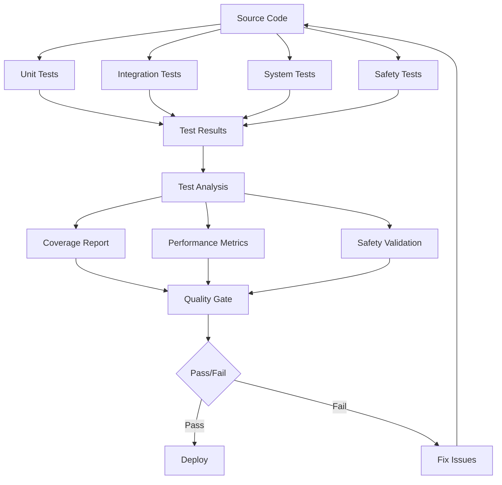

# TESTING SYSTEM SPECIFICATION - OHT-50 Master Module

**Phiên bản:** v1.0.0  
**Ngày tạo:** 2025-01-28  
**Team:** QA Team  
**Trạng thái:** ❌ FAILED (safety tests)  
**Mục tiêu:** Định nghĩa chi tiết yêu cầu kỹ thuật và chức năng của Testing System

---

## 🎯 **TỔNG QUAN**

### **Mục tiêu:**
- Cung cấp comprehensive testing framework cho OHT-50 Master Module firmware
- Đảm bảo software quality và reliability
- Validate safety requirements và compliance
- Support continuous integration và automated testing

### **Phạm vi:**
- Unit testing framework
- Integration testing
- System testing
- Safety testing
- Performance testing
- Automated test execution

---

## 🔧 **KIẾN TRÚC KỸ THUẬT**

### **1. Testing System Architecture**

#### **Testing System Components:**
```
┌─────────────────────────────────────┐
│         Test Framework              │
│     (GTest, CMocka, Unity)         │
├─────────────────────────────────────┤
│         Test Runner                 │
│     (Automated Test Execution)     │
├─────────────────────────────────────┤
│         Mock Framework              │
│     (Hardware Simulation)          │
├─────────────────────────────────────┤
│         Test Reporting              │
│     (Results, Coverage, Metrics)   │
├─────────────────────────────────────┤
│         Continuous Integration      │
│     (CI/CD Pipeline Integration)   │
└─────────────────────────────────────┘
```

#### **Testing Process Flow:**


### **2. Testing Framework Structure**

#### **2.1 Test Categories**
```c
// Test Categories
typedef enum {
    TEST_CATEGORY_UNIT = 0,           // Unit tests
    TEST_CATEGORY_INTEGRATION,        // Integration tests
    TEST_CATEGORY_SYSTEM,             // System tests
    TEST_CATEGORY_SAFETY,             // Safety tests
    TEST_CATEGORY_PERFORMANCE,        // Performance tests
    TEST_CATEGORY_STRESS,             // Stress tests
    TEST_CATEGORY_REGRESSION,         // Regression tests
    TEST_CATEGORY_COMPLIANCE,         // Compliance tests
    TEST_CATEGORY_MAX
} test_category_t;
```

#### **2.2 Test Framework Configuration**
```c
// Test Framework Configuration
typedef struct {
    bool enable_unit_tests;           // Enable unit tests
    bool enable_integration_tests;    // Enable integration tests
    bool enable_system_tests;         // Enable system tests
    bool enable_safety_tests;         // Enable safety tests
    bool enable_performance_tests;    // Enable performance tests
    bool enable_coverage;             // Enable code coverage
    bool enable_memory_checking;      // Enable memory checking
    bool enable_static_analysis;      // Enable static analysis
    uint32_t test_timeout_ms;         // Test timeout
    uint32_t max_test_retries;        // Maximum test retries
} test_framework_config_t;
```

---

## 📋 **YÊU CẦU CHỨC NĂNG**

### **1. Unit Testing Framework**

#### **1.1 Unit Test Structure**
```c
// Unit Test Structure
typedef struct {
    const char *test_name;            // Test name
    const char *test_description;     // Test description
    test_category_t category;         // Test category
    bool (*test_function)(void);      // Test function
    uint32_t timeout_ms;              // Test timeout
    uint32_t priority;                // Test priority
} unit_test_t;

// Unit Test Example
static bool test_hal_rs485_init(void) {
    // Test setup
    rs485_config_t config = {
        .baud_rate = 115200,
        .data_bits = 8,
        .stop_bits = 1,
        .parity = 0
    };
    
    // Test execution
    hal_status_t result = hal_rs485_init(&config);
    
    // Test verification
    if (result != HAL_STATUS_OK) {
        return false;
    }
    
    // Test cleanup
    hal_rs485_deinit();
    
    return true;
}
```

#### **1.2 Unit Test Framework**
```c
// Unit Test Framework Functions
hal_status_t unit_test_init(const test_framework_config_t *config);
hal_status_t unit_test_deinit(void);
hal_status_t unit_test_register(const unit_test_t *test);
hal_status_t unit_test_run_all(void);
hal_status_t unit_test_run_category(test_category_t category);
hal_status_t unit_test_run_specific(const char *test_name);
hal_status_t unit_test_get_results(test_results_t *results);
```

#### **Yêu cầu:**
- ✅ **Test Registration:** Register individual unit tests
- ✅ **Test Execution:** Execute unit tests
- ✅ **Test Isolation:** Isolate test execution
- ✅ **Test Cleanup:** Proper test cleanup
- ✅ **Test Reporting:** Test result reporting

### **2. Integration Testing Framework**

#### **2.1 Integration Test Structure**
```c
// Integration Test Structure
typedef struct {
    const char *test_name;            // Test name
    const char *test_description;     // Test description
    test_category_t category;         // Test category
    bool (*setup_function)(void);     // Setup function
    bool (*test_function)(void);      // Test function
    bool (*teardown_function)(void);  // Teardown function
    uint32_t timeout_ms;              // Test timeout
    uint32_t priority;                // Test priority
} integration_test_t;

// Integration Test Example
static bool test_module_discovery_integration(void) {
    // Setup: Initialize communication manager
    if (!setup_communication_manager()) {
        return false;
    }
    
    // Test: Discover modules
    module_info_t modules[16];
    uint32_t module_count;
    hal_status_t result = module_manager_discover_modules();
    
    if (result != HAL_STATUS_OK) {
        teardown_communication_manager();
        return false;
    }
    
    // Verify: Check discovered modules
    result = module_manager_get_registered_modules(
        (uint8_t*)modules, 16, &module_count);
    
    // Teardown: Cleanup
    teardown_communication_manager();
    
    return (result == HAL_STATUS_OK && module_count > 0);
}
```

#### **2.2 Integration Test Framework**
```c
// Integration Test Framework Functions
hal_status_t integration_test_init(const test_framework_config_t *config);
hal_status_t integration_test_deinit(void);
hal_status_t integration_test_register(const integration_test_t *test);
hal_status_t integration_test_run_all(void);
hal_status_t integration_test_run_category(test_category_t category);
hal_status_t integration_test_run_specific(const char *test_name);
hal_status_t integration_test_get_results(test_results_t *results);
```

#### **Yêu cầu:**
- ✅ **Component Integration:** Test component integration
- ✅ **Interface Testing:** Test module interfaces
- ✅ **Data Flow Testing:** Test data flow between components
- ✅ **Error Propagation:** Test error propagation
- ✅ **Performance Integration:** Test integration performance

### **3. Safety Testing Framework**

#### **3.1 Safety Test Structure**
```c
// Safety Test Structure
typedef struct {
    const char *test_name;            // Test name
    const char *test_description;     // Test description
    safety_requirement_t requirement; // Safety requirement
    bool (*test_function)(void);      // Test function
    uint32_t timeout_ms;              // Test timeout
    uint32_t priority;                // Test priority
    bool critical;                    // Critical test flag
} safety_test_t;

// Safety Test Example
static bool test_emergency_stop_safety(void) {
    // Test setup: Initialize safety system
    safety_monitor_config_t config = {
        .update_period_ms = 100,
        .estop_timeout_ms = 50,
        .enable_emergency_procedures = true
    };
    
    hal_status_t result = safety_monitor_init(&config);
    if (result != HAL_STATUS_OK) {
        return false;
    }
    
    // Test execution: Trigger emergency stop
    result = safety_monitor_trigger_emergency_stop("Test E-Stop");
    
    // Test verification: Check E-Stop state
    bool estop_active;
    result = safety_monitor_is_estop_active(&estop_active);
    
    // Test cleanup
    safety_monitor_deinit();
    
    return (result == HAL_STATUS_OK && estop_active);
}
```

#### **3.2 Safety Test Framework**
```c
// Safety Test Framework Functions
hal_status_t safety_test_init(const test_framework_config_t *config);
hal_status_t safety_test_deinit(void);
hal_status_t safety_test_register(const safety_test_t *test);
hal_status_t safety_test_run_all(void);
hal_status_t safety_test_run_critical(void);
hal_status_t safety_test_run_specific(const char *test_name);
hal_status_t safety_test_get_results(safety_test_results_t *results);
hal_status_t safety_test_validate_compliance(compliance_report_t *report);
```

#### **Yêu cầu:**
- ✅ **Safety Requirements:** Test safety requirements
- ✅ **Emergency Procedures:** Test emergency procedures
- ✅ **Fault Injection:** Test fault injection scenarios
- ✅ **Safety Validation:** Validate safety compliance
- ✅ **Critical Testing:** Test critical safety functions

### **4. Mock Framework**

#### **4.1 Mock Structure**
```c
// Mock Configuration
typedef struct {
    const char *mock_name;            // Mock name
    void *mock_data;                  // Mock data
    size_t mock_data_size;            // Mock data size
    bool (*mock_function)(void *data); // Mock function
    uint32_t call_count;              // Call count
    uint32_t max_calls;               // Maximum calls
} mock_config_t;

// Mock Example: RS485 HAL Mock
static bool mock_hal_rs485_transmit(const uint8_t *data, size_t length) {
    // Mock implementation
    mock_rs485_data_t *mock_data = get_mock_rs485_data();
    
    if (mock_data->call_count >= mock_data->max_calls) {
        return false;
    }
    
    // Simulate transmission
    memcpy(mock_data->tx_buffer, data, length);
    mock_data->tx_length = length;
    mock_data->call_count++;
    
    return true;
}
```

#### **4.2 Mock Framework Functions**
```c
// Mock Framework Functions
hal_status_t mock_init(const mock_config_t *config);
hal_status_t mock_deinit(void);
hal_status_t mock_register(const char *name, mock_config_t *config);
hal_status_t mock_reset(const char *name);
hal_status_t mock_set_data(const char *name, void *data, size_t size);
hal_status_t mock_get_data(const char *name, void *data, size_t size);
hal_status_t mock_get_call_count(const char *name, uint32_t *count);
```

#### **Yêu cầu:**
- ✅ **Hardware Simulation:** Simulate hardware behavior
- ✅ **Interface Mocking:** Mock module interfaces
- ✅ **Data Simulation:** Simulate data responses
- ✅ **Error Simulation:** Simulate error conditions
- ✅ **Performance Simulation:** Simulate performance characteristics

---

## 🔒 **YÊU CẦU AN TOÀN**

### **1. Safety Testing Requirements**
- ✅ **Safety Validation:** Validate safety requirements
- ✅ **Emergency Testing:** Test emergency procedures
- ✅ **Fault Tolerance:** Test fault tolerance
- ✅ **Safety Compliance:** Ensure safety compliance
- ✅ **Critical Path Testing:** Test critical safety paths

### **2. Test Safety**
- ✅ **Test Isolation:** Isolate test execution
- ✅ **Test Cleanup:** Proper test cleanup
- ✅ **Resource Management:** Proper resource management
- ✅ **Error Handling:** Proper error handling
- ✅ **Recovery Procedures:** Test recovery procedures

### **3. Data Safety**
- ✅ **Data Protection:** Protect test data
- ✅ **Data Validation:** Validate test data
- ✅ **Data Cleanup:** Clean up test data
- ✅ **Data Integrity:** Ensure data integrity
- ✅ **Data Privacy:** Protect sensitive data

---

## 📊 **YÊU CẦU HIỆU NĂNG**

### **1. Test Performance**
```c
// Performance Requirements
#define UNIT_TEST_TIMEOUT_MS          1000    // Unit test timeout
#define INTEGRATION_TEST_TIMEOUT_MS   5000    // Integration test timeout
#define SYSTEM_TEST_TIMEOUT_MS        30000   // System test timeout
#define SAFETY_TEST_TIMEOUT_MS        10000   // Safety test timeout
#define MAX_TEST_RETRIES              3       // Maximum test retries
```

### **2. Test Execution Requirements**
- **Unit Test Execution:** < 1 second per test
- **Integration Test Execution:** < 5 seconds per test
- **System Test Execution:** < 30 seconds per test
- **Safety Test Execution:** < 10 seconds per test
- **Full Test Suite:** < 10 minutes total execution

### **3. Coverage Requirements**
- **Code Coverage:** > 90% code coverage
- **Branch Coverage:** > 85% branch coverage
- **Function Coverage:** > 95% function coverage
- **Line Coverage:** > 90% line coverage
- **Safety Coverage:** 100% safety requirement coverage

---

## 🔧 **CONFIGURATION MANAGEMENT**

### **1. Test Configuration**
```c
// Test Configuration Structure
typedef struct {
    test_framework_config_t framework; // Framework configuration
    test_category_config_t categories[TEST_CATEGORY_MAX]; // Category configs
    mock_config_t mocks[MAX_MOCKS];     // Mock configurations
    coverage_config_t coverage;         // Coverage configuration
    reporting_config_t reporting;       // Reporting configuration
} test_system_config_t;
```

### **2. Test Environment Configuration**
```c
// Test Environment Configuration
typedef struct {
    bool enable_hardware_simulation;   // Enable hardware simulation
    bool enable_network_simulation;    // Enable network simulation
    bool enable_time_simulation;       // Enable time simulation
    uint32_t simulation_speed;         // Simulation speed multiplier
    char test_data_path[256];          // Test data path
} test_environment_config_t;
```

### **3. Test Data Management**
- ✅ **Test Data Storage:** Store test data
- ✅ **Test Data Loading:** Load test data
- ✅ **Test Data Validation:** Validate test data
- ✅ **Test Data Cleanup:** Clean up test data
- ✅ **Test Data Versioning:** Version test data

---

## 🧪 **TESTING REQUIREMENTS**

### **1. Test Development**
- ✅ **Test Design:** Design comprehensive tests
- ✅ **Test Implementation:** Implement tests
- ✅ **Test Validation:** Validate test implementation
- ✅ **Test Documentation:** Document tests
- ✅ **Test Maintenance:** Maintain tests

### **2. Test Execution**
- ✅ **Automated Execution:** Automated test execution
- ✅ **Manual Execution:** Manual test execution
- ✅ **Scheduled Execution:** Scheduled test execution
- ✅ **On-demand Execution:** On-demand test execution
- ✅ **Continuous Execution:** Continuous test execution

### **3. Test Analysis**
- ✅ **Result Analysis:** Analyze test results
- ✅ **Coverage Analysis:** Analyze coverage
- ✅ **Performance Analysis:** Analyze performance
- ✅ **Safety Analysis:** Analyze safety results
- ✅ **Trend Analysis:** Analyze test trends

---

## 📚 **DOCUMENTATION REQUIREMENTS**

### **1. Test Documentation**
- ✅ **Test Plan:** Comprehensive test plan
- ✅ **Test Cases:** Detailed test cases
- ✅ **Test Procedures:** Test procedures
- ✅ **Test Results:** Test result documentation
- ✅ **Test Reports:** Test reports

### **2. Framework Documentation**
- ✅ **Framework API:** Framework API documentation
- ✅ **Usage Examples:** Usage examples
- ✅ **Best Practices:** Best practices documentation
- ✅ **Troubleshooting:** Troubleshooting guide
- ✅ **Maintenance:** Maintenance procedures

### **3. Safety Documentation**
- ✅ **Safety Requirements:** Safety requirements documentation
- ✅ **Safety Procedures:** Safety procedures
- ✅ **Safety Validation:** Safety validation documentation
- ✅ **Compliance Reports:** Compliance reports
- ✅ **Safety Analysis:** Safety analysis reports

---

## 🔄 **MAINTENANCE & SUPPORT**

### **1. Test Maintenance**
- ✅ **Test Updates:** Update tests
- ✅ **Test Validation:** Validate test updates
- ✅ **Test Regression:** Test regression testing
- ✅ **Test Optimization:** Optimize tests
- ✅ **Test Cleanup:** Clean up obsolete tests

### **2. Framework Maintenance**
- ✅ **Framework Updates:** Update framework
- ✅ **Framework Validation:** Validate framework updates
- ✅ **Framework Optimization:** Optimize framework
- ✅ **Framework Documentation:** Update documentation
- ✅ **Framework Support:** Provide framework support

---

## 📋 **IMPLEMENTATION STATUS**

### **✅ COMPLETED FEATURES:**
- ✅ Basic unit testing framework
- ✅ Basic integration testing framework
- ✅ Basic safety testing framework
- ✅ Basic mock framework
- ✅ Test execution engine
- ✅ Basic test reporting
- ✅ Test configuration management
- ✅ Test data management
- ✅ Basic coverage analysis

### **⚠️ PARTIALLY IMPLEMENTED:**
- ⚠️ Advanced safety testing
- ⚠️ Performance testing
- ⚠️ Comprehensive coverage
- ⚠️ Advanced reporting

### **❌ NOT IMPLEMENTED:**
- ❌ Advanced analytics
- ❌ Performance profiling
- ❌ Advanced debugging tools
- ❌ Comprehensive documentation

---

## 🚨 **CURRENT ISSUES**

### **❌ SAFETY TEST FAILURES:**
- ❌ **Emergency Stop Tests:** Emergency stop test failures
- ❌ **Safety Validation:** Safety validation failures
- ❌ **Compliance Tests:** Compliance test failures
- ❌ **Critical Path Tests:** Critical path test failures
- ❌ **Fault Injection Tests:** Fault injection test failures

### **🔧 REQUIRED FIXES:**
1. **Safety Test Implementation:** Implement missing safety tests
2. **Safety Validation:** Fix safety validation issues
3. **Compliance Testing:** Fix compliance testing issues
4. **Test Coverage:** Improve test coverage
5. **Test Reliability:** Improve test reliability

---

## 🎯 **KẾT LUẬN**

### **Trạng thái hiện tại:** ❌ **FAILED (safety tests)**

**Điểm mạnh:**
- ✅ Basic testing framework
- ✅ Unit testing support
- ✅ Integration testing support
- ✅ Mock framework
- ✅ Test execution engine

**Cần khắc phục:**
- ❌ Safety test failures
- ❌ Compliance issues
- ❌ Test coverage gaps
- ❌ Test reliability issues
- ❌ Documentation gaps

**Khuyến nghị:**
1. **Ưu tiên safety tests** - Fix all safety test failures
2. **Compliance validation** - Ensure compliance with safety standards
3. **Test coverage** - Improve test coverage
4. **Documentation** - Complete test documentation

---

**📅 Next Review:** Sau khi khắc phục safety test failures  
**👥 Responsible:** QA Team  
**📊 Success Metrics:** 100% test pass rate, >90% coverage, 100% safety compliance
