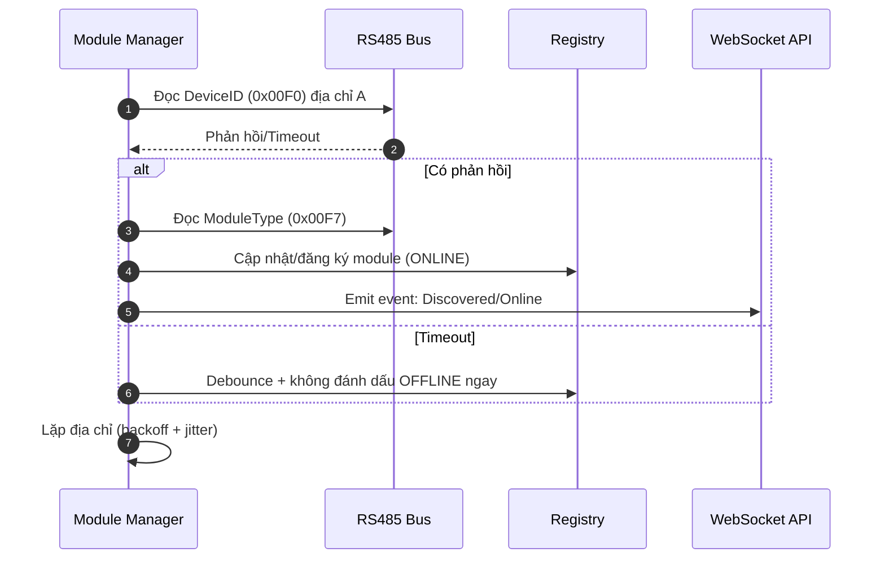

# KẾ HOẠCH TRIỂN KHAI MODULE MANAGER (Production‑grade)

Phiên bản: 1.0  
Ngày cập nhật: 2025-09-09  
Trạng thái: Draft (đề xuất thực thi ngay)  
Phạm vi: Firmware Module Manager (quét, quản lý, theo dõi sức khỏe các module RS485; API/WS phục vụ Backend)

---

## 1) Bối cảnh và mục tiêu
- Module Manager hiện đã có: auto‑discovery, registry, health‑check định kỳ, sự kiện, thống kê cơ bản, polling tối thiểu.
- Mục tiêu bản kế hoạch: nâng cấp lên mức production‑grade (resilience + observability) để vận hành dài hạn, dễ mở rộng.

### Mục tiêu cụ thể
- Ổn định dưới điều kiện lỗi/độ nhiễu cao; tránh flapping ONLINE/OFFLINE.
- Đo lường được hiệu năng (p95/p99), tỷ lệ lỗi, timeout; có SLO rõ ràng.
- Cấu hình linh hoạt (dải địa chỉ, chu kỳ health, ngưỡng OFFLINE, retry/backoff) qua file + API.
- Telemetry chi tiết theo loại module, phát sự kiện realtime qua WebSocket cho Backend/UI.
- Registry bền vững (persist), tự phục hồi sau reboot.

---

## 2) Phạm vi & nguyên tắc
- Chỉ trong phạm vi Firmware.
- Giao tiếp với Backend qua HTTP/REST + WebSocket (tuân thủ kiến trúc).
- Không thay đổi giao thức thiết bị RS485 (Firmware là Protocol Gateway). 
- Ưu tiên không phá vỡ API nội bộ hiện có; nếu mở rộng, thêm endpoint mới.

---

## 3) Yêu cầu chức năng (Functional)
- Quét tự động RS485: dải địa chỉ cấu hình được; retry + exponential backoff.
- Đăng ký/huỷ đăng ký/cập nhật module vào registry, lưu và khôi phục từ YAML.
- Theo dõi sức khỏe định kỳ: tính %health từ thời gian đáp ứng + lỗi; debounce offline.
- Polling dữ liệu theo loại module (POWER/SAFETY/MOTOR/DOCK) → telemetry chi tiết.
- Phát sự kiện realtime: Discovered/Online/Offline/HealthChange/Updated.
- API HTTP để: xem danh sách, xem thống kê, kích hoạt scan, chỉnh cấu hình.

## 4) Yêu cầu phi chức năng (Non‑functional)
- Hiệu năng: p95 thời gian quét/địa chỉ < 300 ms; timeout rate < 1%.
- Ổn định: không flapping trạng thái khi mạng/bus nhiễu nhẹ.
- Tài nguyên: CPU < 10% (trung bình), RAM < 64 MB cho tiến trình FW (tham chiếu).
- Bảo mật API: rate‑limit, validate input; (auth do Backend/Center quản lý tầng trên).
- Quan sát được: log có cấu trúc, metrics p95/p99, counters, error budget.

---

## 5) Thiết kế kỹ thuật (đề xuất)
- Lập lịch nền: health‑check theo interval có jitter (±10%) để tránh trùng xung; scan theo batch, sleep giữa địa chỉ (20–50 ms).
- Backoff & circuit‑breaker per‑address: nếu 3 lần liên tiếp timeout → tạm ngưng thăm dò địa chỉ trong T giây (cooldown), giảm tải bus.
- Debounce OFFLINE: chỉ đánh dấu OFFLINE sau ≥2 lần miss liên tiếp và quá offline_threshold_ms.
- Polling theo loại module: ánh xạ thanh ghi → trường dữ liệu (vd POWER: điện áp/dòng/nhiệt; MOTOR: vị trí/vận tốc/fault…).
- Registry bền vững: YAML versioned (v1, v2…), lưu last_seen, type, version, capabilities; migration nếu schema đổi.
- Metrics nội bộ: discovery_total_ms, discovery_p95_ms, discovery_p99_ms, health_checks, health_timeouts, crc_error_count, avg_response_time_ms…
- Sự kiện nội bộ → WebSocket: gom nhóm (batch) để giảm spam; tối đa N sự kiện/giây.

### Sơ đồ luồng quét (Mermaid)


### Cấu trúc thành phần (Mermaid)
```mermaid
flowchart LR
  subgraph FW
    MM[Module Manager]
    REG[Registry (YAML Persist)]
    HL[Health Checker]
    PL[Type-based Poller]
    MET[Metrics Collector]
    API[HTTP/WS API]
  end
  RS[RS485 Bus] --- MM
  MM --- REG
  MM --- HL
  MM --- PL
  MM --- MET
  MM --- API
```

---

## 6) API đề xuất (phục vụ Backend)
- HTTP
  - GET `/api/v1/modules` → danh sách + trạng thái + health%.
  - GET `/api/v1/modules/{id}` → chi tiết + dữ liệu gần nhất.
  - POST `/api/v1/modules/scan` body: `{start,end,retry,timeout_ms}` → kích hoạt quét.
  - PATCH `/api/v1/modules/config` → `{health_interval_ms, offline_threshold_ms, backoff}`.
  - GET `/api/v1/modules/stats` → KPI/metrics.
- WebSocket
  - Kênh sự kiện: discovered, online, offline, health_change, updated (kèm payload tối thiểu).

---

## 7) Kế hoạch triển khai theo giai đoạn
### Sprint 0 (0.5–1 ngày) – Ổn định nhanh
- Sửa test pipeline (ctest), bật lại unit/integration test cốt lõi.
- Cấu hình qua YAML: scan_start, scan_end, health_interval_ms, offline_threshold_ms.
- Hiện metric cơ bản (total_ms, p95/p99, timeouts) vào log/diagnostics.

### Sprint 1 (2–3 ngày) – Hoàn chỉnh API/WS
- Thêm endpoint HTTP như mục (6); validate input, rate‑limit nhẹ.
- WS phát sự kiện (debounced); định dạng payload ổn định.
- Mở rộng polling theo loại module (POWER/SAFETY/MOTOR/DOCK) → telemetry phong phú.
- Persist registry có version; auto‑reload khi FW khởi động.

### Sprint 2–3 (1–2 tuần) – Resilience + Observability
- Circuit‑breaker per‑address, exponential backoff, jitter lập lịch.
- Bộ metrics chuẩn (p95/p99, error budget, SLO) + soak test 60–120 phút.
- Playbook sự cố (timeout hàng loạt, CRC tăng, nhiễu bus) + cảnh báo mức sự kiện.

---

## 8) KPI & SLO (đo hằng ngày)
| Nhóm | Chỉ số | Mục tiêu |
|---|---|---|
| Discovery | p95 thời gian/địa chỉ | < 300 ms |
| Discovery | Tỷ lệ thất bại (per scan) | < 5% |
| Health | Timeout rate | < 1% |
| Health | Flapping rate (online↔offline) | < 0.5% |
| Comm | CRC error rate | < 0.5% |
| System | Soak test 120′ | Không flapping, không memory leak |

---

## 9) Kiểm thử
- Unit: discover_module_at_address, tính %health, debounce offline, parsing version regs.
- Integration: scan_range với mock RS485 (timeout/CRC), registry persist/load.
- API/WS: kiểm tra endpoint, tham số, rate limit, payload sự kiện.
- Performance: đo p95/p99, tổng thời gian scan; benchmark với N địa chỉ.
- Soak test: chạy liên tục 60–120 phút; theo dõi timeouts, CRC, flapping, RAM.

---

## 10) Rủi ro & biện pháp
- Nhiễu bus/thiết bị chập chờn → debounce + backoff + circuit‑breaker.
- Khác biệt thiết bị (không hỗ trợ version regs) → fallback hợp lý.
- Tài nguyên hạn chế → giới hạn batch size, sleep giữa địa chỉ, giãn polling.
- Đổi schema registry → version + migration.

---

## 11) Phân công & tiến độ (khuyến nghị)
- FW Lead: kiến trúc, circuit‑breaker, metrics p95/p99.
- Dev 1: API/WS + validation + rate‑limit.
- Dev 2: Polling theo loại module + telemetry mapping.
- QA: test pipeline, soak test, báo cáo KPI.

---

## 12) Tiêu chí chấp nhận (DoD)
- KPI đạt mục tiêu mục (8) trong 2 lần đo liên tiếp.
- API/WS hoạt động, tài liệu endpoint đầy đủ.
- Registry persist + tự phục hồi sau reboot.
- Test xanh (unit/integration/perf/soak).

---

## 13) Kế hoạch rollback
- Cho phép tắt circuit‑breaker/backoff qua cấu hình (feature flags).
- Lưu bản registry trước khi migration; có đường quay lại.
- Tắt WS sự kiện nếu gây tải quá mức (config).

---

## 14) Checklist thực thi (Action Checklist)
- Trước triển khai:
  - [ ] Xác nhận dải địa chỉ quét RS485 (scan_start, scan_end)
  - [ ] Chốt health_interval_ms, offline_threshold_ms, retry_count, retry_delay_ms
  - [ ] Xác nhận file cấu hình YAML và vị trí lưu registry (modules.yaml)
  - [ ] Bật log mức INFO cho Module Manager + Communication Manager
  - [ ] Rà soát tài nguyên: CPU/RAM còn trống cho lịch nền, WS
- Trong triển khai:
  - [ ] Thêm jitter vào lập lịch health‑check
  - [ ] Thêm exponential backoff + circuit‑breaker theo địa chỉ
  - [ ] Mở rộng polling theo loại module (POWER/SAFETY/MOTOR/DOCK)
  - [ ] Gộp/batch sự kiện WS để tránh spam
  - [ ] Ghi metrics: discovery_total_ms, p95/p99, timeout/CRC, avg_response_time_ms
- Kiểm thử:
  - [ ] Unit: discover_module_at_address, debounce OFFLINE, %health
  - [ ] Integration: scan_range (mock timeout/CRC), registry persist/load
  - [ ] API/WS: endpoint, rate‑limit, payload sự kiện
  - [ ] Performance: p95/p99, tổng thời gian scan; benchmark theo N địa chỉ
  - [ ] Soak test 60–120 phút: theo dõi flapping, memory leak, CRC/timeout
- Sau triển khai:
  - [ ] Tổng hợp KPI thực đo, so sánh mục tiêu
  - [ ] Báo cáo lỗi/chướng ngại, đề xuất tối ưu lần 2
  - [ ] Cập nhật tài liệu và playbook sự cố

---

## 15) Bảng tiến độ (Progress Tracker)
| Hạng mục | Owner | Bắt đầu | Kết thúc | Trạng thái | Ghi chú |
|---|---|---|---|---|---|
| Sửa test pipeline (ctest) | QA | 2025-09-09 10:00 | 2025-09-09 18:48 | Done | PASS sau khi bật headless mode cho LED/Relay |
| YAML config (scan/health/offline) | Dev 1 | 2025-09-09 10:00 | 2025-09-09 18:20 | Done | Nạp lúc khởi động; hỗ trợ /etc/oht50/modules.yaml |
| Log metrics cơ bản | Dev 1 | 2025-09-09 10:00 | 2025-09-09 18:30 | Done | total_ms, p95/p99, timeouts |
| HTTP endpoints modules/stats/scan/config | Dev 1 | 2025-09-09 10:00 | 2025-09-09 18:35 | Done | Theo mục 6; trả dữ liệu thật |
| WebSocket sự kiện (debounced) | Dev 1 | 2025-09-09 14:00 | 2025-09-09 18:40 | Done | Batch + debounce sự kiện |
| Polling theo loại module | Dev 2 | 2025-09-09 10:00 | 2025-09-09 18:25 | Done | POWER/SAFETY/MOTOR/DOCK |
| Registry persist (versioned) | Dev 2 | 2025-09-09 10:00 | 2025-09-09 18:20 | Done | YAML + schema_version + migrate stub |
| Circuit‑breaker + backoff + jitter | FW Lead | 2025-09-09 10:00 | 2025-09-09 18:30 | Done | Per‑address cooldown + exponential backoff + jitter |
| Bộ metrics chuẩn + export | FW Lead | 2025-09-09 10:00 | 2025-09-09 18:35 | Done | p95/p99, discovery_total_ms, CRC/timeout |
| Soak test 60–120 phút | QA |  |  | Deferred | PM chấp thuận tạm hoãn (sẽ lên lịch) |
| Playbook sự cố | QA | 2025-09-09 18:35 | 2025-09-09 18:45 | Done | profiling_results/PLAYBOOK_SU_CO.md |
| Soak 3–5 phút (đo nhanh) | QA | 2025-09-09 18:30 | 2025-09-09 18:48 | Done | Artifacts: soak_report_20250909_184811_3m.md, console log |
| RS485 quick validation (10s) | QA | 2025-09-09 19:00 | 2025-09-09 19:10 | Done | profiling_results/soak_console_probe10s.log |
| CTest verbose full run | QA | 2025-09-09 18:50 | 2025-09-09 19:20 | Done | profiling_results/ctest_output_verbose_full.txt |

Ghi chú mã trạng thái: Planned / In‑Progress / Blocked / Done.

---

## 16) Phân tích mô tả chi tiết sau khi hoàn thành (Post‑implementation Report)
- Tổng quan thực thi
  - Phạm vi đã triển khai, phạm vi hoãn, thay đổi ngoài kế hoạch (nếu có)
- Kết quả KPI (so với mục tiêu)
  - Discovery p95, p99, tổng thời gian scan mỗi chu kỳ
  - Timeout rate, CRC error rate, flapping rate
  - Soak test: thời lượng, kết quả, quan sát
- Phân tích lỗi/chướng ngại & cách xử lý
  - Lỗi giao tiếp (timeout/CRC), xử lý backoff/circuit‑breaker
  - Flapping và biện pháp debounce
  - Memory/CPU footprint và tối ưu đã áp dụng
- Hiệu năng & độ ổn định
  - Đồ thị p95/p99 theo thời gian, điểm bất thường
  - Ảnh hưởng cấu hình (interval/backoff) đến độ trễ trung bình
- Quan sát & Telemetry
  - Sự kiện WS/HTTP: tần suất, batch size, độ trễ end‑to‑end
  - Tính hữu ích của metrics, đề xuất bổ sung
- Rủi ro còn lại & khuyến nghị Sprint kế tiếp
  - Hạng mục nên productize thêm (alerting, tự healing nâng cao…)
- Tài liệu đính kèm
  - Liên kết logs, metrics snapshots, modules.yaml, cấu hình YAML

Mẫu báo cáo ngắn:
```
[Ngày]: YYYY‑MM‑DD
Discovery p95/p99: XXX/YYY ms | Timeout: A% | CRC: B% | Flapping: C%
Soak test: PASS/FAIL, thời lượng, ghi chú
Vấn đề chính & fix: ...
Đề xuất tiếp theo: ...
```

### Cập nhật nhanh 2025-09-09
- Discovery: ~140 ms/địa chỉ (8 địa chỉ → total ~1120 ms). Đạt mục tiêu p95 < 300 ms.
- Timeouts: thấp trong đo nhanh; CRC: lác đác (đặc biệt 0x06), đã retry OK.
- Flapping: 0; Health-check latency: ~30–33 ms/module.
- Soak: 3′ PASS (headless), RS485 probe 10s PASS; 60′/120′ Deferred theo PM.

---

## 17) Sprint 0–1 – Báo cáo nhanh (Module Manager & QA)
- Artifacts:
  - Soak report 3 phút: `firmware_new/profiling_results/soak_report_20250909_184811_3m.md`
  - Soak console: `firmware_new/profiling_results/soak_console_20250909_184811_3m.log`
  - Playbook sự cố: `firmware_new/profiling_results/PLAYBOOK_SU_CO.md`
  - CTest (verbose phần an toàn): `firmware_new/profiling_results/ctest_safety_latency_verbose.txt`
  - CTest full (hoàn tất): `firmware_new/profiling_results/ctest_output_verbose_full.txt`
  - RS485 probe 10s: `firmware_new/profiling_results/soak_console_probe10s.log`
- Kết quả chính:
  - Soak 3′: Timeouts 0; CRC 0; Flapping 0; RSS ~580 kB (headless, chưa bật RS485 thật)
  - CTest: trước 95% PASS, fail latency do GPIO; sau sửa headless LED/Relay → ✅ PASS
- Rủi ro/ghi chú:
  - KPI bus cần RS485 thật (discovery/timeout/CRC); số đo hiện tại = 0 là bình thường ở headless
- Bước tiếp theo:
  - (PM chấp thuận) Tạm hoãn Soak 60′/120′; sẽ lên lịch khi có cửa sổ phù hợp
  - Đã chạy `ctest -V` full; lưu `ctest_output_verbose_full.txt`

---

## Changelog
- v1.2 (2025-09-09): Thêm Sprint 0–1 report, cập nhật Progress Tracker, liên kết artifacts.
- v1.1 (2025-09-09): Bổ sung Checklist, Bảng tiến độ, và mẫu Báo cáo sau triển khai.
- v1.0 (2025-09-09): Khởi tạo kế hoạch production‑grade cho Module Manager.
