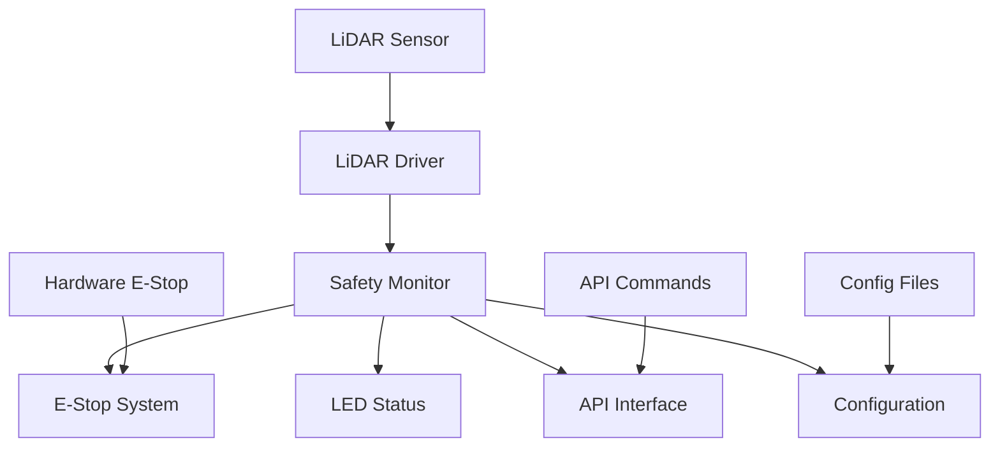
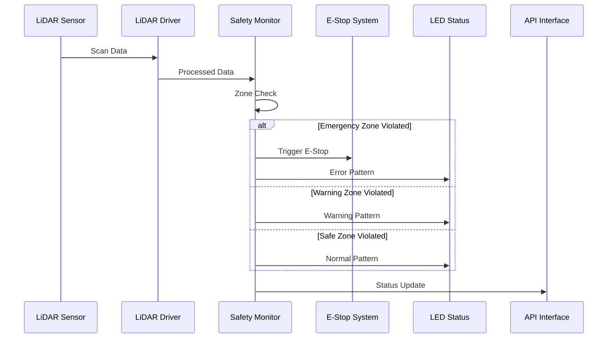

# LiDAR Safety Integration Guide

**Phiên bản:** 1.0.0  
**Ngày cập nhật:** 2025-01-28  
**Module:** LiDAR Safety Integration  
**Team:** FIRMWARE  
**Task:** LIDAR Safety Integration

---

## 📋 **TỔNG QUAN**

LiDAR Safety Integration Guide mô tả cách tích hợp LiDAR sensor với safety system của OHT-50 Master Module để cung cấp real-time proximity detection và safety zone monitoring.

---

## 🎯 **MỤC TIÊU**

### **Primary Objectives**
- ✅ **Real-time Safety Monitoring:** LiDAR-based proximity detection
- ✅ **3-Zone Safety System:** Emergency, Warning, Safe zones
- ✅ **E-Stop Integration:** Automatic E-Stop khi emergency zone violated
- ✅ **LED Status Feedback:** Visual indication cho safety states
- ✅ **Configuration Management:** Flexible zone configuration

### **Safety Requirements**
- **Emergency Zone:** < 500mm - Immediate E-Stop
- **Warning Zone:** < 1000mm - Reduce speed, warning indication
- **Safe Zone:** < 2000mm - Normal operation, monitoring
- **Response Time:** < 100ms cho E-Stop trigger
- **Reliability:** 99.9% uptime cho safety monitoring

---

## 🔧 **ARCHITECTURE OVERVIEW**

### **System Architecture**


### **Data Flow**


---

## 📁 **FILE STRUCTURE**

### **Core Files**
```
firmware_new/src/app/core/
├── safety_monitor.h          # Safety monitor header
├── safety_monitor.c          # Safety monitor implementation
└── lidar_driver.h           # LiDAR driver interface

firmware_new/src/hal/
├── peripherals/
│   ├── hal_led.h            # LED control
│   └── hal_led.c
├── safety/
│   ├── hal_estop.h          # E-Stop control
│   └── hal_estop.c
└── storage/
    ├── hal_config_persistence.h  # Configuration storage
    └── hal_config_persistence.c

firmware_new/src/app/api/
├── api_endpoints.h          # API endpoints
├── api_endpoints.c          # API implementation
└── api_manager.c            # API routing

firmware_new/docs/
├── LIDAR_SAFETY_INTEGRATION_PLAN.md
├── SAFETY_MONITOR_API_REFERENCE.md
├── LIDAR_SAFETY_INTEGRATION_GUIDE.md
└── SAFETY_CONFIGURATION_GUIDE.md
```

---

## 🔌 **INTEGRATION STEPS**

### **Step 1: LiDAR Driver Integration**
```c
// Initialize LiDAR driver
hal_status_t status = lidar_driver_init();
if (status != HAL_STATUS_OK) {
    printf("Failed to initialize LiDAR driver\n");
    return status;
}

// Configure LiDAR parameters
lidar_config_t config = {
    .baud_rate = 460800,
    .scan_frequency = 10,  // 10Hz
    .angle_resolution = 1, // 1 degree
    .range_min = 50,       // 50mm
    .range_max = 5000      // 5000mm
};
lidar_driver_set_config(&config);
```

### **Step 2: Safety Monitor Initialization**
```c
// Initialize safety monitor
status = safety_monitor_init();
if (status != HAL_STATUS_OK) {
    printf("Failed to initialize safety monitor\n");
    return status;
}

// Set safety zones
basic_safety_zones_t zones = {
    .enabled = true,
    .emergency_zone_mm = 500,  // 500mm
    .warning_zone_mm = 1000,   // 1000mm
    .safe_zone_mm = 2000       // 2000mm
};
safety_monitor_set_basic_zones(&zones);
```

### **Step 3: Main Loop Integration**
```c
// Main safety monitoring loop
while (running) {
    // Get LiDAR scan data
    lidar_scan_data_t scan_data;
    status = lidar_driver_get_scan_data(&scan_data);
    
    if (status == HAL_STATUS_OK) {
        // Update safety monitor with LiDAR data
        safety_monitor_update_with_lidar(&scan_data);
    } else {
        // Fallback to basic safety monitoring
        safety_monitor_update();
    }
    
    // Update LED status
    hal_led_update();
    
    // Sleep for 50ms (20Hz update rate)
    usleep(50000);
}
```

---

## 🚨 **SAFETY ZONES CONFIGURATION**

### **Zone Definitions**
```c
typedef struct {
    bool enabled;                    // Enable/disable zones
    uint16_t emergency_zone_mm;      // Emergency zone (500mm)
    uint16_t warning_zone_mm;        // Warning zone (1000mm)
    uint16_t safe_zone_mm;           // Safe zone (2000mm)
    uint16_t min_distance_mm;        // Current min distance
    uint16_t min_distance_angle;     // Angle of min distance
    bool emergency_violated;         // Emergency zone violated
    bool warning_violated;           // Warning zone violated
    bool safe_violated;              // Safe zone violated
    uint64_t last_violation_time;    // Last violation timestamp
} basic_safety_zones_t;
```

### **Zone Behavior**
| Zone | Distance | Action | LED Pattern |
|------|----------|--------|-------------|
| **Emergency** | < 500mm | E-Stop | Error LED fast blink |
| **Warning** | < 1000mm | Reduce speed | System LED fast blink |
| **Safe** | < 2000mm | Monitor | Normal operation |
| **Clear** | > 2000mm | Normal | All LEDs solid |

---

## 🔧 **CONFIGURATION MANAGEMENT**

### **JSON Configuration Format**
```json
{
  "safety_config": {
    "version": "1.0.0",
    "timestamp": 1234567890,
    "safety_zones": {
      "enabled": true,
      "emergency_zone_mm": 500,
      "warning_zone_mm": 1000,
      "safe_zone_mm": 2000
    },
    "monitor_config": {
      "estop_timeout_ms": 100,
      "zone_check_period_ms": 50,
      "interlock_check_period_ms": 100,
      "sensor_check_period_ms": 200,
      "watchdog_timeout_ms": 1000,
      "enable_zone_monitoring": true,
      "enable_interlock_monitoring": true,
      "enable_sensor_monitoring": true,
      "enable_watchdog_monitoring": true
    }
  }
}
```

### **Configuration API Endpoints**
```
GET  /api/v1/safety/config          # Get current config
PUT  /api/v1/safety/config          # Update config
GET  /api/v1/safety/config/export   # Export config file
POST /api/v1/safety/config/import   # Import config file
POST /api/v1/safety/config/reset    # Reset to factory defaults
```

---

## 🎨 **LED STATUS INDICATION**

### **LED Pattern Mapping**
```c
// Safe State
hal_led_power_set(LED_STATE_ON);      // Green solid
hal_led_system_set(LED_STATE_ON);     // Blue solid
hal_led_comm_set(LED_STATE_ON);       // Yellow solid
hal_led_network_set(LED_STATE_ON);    // Green solid
hal_led_error_set(LED_STATE_OFF);     // Red off

// Warning State
hal_led_power_set(LED_STATE_ON);      // Green solid
hal_led_system_set(LED_STATE_BLINK_FAST); // Blue fast blink
hal_led_comm_set(LED_STATE_BLINK_SLOW);   // Yellow slow blink
hal_led_network_set(LED_STATE_ON);    // Green solid
hal_led_error_set(LED_STATE_OFF);     // Red off

// E-Stop State
hal_led_power_set(LED_STATE_ON);      // Green solid
hal_led_system_set(LED_STATE_OFF);    // Blue off
hal_led_comm_set(LED_STATE_OFF);      // Yellow off
hal_led_network_set(LED_STATE_OFF);   // Green off
hal_led_error_set(LED_STATE_BLINK_FAST); // Red fast blink
```

---

## 🔌 **API INTEGRATION**

### **Safety Status API**
```bash
# Get safety status
curl -X GET "http://localhost:8000/api/v1/safety/status"

# Response
{
  "estop_active": false,
  "safety_ok": true,
  "safety_level": 0,
  "safety_message": "System safe",
  "last_safety_check": 1234567890,
  "current_state": "SAFE",
  "safety_zones": {
    "enabled": true,
    "emergency_zone_mm": 500,
    "warning_zone_mm": 1000,
    "safe_zone_mm": 2000,
    "min_distance_mm": 1500,
    "emergency_violated": false,
    "warning_violated": false,
    "safe_violated": false
  },
  "violation_count": 0,
  "fault_count": 0
}
```

### **Safety Zones API**
```bash
# Get zones configuration
curl -X GET "http://localhost:8000/api/v1/safety/zones"

# Update zones configuration
curl -X PUT "http://localhost:8000/api/v1/safety/zones" \
  -H "Content-Type: application/json" \
  -d '{
    "enabled": true,
    "emergency_zone_mm": 400,
    "warning_zone_mm": 800,
    "safe_zone_mm": 1500
  }'
```

---

## ⚠️ **TROUBLESHOOTING**

### **Common Issues**

#### **1. LiDAR Connection Issues**
```bash
# Check LiDAR device
ls -la /dev/ttyUSB0

# Check permissions
sudo chmod 666 /dev/ttyUSB0

# Test LiDAR communication
lidar_test_communication
```

#### **2. Safety Monitor Not Initializing**
```bash
# Check HAL components
hal_led_init
hal_estop_init
hal_config_init

# Check safety monitor status
safety_monitor_get_status
```

#### **3. Zone Violations Not Detected**
```bash
# Check LiDAR data
lidar_get_scan_data

# Check zone configuration
safety_monitor_get_basic_zones

# Test zone calculation
safety_monitor_test_zones
```

#### **4. E-Stop Not Triggering**
```bash
# Check E-Stop hardware
hal_estop_get_status

# Check software E-Stop
safety_monitor_is_estop_active

# Test E-Stop trigger
safety_monitor_trigger_emergency_stop "Test"
```

### **Debug Commands**
```bash
# Enable debug mode
export SAFETY_DEBUG=1

# Check safety monitor logs
tail -f /var/log/safety_monitor.log

# Monitor safety status
watch -n 1 'curl -s http://localhost:8000/api/v1/safety/status | jq'
```

---

## 🔒 **SAFETY VALIDATION**

### **Safety Checklist**
- [ ] **LiDAR Sensor:** Connected và calibrated
- [ ] **Safety Zones:** Properly configured
- [ ] **E-Stop System:** Hardware và software working
- [ ] **LED Indicators:** All LEDs functional
- [ ] **API Interface:** All endpoints responding
- [ ] **Configuration:** Valid và saved
- [ ] **Response Time:** < 100ms cho E-Stop
- [ ] **Error Handling:** Proper fallback mechanisms

### **Validation Tests**
```bash
# Test 1: Zone Violation Detection
# Move object vào emergency zone
# Verify E-Stop triggered

# Test 2: LED Pattern Changes
# Trigger different safety states
# Verify LED patterns correct

# Test 3: API Response
# Call all safety APIs
# Verify responses correct

# Test 4: Configuration Persistence
# Change configuration
# Restart system
# Verify configuration preserved
```

---

## 📊 **PERFORMANCE METRICS**

### **Key Performance Indicators**
- **Response Time:** < 100ms cho E-Stop trigger
- **Update Rate:** 20Hz safety monitoring
- **Accuracy:** ±10mm distance measurement
- **Reliability:** 99.9% uptime
- **False Positives:** < 0.1%
- **False Negatives:** 0% (critical safety)

### **Monitoring Commands**
```bash
# Monitor performance
safety_monitor_get_statistics

# Check response times
safety_monitor_benchmark

# Monitor resource usage
top -p $(pgrep safety_monitor)
```

---

## 🔄 **MAINTENANCE**

### **Regular Maintenance**
- **Daily:** Check LED indicators
- **Weekly:** Validate zone configuration
- **Monthly:** Test E-Stop functionality
- **Quarterly:** Calibrate LiDAR sensor
- **Annually:** Full safety system validation

### **Backup Procedures**
```bash
# Backup configuration
safety_monitor_export_config_json > backup_config.json

# Restore configuration
safety_monitor_import_config_json < backup_config.json

# Factory reset
safety_monitor_reset_config_to_factory
```

---

**Changelog v1.0:**
- ✅ Created comprehensive integration guide
- ✅ Added architecture overview
- ✅ Added step-by-step integration instructions
- ✅ Added configuration management guide
- ✅ Added troubleshooting section
- ✅ Added safety validation checklist
- ✅ Added performance metrics
- ✅ Added maintenance procedures

**🚨 Lưu ý:** Luôn tuân thủ safety procedures và validation checklist trước khi deploy.
