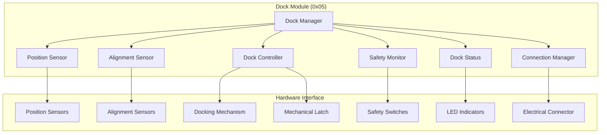

# Dock Module Specification - OHT-50 Master Module (Phiên bản 1.0)

**Phiên bản:** v1.0  
**Ngày tạo:** 2025-01-28  
**Team:** FW Team  
**Trạng thái:** 🚢 PRODUCTION READY

---

## 🎯 **TỔNG QUAN DOCK MODULE**

### **Module Information:**
- **Address:** 0x05
- **Type:** MODULE_TYPE_DOCK
- **Function:** Docking system control và management
- **Protocol:** Modbus RTU
- **Baudrate:** 115200 bps

### **Mục tiêu:**
- Điều khiển hệ thống docking tự động
- Position sensing và alignment
- Docking mechanism control
- Safety monitoring và protection
- Docking status management

---

## 🚢 **DOCK MODULE ARCHITECTURE**

### **Module Structure:**


---

## 📊 **DOCK MODULE REGISTERS**

### **Modbus Register Map:**
```c
// Dock Module Register Map (0x05)
#define DOCK_REG_STATUS              0x0000  // Module status
#define DOCK_REG_DOCK_STATUS         0x0001  // Docking status
#define DOCK_REG_POSITION_X          0x0002  // Position X (mm)
#define DOCK_REG_POSITION_Y          0x0003  // Position Y (mm)
#define DOCK_REG_POSITION_Z          0x0004  // Position Z (mm)
#define DOCK_REG_ALIGNMENT_X         0x0005  // Alignment X (mm)
#define DOCK_REG_ALIGNMENT_Y         0x0006  // Alignment Y (mm)
#define DOCK_REG_ALIGNMENT_Z         0x0007  // Alignment Z (mm)
#define DOCK_REG_CONNECTION_STATUS   0x0008  // Connection status
#define DOCK_REG_LATCH_STATUS        0x0009  // Latch status
#define DOCK_REG_SAFETY_STATUS       0x000A  // Safety status
#define DOCK_REG_DOCKING_FORCE       0x000B  // Docking force (N)
#define DOCK_REG_DOCKING_SPEED       0x000C  // Docking speed (mm/s)
#define DOCK_REG_FAULT_STATUS        0x000D  // Fault status
#define DOCK_REG_FAULT_CODE          0x000E  // Fault code
#define DOCK_REG_DOCKING_MODE        0x000F  // Docking mode
#define DOCK_REG_UPTIME              0x0010  // Module uptime (hours)
#define DOCK_REG_VERSION             0x0011  // Firmware version
```

### **Register Data Types:**
```c
// Dock Module Data Types
typedef struct {
    uint16_t status;              // Module status
    uint8_t dock_status;          // Docking status
    int16_t position_x;           // Position X (0.1mm resolution)
    int16_t position_y;           // Position Y (0.1mm resolution)
    int16_t position_z;           // Position Z (0.1mm resolution)
    int16_t alignment_x;          // Alignment X (0.1mm resolution)
    int16_t alignment_y;          // Alignment Y (0.1mm resolution)
    int16_t alignment_z;          // Alignment Z (0.1mm resolution)
    uint8_t connection_status;    // Connection status
    uint8_t latch_status;         // Latch status
    uint8_t safety_status;        // Safety status
    uint16_t docking_force;       // Docking force (0.1N resolution)
    uint16_t docking_speed;       // Docking speed (0.1mm/s resolution)
    uint16_t fault_status;        // Fault status
    uint16_t fault_code;          // Fault code
    uint8_t docking_mode;         // Docking mode
    uint32_t uptime;              // Uptime (hours)
    uint32_t version;             // Firmware version
} dock_module_data_t;
```

---

## 🔧 **DOCK MODULE COMMANDS**

### **Command Set:**
```c
// Dock Module Commands
#define DOCK_CMD_GET_STATUS          0x01    // Get module status
#define DOCK_CMD_GET_POSITION        0x02    // Get position
#define DOCK_CMD_GET_ALIGNMENT       0x03    // Get alignment
#define DOCK_CMD_GET_CONNECTION      0x04    // Get connection status
#define DOCK_CMD_GET_LATCH           0x05    // Get latch status
#define DOCK_CMD_GET_SAFETY          0x06    // Get safety status
#define DOCK_CMD_GET_FAULTS          0x07    // Get fault status
#define DOCK_CMD_START_DOCKING       0x08    // Start docking sequence
#define DOCK_CMD_STOP_DOCKING        0x09    // Stop docking sequence
#define DOCK_CMD_UNDOCK              0x0A    // Start undocking sequence
#define DOCK_CMD_SET_DOCKING_MODE    0x0B    // Set docking mode
#define DOCK_CMD_SET_DOCKING_SPEED   0x0C    // Set docking speed
#define DOCK_CMD_SET_DOCKING_FORCE   0x0D    // Set docking force
#define DOCK_CMD_RESET_FAULTS        0x0E    // Reset faults
#define DOCK_CMD_CALIBRATE           0x0F    // Calibrate sensors
#define DOCK_CMD_UPDATE_FIRMWARE     0x10    // Update firmware
#define DOCK_CMD_GET_CONFIG          0x11    // Get configuration
#define DOCK_CMD_SET_CONFIG          0x12    // Set configuration
```

### **Command Structure:**
```c
// Dock Module Command
typedef struct {
    uint8_t address;           // Module address (0x05)
    uint8_t command;           // Command code
    uint16_t data_length;      // Data length
    uint8_t data[32];          // Command data
    uint16_t crc;              // CRC checksum
} dock_module_command_t;

// Dock Module Response
typedef struct {
    uint8_t address;           // Module address (0x05)
    uint8_t command;           // Command code
    uint8_t status;            // Response status
    uint16_t data_length;      // Data length
    uint8_t data[32];          // Response data
    uint16_t crc;              // CRC checksum
} dock_module_response_t;
```

---

## ⚠️ **DOCK MODULE FAULTS**

### **Fault Types:**
```c
// Dock Module Fault Codes
typedef enum {
    DOCK_FAULT_NONE = 0x0000,               // No fault
    DOCK_FAULT_POSITION_SENSOR = 0x0001,   // Position sensor fault
    DOCK_FAULT_ALIGNMENT_SENSOR = 0x0002,  // Alignment sensor fault
    DOCK_FAULT_DOCKING_MECHANISM = 0x0003, // Docking mechanism fault
    DOCK_FAULT_LATCH_FAULT = 0x0004,       // Latch fault
    DOCK_FAULT_CONNECTION_FAULT = 0x0005,  // Connection fault
    DOCK_FAULT_SAFETY_FAULT = 0x0006,      // Safety fault
    DOCK_FAULT_OVERCURRENT = 0x0007,       // Overcurrent
    DOCK_FAULT_OVERVOLTAGE = 0x0008,       // Overvoltage
    DOCK_FAULT_UNDERVOLTAGE = 0x0009,      // Undervoltage
    DOCK_FAULT_OVERTEMPERATURE = 0x000A,   // Overtemperature
    DOCK_FAULT_MISALIGNMENT = 0x000B,      // Misalignment
    DOCK_FAULT_TIMEOUT = 0x000C,           // Docking timeout
    DOCK_FAULT_COMMUNICATION = 0x000D,     // Communication fault
    DOCK_FAULT_CALIBRATION = 0x000E,       // Calibration fault
    DOCK_FAULT_FIRMWARE = 0x000F,          // Firmware fault
    DOCK_FAULT_HARDWARE = 0x0010,          // Hardware fault
    DOCK_FAULT_WATCHDOG = 0x0011,          // Watchdog timeout
    DOCK_FAULT_UNKNOWN = 0x00FF            // Unknown fault
} dock_fault_code_t;
```

### **Fault Handling:**
```c
// Fault Handling Functions
int dock_fault_detect(void);
int dock_fault_handle(dock_fault_code_t fault_code);
int dock_fault_clear(void);
int dock_fault_get_status(dock_fault_code_t *fault_code);
int dock_fault_get_history(dock_fault_code_t *faults, uint8_t *count);
```

---

## 🎛️ **DOCKING MODES**

### **Docking Modes:**
```c
// Docking Modes
typedef enum {
    DOCK_MODE_DISABLED = 0x00,      // Docking disabled
    DOCK_MODE_MANUAL = 0x01,        // Manual docking
    DOCK_MODE_AUTO = 0x02,          // Automatic docking
    DOCK_MODE_SEMI_AUTO = 0x03,     // Semi-automatic docking
    DOCK_MODE_EMERGENCY = 0x04,     // Emergency docking
    DOCK_MODE_CALIBRATION = 0x05,   // Calibration mode
    DOCK_MODE_TEST = 0x06,          // Test mode
    DOCK_MODE_MAINTENANCE = 0x07    // Maintenance mode
} dock_mode_t;

// Docking Status
typedef enum {
    DOCK_STATUS_IDLE = 0x00,        // Idle
    DOCK_STATUS_APPROACHING = 0x01, // Approaching
    DOCK_STATUS_ALIGNING = 0x02,    // Aligning
    DOCK_STATUS_DOCKING = 0x03,     // Docking
    DOCK_STATUS_DOCKED = 0x04,      // Docked
    DOCK_STATUS_UNDOCKING = 0x05,   // Undocking
    DOCK_STATUS_FAULT = 0x06,       // Fault
    DOCK_STATUS_EMERGENCY = 0x07    // Emergency
} dock_status_t;
```

### **Docking Control Functions:**
```c
// Docking Control Functions
int dock_control_init(void);
int dock_control_set_mode(dock_mode_t mode);
int dock_control_get_mode(dock_mode_t *mode);
int dock_control_start_docking(void);
int dock_control_stop_docking(void);
int dock_control_start_undocking(void);
int dock_control_emergency_stop(void);
int dock_control_get_status(dock_status_t *status);
```

---

## 📍 **POSITION SENSING**

### **Position Sensor Configuration:**
```c
// Position Sensor Configuration
typedef struct {
    uint8_t sensor_count;                    // Number of sensors
    uint8_t sensor_types[8];                 // Sensor types
    uint16_t sensor_resolution[8];           // Sensor resolution (0.1mm)
    uint16_t sensor_range[8];                // Sensor range (mm)
    uint8_t sensor_calibration_enabled[8];   // Calibration enabled
    uint16_t sensor_calibration_offset[8];   // Calibration offset
    uint16_t sensor_calibration_gain[8];     // Calibration gain
} position_sensor_config_t;

// Position Sensor Types
typedef enum {
    POS_SENSOR_TYPE_ULTRASONIC = 0x01,   // Ultrasonic sensor
    POS_SENSOR_TYPE_INFRARED = 0x02,     // Infrared sensor
    POS_SENSOR_TYPE_LASER = 0x03,        // Laser sensor
    POS_SENSOR_TYPE_CAMERA = 0x04,       // Camera sensor
    POS_SENSOR_TYPE_HALL = 0x05,         // Hall sensor
    POS_SENSOR_TYPE_UNKNOWN = 0xFF       // Unknown type
} position_sensor_type_t;
```

### **Position Sensing Functions:**
```c
// Position Sensing Functions
int position_sensor_init(position_sensor_config_t *config);
int position_sensor_get_position(int16_t *x, int16_t *y, int16_t *z);
int position_sensor_get_sensor_value(uint8_t sensor, uint16_t *value);
int position_sensor_calibrate(uint8_t sensor);
int position_sensor_set_calibration(uint8_t sensor, uint16_t offset, uint16_t gain);
int position_sensor_get_status(uint8_t *status);
```

---

## 🔄 **ALIGNMENT SENSING**

### **Alignment Sensor Configuration:**
```c
// Alignment Sensor Configuration
typedef struct {
    uint8_t sensor_count;                    // Number of alignment sensors
    uint8_t sensor_types[8];                 // Sensor types
    uint16_t sensor_resolution[8];           // Sensor resolution (0.1mm)
    uint16_t sensor_range[8];                // Sensor range (mm)
    uint8_t sensor_calibration_enabled[8];   // Calibration enabled
    uint16_t alignment_tolerance;            // Alignment tolerance (mm)
    uint8_t auto_alignment_enabled;          // Auto alignment enabled
} alignment_sensor_config_t;
```

### **Alignment Sensing Functions:**
```c
// Alignment Sensing Functions
int alignment_sensor_init(alignment_sensor_config_t *config);
int alignment_sensor_get_alignment(int16_t *x, int16_t *y, int16_t *z);
int alignment_sensor_check_alignment(uint8_t *aligned);
int alignment_sensor_auto_align(void);
int alignment_sensor_set_tolerance(uint16_t tolerance);
int alignment_sensor_calibrate(uint8_t sensor);
int alignment_sensor_get_status(uint8_t *status);
```

---

## 🔌 **CONNECTION MANAGEMENT**

### **Connection Configuration:**
```c
// Connection Configuration
typedef struct {
    uint8_t connector_count;                 // Number of connectors
    uint8_t connector_types[8];              // Connector types
    uint8_t connector_pins[8];               // Connector pin counts
    uint8_t auto_connection_enabled;         // Auto connection enabled
    uint16_t connection_timeout_ms;          // Connection timeout
    uint8_t connection_verification_enabled; // Connection verification
} connection_config_t;

// Connector Types
typedef enum {
    CONNECTOR_TYPE_POWER = 0x01,         // Power connector
    CONNECTOR_TYPE_SIGNAL = 0x02,        // Signal connector
    CONNECTOR_TYPE_DATA = 0x03,          // Data connector
    CONNECTOR_TYPE_FLUID = 0x04,         // Fluid connector
    CONNECTOR_TYPE_MECHANICAL = 0x05,    // Mechanical connector
    CONNECTOR_TYPE_UNKNOWN = 0xFF        // Unknown type
} connector_type_t;
```

### **Connection Management Functions:**
```c
// Connection Management Functions
int connection_init(connection_config_t *config);
int connection_get_status(uint8_t *status);
int connection_connect(uint8_t connector);
int connection_disconnect(uint8_t connector);
int connection_verify(uint8_t connector, uint8_t *verified);
int connection_set_timeout(uint16_t timeout_ms);
int connection_get_connector_status(uint8_t connector, uint8_t *status);
```

---

## 🔒 **LATCH MANAGEMENT**

### **Latch Configuration:**
```c
// Latch Configuration
typedef struct {
    uint8_t latch_count;                    // Number of latches
    uint8_t latch_types[8];                 // Latch types
    uint8_t latch_pins[8];                  // Latch control pins
    uint8_t latch_sensor_pins[8];           // Latch sensor pins
    uint16_t latch_force[8];                // Latch force (N)
    uint16_t latch_stroke[8];               // Latch stroke (mm)
    uint8_t auto_latch_enabled;             // Auto latch enabled
} latch_config_t;

// Latch Types
typedef enum {
    LATCH_TYPE_MECHANICAL = 0x01,       // Mechanical latch
    LATCH_TYPE_ELECTROMAGNETIC = 0x02,  // Electromagnetic latch
    LATCH_TYPE_HYDRAULIC = 0x03,        // Hydraulic latch
    LATCH_TYPE_PNEUMATIC = 0x04,        // Pneumatic latch
    LATCH_TYPE_UNKNOWN = 0xFF           // Unknown type
} latch_type_t;
```

### **Latch Management Functions:**
```c
// Latch Management Functions
int latch_init(latch_config_t *config);
int latch_get_status(uint8_t *status);
int latch_engage(uint8_t latch);
int latch_disengage(uint8_t latch);
int latch_get_latch_status(uint8_t latch, uint8_t *status);
int latch_set_force(uint8_t latch, uint16_t force);
int latch_auto_engage(void);
int latch_auto_disengage(void);
```

---

## 🔧 **DOCK MODULE CONFIGURATION**

### **Module Configuration:**
```c
// Dock Module Configuration
typedef struct {
    uint16_t module_id;                        // Module ID
    uint8_t module_type;                       // Module type
    uint8_t firmware_version[4];               // Firmware version
    uint32_t serial_number;                    // Serial number
    position_sensor_config_t position_config;  // Position sensor config
    alignment_sensor_config_t alignment_config; // Alignment sensor config
    connection_config_t connection_config;      // Connection config
    latch_config_t latch_config;               // Latch config
    uint8_t module_enabled;                    // Module enabled
    uint8_t safety_enabled;                    // Safety enabled
    uint16_t docking_timeout_ms;               // Docking timeout
    uint16_t max_docking_force;                // Maximum docking force
    uint16_t max_docking_speed;                // Maximum docking speed
} dock_module_config_t;
```

### **Configuration Functions:**
```c
// Configuration Functions
int dock_config_init(void);
int dock_config_load(dock_module_config_t *config);
int dock_config_save(dock_module_config_t *config);
int dock_config_validate(dock_module_config_t *config);
int dock_config_reset(void);
int dock_config_backup(void);
int dock_config_restore(void);
```

---

## 📋 **TASK MAPPING CHO PM**

### **EMBED Team Tasks:**
- [ ] Implement dock module hardware
- [ ] Implement position sensors
- [ ] Implement alignment sensors
- [ ] Implement docking mechanism
- [ ] Implement latches
- [ ] Implement connectors
- [ ] Hardware validation tests
- [ ] Docking performance optimization

### **Firmware Team Tasks:**
- [ ] Implement dock module firmware
- [ ] Implement Modbus RTU protocol
- [ ] Implement position sensing
- [ ] Implement alignment sensing
- [ ] Implement connection management
- [ ] Implement latch management
- [ ] Implement docking control
- [ ] Implement fault detection
- [ ] Unit tests cho dock module

### **System Integration Tasks:**
- [ ] Dock module integration testing
- [ ] End-to-end docking testing
- [ ] Performance testing
- [ ] Safety testing
- [ ] Fault injection testing

---

## 📚 **REFERENCES**

### **Related Documents:**
- `../module_architecture.md` - Module architecture overview
- `../communication_architecture.md` - Communication protocol
- `../interfaces.md` - Interface definitions

### **Standards:**
- Modbus RTU Protocol
- Docking System Standards
- Position Sensing Standards
- Safety Standards

---

## 📝 **CHANGELOG**

### **v1.0 (2025-01-28):**
- ✅ Added comprehensive dock module specification
- ✅ Added Modbus register map
- ✅ Added command set
- ✅ Added fault handling
- ✅ Added docking modes
- ✅ Added position sensing
- ✅ Added alignment sensing
- ✅ Added connection management
- ✅ Added latch management
- ✅ Added configuration management
- ✅ Added task mapping for PM

---

**🚨 Lưu ý:** Dock module phải đảm bảo an toàn và độ chính xác cao trong quá trình docking.
