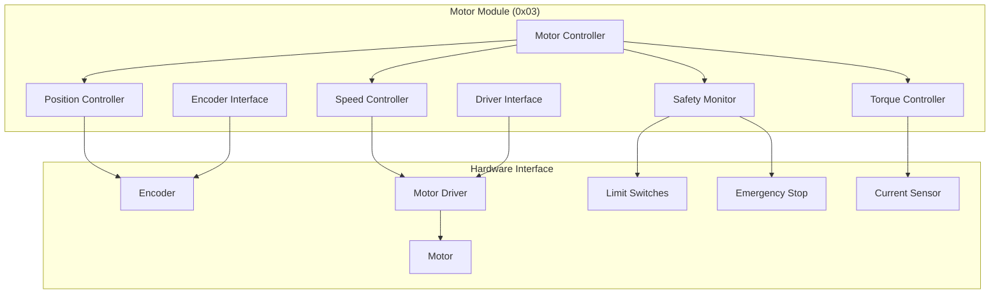

# Motor Module Specification - OHT-50 Master Module (Phiên bản 1.0)

**Phiên bản:** v1.0  
**Ngày tạo:** 2025-01-28  
**Team:** FW Team  
**Trạng thái:** 🚗 PRODUCTION READY

---

## 🎯 **TỔNG QUAN MOTOR MODULE**

### **Module Information:**
- **Address:** 0x03
- **Type:** MODULE_TYPE_MOTOR
- **Function:** Motor control và motion management
- **Protocol:** Modbus RTU
- **Baudrate:** 115200 bps

### **Mục tiêu:**
- Điều khiển motor chuyển động chính
- Position control với độ chính xác cao
- Speed control với profile optimization
- Torque control và load monitoring
- Safety monitoring và fault protection

---

## 🚗 **MOTOR MODULE ARCHITECTURE**

### **Module Structure:**


---

## 📊 **MOTOR MODULE REGISTERS**

### **Modbus Register Map:**
```c
// Motor Module Register Map (0x03)
#define MOTOR_REG_STATUS              0x0000  // Module status
#define MOTOR_REG_POSITION            0x0001  // Current position (steps)
#define MOTOR_REG_TARGET_POSITION     0x0002  // Target position (steps)
#define MOTOR_REG_SPEED               0x0003  // Current speed (RPM)
#define MOTOR_REG_TARGET_SPEED        0x0004  // Target speed (RPM)
#define MOTOR_REG_TORQUE              0x0005  // Current torque (Nm)
#define MOTOR_REG_TARGET_TORQUE       0x0006  // Target torque (Nm)
#define MOTOR_REG_CURRENT             0x0007  // Motor current (A)
#define MOTOR_REG_VOLTAGE             0x0008  // Motor voltage (V)
#define MOTOR_REG_TEMPERATURE         0x0009  // Motor temperature (°C)
#define MOTOR_REG_ENCODER_COUNT       0x000A  // Encoder count
#define MOTOR_REG_ENCODER_VELOCITY    0x000B  // Encoder velocity
#define MOTOR_REG_FAULT_STATUS        0x000C  // Fault status
#define MOTOR_REG_FAULT_CODE          0x000D  // Fault code
#define MOTOR_REG_CONTROL_MODE        0x000E  // Control mode
#define MOTOR_REG_MOTION_STATUS       0x000F  // Motion status
#define MOTOR_REG_UPTIME              0x0010  // Module uptime (hours)
#define MOTOR_REG_VERSION             0x0011  // Firmware version
```

### **Register Data Types:**
```c
// Motor Module Data Types
typedef struct {
    uint16_t status;              // Module status
    int32_t position;             // Current position (steps)
    int32_t target_position;      // Target position (steps)
    uint16_t speed;               // Current speed (0.1 RPM resolution)
    uint16_t target_speed;        // Target speed (0.1 RPM resolution)
    uint16_t torque;              // Current torque (0.01 Nm resolution)
    uint16_t target_torque;       // Target torque (0.01 Nm resolution)
    uint16_t current;             // Motor current (0.01A resolution)
    uint16_t voltage;             // Motor voltage (0.1V resolution)
    uint16_t temperature;         // Motor temperature (0.1°C resolution)
    int32_t encoder_count;        // Encoder count
    int16_t encoder_velocity;     // Encoder velocity (0.1 RPM resolution)
    uint16_t fault_status;        // Fault status
    uint16_t fault_code;          // Fault code
    uint8_t control_mode;         // Control mode
    uint8_t motion_status;        // Motion status
    uint32_t uptime;              // Uptime (hours)
    uint32_t version;             // Firmware version
} motor_module_data_t;
```

---

## 🔧 **MOTOR MODULE COMMANDS**

### **Command Set:**
```c
// Motor Module Commands
#define MOTOR_CMD_GET_STATUS          0x01    // Get module status
#define MOTOR_CMD_GET_POSITION        0x02    // Get position
#define MOTOR_CMD_GET_SPEED           0x03    // Get speed
#define MOTOR_CMD_GET_TORQUE          0x04    // Get torque
#define MOTOR_CMD_GET_CURRENT         0x05    // Get current
#define MOTOR_CMD_GET_TEMPERATURE     0x06    // Get temperature
#define MOTOR_CMD_GET_FAULTS          0x07    // Get fault status
#define MOTOR_CMD_SET_POSITION        0x08    // Set target position
#define MOTOR_CMD_SET_SPEED           0x09    // Set target speed
#define MOTOR_CMD_SET_TORQUE          0x0A    // Set target torque
#define MOTOR_CMD_START_MOTION        0x0B    // Start motion
#define MOTOR_CMD_STOP_MOTION         0x0C    // Stop motion
#define MOTOR_CMD_EMERGENCY_STOP      0x0D    // Emergency stop
#define MOTOR_CMD_RESET_FAULTS        0x0E    // Reset faults
#define MOTOR_CMD_SET_CONTROL_MODE    0x0F    // Set control mode
#define MOTOR_CMD_CALIBRATE           0x10    // Calibrate
#define MOTOR_CMD_UPDATE_FIRMWARE     0x11    // Update firmware
#define MOTOR_CMD_GET_CONFIG          0x12    // Get configuration
#define MOTOR_CMD_SET_CONFIG          0x13    // Set configuration
```

### **Command Structure:**
```c
// Motor Module Command
typedef struct {
    uint8_t address;           // Module address (0x03)
    uint8_t command;           // Command code
    uint16_t data_length;      // Data length
    uint8_t data[32];          // Command data
    uint16_t crc;              // CRC checksum
} motor_module_command_t;

// Motor Module Response
typedef struct {
    uint8_t address;           // Module address (0x03)
    uint8_t command;           // Command code
    uint8_t status;            // Response status
    uint16_t data_length;      // Data length
    uint8_t data[32];          // Response data
    uint16_t crc;              // CRC checksum
} motor_module_response_t;
```

---

## ⚠️ **MOTOR MODULE FAULTS**

### **Fault Types:**
```c
// Motor Module Fault Codes
typedef enum {
    MOTOR_FAULT_NONE = 0x0000,             // No fault
    MOTOR_FAULT_OVERCURRENT = 0x0001,      // Overcurrent
    MOTOR_FAULT_OVERVOLTAGE = 0x0002,      // Overvoltage
    MOTOR_FAULT_UNDERVOLTAGE = 0x0003,     // Undervoltage
    MOTOR_FAULT_OVERTEMPERATURE = 0x0004,  // Overtemperature
    MOTOR_FAULT_ENCODER_FAULT = 0x0005,    // Encoder fault
    MOTOR_FAULT_DRIVER_FAULT = 0x0006,     // Driver fault
    MOTOR_FAULT_POSITION_ERROR = 0x0007,   // Position error
    MOTOR_FAULT_SPEED_ERROR = 0x0008,      // Speed error
    MOTOR_FAULT_TORQUE_ERROR = 0x0009,     // Torque error
    MOTOR_FAULT_LIMIT_SWITCH = 0x000A,     // Limit switch triggered
    MOTOR_FAULT_EMERGENCY_STOP = 0x000B,   // Emergency stop
    MOTOR_FAULT_COMMUNICATION = 0x000C,    // Communication fault
    MOTOR_FAULT_CALIBRATION = 0x000D,      // Calibration fault
    MOTOR_FAULT_FIRMWARE = 0x000E,         // Firmware fault
    MOTOR_FAULT_HARDWARE = 0x000F,         // Hardware fault
    MOTOR_FAULT_WATCHDOG = 0x0010,         // Watchdog timeout
    MOTOR_FAULT_UNKNOWN = 0x00FF           // Unknown fault
} motor_fault_code_t;
```

### **Fault Handling:**
```c
// Fault Handling Functions
int motor_fault_detect(void);
int motor_fault_handle(motor_fault_code_t fault_code);
int motor_fault_clear(void);
int motor_fault_get_status(motor_fault_code_t *fault_code);
int motor_fault_get_history(motor_fault_code_t *faults, uint8_t *count);
```

---

## 🎛️ **MOTOR CONTROL MODES**

### **Control Modes:**
```c
// Motor Control Modes
typedef enum {
    MOTOR_MODE_DISABLED = 0x00,        // Motor disabled
    MOTOR_MODE_POSITION = 0x01,        // Position control
    MOTOR_MODE_SPEED = 0x02,           // Speed control
    MOTOR_MODE_TORQUE = 0x03,          // Torque control
    MOTOR_MODE_VELOCITY = 0x04,        // Velocity control
    MOTOR_MODE_HOMING = 0x05,          // Homing mode
    MOTOR_MODE_CALIBRATION = 0x06,     // Calibration mode
    MOTOR_MODE_EMERGENCY = 0x07        // Emergency mode
} motor_control_mode_t;

// Motion Status
typedef enum {
    MOTION_STATUS_IDLE = 0x00,         // Idle
    MOTION_STATUS_MOVING = 0x01,       // Moving
    MOTION_STATUS_HOMING = 0x02,       // Homing
    MOTION_STATUS_CALIBRATING = 0x03,  // Calibrating
    MOTION_STATUS_FAULT = 0x04,        // Fault
    MOTION_STATUS_EMERGENCY = 0x05     // Emergency stop
} motor_motion_status_t;
```

### **Control Functions:**
```c
// Motor Control Functions
int motor_control_init(void);
int motor_control_set_mode(motor_control_mode_t mode);
int motor_control_get_mode(motor_control_mode_t *mode);
int motor_control_enable(void);
int motor_control_disable(void);
int motor_control_emergency_stop(void);
int motor_control_reset(void);
```

---

## 📍 **POSITION CONTROL**

### **Position Control Configuration:**
```c
// Position Control Configuration
typedef struct {
    uint32_t max_position;             // Maximum position (steps)
    uint32_t min_position;             // Minimum position (steps)
    uint16_t max_speed;                // Maximum speed (RPM)
    uint16_t max_acceleration;         // Maximum acceleration (RPM/s)
    uint16_t max_deceleration;         // Maximum deceleration (RPM/s)
    uint16_t position_tolerance;       // Position tolerance (steps)
    uint16_t settling_time;            // Settling time (ms)
    uint8_t homing_enabled;            // Homing enabled
    uint8_t homing_direction;          // Homing direction
    uint16_t homing_speed;             // Homing speed (RPM)
} position_control_config_t;
```

### **Position Control Functions:**
```c
// Position Control Functions
int position_control_init(position_control_config_t *config);
int position_control_set_target(int32_t target_position);
int position_control_get_position(int32_t *position);
int position_control_start_motion(void);
int position_control_stop_motion(void);
int position_control_home(void);
int position_control_calibrate(void);
int position_control_get_status(motor_motion_status_t *status);
```

---

## ⚡ **SPEED CONTROL**

### **Speed Control Configuration:**
```c
// Speed Control Configuration
typedef struct {
    uint16_t max_speed;                // Maximum speed (RPM)
    uint16_t min_speed;                // Minimum speed (RPM)
    uint16_t max_acceleration;         // Maximum acceleration (RPM/s)
    uint16_t max_deceleration;         // Maximum deceleration (RPM/s)
    uint16_t speed_tolerance;          // Speed tolerance (RPM)
    uint16_t ramp_time;                // Ramp time (ms)
    uint8_t direction;                 // Direction (0=forward, 1=reverse)
    uint8_t speed_profile;             // Speed profile type
} speed_control_config_t;
```

### **Speed Control Functions:**
```c
// Speed Control Functions
int speed_control_init(speed_control_config_t *config);
int speed_control_set_target(uint16_t target_speed);
int speed_control_get_speed(uint16_t *speed);
int speed_control_start_motion(void);
int speed_control_stop_motion(void);
int speed_control_set_direction(uint8_t direction);
int speed_control_get_status(motor_motion_status_t *status);
```

---

## 🔧 **TORQUE CONTROL**

### **Torque Control Configuration:**
```c
// Torque Control Configuration
typedef struct {
    uint16_t max_torque;               // Maximum torque (Nm)
    uint16_t min_torque;               // Minimum torque (Nm)
    uint16_t torque_ramp_time;         // Torque ramp time (ms)
    uint16_t torque_tolerance;         // Torque tolerance (Nm)
    uint8_t torque_limiting;           // Torque limiting enabled
    uint16_t current_limit;            // Current limit (A)
} torque_control_config_t;
```

### **Torque Control Functions:**
```c
// Torque Control Functions
int torque_control_init(torque_control_config_t *config);
int torque_control_set_target(uint16_t target_torque);
int torque_control_get_torque(uint16_t *torque);
int torque_control_start_motion(void);
int torque_control_stop_motion(void);
int torque_control_set_current_limit(uint16_t current_limit);
int torque_control_get_status(motor_motion_status_t *status);
```

---

## 🔍 **ENCODER INTERFACE**

### **Encoder Configuration:**
```c
// Encoder Configuration
typedef struct {
    uint32_t resolution;               // Encoder resolution (counts/rev)
    uint8_t encoder_type;              // Encoder type
    uint8_t direction;                 // Encoder direction
    uint16_t filter_time;              // Filter time constant (ms)
    uint8_t index_enabled;             // Index enabled
    uint8_t quadrature_mode;           // Quadrature mode
} encoder_config_t;

// Encoder Types
typedef enum {
    ENCODER_TYPE_INCREMENTAL = 0x01,   // Incremental encoder
    ENCODER_TYPE_ABSOLUTE = 0x02,      // Absolute encoder
    ENCODER_TYPE_HALL = 0x03,          // Hall sensor
    ENCODER_TYPE_RESOLVER = 0x04,      // Resolver
    ENCODER_TYPE_UNKNOWN = 0xFF        // Unknown type
} encoder_type_t;
```

### **Encoder Functions:**
```c
// Encoder Functions
int encoder_init(encoder_config_t *config);
int encoder_get_position(int32_t *position);
int encoder_get_velocity(int16_t *velocity);
int encoder_reset_position(void);
int encoder_set_position(int32_t position);
int encoder_calibrate(void);
int encoder_get_status(uint8_t *status);
```

---

## 🔧 **MOTOR MODULE CONFIGURATION**

### **Module Configuration:**
```c
// Motor Module Configuration
typedef struct {
    uint16_t module_id;                    // Module ID
    uint8_t module_type;                   // Module type
    uint8_t firmware_version[4];           // Firmware version
    uint32_t serial_number;                // Serial number
    position_control_config_t position;    // Position control config
    speed_control_config_t speed;          // Speed control config
    torque_control_config_t torque;        // Torque control config
    encoder_config_t encoder;              // Encoder config
    uint8_t motor_enabled;                 // Motor enabled
    uint8_t safety_enabled;                // Safety enabled
    uint16_t emergency_stop_timeout;       // Emergency stop timeout (ms)
} motor_module_config_t;
```

### **Configuration Functions:**
```c
// Configuration Functions
int motor_config_init(void);
int motor_config_load(motor_module_config_t *config);
int motor_config_save(motor_module_config_t *config);
int motor_config_validate(motor_module_config_t *config);
int motor_config_reset(void);
int motor_config_backup(void);
int motor_config_restore(void);
```

---

## 📋 **TASK MAPPING CHO PM**

### **EMBED Team Tasks:**
- [ ] Implement motor driver hardware
- [ ] Implement encoder interface
- [ ] Implement current/voltage sensors
- [ ] Implement limit switches
- [ ] Hardware validation tests
- [ ] Motor performance optimization

### **Firmware Team Tasks:**
- [ ] Implement motor module firmware
- [ ] Implement Modbus RTU protocol
- [ ] Implement position control
- [ ] Implement speed control
- [ ] Implement torque control
- [ ] Implement encoder interface
- [ ] Implement fault detection
- [ ] Unit tests cho motor module

### **System Integration Tasks:**
- [ ] Motor module integration testing
- [ ] End-to-end motion testing
- [ ] Performance testing
- [ ] Safety testing
- [ ] Fault injection testing

---

## 📚 **REFERENCES**

### **Related Documents:**
- `../module_architecture.md` - Module architecture overview
- `../communication_architecture.md` - Communication protocol
- `../interfaces.md` - Interface definitions

### **Standards:**
- Modbus RTU Protocol
- Motor Control Standards
- Encoder Standards
- Safety Standards

---

## 📝 **CHANGELOG**

### **v1.0 (2025-01-28):**
- ✅ Added comprehensive motor module specification
- ✅ Added Modbus register map
- ✅ Added command set
- ✅ Added fault handling
- ✅ Added control modes
- ✅ Added position/speed/torque control
- ✅ Added encoder interface
- ✅ Added configuration management
- ✅ Added task mapping for PM

---

**🚨 Lưu ý:** Motor module phải đảm bảo an toàn và độ chính xác cao trong điều khiển chuyển động.
