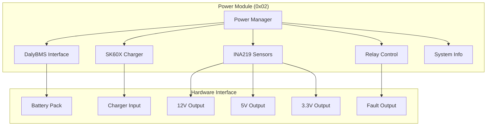

# Power Module Specification - OHT-50 Master Module (Phiên bản 2.0)

**Phiên bản:** v2.0  
**Ngày tạo:** 2025-01-28  
**Team:** FW Team  
**Trạng thái:** ⚡ PRODUCTION READY  
**Reference:** https://github.com/hiimshyy/stm32-power-management/blob/main/Docs/modbus_register_map.md

---

## 🎯 **TỔNG QUAN POWER MODULE**

### **Module Information:**
- **Address:** 0x02
- **Type:** MODULE_TYPE_POWER (0x0002)
- **Function:** Power management và monitoring với STM32 Power Management
- **Protocol:** Modbus RTU
- **Baudrate:** 115200 bps (configurable)

### **Mục tiêu:**
- Quản lý nguồn điện cho toàn bộ hệ thống
- Battery monitoring với DalyBMS
- Charging control với SK60X
- Power distribution với INA219 sensors
- Fault detection và protection

---

## ⚡ **POWER MODULE ARCHITECTURE**

### **Module Structure:**


---

## 📊 **POWER MODULE REGISTERS**

### **Modbus Register Map (STM32 Power Management):**

#### **Modbus Configuration Registers (0x0100-0x0106):**
```c
#define POWER_REG_SLAVE_ID             0x0100  // Modbus slave address (1-247)
#define POWER_REG_BAUDRATE_CODE        0x0101  // UART baudrate setting
#define POWER_REG_PARITY               0x0102  // UART parity (0=None, 1=Even, 2=Odd)
#define POWER_REG_STOP_BITS            0x0103  // UART stop bits (1 or 2)
#define POWER_REG_FC_MASK              0x0104  // Supported function codes
#define POWER_REG_APPLY_CONFIG         0x0105  // Apply config flag
#define POWER_REG_CONFIG_CRC           0x0106  // Config CRC
```

#### **DalyBMS Status Registers (0x0000-0x002B):**
```c
#define POWER_REG_BATTERY_VOLTAGE      0x0000  // Battery pack voltage (V, /10.0 scaling)
#define POWER_REG_BATTERY_CURRENT      0x0001  // Battery pack current (A, /10.0 scaling)
#define POWER_REG_BATTERY_SOC          0x0002  // State of Charge (%, /10.0 scaling)
#define POWER_REG_MAX_CELL_V           0x0003  // Maximum cell voltage (mV)
#define POWER_REG_MIN_CELL_V           0x0004  // Minimum cell voltage (mV)
#define POWER_REG_CELL_DIFF            0x0007  // Voltage difference between cells (mV)
#define POWER_REG_TEMPERATURE          0x0008  // Average temperature (°C)
#define POWER_REG_CONNECTION_STATUS    0x0009  // BMS Connection Status
#define POWER_REG_CHARGE_MOS           0x000B  // Charge MOSFET status
#define POWER_REG_DISCHARGE_MOS        0x000C  // Discharge MOSFET status
#define POWER_REG_CELL_VOLTAGE_0       0x0014  // Cell 0 voltage (mV)
#define POWER_REG_CELL_VOLTAGE_1       0x0015  // Cell 1 voltage (mV)
#define POWER_REG_CELL_VOLTAGE_2       0x0016  // Cell 2 voltage (mV)
#define POWER_REG_CELL_VOLTAGE_3       0x0017  // Cell 3 voltage (mV)
#define POWER_REG_CELL_VOLTAGE_4       0x0018  // Cell 4 voltage (mV)
#define POWER_REG_CELL_VOLTAGE_5       0x0019  // Cell 5 voltage (mV)
#define POWER_REG_TEMPERATURE_0        0x001A  // Temperature sensor 0 (°C)
#define POWER_REG_TEMPERATURE_1        0x001B  // Temperature sensor 1 (°C)
#define POWER_REG_CELL_BALANCE_0       0x001C  // Cell 0 balancing status
#define POWER_REG_CELL_BALANCE_1       0x001D  // Cell 1 balancing status
#define POWER_REG_CELL_BALANCE_2       0x001E  // Cell 2 balancing status
#define POWER_REG_CELL_BALANCE_3       0x001F  // Cell 3 balancing status
#define POWER_REG_CELL_BALANCE_4       0x0020  // Cell 4 balancing status
#define POWER_REG_CELL_BALANCE_5       0x0021  // Cell 5 balancing status
#define POWER_REG_CELL_BALANCE_ACTIVE  0x0022  // Global balancing status
#define POWER_REG_FAULT_FLAGS          0x0023  // Fault status flags
```

#### **SK60X Data Registers (0x0030-0x003F):**
```c
#define POWER_REG_V_SET                0x0030  // Voltage setpoint (V, /10.0 scaling)
#define POWER_REG_I_SET                0x0031  // Current setpoint (A, /10.0 scaling)
#define POWER_REG_V_OUT                0x0032  // Output voltage (V, /10.0 scaling)
#define POWER_REG_I_OUT                0x0033  // Output current (A, /10.0 scaling)
#define POWER_REG_P_OUT                0x0034  // Output power (W, /10.0 scaling)
#define POWER_REG_V_IN                 0x0035  // Input voltage (V, /10.0 scaling)
#define POWER_REG_I_IN                 0x0036  // Input current (A, /10.0 scaling)
#define POWER_REG_TEMP                 0x0037  // Temperature of SK60X (°C)
#define POWER_REG_STATUS               0x003B  // Operational status
#define POWER_REG_ON_OFF               0x003C  // Output ON/OFF state
#define POWER_REG_CHARGE_RELAY         0x003D  // Charge relay status
#define POWER_REG_CHARGE_STATE         0x003E  // Charge state (0=IDLE, 1=WAITING, 2=CHARGE)
#define POWER_REG_CHARGE_REQUEST       0x003F  // Charge request
```

#### **INA219 Sensor Values (0x0040-0x0048):**
```c
#define POWER_REG_V_OUT_12V            0x0040  // 12V output voltage (V, /10.0 scaling)
#define POWER_REG_I_OUT_12V            0x0041  // 12V output current (A, /10.0 scaling)
#define POWER_REG_P_OUT_12V            0x0042  // 12V output power (W, /10.0 scaling)
#define POWER_REG_V_OUT_5V             0x0043  // 5V output voltage (V, /10.0 scaling)
#define POWER_REG_I_OUT_5V             0x0044  // 5V output current (A, /10.0 scaling)
#define POWER_REG_P_OUT_5V             0x0045  // 5V output power (W, /10.0 scaling)
#define POWER_REG_V_OUT_3V3            0x0046  // 3.3V output voltage (V, /10.0 scaling)
#define POWER_REG_I_OUT_3V3            0x0047  // 3.3V output current (A, /10.0 scaling)
#define POWER_REG_P_OUT_3V3            0x0048  // 3.3V output power (W, /10.0 scaling)
```

#### **Relay State (0x0049-0x004D):**
```c
#define POWER_REG_RL_12V               0x0049  // State of 12V relay
#define POWER_REG_RL_5V                0x004A  // State of 5V relay
#define POWER_REG_RL_3V3               0x004B  // State of 3V3 relay
#define POWER_REG_RL_FAUL              0x004C  // State of Faul relay
#define POWER_REG_USE_V_THS            0x004D  // Voltage usage threshold (/100.0 scaling)
```

#### **System Registers (0x00F0-0x00FF) - Auto Detect Support:**
```c
#define POWER_REG_DEVICE_ID              0x00F0  // Device ID (Modbus slave address)
#define POWER_REG_FIRMWARE_VERSION       0x00F1  // Firmware version (e.g. 0x0101 = v1.01)
#define POWER_REG_SYSTEM_STATUS          0x00F2  // System status (bit field)
#define POWER_REG_SYSTEM_ERROR           0x00F3  // System error (global error code)
#define POWER_REG_RESET_ERROR_CMD        0x00F4  // Reset error command
#define POWER_REG_CONFIG_BAUDRATE        0x00F5  // Config baudrate
#define POWER_REG_CONFIG_PARITY          0x00F6  // Config parity
#define POWER_REG_MODULE_TYPE            0x00F7  // Module type (0x0002 = Power Module)
#define POWER_REG_MODULE_NAME_LOW        0x00F8  // Module name (low word)
#define POWER_REG_MODULE_NAME_HIGH       0x00F9  // Module name (high word)
#define POWER_REG_HARDWARE_VERSION       0x00FA  // Hardware version
#define POWER_REG_SERIAL_NUMBER_LOW      0x00FB  // Serial number (low word)
#define POWER_REG_SERIAL_NUMBER_HIGH     0x00FC  // Serial number (high word)
#define POWER_REG_BUILD_DATE_LOW         0x00FD  // Build date (low word)
#define POWER_REG_BUILD_DATE_HIGH        0x00FE  // Build date (high word)
#define POWER_REG_CHECKSUM               0x00FF  // Register checksum
```

---

## 🔧 **POWER MODULE DATA STRUCTURES**

### **Power Module Data:**
```c
typedef struct {
    // Modbus configuration
    uint8_t slave_id;              // Modbus slave address
    uint8_t baudrate_code;         // UART baudrate setting
    uint8_t parity;                // UART parity
    uint8_t stop_bits;             // UART stop bits
    uint8_t fc_mask;               // Supported function codes
    uint16_t config_crc;           // Config CRC
    
    // DalyBMS battery information
    float battery_voltage;         // Battery voltage (V)
    float battery_current;         // Battery current (A)
    float battery_soc;             // State of charge (%)
    uint16_t max_cell_v;           // Maximum cell voltage (mV)
    uint16_t min_cell_v;           // Minimum cell voltage (mV)
    uint8_t cell_diff;             // Voltage difference between cells (mV)
    uint8_t temperature;           // Average temperature (°C)
    bool connection_status;        // BMS Connection Status
    bool charge_mos;               // Charge MOSFET status
    bool discharge_mos;            // Discharge MOSFET status
    
    // Cell voltages (6 cells)
    uint16_t cell_voltage[6];      // Voltage of each cell (mV)
    uint8_t temperature_sensors[2]; // Temperature sensor values (°C)
    bool cell_balance[6];          // Per-cell balancing status
    bool cell_balance_active;      // Global balancing status
    uint8_t fault_flags;           // Fault status flags
    
    // SK60X charging control
    float v_set;                   // Voltage setpoint (V)
    float i_set;                   // Current setpoint (A)
    float v_out;                   // Output voltage (V)
    float i_out;                   // Output current (A)
    float p_out;                   // Output power (W)
    float v_in;                    // Input voltage (V)
    float i_in;                    // Input current (A)
    uint8_t temp;                  // Temperature of SK60X (°C)
    bool status;                   // Operational status
    bool on_off;                   // Output ON/OFF state
    bool charge_relay;             // Charge relay status
    uint16_t charge_state;         // Charge state (0=IDLE, 1=WAITING, 2=CHARGE)
    bool charge_request;           // Charge request
    
    // INA219 power distribution
    float v_out_12v;               // Voltage of 12V output (V)
    float i_out_12v;               // Current of 12V output (A)
    float p_out_12v;               // Power of 12V output (W)
    float v_out_5v;                // Voltage of 5V output (V)
    float i_out_5v;                // Current of 5V output (A)
    float p_out_5v;                // Power of 5V output (W)
    float v_out_3v3;               // Voltage of 3.3V output (V)
    float i_out_3v3;               // Current of 3.3V output (A)
    float p_out_3v3;               // Power of 3.3V output (W)
    
    // Relay states
    uint8_t rl_12v;                // State of 12V relay
    uint8_t rl_5v;                 // State of 5V relay
    uint8_t rl_3v3;                // State of 3V3 relay
    uint8_t rl_faul;               // State of Faul relay
    float use_v_ths;               // Voltage usage threshold
    
    // System information
    uint16_t device_id;            // Device ID (Modbus slave address)
    uint16_t firmware_version;     // Firmware version
    uint16_t system_status;        // System status (bit field)
    uint16_t system_error;         // System error (global error code)
    uint16_t hardware_version;     // Hardware version
    uint32_t serial_number;        // Serial number
    uint32_t build_date;           // Build date
    uint16_t module_type;          // Module type (0x0002 = Power Module)
    uint32_t module_name;          // Module name (32-bit)
    uint16_t checksum;             // Register checksum
    
    uint64_t last_update_ms;       // Last update timestamp
} power_module_data_t;
```

### **Power Module Configuration:**
```c
typedef struct {
    // Modbus configuration
    uint8_t slave_id;              // Modbus slave address (1-247)
    uint8_t baudrate_code;         // UART baudrate setting
    uint8_t parity;                // UART parity
    uint8_t stop_bits;             // UART stop bits
    uint8_t fc_mask;               // Supported function codes
    
    // Battery thresholds
    uint16_t max_cell_threshold_1; // Max cell voltage threshold 1 (mV)
    uint16_t min_cell_threshold_1; // Min cell voltage threshold 1 (mV)
    uint16_t max_cell_threshold_2; // Max cell voltage threshold 2 (mV)
    uint16_t min_cell_threshold_2; // Min cell voltage threshold 2 (mV)
    uint16_t max_pack_threshold_1; // Max pack voltage threshold 1 (mV)
    uint16_t min_pack_threshold_1; // Min pack voltage threshold 1 (mV)
    uint16_t max_pack_threshold_2; // Max pack voltage threshold 2 (mV)
    uint16_t min_pack_threshold_2; // Min pack voltage threshold 2 (mV)
    
    // Charging configuration
    float charge_voltage_set;      // Charge voltage setting (V)
    float charge_current_set;      // Charge current setting (A)
    bool charge_enable;            // Charge enable/disable
    
    // Output configuration
    bool output_12v_enabled;       // 12V output enabled
    bool output_5v_enabled;        // 5V output enabled
    bool output_3v3_enabled;       // 3.3V output enabled
    
    // Protection thresholds
    float overvoltage_threshold;   // Overvoltage threshold (V)
    float overcurrent_threshold;   // Overcurrent threshold (A)
    float overtemp_threshold;      // Overtemperature threshold (°C)
    
    // Voltage usage threshold
    float use_v_ths;               // Voltage usage threshold
} power_module_config_t;
```

---

## ⚠️ **POWER MODULE FAULTS**

### **Fault Types:**
```c
// Power Module Alarm Bit Definitions
#define POWER_ALARM_OVERVOLTAGE    (1 << 0)
#define POWER_ALARM_UNDERVOLTAGE   (1 << 1)
#define POWER_ALARM_OVERCURRENT    (1 << 2)
#define POWER_ALARM_OVERTEMP       (1 << 3)
#define POWER_ALARM_COMM_ERROR     (1 << 4)
#define POWER_ALARM_RELAY_FAULT    (1 << 5)
#define POWER_ALARM_BATTERY_LOW    (1 << 6)
#define POWER_ALARM_CHARGING_FAULT (1 << 7)
```

### **Capabilities:**
```c
// Power Module Capabilities
#define POWER_CAP_VOLTAGE_MONITOR     (1 << 0)
#define POWER_CAP_CURRENT_MONITOR     (1 << 1)
#define POWER_CAP_TEMP_MONITOR        (1 << 2)
#define POWER_CAP_RELAY_CONTROL       (1 << 3)
#define POWER_CAP_OVERVOLTAGE_PROTECT (1 << 4)
#define POWER_CAP_OVERCURRENT_PROTECT (1 << 5)
#define POWER_CAP_OVERTEMP_PROTECT    (1 << 6)
#define POWER_CAP_BATTERY_MONITOR     (1 << 7)
#define POWER_CAP_CHARGING_CONTROL    (1 << 8)
#define POWER_CAP_POWER_DISTRIBUTION  (1 << 9)
```

---

## 🔧 **POWER MODULE FUNCTIONS**

### **Core Functions:**
```c
// Initialization
hal_status_t power_module_handler_init(const power_module_config_t *config);
hal_status_t power_module_handler_deinit(void);

// Data Reading
hal_status_t power_module_handler_read_data(power_module_data_t *data);
hal_status_t power_module_handler_read_register(uint16_t register_addr, uint16_t *value);
hal_status_t power_module_handler_write_register(uint16_t register_addr, uint16_t value);

// Control Functions
hal_status_t power_module_handler_set_charging(float current, float voltage, bool enable);
hal_status_t power_module_handler_control_outputs(bool output_12v, bool output_5v, bool output_3v3);
hal_status_t power_module_handler_reset_faults(void);

// Status & Info
hal_status_t power_module_handler_get_status(power_module_status_t *status);
uint32_t power_module_handler_get_capabilities(void);

// Auto Detection
hal_status_t power_module_handler_auto_detect(uint8_t slave_id, uint32_t timeout_ms);
hal_status_t power_module_handler_get_module_info(uint16_t *device_id, uint16_t *module_type, 
                                                  uint16_t *firmware_version, uint16_t *hardware_version);
hal_status_t power_module_handler_get_module_name(char *name_buffer, size_t buffer_size);
hal_status_t power_module_handler_reset_system_errors(void);
hal_status_t power_module_handler_get_system_status(uint16_t *system_status, uint16_t *system_error);
```

---

## 📋 **TASK MAPPING CHO PM**

### **EMBED Team Tasks:**
- [x] Implement power module hardware interface
- [x] Implement RS485 communication
- [x] Hardware validation tests
- [x] Power efficiency optimization

### **Firmware Team Tasks:**
- [x] Implement power module handler
- [x] Implement Modbus RTU protocol
- [x] Implement DalyBMS interface
- [x] Implement SK60X charger control
- [x] Implement INA219 sensor reading
- [x] Implement relay control
- [x] Implement fault detection
- [x] Unit tests cho power module

### **System Integration Tasks:**
- [x] Power module integration testing
- [x] End-to-end power testing
- [x] Performance testing
- [x] Fault injection testing

---

## 📚 **REFERENCES**

### **Related Documents:**
- `../module_architecture.md` - Module architecture overview
- `../communication_architecture.md` - Communication protocol
- `../interfaces.md` - Interface definitions
- `firmware/include/power_module_handler.h` - Header file
- `firmware/src/app/power_module_handler.c` - Implementation
- `firmware/tests/app/test_power_module_handler.c` - Test suite

### **External References:**
- [STM32 Power Management](https://github.com/hiimshyy/stm32-power-management) - Reference implementation
- Modbus RTU Protocol Specification
- DalyBMS Protocol Documentation
- SK60X Charger Documentation
- INA219 Sensor Documentation

---

## 📝 **CHANGELOG**

### **v2.0 (2025-01-28):**
- ✅ Updated to STM32 Power Management reference
- ✅ Added DalyBMS battery management
- ✅ Added SK60X charging control
- ✅ Added INA219 power distribution monitoring
- ✅ Added comprehensive register map
- ✅ Added auto-detection support
- ✅ Added system information registers
- ✅ Updated data structures and functions
- ✅ Added complete test suite

### **v1.0 (2025-01-28):**
- ✅ Added basic power module specification
- ✅ Added Modbus register map
- ✅ Added command set
- ✅ Added fault handling
- ✅ Added battery management
- ✅ Added power monitoring
- ✅ Added configuration management
- ✅ Added task mapping for PM

---

**🚨 Lưu ý:** Power module phải đảm bảo an toàn và hiệu quả năng lượng cao, tuân thủ đúng register map của STM32 Power Management.
