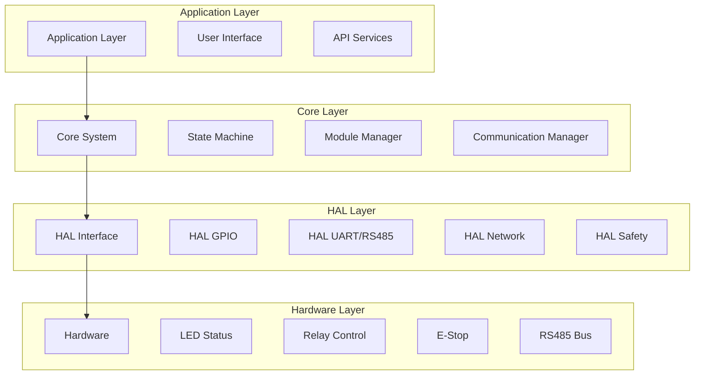
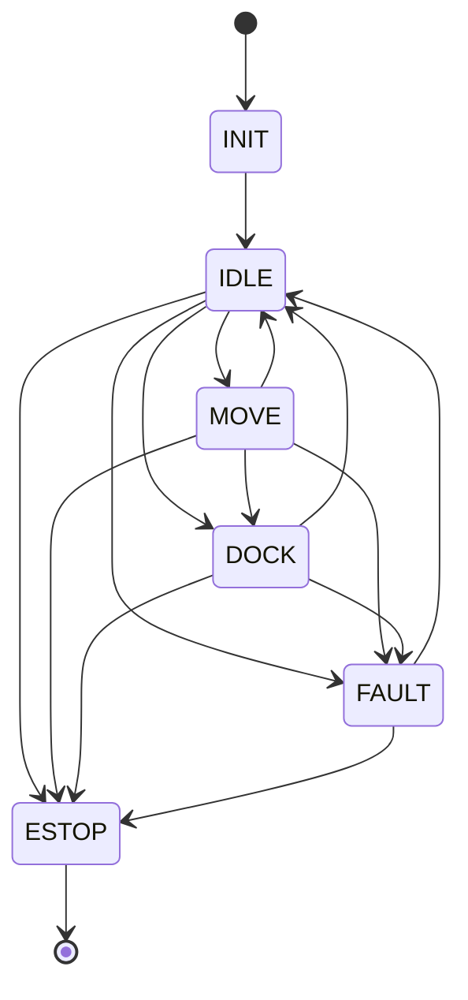

# Kiến trúc Firmware OHT-50 Master Module (Phiên bản 2.0)

**Phiên bản:** v2.0  
**Ngày tạo:** 2025-01-28  
**Team:** FW Team  
**Trạng thái:** �� PRODUCTION READY

---

## 🎯 **TỔNG QUAN KIẾN TRÚC**

### **Mục tiêu:**
- Kiến trúc firmware phân lớp rõ ràng cho OHT-50 Master Module
- Hỗ trợ giao tiếp đa giao thức: RS485, Ethernet, WiFi, USB
- Hệ thống an toàn E-Stop và monitoring
- Module management và auto-discovery
- State machine cho system control

### **Kiến trúc tổng thể:**


---

## 🏗️ **KIẾN TRÚC PHÂN LỚP**

### **1. Application Layer**
- **User Interface:** Dashboard, configuration, monitoring
- **API Services:** REST API, WebSocket, MQTT
- **Application Logic:** Business logic, workflow management

### **2. Core Layer**
- **Core System:** System initialization, resource management
- **State Machine:** System state management (Idle, Move, Dock, Fault, E-Stop)
- **Module Manager:** Module registry, auto-discovery, health monitoring
- **Communication Manager:** Multi-protocol communication management

### **3. HAL Layer (Hardware Abstraction Layer)**
- **HAL GPIO:** LED control, relay control, digital I/O
- **HAL UART/RS485:** RS485 communication, Modbus RTU protocol
- **HAL Network:** Ethernet, WiFi, network management
- **HAL Safety:** E-Stop monitoring, safety system integration

### **4. Hardware Layer**
- **LED Status:** 5 LED indicators (Power, System, Comm, Network, Error)
- **Relay Control:** 2 relay outputs (24V DC, 2A each)
- **E-Stop:** Dual-channel safety system
- **RS485 Bus:** Modbus RTU communication bus

---

## �� **MODULE ARCHITECTURE**

### **Module Types:**
```c
typedef enum {
    MODULE_TYPE_UNKNOWN = 0,
    MODULE_TYPE_POWER = 1,     // 0x02 - Power module
    MODULE_TYPE_MOTOR = 2,     // 0x03 - Motor module
    MODULE_TYPE_IO = 3,        // 0x04 - IO module
    MODULE_TYPE_DOCK = 4,      // 0x05 - Dock module
    MODULE_TYPE_DIDO = 5,      // 0x06 - DI/DO module
    MODULE_TYPE_AI = 6,        // 0x07 - AI module
    MODULE_TYPE_CUSTOM = 7     // 0x08+ - Custom modules
} module_type_t;
```

### **Module Status:**
```c
typedef enum {
    MODULE_STATUS_OFFLINE = 0,
    MODULE_STATUS_ONLINE = 1,
    MODULE_STATUS_ERROR = 2,
    MODULE_STATUS_WARNING = 3,
    MODULE_STATUS_MAINTENANCE = 4
} module_status_t;
```

---

## 🔄 **STATE MACHINE ARCHITECTURE**

### **System States:**


### **State Transitions:**
- **INIT:** System initialization
- **IDLE:** Ready for commands
- **MOVE:** Movement in progress
- **DOCK:** Docking operation
- **FAULT:** Error condition
- **E-STOP:** Emergency stop (highest priority)

---

## 🔌 **COMMUNICATION ARCHITECTURE**

### **RS485 Bus (Modbus RTU):**
- **Baudrate:** 115200 bps
- **Protocol:** Modbus RTU
- **Address Range:** 0x02 - 0xFF
- **Max Devices:** 254 modules
- **Termination:** 120Ω resistors

### **Network Communication:**
- **Ethernet:** 10/100/1000 Mbps
- **WiFi:** 802.11ac 2.4G/5G dual-band
- **Protocols:** HTTP/HTTPS, WebSocket, MQTT
- **Security:** SSL/TLS, authentication

### **USB Debug:**
- **Type:** USB 2.0 Type-C
- **Function:** Debug console, firmware update
- **Device:** `/dev/ttyACM0`

---

## 🛡️ **SAFETY ARCHITECTURE**

### **E-Stop System:**
- **Dual-channel safety:** Hardware redundancy
- **Response time:** < 100ms target
- **Monitoring:** Continuous safety monitoring
- **Priority:** Highest priority over all commands

### **Safety Features:**
- **Hardware E-Stop:** Physical emergency stop
- **Software E-Stop:** Software emergency stop
- **Interlock:** Safety interlocks for operations
- **Monitoring:** Continuous safety monitoring

---

## 📊 **PERFORMANCE REQUIREMENTS**

### **Timing Requirements:**
- **E-Stop Response:** < 100ms
- **Command Response:** < 50ms
- **Telemetry Update:** 10Hz
- **Module Discovery:** < 5s per module

### **Resource Requirements:**
- **Memory:** < 512MB RAM
- **Storage:** < 1GB flash
- **CPU:** < 50% average usage
- **Network:** < 10Mbps bandwidth

---

## �� **UPDATE & MAINTENANCE**

### **OTA Updates:**
- **Rollback Support:** Automatic rollback on failure
- **Version Management:** Semantic versioning
- **Security:** Signed firmware updates
- **Validation:** Integrity checks

### **Configuration Management:**
- **Versioned Config:** Configuration versioning
- **Backup/Restore:** Configuration backup
- **Validation:** Configuration validation
- **Audit Trail:** Configuration change logging

---

## �� **DEPENDENCIES**

### **Hardware Dependencies:**
- Orange Pi 5B (RK3588)
- RS485 transceiver
- LED indicators
- Relay modules
- E-Stop hardware

### **Software Dependencies:**
- Ubuntu 22.04 LTS
- Linux kernel 5.10+
- libgpiod
- libmodbus
- OpenSSL

---

## 🚀 **DEPLOYMENT ARCHITECTURE**

### **Build System:**
- **Makefile:** Automated build process
- **Cross-compilation:** ARM64 target
- **Dependencies:** Automated dependency management
- **Testing:** Automated testing framework

### **Deployment:**
- **OTA Updates:** Over-the-air firmware updates
- **Rollback:** Automatic rollback on failure
- **Monitoring:** Deployment monitoring
- **Logging:** Comprehensive logging

---

## 📚 **REFERENCES**

### **Related Documents:**
- `docs/specs/architecture.md` - System architecture
- `docs/technical/00-rs485-system-overview.md` - RS485 overview
- `docs/EMBED_COMPLETE_GUIDE.md` - Hardware guide
- `docs/FIRMWARE/README.md` - Firmware documentation

### **Standards:**
- Modbus RTU Protocol
- RS485 Electrical Standards
- SIL2 Safety Standards
- IEC 61508 Functional Safety

---

## �� **CHANGELOG**

### **v2.0 (2025-01-28):**
- ✅ Added comprehensive firmware architecture
- ✅ Added state machine design
- ✅ Added module management architecture
- ✅ Added safety system architecture
- ✅ Added performance requirements
- ✅ Added deployment architecture

### **v1.0 (2025-01-27):**
- ✅ Initial architecture document
- ✅ Basic system overview
- ✅ Hardware specification

---

**�� Lưu ý:** Kiến trúc này tuân thủ các tiêu chuẩn an toàn SIL2 và đảm bảo khả năng mở rộng cho tương lai.
