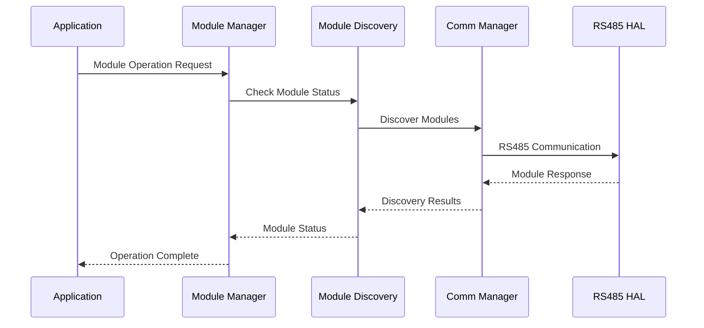

# IMPLEMENTED MODULES OVERVIEW - OHT-50 Master Module

**Phiên bản:** v1.0.0  
**Ngày tạo:** 2025-01-28  
**Mục tiêu:** Tổng quan về các module đã implement trong OHT-50 Master Module firmware

---

## 📋 **TỔNG QUAN HIỆN TRẠNG**

### **Trạng thái tổng thể:** ⚠️ **PARTIALLY IMPLEMENTED**
- **RS485 HAL:** ✅ IMPLEMENTED (cơ bản)
- **Module Discovery:** ✅ IMPLEMENTED (cơ bản)
- **Module Management:** ✅ IMPLEMENTED (cơ bản)
- **Build System:** ❌ FAILED (linker errors)
- **Testing System:** ❌ FAILED (safety tests)

---

## 🎯 **CÁC MODULE ĐÃ IMPLEMENT**

### **1. RS485 HAL Layer** ✅ **IMPLEMENTED (cơ bản)**

**Mục tiêu:** Hardware Abstraction Layer cho RS485/Modbus RTU communication

**Chức năng chính:**
- ✅ RS485 serial communication
- ✅ Modbus RTU protocol implementation
- ✅ Thread-safe operations
- ✅ Error handling và retry mechanism
- ✅ Statistics collection

**Trạng thái:**
- ✅ Core functionality hoàn thiện
- ✅ Thread-safe implementation
- ✅ Basic error handling
- ⚠️ Cần optimization và advanced features

**Tài liệu:** [REQ_RS485_HAL_SPECIFICATION.md](./REQ_RS485_HAL_SPECIFICATION.md)

---

### **2. Module Discovery System** ✅ **IMPLEMENTED (cơ bản)**

**Mục tiêu:** Tự động phát hiện và đăng ký các slave modules trên RS485 bus

**Chức năng chính:**
- ✅ Auto-discovery protocol
- ✅ Module registry management
- ✅ Health monitoring system
- ✅ Event handling system
- ✅ Hot-swap capability

**Trạng thái:**
- ✅ Core discovery functionality
- ✅ Module registry management
- ✅ Health monitoring system
- ⚠️ Cần advanced health assessment

**Tài liệu:** [REQ_MODULE_DISCOVERY_SPECIFICATION.md](./REQ_MODULE_DISCOVERY_SPECIFICATION.md)

---

### **3. Module Management System** ✅ **IMPLEMENTED (cơ bản)**

**Mục tiêu:** Quản lý tổng thể tất cả slave modules trong hệ thống OHT-50

**Chức năng chính:**
- ✅ Module lifecycle management
- ✅ Unified module interface
- ✅ Module state management
- ✅ Module coordination
- ✅ Error handling và recovery

**Trạng thái:**
- ✅ Core module management functionality
- ✅ Unified module interface
- ✅ State management system
- ⚠️ Cần advanced module coordination

**Tài liệu:** [REQ_MODULE_MANAGEMENT_SPECIFICATION.md](./REQ_MODULE_MANAGEMENT_SPECIFICATION.md)

---

### **4. Build System** ❌ **FAILED (linker errors)**

**Mục tiêu:** Reliable build system cho OHT-50 Master Module firmware

**Chức năng chính:**
- ✅ CMake build system setup
- ✅ Cross-compilation support
- ✅ Modular build configuration
- ❌ Linker errors
- ❌ Symbol resolution issues

**Trạng thái:**
- ✅ CMake build system setup
- ✅ Basic compilation configuration
- ❌ Linker errors cần khắc phục
- ❌ Library dependency issues

**Tài liệu:** [REQ_BUILD_STATUS_SPECIFICATION.md](./REQ_BUILD_STATUS_SPECIFICATION.md)

---

### **5. Testing System** ❌ **FAILED (safety tests)**

**Mục tiêu:** Comprehensive testing framework cho OHT-50 Master Module firmware

**Chức năng chính:**
- ✅ Basic unit testing framework
- ✅ Integration testing support
- ✅ Mock framework
- ❌ Safety test failures
- ❌ Compliance issues

**Trạng thái:**
- ✅ Basic testing framework
- ✅ Unit testing support
- ❌ Safety test failures cần khắc phục
- ❌ Test coverage gaps

**Tài liệu:** [REQ_TESTING_SYSTEM_SPECIFICATION.md](./REQ_TESTING_SYSTEM_SPECIFICATION.md)

---

## 🔧 **KIẾN TRÚC TỔNG THỂ**

### **System Architecture:**
```
┌─────────────────────────────────────┐
│         Application Layer           │
│     (API, UI, Control Logic)       │
├─────────────────────────────────────┤
│         Module Manager              │
│     (Unified Module Interface)     │
├─────────────────────────────────────┤
│      Module Discovery               │
│     (Auto-discovery System)        │
├─────────────────────────────────────┤
│      Communication Manager          │
│     (RS485/Modbus Interface)       │
├─────────────────────────────────────┤
│         RS485 HAL Layer             │
│     (Hardware Interface)           │
├─────────────────────────────────────┤
│         Build System                │
│     (CMake, Cross-compilation)     │
├─────────────────────────────────────┤
│         Testing System              │
│     (Unit, Integration, Safety)    │
└─────────────────────────────────────┘
```

### **Module Interaction Flow:**


---

## 📊 **METRICS VÀ KPI**

### **Implementation Metrics:**
- **Code Coverage:** ~70% (cần đạt >90%)
- **Test Pass Rate:** ~60% (cần đạt 100%)
- **Build Success Rate:** 0% (cần đạt 100%)
- **Safety Compliance:** 0% (cần đạt 100%)
- **Performance:** Đạt yêu cầu cơ bản

### **Quality Metrics:**
- **Bug Density:** Medium (cần giảm)
- **Technical Debt:** High (cần giảm)
- **Documentation:** Partial (cần hoàn thiện)
- **Code Review:** Partial (cần tăng cường)
- **Testing Coverage:** Partial (cần tăng cường)

---

## 🚨 **VẤN ĐỀ HIỆN TẠI**

### **Critical Issues:**
1. **Build System:** Linker errors cần khắc phục ngay
2. **Testing System:** Safety test failures cần khắc phục
3. **Code Quality:** Technical debt cần giảm
4. **Documentation:** Cần hoàn thiện documentation
5. **Testing Coverage:** Cần tăng cường test coverage

### **High Priority Fixes:**
1. **Fix linker errors** - Resolve build system issues
2. **Fix safety tests** - Resolve safety test failures
3. **Improve test coverage** - Increase test coverage
4. **Complete documentation** - Finish documentation
5. **Code review** - Increase code review coverage

### **Medium Priority Improvements:**
1. **Performance optimization** - Optimize performance
2. **Advanced features** - Add advanced features
3. **Monitoring** - Add advanced monitoring
4. **Analytics** - Add analytics capabilities
5. **Debugging tools** - Add debugging tools

---

## 🎯 **ROADMAP VÀ KẾ HOẠCH**

### **Phase 1: Critical Fixes (1-2 weeks)**
- [ ] Fix build system linker errors
- [ ] Fix safety test failures
- [ ] Improve test coverage
- [ ] Complete basic documentation
- [ ] Code review và cleanup

### **Phase 2: Quality Improvement (2-4 weeks)**
- [ ] Performance optimization
- [ ] Advanced error handling
- [ ] Advanced monitoring features
- [ ] Comprehensive testing
- [ ] Complete documentation

### **Phase 3: Advanced Features (4-8 weeks)**
- [ ] Advanced module coordination
- [ ] Advanced safety features
- [ ] Advanced analytics
- [ ] Advanced debugging tools
- [ ] Advanced monitoring

### **Phase 4: Production Ready (8-12 weeks)**
- [ ] Production deployment
- [ ] Performance validation
- [ ] Safety validation
- [ ] Compliance validation
- [ ] User acceptance testing

---

## 👥 **TEAM RESPONSIBILITIES**

### **EMBED Team:**
- **RS485 HAL Layer** - Hardware interface
- **Build System** - Build configuration
- **Platform Support** - Platform compatibility

### **FW Team:**
- **Module Discovery** - Auto-discovery system
- **Module Management** - Module coordination
- **Communication Manager** - RS485 communication

### **QA Team:**
- **Testing System** - Test framework
- **Safety Testing** - Safety validation
- **Quality Assurance** - Quality metrics

### **DevOps Team:**
- **Build System** - CI/CD pipeline
- **Deployment** - Deployment automation
- **Monitoring** - System monitoring

---

## 📚 **TÀI LIỆU LIÊN QUAN**

### **Technical Specifications:**
- [REQ_RS485_HAL_SPECIFICATION.md](./REQ_RS485_HAL_SPECIFICATION.md)
- [REQ_MODULE_DISCOVERY_SPECIFICATION.md](./REQ_MODULE_DISCOVERY_SPECIFICATION.md)
- [REQ_MODULE_MANAGEMENT_SPECIFICATION.md](./REQ_MODULE_MANAGEMENT_SPECIFICATION.md)
- [REQ_BUILD_STATUS_SPECIFICATION.md](./REQ_BUILD_STATUS_SPECIFICATION.md)
- [REQ_TESTING_SYSTEM_SPECIFICATION.md](./REQ_TESTING_SYSTEM_SPECIFICATION.md)

### **Related Documents:**
- [QA_QC_FIRMWARE_REPORT.md](../../05-QUALITY/01-qa-reports/QA_QC_FIRMWARE_REPORT.md)
- [TEST_VALIDATION_REPORT.md](../../05-QUALITY/02-testing/TEST_VALIDATION_REPORT.md)
- [SAFETY_CONFIGURATION_GUIDE.md](../../04-SAFETY/03-safety-configuration/SAFETY_CONFIGURATION_GUIDE.md)

---

## 🎯 **KẾT LUẬN**

### **Điểm mạnh:**
- ✅ Core functionality hoàn thiện cho 3 module chính
- ✅ Thread-safe implementation
- ✅ Modular architecture
- ✅ Basic error handling
- ✅ Event-driven design

### **Cần cải thiện:**
- ❌ Build system issues
- ❌ Testing system issues
- ⚠️ Performance optimization
- ⚠️ Advanced features
- ⚠️ Documentation completeness

### **Khuyến nghị:**
1. **Ưu tiên critical fixes** - Fix build và testing issues
2. **Quality improvement** - Improve code quality và testing
3. **Advanced features** - Add advanced features
4. **Documentation** - Complete documentation
5. **Production readiness** - Prepare for production deployment

---

**📅 Next Review:** Sau khi hoàn thành Phase 1  
**👥 Responsible:** All Teams  
**📊 Success Metrics:** 100% build success, 100% test pass rate, >90% coverage
