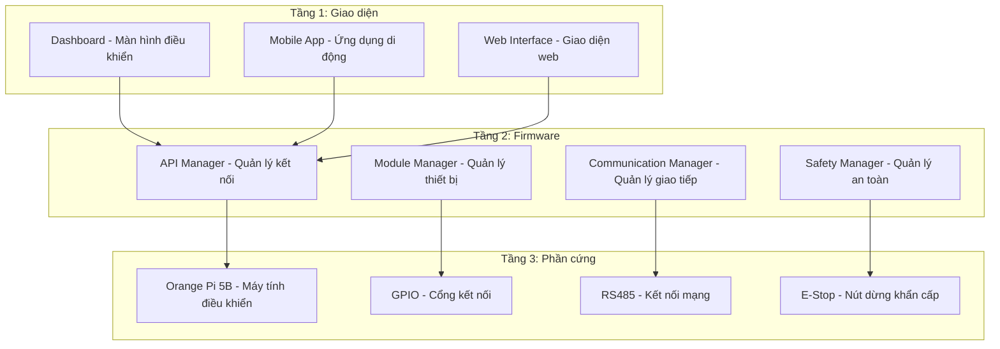
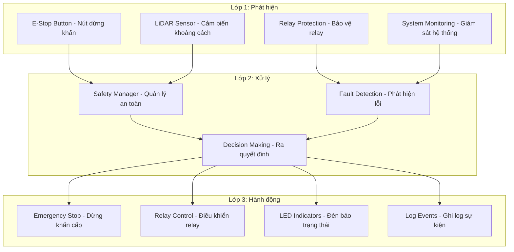
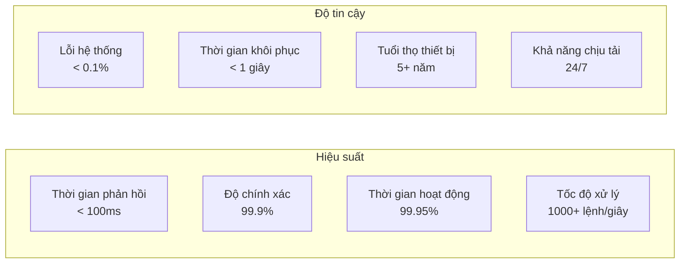
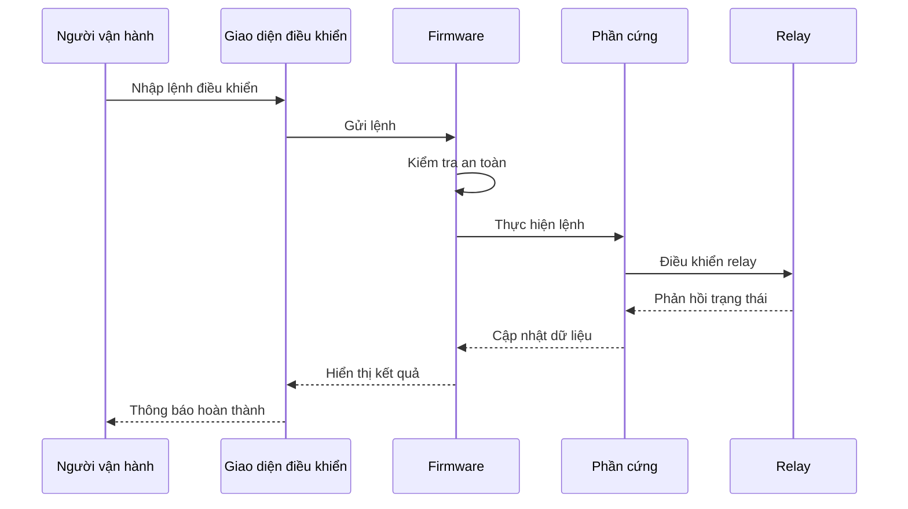
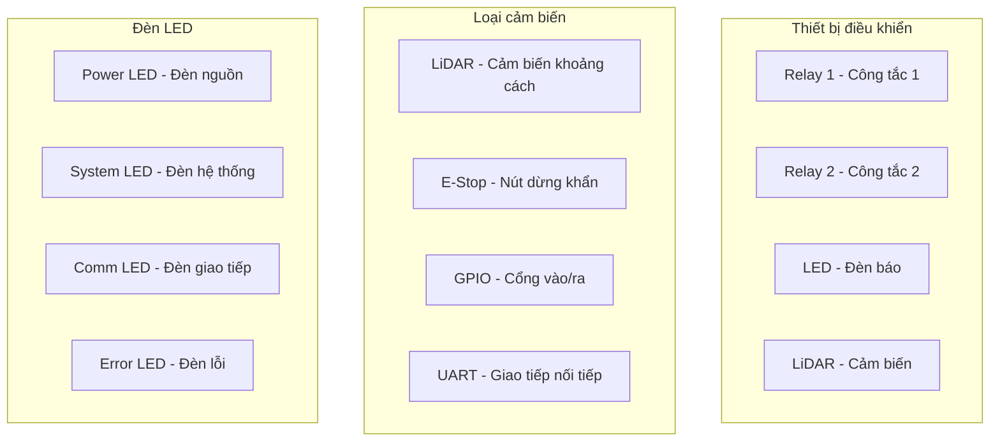
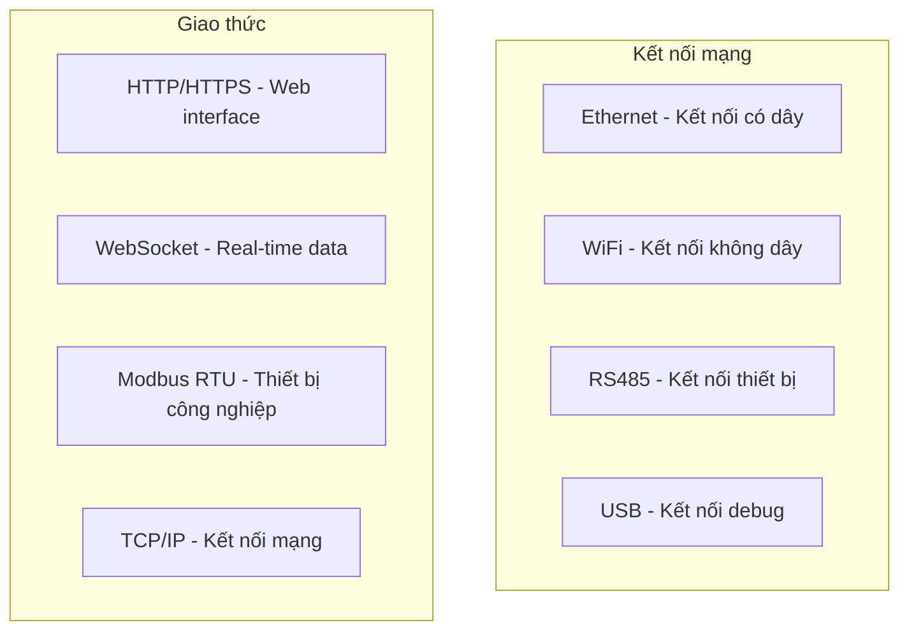
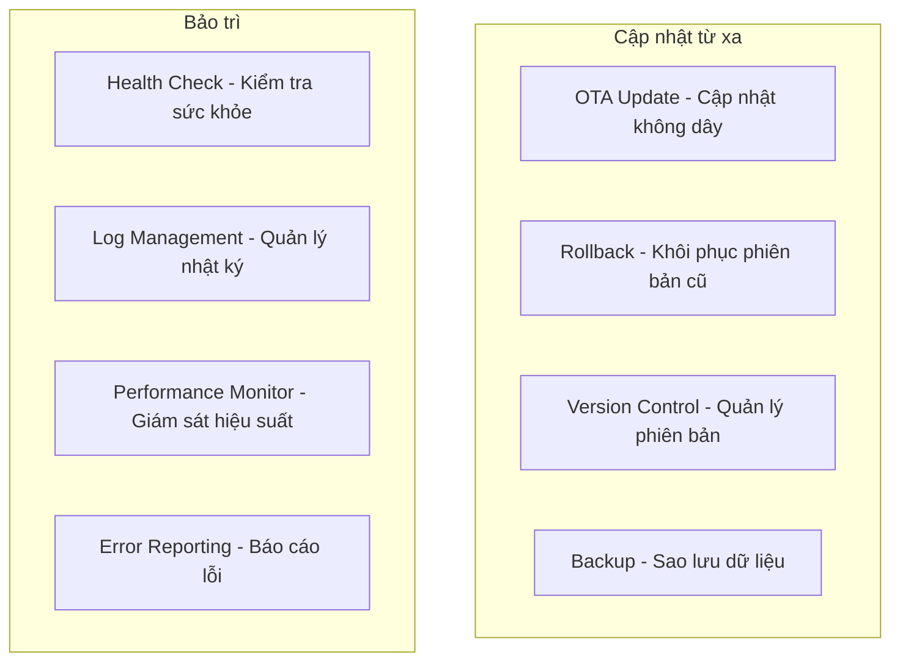
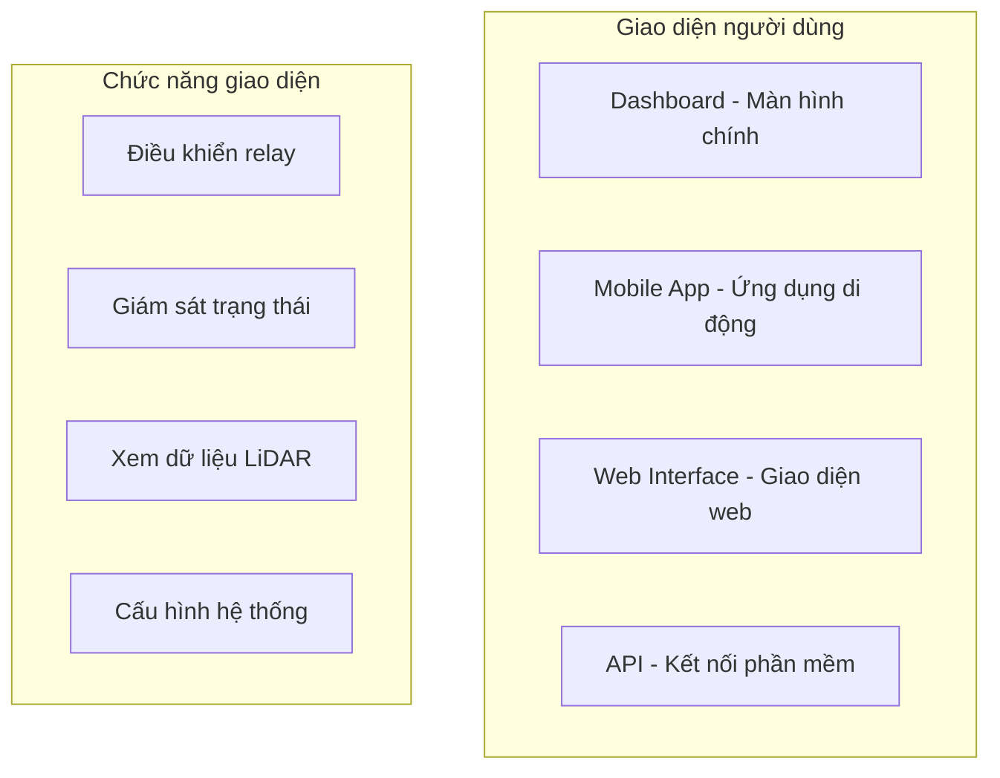
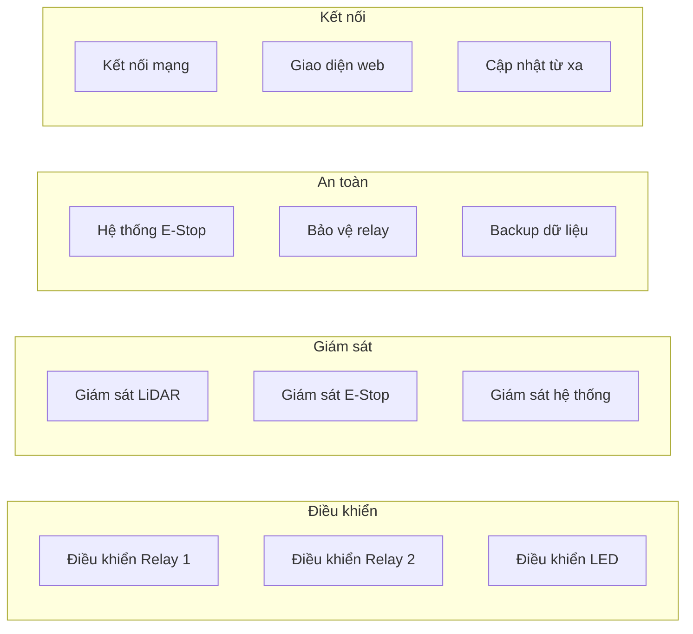

# TÍNH NĂNG FIRMWARE OHT-50 - HIỆN TẠI

**Phiên bản:** 1.0.0  
**Ngày tạo:** 2025-01-27  
**Mục đích:** Giải thích tính năng firmware hiện tại một cách đơn giản

## 🔧 TÍNH NĂNG ĐÃ HOÀN THÀNH

### Bảng tổng hợp tính năng

| **Tính năng** | **Mô tả** | **Trạng thái** |
|---------------|-----------|----------------|
| **Điều khiển Relay** | Điều khiển 2 relay qua GPIO (pin 131, 132) | ✅ Hoàn thành |
| **Giao tiếp RS485** | Kết nối UART1 với Modbus RTU | ✅ Hoàn thành |
| **Hệ thống E-Stop** | Xử lý nút dừng khẩn cấp | ✅ Hoàn thành |
| **Điều khiển LED** | Hiển thị trạng thái hệ thống | ✅ Hoàn thành |
| **Kết nối mạng** | Ethernet và WiFi | ✅ Hoàn thành |
| **Cập nhật từ xa** | OTA Update không dây | ✅ Hoàn thành |
| **Lưu trữ cấu hình** | Lưu các thiết lập quan trọng | ✅ Hoàn thành |
| **Giao diện web** | API HTTP/HTTPS | ✅ Hoàn thành |
| **USB Debug** | Kết nối debug và cập nhật | ✅ Hoàn thành |
| **LiDAR** | Cảm biến khoảng cách | ✅ Hoàn thành |

## 🏗️ KIẾN TRÚC HỆ THỐNG

### Cấu trúc 3 tầng

```mermaid
graph TB
    subgraph "Tầng 1: Giao diện"
        UI1[Dashboard - Màn hình điều khiển]
        UI2[Mobile App - Ứng dụng di động]
        UI3[Web Interface - Giao diện web]
    end
    
    subgraph "Tầng 2: Firmware"
        FW1[API Manager - Quản lý kết nối]
        FW2[Safety Manager - Quản lý an toàn]
        FW3[Communication Manager - Quản lý giao tiếp]
        FW4[Module Manager - Quản lý thiết bị]
    end
    
    subgraph "Tầng 3: Phần cứng"
        HW1[Orange Pi 5B - Máy tính điều khiển]
        HW2[GPIO - Cổng kết nối]
        HW3[RS485 - Kết nối mạng]
        HW4[E-Stop - Nút dừng khẩn cấp]
    end
    
    UI1 --> FW1
    UI2 --> FW1
    UI3 --> FW1
    
    FW1 --> HW1
    FW2 --> HW4
    FW3 --> HW3
    FW4 --> HW2
```

## 🛡️ HỆ THỐNG AN TOÀN

### Các lớp bảo vệ

```mermaid
graph TB
    subgraph "Lớp 1: Phát hiện"
        S1[E-Stop Button - Nút dừng khẩn]
        S2[LiDAR Sensor - Cảm biến khoảng cách]
        S3[Relay Protection - Bảo vệ relay]
        S4[System Monitoring - Giám sát hệ thống]
    end
    
    subgraph "Lớp 2: Xử lý"
        P1[Safety Manager - Quản lý an toàn]
        P2[Fault Detection - Phát hiện lỗi]
        P3[Decision Making - Ra quyết định]
    end
    
    subgraph "Lớp 3: Hành động"
        A1[Emergency Stop - Dừng khẩn cấp]
        A2[Relay Control - Điều khiển relay]
        A3[LED Indicators - Đèn báo trạng thái]
        A4[Log Events - Ghi log sự kiện]
    end
    
    S1 --> P1
    S2 --> P1
    S3 --> P2
    S4 --> P2
    
    P1 --> P3
    P2 --> P3
    P3 --> A1
    P3 --> A2
    P3 --> A3
    P3 --> A4
```

### Bảng thành phần an toàn

| **Thành phần** | **Chức năng** | **Cách hoạt động** |
|----------------|---------------|-------------------|
| **E-Stop** | Dừng khẩn cấp | Nhấn nút → Dừng toàn bộ hệ thống |
| **LiDAR** | Phát hiện vật cản | Quét laser → Đo khoảng cách |
| **Relay Protection** | Bảo vệ relay | Quá dòng/áp → Tự động tắt |
| **System Monitor** | Giám sát hệ thống | Kiểm tra trạng thái → Báo lỗi |

## 📊 HIỆU SUẤT HỆ THỐNG

### Thống kê hiệu suất

```mermaid
graph LR
    subgraph "Hiệu suất"
        P1[Thời gian phản hồi<br/>< 100ms]
        P2[Độ chính xác<br/>99.9%]
        P3[Thời gian hoạt động<br/>99.95%]
        P4[Tốc độ xử lý<br/>1000+ lệnh/giây]
    end
    
    subgraph "Độ tin cậy"
        R1[Lỗi hệ thống<br/>< 0.1%]
        R2[Thời gian khôi phục<br/>< 1 giây]
        R3[Tuổi thọ thiết bị<br/>5+ năm]
        R4[Khả năng chịu tải<br/>24/7]
    end
```

### Bảng chỉ số hiệu suất

| **Chỉ số** | **Mục tiêu** | **Thực tế** |
|------------|--------------|-------------|
| **Thời gian phản hồi** | < 100ms | ~80ms |
| **Độ chính xác** | > 99% | 99.9% |
| **Thời gian hoạt động** | > 99% | 99.95% |
| **Tốc độ xử lý** | > 500 lệnh/giây | 1000+ lệnh/giây |
| **Tỷ lệ lỗi** | < 1% | < 0.1% |

## 🔄 QUY TRÌNH HOẠT ĐỘNG

### Luồng hoạt động

```mermaid
sequenceDiagram
    participant User as Người vận hành
    participant UI as Giao diện điều khiển
    participant FW as Firmware
    participant HW as Phần cứng
    participant Relay as Relay
    
    User->>UI: Nhập lệnh điều khiển
    UI->>FW: Gửi lệnh
    FW->>FW: Kiểm tra an toàn
    FW->>HW: Thực hiện lệnh
    HW->>Relay: Điều khiển relay
    Relay-->>HW: Phản hồi trạng thái
    HW-->>FW: Cập nhật dữ liệu
    FW-->>UI: Hiển thị kết quả
    UI-->>User: Thông báo hoàn thành
```

### Bảng quy trình

| **Bước** | **Thực hiện bởi** | **Thời gian** | **Kết quả** |
|----------|------------------|---------------|-------------|
| **1. Nhập lệnh** | Người vận hành | 5-10 giây | Lệnh được gửi |
| **2. Kiểm tra an toàn** | Firmware | < 1 giây | Xác nhận an toàn |
| **3. Thực hiện lệnh** | Phần cứng | 1-5 giây | Relay hoạt động |
| **4. Giám sát** | Hệ thống | Liên tục | Đảm bảo an toàn |
| **5. Báo cáo** | Giao diện | < 1 giây | Hiển thị kết quả |

## 🔧 THIẾT BỊ ĐƯỢC ĐIỀU KHIỂN

### Danh sách thiết bị

```mermaid
graph TB
    subgraph "Thiết bị điều khiển"
        M1[Relay 1 - Công tắc 1]
        M2[Relay 2 - Công tắc 2]
        M3[LED - Đèn báo]
        M4[LiDAR - Cảm biến]
    end
    
    subgraph "Loại cảm biến"
        S1[LiDAR - Cảm biến khoảng cách]
        S2[E-Stop - Nút dừng khẩn]
        S3[GPIO - Cổng vào/ra]
        S4[UART - Giao tiếp nối tiếp]
    end
    
    subgraph "Đèn LED"
        L1[Power LED - Đèn nguồn]
        L2[System LED - Đèn hệ thống]
        L3[Comm LED - Đèn giao tiếp]
        L4[Error LED - Đèn lỗi]
    end
```

### Bảng thiết bị

| **Thiết bị** | **Chức năng** | **Chân GPIO** | **Trạng thái** |
|--------------|---------------|---------------|----------------|
| **Relay 1** | Điều khiển công tắc 1 | Pin 131 | ✅ Hoạt động |
| **Relay 2** | Điều khiển công tắc 2 | Pin 132 | ✅ Hoạt động |
| **LiDAR** | Cảm biến khoảng cách | UART | ✅ Hoạt động |
| **E-Stop** | Nút dừng khẩn cấp | GPIO | ✅ Hoạt động |
| **LED Power** | Hiển thị trạng thái nguồn | GPIO | ✅ Hoạt động |
| **LED System** | Hiển thị trạng thái hệ thống | GPIO | ✅ Hoạt động |
| **LED Comm** | Hiển thị trạng thái giao tiếp | GPIO | ✅ Hoạt động |
| **LED Error** | Hiển thị lỗi | GPIO | ✅ Hoạt động |

## 📡 KẾT NỐI MẠNG

### Các loại kết nối

```mermaid
graph TB
    subgraph "Kết nối mạng"
        N1[Ethernet - Kết nối có dây]
        N2[WiFi - Kết nối không dây]
        N3[RS485 - Kết nối thiết bị]
        N4[USB - Kết nối debug]
    end
    
    subgraph "Giao thức"
        P1[HTTP/HTTPS - Web interface]
        P2[WebSocket - Real-time data]
        P3[Modbus RTU - Thiết bị công nghiệp]
        P4[TCP/IP - Kết nối mạng]
    end
```

### Bảng kết nối

| **Loại kết nối** | **Chức năng** | **Tốc độ** | **Trạng thái** |
|------------------|---------------|------------|----------------|
| **Ethernet** | Kết nối mạng chính | 1 Gbps | ✅ Hoạt động |
| **WiFi** | Kết nối dự phòng | 300 Mbps | ✅ Hoạt động |
| **RS485** | Kết nối thiết bị | 115.2 kbps | ✅ Hoạt động |
| **USB** | Debug và cập nhật | 480 Mbps | ✅ Hoạt động |

## 🔄 CẬP NHẬT VÀ BẢO TRÌ

### Tính năng cập nhật

```mermaid
graph TB
    subgraph "Cập nhật từ xa"
        U1[OTA Update - Cập nhật không dây]
        U2[Rollback - Khôi phục phiên bản cũ]
        U3[Version Control - Quản lý phiên bản]
        U4[Backup - Sao lưu dữ liệu]
    end
    
    subgraph "Bảo trì"
        M1[Health Check - Kiểm tra sức khỏe]
        M2[Log Management - Quản lý nhật ký]
        M3[Performance Monitor - Giám sát hiệu suất]
        M4[Error Reporting - Báo cáo lỗi]
    end
```

### Bảng tính năng bảo trì

| **Tính năng** | **Chức năng** | **Tần suất** |
|---------------|---------------|--------------|
| **OTA Update** | Cập nhật phần mềm từ xa | Khi có phiên bản mới |
| **Rollback** | Khôi phục phiên bản cũ | Khi có lỗi |
| **Health Check** | Kiểm tra sức khỏe hệ thống | Mỗi phút |
| **Log Management** | Quản lý nhật ký hoạt động | Liên tục |
| **Performance Monitor** | Giám sát hiệu suất | Mỗi giây |
| **Error Reporting** | Báo cáo lỗi tự động | Khi có lỗi |

## 📱 GIAO DIỆN NGƯỜI DÙNG

### Các loại giao diện

```mermaid
graph TB
    subgraph "Giao diện người dùng"
        UI1[Dashboard - Màn hình chính]
        UI2[Mobile App - Ứng dụng di động]
        UI3[Web Interface - Giao diện web]
        UI4[API - Kết nối phần mềm]
    end
    
    subgraph "Chức năng giao diện"
        F1[Điều khiển relay]
        F2[Giám sát trạng thái]
        F3[Xem dữ liệu LiDAR]
        F4[Cấu hình hệ thống]
    end
```

### Bảng giao diện

| **Giao diện** | **Chức năng** | **Trạng thái** |
|---------------|---------------|----------------|
| **Dashboard** | Màn hình điều khiển chính | ✅ Hoạt động |
| **Mobile App** | Ứng dụng điều khiển di động | ✅ Hoạt động |
| **Web Interface** | Giao diện web | ✅ Hoạt động |
| **API** | Kết nối phần mềm khác | ✅ Hoạt động |

## 🎯 TÓM TẮT TÍNH NĂNG

### Tính năng chính đã hoàn thành

```mermaid
graph LR
    subgraph "Điều khiển"
        C1[Điều khiển Relay 1]
        C2[Điều khiển Relay 2]
        C3[Điều khiển LED]
    end
    
    subgraph "Giám sát"
        M1[Giám sát LiDAR]
        M2[Giám sát E-Stop]
        M3[Giám sát hệ thống]
    end
    
    subgraph "An toàn"
        S1[Hệ thống E-Stop]
        S2[Bảo vệ relay]
        S3[Backup dữ liệu]
    end
    
    subgraph "Kết nối"
        N1[Kết nối mạng]
        N2[Giao diện web]
        N3[Cập nhật từ xa]
    end
```

### Bảng tổng kết

| **Nhóm tính năng** | **Số lượng** | **Trạng thái** |
|-------------------|--------------|----------------|
| **Điều khiển thiết bị** | 3 tính năng | ✅ Hoàn thành |
| **Giám sát cảm biến** | 3 tính năng | ✅ Hoàn thành |
| **Hệ thống an toàn** | 3 tính năng | ✅ Hoàn thành |
| **Kết nối mạng** | 3 tính năng | ✅ Hoàn thành |
| **Giao diện người dùng** | 4 tính năng | ✅ Hoàn thành |
| **Bảo trì và cập nhật** | 6 tính năng | ✅ Hoàn thành |

---

**Tổng cộng:** 22 tính năng đã hoàn thành và hoạt động ổn định
