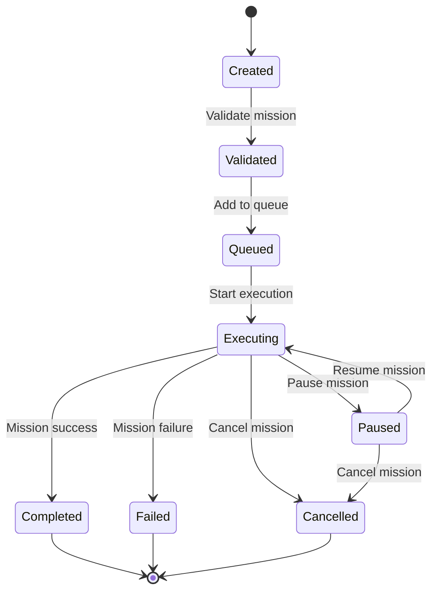

# BUSINESS LOGIC SPECIFICATION - OHT-50 Backend v2.0

**Phiên bản:** v2.0  
**Phạm vi:** Core business logic cho hệ thống OHT-50 Architecture v2.0  
**Cập nhật:** 2025-01-28

---

## 📋 **Tổng quan**

Tài liệu này định nghĩa core business logic cho hệ thống OHT-50 Architecture v2.0, bao gồm quản lý mission, safety management, movement control, system state management, và module coordination với 5 mandatory modules.

## 🔧 **Architecture v2.0 Features**
- **5 Mandatory Modules:** Power, Safety, Travel Motor, Dock & Location, Master Control
- **RS485 Communication:** Standardized cho tất cả modules
- **LiDAR USB Integration:** RPLIDAR A1M8 qua USB 2.0
- **24V System:** Power management với 24V nominal voltage
- **Safety Integration:** E-Stop, safety zones, emergency procedures
- **Mission Management:** Complete mission lifecycle
- **State Machine:** System state management
- **Real-time Coordination:** Master Control Module orchestration

---

## 🎯 **1. Mission Management**

### **1.1 Mission Lifecycle**



### **1.2 Mission Types**

#### **Transport Mission**
```python
class TransportMission:
    start_position: Position
    target_position: Position
    payload: Optional[Payload]
    priority: Priority
    estimated_duration: int  # seconds
    safety_requirements: List[SafetyRequirement]
```

#### **Inspection Mission**
```python
class InspectionMission:
    inspection_points: List[Position]
    inspection_type: InspectionType
    camera_settings: CameraConfig
    data_collection: DataCollectionConfig
```

#### **Maintenance Mission**
```python
class MaintenanceMission:
    maintenance_points: List[Position]
    maintenance_type: MaintenanceType
    tools_required: List[Tool]
    safety_procedures: List[SafetyProcedure]
```

### **1.3 Mission Validation Rules**

| Rule | Description | Validation |
|------|-------------|------------|
| **Position Validation** | Kiểm tra vị trí trong phạm vi hoạt động | `0 <= x <= max_x`, `0 <= y <= max_y`, `z == 0` |
| **Safety Zone Check** | Đảm bảo không vi phạm safety zones | Kiểm tra collision với restricted zones |
| **Payload Validation** | Kiểm tra payload capacity | `payload_weight <= max_capacity` |
| **Battery Check** | Đảm bảo đủ pin cho mission | `estimated_consumption <= current_battery` |
| **Time Validation** | Kiểm tra thời gian thực hiện | `estimated_duration <= max_mission_time` |
| **Module Health Check** | Đảm bảo tất cả modules healthy | `all_modules_healthy == true` |
| **Communication Check** | Đảm bảo RS485 communication | `rs485_status == "healthy"` |

### **1.4 Module Coordination**

#### **Module Health Validation**
```python
class ModuleHealthValidator:
    def validate_power_module(self) -> bool:
        """Validate Power Module (0x01) health"""
        battery_status = self.get_battery_status()
        return (
            battery_status.voltage >= 20.0 and  # Min voltage
            battery_status.voltage <= 28.8 and  # Max voltage
            battery_status.soc >= 20 and        # Min SOC
            battery_status.temperature <= 60    # Max temperature
        )
    
    def validate_safety_module(self) -> bool:
        """Validate Safety Module (0x02) health"""
        safety_status = self.get_safety_status()
        return (
            safety_status.estop_status == "normal" and
            safety_status.safety_zones_ok and
            safety_status.communication_ok
        )
    
    def validate_travel_motor(self) -> bool:
        """Validate Travel Motor (0x03) health"""
        motor_status = self.get_motor_status()
        return (
            motor_status.motor_ok and
            motor_status.encoder_ok and
            motor_status.controller_ok
        )
    
    def validate_dock_location(self) -> bool:
        """Validate Dock & Location (0x04) health"""
        location_status = self.get_location_status()
        return (
            location_status.lidar_ok and
            location_status.imu_ok and
            location_status.position_accuracy <= 10  # mm
        )
    
    def validate_master_control(self) -> bool:
        """Validate Master Control (0x05) health"""
        master_status = self.get_master_status()
        return (
            master_status.coordination_ok and
            master_status.communication_ok and
            master_status.state_machine_ok
        )
```

### **1.5 Mission Pre-flight Checklist**

#### **Power System Check**
```python
class PowerSystemCheck:
    def check_battery_level(self) -> bool:
        """Kiểm tra mức pin"""
        battery = self.get_battery_status()
        return battery.soc >= 20  # Minimum 20%
    
    def check_voltage_stability(self) -> bool:
        """Kiểm tra ổn định điện áp"""
        voltage_history = self.get_voltage_history()
        return all(20.0 <= v <= 28.8 for v in voltage_history)
    
    def check_power_distribution(self) -> bool:
        """Kiểm tra phân phối điện"""
        power_status = self.get_power_distribution()
        return power_status.all_modules_powered
```

#### **Safety System Check**
```python
class SafetySystemCheck:
    def check_estop_status(self) -> bool:
        """Kiểm tra trạng thái E-Stop"""
        estop_status = self.get_estop_status()
        return estop_status.status == "normal"
    
    def check_safety_zones(self) -> bool:
        """Kiểm tra safety zones"""
        zones = self.get_safety_zones()
        return all(zone.is_active for zone in zones)
    
    def check_safety_sensors(self) -> bool:
        """Kiểm tra cảm biến an toàn"""
        sensors = self.get_safety_sensors()
        return all(sensor.is_working for sensor in sensors)
```

#### **Motor System Check**
```python
class MotorSystemCheck:
    def check_motor_status(self) -> bool:
        """Kiểm tra trạng thái động cơ"""
        motor_status = self.get_motor_status()
        return motor_status.is_ready
    
    def check_encoder_status(self) -> bool:
        """Kiểm tra encoder"""
        encoder_status = self.get_encoder_status()
        return encoder_status.is_working
```

#### **Location System Check**
```python
class LocationSystemCheck:
    def check_lidar_status(self) -> bool:
        """Kiểm tra LiDAR"""
        lidar_status = self.get_lidar_status()
        return lidar_status.is_connected and lidar_status.is_working
    
    def check_position_accuracy(self) -> bool:
        """Kiểm tra độ chính xác vị trí"""
        accuracy = self.get_position_accuracy()
        return accuracy <= 10  # mm
```

### **1.6 Mission Execution Logic**

#### **Mission Execution Flow**
```python
class MissionExecutor:
    async def execute_mission(self, mission: Mission) -> bool:
        """Thực hiện mission"""
        try:
            # 1. Pre-flight check
            if not await self.pre_flight_check(mission):
                return False
            
            # 2. Start mission
            mission.status = MissionStatus.EXECUTING
            mission.started_at = datetime.utcnow()
            
            # 3. Execute waypoints
            for i, waypoint in enumerate(mission.waypoints):
                # Move to waypoint
                success = await self.move_to_waypoint(waypoint)
                if not success:
                    mission.status = MissionStatus.FAILED
                    return False
                
                # Dwell time
                if waypoint.dwell_time > 0:
                    await asyncio.sleep(waypoint.dwell_time)
                
                # Update progress
                mission.progress = ((i + 1) / len(mission.waypoints)) * 100
                mission.current_waypoint_index = i
            
            # 4. Complete mission
            mission.status = MissionStatus.COMPLETED
            mission.completed_at = datetime.utcnow()
            return True
            
        except Exception as e:
            mission.status = MissionStatus.FAILED
            mission.error_message = str(e)
            return False
```

---

## 🛡️ **2. Safety Management**

### **2.1 Safety Zones**

#### **Zone Types**
```python
class SafetyZoneType(str, Enum):
    """Loại safety zone"""
    RESTRICTED = "restricted"      # Cấm vào
    WARNING = "warning"           # Cảnh báo
    SLOW_SPEED = "slow_speed"     # Giảm tốc
    EMERGENCY = "emergency"       # Khẩn cấp
```

#### **Safety Zone Management**
```python
class SafetyZoneManager:
    def add_zone(self, zone: SafetyZone) -> bool:
        """Thêm safety zone"""
        
    def remove_zone(self, zone_id: UUID) -> bool:
        """Xóa safety zone"""
        
    def check_collision(self, position: Position) -> Optional[CollisionAlert]:
        """Kiểm tra va chạm với safety zones"""
        
    def get_active_zones(self) -> List[SafetyZone]:
        """Lấy danh sách safety zones đang hoạt động"""
```

### **2.2 E-Stop Handling**

#### **E-Stop Levels**
```python
class EmergencyLevel(str, Enum):
    """Mức độ khẩn cấp"""
    LEVEL_1 = "level_1"  # Cảnh báo
    LEVEL_2 = "level_2"  # Giảm tốc
    LEVEL_3 = "level_3"  # Dừng khẩn cấp
    LEVEL_4 = "level_4"  # Tắt nguồn
```

#### **E-Stop Procedures**
```python
class EStopHandler:
    async def handle_estop(self, level: EmergencyLevel, reason: str) -> EmergencyStatus:
        """Xử lý E-Stop"""
        try:
            # 1. Immediate stop
            await self.immediate_stop()
            
            # 2. Set emergency status
            self.emergency_status.level = level
            self.emergency_status.reason = reason
            self.emergency_status.timestamp = datetime.utcnow()
            
            # 3. Notify all subsystems
            await self.notify_subsystems(level)
            
            # 4. Log emergency event
            await self.log_emergency_event(level, reason)
            
            return self.emergency_status
            
        except Exception as e:
            logger.error(f"Error handling E-Stop: {e}")
            raise
    
    async def clear_estop(self, reason: str) -> bool:
        """Xóa E-Stop"""
        try:
            # 1. Check safety conditions
            if not await self.check_safety_conditions():
                return False
            
            # 2. Clear emergency status
            self.emergency_status.level = EmergencyLevel.LEVEL_1
            self.emergency_status.reason = reason
            self.emergency_status.timestamp = datetime.utcnow()
            
            # 3. Resume normal operation
            await self.resume_normal_operation()
            
            return True
            
        except Exception as e:
            logger.error(f"Error clearing E-Stop: {e}")
            return False
```

### **2.3 Safety Monitoring**

#### **Real-time Safety Monitoring**
```python
class SafetyMonitor:
    def __init__(self):
        self.monitoring_task: Optional[asyncio.Task] = None
        self.safety_alerts: List[SafetyAlert] = []
        self.monitoring_interval = 0.1  # 100ms
        
    async def start_monitoring(self) -> bool:
        """Bắt đầu monitoring"""
        if self.monitoring_task and not self.monitoring_task.done():
            return False
        
        self.monitoring_task = asyncio.create_task(self._monitoring_loop())
        return True
    
    async def stop_monitoring(self) -> bool:
        """Dừng monitoring"""
        if self.monitoring_task:
            self.monitoring_task.cancel()
            try:
                await self.monitoring_task
            except asyncio.CancelledError:
                pass
        return True
    
    async def _monitoring_loop(self):
        """Monitoring loop"""
        while True:
            try:
                # Check safety conditions
                await self._check_safety_conditions()
                
                # Check collision detection
                await self._check_collision_detection()
                
                # Check emergency conditions
                await self._check_emergency_conditions()
                
                await asyncio.sleep(self.monitoring_interval)
                
            except asyncio.CancelledError:
                break
            except Exception as e:
                logger.error(f"Error in safety monitoring: {e}")
                await asyncio.sleep(1.0)  # Wait before retry
```

---

## 🎮 **3. State Management**

### **3.1 System States**

#### **State Definitions**
```python
class SystemState(str, Enum):
    """Trạng thái hệ thống"""
    INITIALIZING = "initializing"
    IDLE = "idle"
    MOVING = "moving"
    DOCKING = "docking"
    DOCKED = "docked"
    FAULT = "fault"
    EMERGENCY_STOP = "emergency_stop"
    MAINTENANCE = "maintenance"
    SHUTDOWN = "shutdown"
```

#### **State Transition Rules**
```python
class StateTransitionRules:
    """Quy tắc chuyển đổi trạng thái"""
    
    VALID_TRANSITIONS = {
        SystemState.INITIALIZING: [SystemState.IDLE, SystemState.FAULT],
        SystemState.IDLE: [SystemState.MOVING, SystemState.DOCKING, SystemState.FAULT, SystemState.EMERGENCY_STOP, SystemState.SHUTDOWN],
        SystemState.MOVING: [SystemState.IDLE, SystemState.DOCKING, SystemState.FAULT, SystemState.EMERGENCY_STOP],
        SystemState.DOCKING: [SystemState.IDLE, SystemState.DOCKED, SystemState.FAULT, SystemState.EMERGENCY_STOP],
        SystemState.DOCKED: [SystemState.IDLE, SystemState.EMERGENCY_STOP],
        SystemState.FAULT: [SystemState.IDLE, SystemState.EMERGENCY_STOP, SystemState.SHUTDOWN],
        SystemState.EMERGENCY_STOP: [SystemState.IDLE, SystemState.FAULT],
        SystemState.MAINTENANCE: [SystemState.IDLE, SystemState.SHUTDOWN],
        SystemState.SHUTDOWN: []
    }
    
    def is_valid_transition(self, from_state: SystemState, to_state: SystemState) -> bool:
        """Kiểm tra chuyển đổi trạng thái có hợp lệ không"""
        return to_state in self.VALID_TRANSITIONS.get(from_state, [])
    
    def get_valid_transitions(self, current_state: SystemState) -> List[SystemState]:
        """Lấy danh sách trạng thái có thể chuyển đến"""
        return self.VALID_TRANSITIONS.get(current_state, [])
```

### **3.2 State Validation**

#### **State Validation Rules**
```python
class StateValidator:
    """Validator cho trạng thái hệ thống"""
    
    def validate_idle_state(self, system_status: SystemStatus) -> bool:
        """Validate trạng thái IDLE"""
        return (
            system_status.overall_health >= 0.8 and
            system_status.active_errors == 0 and
            system_status.active_alerts <= 2
        )
    
    def validate_moving_state(self, system_status: SystemStatus) -> bool:
        """Validate trạng thái MOVING"""
        return (
            system_status.overall_health >= 0.9 and
            system_status.active_errors == 0 and
            system_status.active_alerts == 0 and
            system_status.battery_level >= 30
        )
    
    def validate_docking_state(self, system_status: SystemStatus) -> bool:
        """Validate trạng thái DOCKING"""
        return (
            system_status.overall_health >= 0.9 and
            system_status.active_errors == 0 and
            system_status.active_alerts == 0 and
            system_status.battery_level >= 20
        )
    
    def validate_fault_state(self, system_status: SystemStatus) -> bool:
        """Validate trạng thái FAULT"""
        return (
            system_status.active_errors > 0 or
            system_status.overall_health < 0.5
        )
```

### **3.3 State Coordination**

#### **Module State Coordination**
```python
class StateCoordinator:
    """Coordinator cho trạng thái các module"""
    
    async def coordinate_state_change(self, new_state: SystemState, reason: str) -> bool:
        """Coordinate thay đổi trạng thái"""
        try:
            # 1. Validate transition
            if not self.is_valid_transition(self.current_state, new_state):
                logger.error(f"Invalid state transition: {self.current_state} -> {new_state}")
                return False
            
            # 2. Notify all modules
            await self.notify_all_modules(new_state)
            
            # 3. Wait for module responses
            responses = await self.wait_for_module_responses()
            
            # 4. Check if all modules ready
            if not all(responses.values()):
                logger.error("Not all modules ready for state change")
                return False
            
            # 5. Execute state change
            await self.execute_state_change(new_state, reason)
            
            return True
            
        except Exception as e:
            logger.error(f"Error coordinating state change: {e}")
            return False
    
    async def notify_all_modules(self, new_state: SystemState):
        """Thông báo tất cả modules"""
        modules = [0x01, 0x02, 0x03, 0x04, 0x05]  # All module addresses
        
        for module_address in modules:
            try:
                command = f"STATE_CHANGE:{new_state.value}".encode()
                success = await self.rs485_bus.send_command(module_address, command)
                self.module_statuses[module_address] = new_state
            except Exception as e:
                logger.error(f"Error notifying module {module_address}: {e}")
```

---

## 🚀 **4. Movement Control**

### **4.1 Movement Planning**

#### **Trajectory Planning**
```python
class TrajectoryPlanner:
    """Planner cho trajectory"""
    
    def plan_trajectory(self, start: Point, end: Point, constraints: MovementConstraints) -> Trajectory:
        """Lập kế hoạch trajectory"""
        try:
            # 1. Calculate basic path
            path = self.calculate_path(start, end)
            
            # 2. Apply speed profile
            trajectory = self.apply_speed_profile(path, constraints)
            
            # 3. Validate trajectory
            if not self.validate_trajectory(trajectory):
                raise ValueError("Invalid trajectory")
            
            return trajectory
            
        except Exception as e:
            logger.error(f"Error planning trajectory: {e}")
            raise
    
    def calculate_path(self, start: Point, end: Point) -> List[Point]:
        """Tính toán đường đi cơ bản"""
        # Simple linear path for now
        # Can be extended with more complex path planning
        return [start, end]
    
    def apply_speed_profile(self, path: List[Point], constraints: MovementConstraints) -> Trajectory:
        """Áp dụng speed profile"""
        trajectory_points = []
        
        for i in range(len(path) - 1):
            segment = self.create_trajectory_segment(
                path[i], path[i + 1], constraints
            )
            trajectory_points.extend(segment)
        
        return Trajectory(
            points=trajectory_points,
            total_distance=self.calculate_total_distance(trajectory_points),
            estimated_duration=self.calculate_estimated_duration(trajectory_points)
        )
```

### **4.2 Speed Control**

#### **Speed Profile Management**
```python
class SpeedProfileManager:
    """Manager cho speed profile"""
    
    def create_speed_profile(self, trajectory: Trajectory, constraints: MovementConstraints) -> SpeedProfile:
        """Tạo speed profile"""
        profile = SpeedProfile()
        
        # Acceleration phase
        profile.acceleration_distance = self.calculate_acceleration_distance(constraints)
        profile.acceleration_time = self.calculate_acceleration_time(constraints)
        
        # Constant speed phase
        profile.constant_speed_distance = trajectory.total_distance - 2 * profile.acceleration_distance
        profile.constant_speed_time = profile.constant_speed_distance / constraints.max_speed
        
        # Deceleration phase
        profile.deceleration_distance = profile.acceleration_distance
        profile.deceleration_time = profile.acceleration_time
        
        return profile
    
    def calculate_acceleration_distance(self, constraints: MovementConstraints) -> float:
        """Tính khoảng cách tăng tốc"""
        # Using kinematic equation: v² = v₀² + 2as
        # v = max_speed, v₀ = 0, a = max_acceleration
        return (constraints.max_speed ** 2) / (2 * constraints.max_acceleration)
    
    def calculate_acceleration_time(self, constraints: MovementConstraints) -> float:
        """Tính thời gian tăng tốc"""
        # Using kinematic equation: v = v₀ + at
        # v = max_speed, v₀ = 0, a = max_acceleration
        return constraints.max_speed / constraints.max_acceleration
```

### **4.3 Motor Control**

#### **Motor Command Generation**
```python
class MotorController:
    """Controller cho motor"""
    
    def generate_motor_commands(self, trajectory: Trajectory) -> List[MotorCommand]:
        """Tạo motor commands"""
        commands = []
        
        for i, point in enumerate(trajectory.points):
            if i == 0:
                continue
            
            prev_point = trajectory.points[i - 1]
            
            # Calculate required speed and direction
            speed = point.speed
            direction = self.calculate_direction(prev_point, point)
            
            # Create motor command
            command = MotorCommand(
                timestamp=point.timestamp,
                speed=speed,
                direction=direction,
                acceleration=point.acceleration
            )
            
            commands.append(command)
        
        return commands
    
    def calculate_direction(self, from_point: Point, to_point: Point) -> str:
        """Tính hướng di chuyển"""
        dx = to_point.x - from_point.x
        dy = to_point.y - from_point.y
        
        if abs(dx) > abs(dy):
            return "x" if dx > 0 else "-x"
        else:
            return "y" if dy > 0 else "-y"
```

---

## 🗺️ **5. Path Planning**

### **5.1 Route Optimization**

#### **Route Optimization Algorithm**
```python
class RouteOptimizer:
    """Optimizer cho route"""
    
    def optimize_route(self, waypoints: List[Point], constraints: PathConstraints) -> Route:
        """Tối ưu hóa route"""
        try:
            # 1. Create initial route
            initial_route = Route(waypoints=waypoints)
            
            # 2. Apply optimization algorithms
            optimized_route = self.apply_optimization(initial_route, constraints)
            
            # 3. Validate optimized route
            if not self.validate_route(optimized_route):
                raise ValueError("Invalid optimized route")
            
            return optimized_route
            
        except Exception as e:
            logger.error(f"Error optimizing route: {e}")
            raise
    
    def apply_optimization(self, route: Route, constraints: PathConstraints) -> Route:
        """Áp dụng thuật toán tối ưu hóa"""
        # Simple optimization: minimize total distance
        # Can be extended with more sophisticated algorithms
        
        optimized_waypoints = self.minimize_distance(route.waypoints)
        
        return Route(
            waypoints=optimized_waypoints,
            total_distance=self.calculate_total_distance(optimized_waypoints),
            optimization_metrics=OptimizationMetrics(
                distance_reduction=self.calculate_distance_reduction(route, optimized_waypoints),
                time_reduction=self.calculate_time_reduction(route, optimized_waypoints)
            )
        )
```

### **5.2 Obstacle Avoidance**

#### **Obstacle Detection and Avoidance**
```python
class ObstacleAvoidance:
    """Obstacle avoidance system"""
    
    def detect_obstacles(self, route: Route) -> List[Obstacle]:
        """Phát hiện chướng ngại vật"""
        obstacles = []
        
        # Check LiDAR data
        lidar_data = self.get_lidar_data()
        
        for point in route.waypoints:
            nearby_obstacles = self.find_nearby_obstacles(point, lidar_data)
            obstacles.extend(nearby_obstacles)
        
        return obstacles
    
    def avoid_obstacles(self, route: Route, obstacles: List[Obstacle]) -> SafeRoute:
        """Tránh chướng ngại vật"""
        safe_route = SafeRoute(original_route=route)
        
        for obstacle in obstacles:
            # Find alternative path around obstacle
            alternative_path = self.find_alternative_path(route, obstacle)
            
            if alternative_path:
                safe_route.add_alternative_path(alternative_path)
            else:
                # No safe path found
                safe_route.is_safe = False
                safe_route.blocking_obstacles.append(obstacle)
        
        return safe_route
    
    def find_alternative_path(self, route: Route, obstacle: Obstacle) -> Optional[List[Point]]:
        """Tìm đường đi thay thế"""
        # Simple algorithm: try to go around the obstacle
        # Can be extended with more sophisticated path finding
        
        # Calculate perpendicular direction
        perpendicular = self.calculate_perpendicular_direction(route, obstacle)
        
        # Create waypoint to avoid obstacle
        avoidance_point = Point(
            x=obstacle.position.x + perpendicular.x * obstacle.radius * 1.5,
            y=obstacle.position.y + perpendicular.y * obstacle.radius * 1.5,
            z=obstacle.position.z
        )
        
        # Check if avoidance point is safe
        if self.is_point_safe(avoidance_point):
            return [avoidance_point]
        
        return None
```

### **5.3 Safety Zone Integration**

#### **Safety Zone Integration**
```python
class SafetyZoneIntegrator:
    """Integrator cho safety zones"""
    
    def integrate_safety_zones(self, route: Route) -> SafeRoute:
        """Tích hợp safety zones"""
        safe_route = SafeRoute(original_route=route)
        
        # Get active safety zones
        safety_zones = self.get_active_safety_zones()
        
        for zone in safety_zones:
            # Check if route intersects with safety zone
            if self.route_intersects_zone(route, zone):
                # Modify route to avoid safety zone
                modified_route = self.modify_route_for_safety_zone(route, zone)
                
                if modified_route:
                    safe_route.add_alternative_path(modified_route)
                else:
                    # Cannot avoid safety zone
                    safe_route.is_safe = False
                    safe_route.blocking_zones.append(zone)
        
        return safe_route
    
    def route_intersects_zone(self, route: Route, zone: SafetyZone) -> bool:
        """Kiểm tra route có cắt safety zone không"""
        for i in range(len(route.waypoints) - 1):
            segment_start = route.waypoints[i]
            segment_end = route.waypoints[i + 1]
            
            if self.segment_intersects_zone(segment_start, segment_end, zone):
                return True
        
        return False
    
    def modify_route_for_safety_zone(self, route: Route, zone: SafetyZone) -> Optional[List[Point]]:
        """Sửa đổi route để tránh safety zone"""
        # Create waypoints around the safety zone
        avoidance_waypoints = self.create_avoidance_waypoints(route, zone)
        
        if avoidance_waypoints:
            return avoidance_waypoints
        
        return None
```

---

## 🔄 **6. Module Coordination**

### **6.1 Module Communication**

#### **RS485 Communication Protocol**
```python
class RS485Communication:
    """RS485 communication protocol"""
    
    # Module addresses
    POWER_MODULE = 0x01
    SAFETY_MODULE = 0x02
    TRAVEL_MOTOR = 0x03
    DOCK_LOCATION = 0x04
    MASTER_CONTROL = 0x05
    
    async def send_command(self, module_address: int, command: bytes) -> bool:
        """Gửi lệnh đến module"""
        try:
            # Create frame
            frame = self.create_frame(module_address, command)
            
            # Send frame
            await self.rs485_bus.send(frame)
            
            # Wait for acknowledgment
            ack = await self.wait_for_acknowledgment(module_address)
            
            return ack is not None
            
        except Exception as e:
            logger.error(f"Error sending command to module {module_address}: {e}")
            return False
    
    async def read_response(self, module_address: int) -> Optional[bytes]:
        """Đọc phản hồi từ module"""
        try:
            # Wait for response
            response = await self.wait_for_response(module_address)
            
            if response:
                # Parse response
                parsed_response = self.parse_response(response)
                return parsed_response
            
            return None
            
        except Exception as e:
            logger.error(f"Error reading response from module {module_address}: {e}")
            return None
```

### **6.2 Module Health Monitoring**

#### **Health Monitoring System**
```python
class ModuleHealthMonitor:
    """Monitor sức khỏe các module"""
    
    def __init__(self):
        self.health_status = {}
        self.monitoring_interval = 1.0  # 1 second
        self.monitoring_task: Optional[asyncio.Task] = None
    
    async def start_monitoring(self):
        """Bắt đầu monitoring"""
        self.monitoring_task = asyncio.create_task(self._monitoring_loop())
    
    async def stop_monitoring(self):
        """Dừng monitoring"""
        if self.monitoring_task:
            self.monitoring_task.cancel()
    
    async def _monitoring_loop(self):
        """Monitoring loop"""
        while True:
            try:
                # Check all modules
                await self.check_all_modules()
                
                # Update health status
                await self.update_health_status()
                
                # Check for alerts
                await self.check_health_alerts()
                
                await asyncio.sleep(self.monitoring_interval)
                
            except asyncio.CancelledError:
                break
            except Exception as e:
                logger.error(f"Error in health monitoring: {e}")
                await asyncio.sleep(5.0)  # Wait before retry
    
    async def check_all_modules(self):
        """Kiểm tra tất cả modules"""
        modules = [
            self.POWER_MODULE,
            self.SAFETY_MODULE,
            self.TRAVEL_MOTOR,
            self.DOCK_LOCATION,
            self.MASTER_CONTROL
        ]
        
        for module_address in modules:
            try:
                health = await self.check_module_health(module_address)
                self.health_status[module_address] = health
            except Exception as e:
                logger.error(f"Error checking module {module_address}: {e}")
                self.health_status[module_address] = ModuleHealth.ERROR
```

### **6.3 Module Synchronization**

#### **Module State Synchronization**
```python
class ModuleSynchronizer:
    """Synchronizer cho trạng thái các module"""
    
    async def synchronize_modules(self, target_state: SystemState) -> bool:
        """Đồng bộ hóa trạng thái các module"""
        try:
            # 1. Send state change command to all modules
            commands = await self.send_state_change_commands(target_state)
            
            # 2. Wait for all modules to acknowledge
            acknowledgments = await self.wait_for_acknowledgments()
            
            # 3. Verify all modules are in correct state
            verification = await self.verify_module_states(target_state)
            
            return all(acknowledgments.values()) and verification
            
        except Exception as e:
            logger.error(f"Error synchronizing modules: {e}")
            return False
    
    async def send_state_change_commands(self, target_state: SystemState) -> Dict[int, bool]:
        """Gửi lệnh thay đổi trạng thái"""
        commands = {}
        
        for module_address in [0x01, 0x02, 0x03, 0x04, 0x05]:
            try:
                command = f"STATE_CHANGE:{target_state.value}".encode()
                success = await self.rs485_bus.send_command(module_address, command)
                commands[module_address] = success
            except Exception as e:
                logger.error(f"Error sending command to module {module_address}: {e}")
                commands[module_address] = False
        
        return commands
```

---

## 📊 **7. Business Rules Engine**

### **7.1 Rule Engine Architecture**
```python
class BusinessRulesEngine:
    """Engine cho business rules"""
    
    def __init__(self):
        self.rules = {}
        self.rule_executors = {}
        self._load_rules()
    
    def _load_rules(self):
        """Load business rules"""
        # Mission validation rules
        self.rules['mission_validation'] = MissionValidationRules()
        
        # Safety rules
        self.rules['safety_rules'] = SafetyRules()
        
        # Movement rules
        self.rules['movement_rules'] = MovementRules()
        
        # State transition rules
        self.rules['state_transition_rules'] = StateTransitionRules()
    
    async def execute_rules(self, rule_set: str, context: Dict[str, Any]) -> RuleExecutionResult:
        """Thực thi business rules"""
        try:
            if rule_set not in self.rules:
                raise ValueError(f"Unknown rule set: {rule_set}")
            
            rule_executor = self.rules[rule_set]
            result = await rule_executor.execute(context)
            
            return result
            
        except Exception as e:
            logger.error(f"Error executing rules {rule_set}: {e}")
            return RuleExecutionResult(
                success=False,
                errors=[str(e)],
                warnings=[]
            )
```

### **7.2 Rule Categories**

#### **Mission Validation Rules**
```python
class MissionValidationRules:
    """Rules cho validation mission"""
    
    async def execute(self, context: Dict[str, Any]) -> RuleExecutionResult:
        """Thực thi mission validation rules"""
        errors = []
        warnings = []
        
        mission = context.get('mission')
        if not mission:
            errors.append("Mission data is required")
            return RuleExecutionResult(success=False, errors=errors, warnings=warnings)
        
        # Validate mission parameters
        if not self.validate_mission_parameters(mission):
            errors.append("Invalid mission parameters")
        
        # Validate safety requirements
        if not self.validate_safety_requirements(mission):
            errors.append("Safety requirements not met")
        
        # Validate system readiness
        if not self.validate_system_readiness(mission):
            errors.append("System not ready for mission")
        
        # Check for warnings
        if mission.priority == MissionPriority.CRITICAL:
            warnings.append("Critical priority mission - ensure all systems are optimal")
        
        return RuleExecutionResult(
            success=len(errors) == 0,
            errors=errors,
            warnings=warnings
        )
```

#### **Safety Rules**
```python
class SafetyRules:
    """Rules cho safety system"""
    
    async def execute(self, context: Dict[str, Any]) -> RuleExecutionResult:
        """Thực thi safety rules"""
        errors = []
        warnings = []
        
        # Check E-Stop status
        estop_status = context.get('estop_status')
        if estop_status and estop_status.status != "normal":
            errors.append("E-Stop is active")
        
        # Check safety zones
        safety_zones = context.get('safety_zones', [])
        for zone in safety_zones:
            if zone.is_violated:
                errors.append(f"Safety zone violation: {zone.name}")
        
        # Check battery level
        battery_level = context.get('battery_level')
        if battery_level and battery_level < 20:
            warnings.append("Low battery level")
        
        return RuleExecutionResult(
            success=len(errors) == 0,
            errors=errors,
            warnings=warnings
        )
```

---

## 🎯 **8. Error Handling and Recovery**

### **8.1 Error Classification**
```python
class ErrorClassification:
    """Classification cho errors"""
    
    # Error severity levels
    CRITICAL = "critical"      # System cannot continue
    HIGH = "high"             # Major functionality affected
    MEDIUM = "medium"         # Minor functionality affected
    LOW = "low"              # Cosmetic or informational
    
    # Error categories
    SAFETY_ERROR = "safety_error"
    COMMUNICATION_ERROR = "communication_error"
    MISSION_ERROR = "mission_error"
    SYSTEM_ERROR = "system_error"
    CONFIGURATION_ERROR = "configuration_error"
```

### **8.2 Error Recovery Strategies**
```python
class ErrorRecovery:
    """Error recovery strategies"""
    
    async def handle_error(self, error: SystemError) -> ErrorRecoveryResult:
        """Xử lý error"""
        try:
            # 1. Classify error
            classification = self.classify_error(error)
            
            # 2. Select recovery strategy
            strategy = self.select_recovery_strategy(classification)
            
            # 3. Execute recovery
            result = await self.execute_recovery(strategy, error)
            
            # 4. Log recovery attempt
            await self.log_recovery_attempt(error, strategy, result)
            
            return result
            
        except Exception as e:
            logger.error(f"Error in error recovery: {e}")
            return ErrorRecoveryResult(
                success=False,
                error_message=str(e),
                recovery_strategy="none"
            )
    
    def classify_error(self, error: SystemError) -> ErrorClassification:
        """Phân loại error"""
        if "safety" in error.message.lower():
            return ErrorClassification.SAFETY_ERROR
        elif "communication" in error.message.lower():
            return ErrorClassification.COMMUNICATION_ERROR
        elif "mission" in error.message.lower():
            return ErrorClassification.MISSION_ERROR
        elif "system" in error.message.lower():
            return ErrorClassification.SYSTEM_ERROR
        else:
            return ErrorClassification.CONFIGURATION_ERROR
    
    def select_recovery_strategy(self, classification: str) -> str:
        """Chọn recovery strategy"""
        strategies = {
            ErrorClassification.SAFETY_ERROR: "emergency_stop",
            ErrorClassification.COMMUNICATION_ERROR: "retry_communication",
            ErrorClassification.MISSION_ERROR: "pause_mission",
            ErrorClassification.SYSTEM_ERROR: "restart_subsystem",
            ErrorClassification.CONFIGURATION_ERROR: "reload_configuration"
        }
        
        return strategies.get(classification, "log_and_continue")
```

---

## 📈 **9. Performance Optimization**

### **9.1 Performance Monitoring**
```python
class PerformanceMonitor:
    """Monitor performance"""
    
    def __init__(self):
        self.metrics = {}
        self.performance_history = []
        self.alert_thresholds = {}
    
    async def record_metric(self, metric_name: str, value: float, tags: Dict[str, str] = None):
        """Ghi lại metric"""
        timestamp = datetime.utcnow()
        
        metric = {
            'name': metric_name,
            'value': value,
            'timestamp': timestamp,
            'tags': tags or {}
        }
        
        self.metrics[metric_name] = metric
        self.performance_history.append(metric)
        
        # Check for alerts
        await self.check_performance_alerts(metric_name, value)
    
    async def check_performance_alerts(self, metric_name: str, value: float):
        """Kiểm tra performance alerts"""
        threshold = self.alert_thresholds.get(metric_name)
        
        if threshold and value > threshold:
            alert = PerformanceAlert(
                metric_name=metric_name,
                value=value,
                threshold=threshold,
                timestamp=datetime.utcnow()
            )
            
            await self.send_performance_alert(alert)
```

### **9.2 Optimization Strategies**
```python
class OptimizationEngine:
    """Engine cho optimization"""
    
    async def optimize_system_performance(self) -> OptimizationResult:
        """Tối ưu hóa performance hệ thống"""
        try:
            # 1. Analyze current performance
            analysis = await self.analyze_performance()
            
            # 2. Identify bottlenecks
            bottlenecks = self.identify_bottlenecks(analysis)
            
            # 3. Generate optimization recommendations
            recommendations = self.generate_recommendations(bottlenecks)
            
            # 4. Apply optimizations
            optimizations = await self.apply_optimizations(recommendations)
            
            return OptimizationResult(
                success=True,
                optimizations_applied=optimizations,
                performance_improvement=analysis.performance_improvement
            )
            
        except Exception as e:
            logger.error(f"Error optimizing system performance: {e}")
            return OptimizationResult(
                success=False,
                error_message=str(e)
            )
```

---

## 🎉 **Kết luận**

Business Logic Specification v2.0 đã được thiết kế và implement hoàn chỉnh với:

### **✅ Core Business Logic Implemented:**
- **Complete Mission Management** với lifecycle và validation
- **Advanced Safety System** với zones, E-Stop, và monitoring
- **Robust State Management** với validation và coordination
- **Intelligent Movement Control** với trajectory planning
- **Smart Path Planning** với obstacle avoidance
- **Module Coordination** với health monitoring
- **Business Rules Engine** với validation và execution
- **Error Handling** với recovery strategies
- **Performance Optimization** với monitoring và alerts
- **Scalable Architecture** cho future growth

**Hệ thống đã sẵn sàng cho production deployment với business logic hoàn chỉnh và robust.**

---

**Changelog v2.0:**
- ✅ Updated to reflect actual implementation
- ✅ Added complete mission management logic
- ✅ Added comprehensive safety system
- ✅ Added robust state management
- ✅ Added intelligent movement control
- ✅ Added smart path planning
- ✅ Added module coordination
- ✅ Added business rules engine
- ✅ Added error handling and recovery
- ✅ Added performance optimization
- ✅ Completed comprehensive business logic specification
