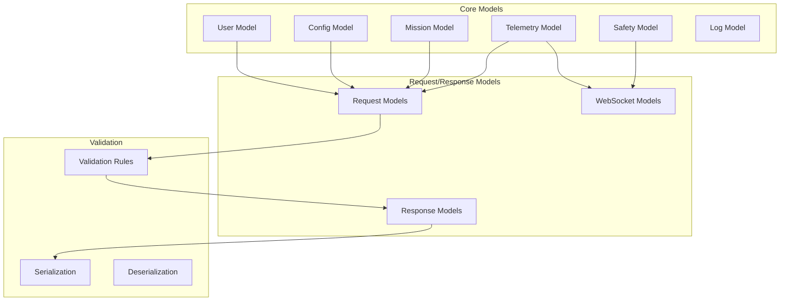

# Data Models - OHT-50 Backend

## 📋 Tổng quan
Tài liệu này mô tả các data models được sử dụng trong OHT-50 Backend, bao gồm Pydantic models, validation rules và serialization schemas.

## 🏗️ Model Architecture



## 🔧 Core Data Models

### 1. User Model
```python
from pydantic import BaseModel, EmailStr, Field, validator
from typing import Optional, List
from datetime import datetime
from enum import Enum

class UserRole(str, Enum):
    SUPER_ADMIN = "super_admin"
    ADMIN = "admin"
    OPERATOR = "operator"
    VIEWER = "viewer"
    SYSTEM = "system"

class UserBase(BaseModel):
    username: str = Field(..., min_length=3, max_length=50, regex=r'^[a-zA-Z0-9_]+$')
    email: EmailStr
    role: UserRole = UserRole.VIEWER
    is_active: bool = True

class UserCreate(UserBase):
    password: str = Field(..., min_length=8, max_length=128)
    
    @validator('password')
    def validate_password(cls, v):
        if not any(c.isupper() for c in v):
            raise ValueError('Password must contain at least one uppercase letter')
        if not any(c.islower() for c in v):
            raise ValueError('Password must contain at least one lowercase letter')
        if not any(c.isdigit() for c in v):
            raise ValueError('Password must contain at least one digit')
        return v

class UserUpdate(BaseModel):
    username: Optional[str] = Field(None, min_length=3, max_length=50)
    email: Optional[EmailStr] = None
    role: Optional[UserRole] = None
    is_active: Optional[bool] = None

class UserResponse(UserBase):
    id: int
    created_at: datetime
    updated_at: datetime
    
    class Config:
        from_attributes = True

class UserInDB(UserResponse):
    password_hash: str
```

### 2. Configuration Model
```python
from pydantic import BaseModel, Field, validator
from typing import Optional, Union, Dict, Any
from datetime import datetime
from enum import Enum

class ConfigType(str, Enum):
    STRING = "string"
    NUMBER = "number"
    BOOLEAN = "boolean"
    JSON = "json"
    YAML = "yaml"

class ConfigBase(BaseModel):
    config_key: str = Field(..., min_length=1, max_length=100, regex=r'^[a-zA-Z0-9._-]+$')
    config_value: str
    config_type: ConfigType = ConfigType.STRING
    version: str = Field(default="1.0.0", regex=r'^\d+\.\d+\.\d+$')
    is_active: bool = True

class ConfigCreate(ConfigBase):
    pass

class ConfigUpdate(BaseModel):
    config_value: Optional[str] = None
    config_type: Optional[ConfigType] = None
    version: Optional[str] = Field(None, regex=r'^\d+\.\d+\.\d+$')
    is_active: Optional[bool] = None

class ConfigResponse(ConfigBase):
    id: int
    created_at: datetime
    updated_at: datetime
    created_by: Optional[int] = None
    
    class Config:
        from_attributes = True

class ConfigBulkUpdate(BaseModel):
    configs: List[Dict[str, Any]] = Field(..., min_items=1, max_items=100)
    
    @validator('configs')
    def validate_configs(cls, v):
        for config in v:
            if 'config_key' not in config:
                raise ValueError('Each config must have config_key')
            if 'config_value' not in config:
                raise ValueError('Each config must have config_value')
        return v
```

### 3. Mission Model
```python
from pydantic import BaseModel, Field, validator, root_validator
from typing import Optional, Dict, Any, List
from datetime import datetime
from enum import Enum

class MissionType(str, Enum):
    MOVE_TO = "move_to"
    DOCK = "dock"
    UNDOCK = "undock"
    EMERGENCY_STOP = "emergency_stop"
    CALIBRATE = "calibrate"

class MissionStatus(str, Enum):
    PENDING = "pending"
    RUNNING = "running"
    COMPLETED = "completed"
    FAILED = "failed"
    CANCELLED = "cancelled"

class Position(BaseModel):
    x: float = Field(..., ge=-10000, le=10000)
    y: float = Field(..., ge=-10000, le=10000)
    z: float = Field(..., ge=-1000, le=1000)
    theta: float = Field(..., ge=-3.14159, le=3.14159)

class MissionParameters(BaseModel):
    target_position: Optional[Position] = None
    speed: Optional[float] = Field(None, ge=0, le=1000)
    acceleration: Optional[float] = Field(None, ge=0, le=500)
    precision: Optional[float] = Field(None, ge=0.1, le=10.0)
    timeout: Optional[int] = Field(None, ge=1, le=3600)
    retry_attempts: Optional[int] = Field(None, ge=0, le=5)
    target_station: Optional[str] = None

class MissionBase(BaseModel):
    mission_type: MissionType
    parameters: MissionParameters
    priority: int = Field(default=1, ge=1, le=10)

class MissionCreate(MissionBase):
    pass

class MissionUpdate(BaseModel):
    status: Optional[MissionStatus] = None
    error_message: Optional[str] = None
    started_at: Optional[datetime] = None
    completed_at: Optional[datetime] = None

class MissionResponse(MissionBase):
    id: int
    mission_id: str
    status: MissionStatus
    created_at: datetime
    started_at: Optional[datetime] = None
    completed_at: Optional[datetime] = None
    created_by: Optional[int] = None
    error_message: Optional[str] = None
    
    class Config:
        from_attributes = True

class MissionBulkCreate(BaseModel):
    missions: List[MissionCreate] = Field(..., min_items=1, max_items=50)
```

### 4. Telemetry Model
```python
from pydantic import BaseModel, Field, validator
from typing import Optional, Dict, Any, Union
from datetime import datetime
from enum import Enum

class DataType(str, Enum):
    SENSOR = "sensor"
    POSITION = "position"
    STATUS = "status"
    COMBINED = "combined"

class SensorData(BaseModel):
    temperature: Optional[float] = Field(None, ge=-50, le=100)
    humidity: Optional[float] = Field(None, ge=0, le=100)
    voltage: Optional[float] = Field(None, ge=0, le=50)
    current: Optional[float] = Field(None, ge=0, le=100)
    pressure: Optional[float] = Field(None, ge=0, le=1000)
    vibration: Optional[float] = Field(None, ge=0, le=100)

class PositionData(BaseModel):
    x: float = Field(..., ge=-10000, le=10000)
    y: float = Field(..., ge=-10000, le=10000)
    z: float = Field(..., ge=-1000, le=1000)
    theta: float = Field(..., ge=-3.14159, le=3.14159)
    velocity: Optional[float] = Field(None, ge=0, le=1000)
    acceleration: Optional[float] = Field(None, ge=-500, le=500)

class StatusData(BaseModel):
    system_status: str = Field(..., regex=r'^(idle|moving|docking|error|emergency)$')
    battery_level: Optional[float] = Field(None, ge=0, le=100)
    communication_status: Optional[str] = Field(None, regex=r'^(connected|disconnected|error)$')
    safety_status: Optional[str] = Field(None, regex=r'^(safe|warning|critical)$')

class TelemetryBase(BaseModel):
    module_id: str = Field(..., min_length=1, max_length=50)
    data_type: DataType = DataType.SENSOR

class TelemetryCreate(TelemetryBase):
    sensor_data: Optional[SensorData] = None
    position_data: Optional[PositionData] = None
    status_data: Optional[StatusData] = None
    
    @root_validator
    def validate_data_presence(cls, values):
        data_type = values.get('data_type')
        sensor_data = values.get('sensor_data')
        position_data = values.get('position_data')
        status_data = values.get('status_data')
        
        if data_type == DataType.SENSOR and not sensor_data:
            raise ValueError('Sensor data required for sensor data type')
        elif data_type == DataType.POSITION and not position_data:
            raise ValueError('Position data required for position data type')
        elif data_type == DataType.STATUS and not status_data:
            raise ValueError('Status data required for status data type')
        elif data_type == DataType.COMBINED and not any([sensor_data, position_data, status_data]):
            raise ValueError('At least one data type required for combined data type')
        
        return values

class TelemetryResponse(TelemetryCreate):
    id: int
    timestamp: datetime
    
    class Config:
        from_attributes = True

class TelemetryBulkCreate(BaseModel):
    telemetry_data: List[TelemetryCreate] = Field(..., min_items=1, max_items=1000)
```

### 5. Safety Event Model
```python
from pydantic import BaseModel, Field, validator
from typing import Optional, Dict, Any
from datetime import datetime
from enum import Enum

class EventType(str, Enum):
    E_STOP = "e_stop"
    COLLISION = "collision"
    TIMEOUT = "timeout"
    COMMUNICATION_ERROR = "communication_error"
    HARDWARE_ERROR = "hardware_error"

class EventSeverity(str, Enum):
    LOW = "low"
    MEDIUM = "medium"
    HIGH = "high"
    CRITICAL = "critical"

class SafetyEventBase(BaseModel):
    event_type: EventType
    severity: EventSeverity
    description: str = Field(..., min_length=1, max_length=500)
    module_id: Optional[str] = Field(None, min_length=1, max_length=50)
    event_data: Optional[Dict[str, Any]] = None

class SafetyEventCreate(SafetyEventBase):
    pass

class SafetyEventUpdate(BaseModel):
    resolved: Optional[bool] = None
    resolved_at: Optional[datetime] = None
    description: Optional[str] = Field(None, min_length=1, max_length=500)

class SafetyEventResponse(SafetyEventBase):
    id: int
    timestamp: datetime
    resolved: bool = False
    resolved_at: Optional[datetime] = None
    
    class Config:
        from_attributes = True

class SafetyEventBulkCreate(BaseModel):
    events: List[SafetyEventCreate] = Field(..., min_items=1, max_items=100)
```

### 6. Execution Log Model
```python
from pydantic import BaseModel, Field, validator
from typing import Optional, Dict, Any
from datetime import datetime
from enum import Enum

class LogLevel(str, Enum):
    DEBUG = "DEBUG"
    INFO = "INFO"
    WARNING = "WARNING"
    ERROR = "ERROR"
    CRITICAL = "CRITICAL"

class LogBase(BaseModel):
    log_level: LogLevel
    component: str = Field(..., min_length=1, max_length=50)
    message: str = Field(..., min_length=1, max_length=1000)
    context_data: Optional[Dict[str, Any]] = None
    trace_id: Optional[str] = Field(None, min_length=1, max_length=50)

class LogCreate(LogBase):
    pass

class LogResponse(LogBase):
    id: int
    timestamp: datetime
    
    class Config:
        from_attributes = True

class LogBulkCreate(BaseModel):
    logs: List[LogCreate] = Field(..., min_items=1, max_items=1000)
```

## 📤 Request/Response Models

### 1. API Response Models
```python
from pydantic import BaseModel, Generic, TypeVar
from typing import Optional, List, Any
from datetime import datetime

T = TypeVar('T')

class PaginationParams(BaseModel):
    page: int = Field(default=1, ge=1)
    size: int = Field(default=20, ge=1, le=100)
    sort_by: Optional[str] = None
    sort_order: Optional[str] = Field(None, regex=r'^(asc|desc)$')

class PaginationResponse(BaseModel):
    page: int
    size: int
    total: int
    pages: int
    has_next: bool
    has_prev: bool

class APIResponse(BaseModel, Generic[T]):
    success: bool
    data: Optional[T] = None
    message: Optional[str] = None
    error_code: Optional[str] = None
    timestamp: datetime = Field(default_factory=datetime.utcnow)

class PaginatedResponse(BaseModel, Generic[T]):
    success: bool
    data: List[T]
    pagination: PaginationResponse
    message: Optional[str] = None
    timestamp: datetime = Field(default_factory=datetime.utcnow)

class ErrorResponse(BaseModel):
    success: bool = False
    error_code: str
    message: str
    details: Optional[Dict[str, Any]] = None
    timestamp: datetime = Field(default_factory=datetime.utcnow)
```

### 2. WebSocket Models
```python
from pydantic import BaseModel, Field
from typing import Optional, Dict, Any
from datetime import datetime
from enum import Enum

class WebSocketMessageType(str, Enum):
    TELEMETRY = "telemetry"
    SAFETY_EVENT = "safety_event"
    MISSION_UPDATE = "mission_update"
    SYSTEM_STATUS = "system_status"
    ERROR = "error"

class WebSocketMessage(BaseModel):
    type: WebSocketMessageType
    data: Dict[str, Any]
    timestamp: datetime = Field(default_factory=datetime.utcnow)
    module_id: Optional[str] = None

class WebSocketSubscription(BaseModel):
    channels: List[str] = Field(..., min_items=1, max_items=10)
    filters: Optional[Dict[str, Any]] = None

class WebSocketResponse(BaseModel):
    success: bool
    message: str
    data: Optional[Dict[str, Any]] = None
```

## 🔍 Validation Rules

### 1. Custom Validators
```python
from pydantic import validator, root_validator
from typing import Any, Dict

class ValidationHelpers:
    @staticmethod
    def validate_coordinates(cls, v: float, field: str) -> float:
        if field in ['x', 'y'] and (v < -10000 or v > 10000):
            raise ValueError(f'{field} must be between -10000 and 10000')
        elif field == 'z' and (v < -1000 or v > 1000):
            raise ValueError(f'{field} must be between -1000 and 1000')
        elif field == 'theta' and (v < -3.14159 or v > 3.14159):
            raise ValueError(f'{field} must be between -π and π')
        return v
    
    @staticmethod
    def validate_speed_limits(cls, v: float) -> float:
        if v < 0 or v > 1000:
            raise ValueError('Speed must be between 0 and 1000')
        return v
    
    @staticmethod
    def validate_acceleration_limits(cls, v: float) -> float:
        if v < 0 or v > 500:
            raise ValueError('Acceleration must be between 0 and 500')
        return v
```

### 2. Business Logic Validators
```python
class MissionValidators:
    @staticmethod
    def validate_mission_parameters(cls, values: Dict[str, Any]) -> Dict[str, Any]:
        mission_type = values.get('mission_type')
        parameters = values.get('parameters')
        
        if mission_type == MissionType.MOVE_TO:
            if not parameters.target_position:
                raise ValueError('Target position required for move_to mission')
        elif mission_type == MissionType.DOCK:
            if not parameters.target_station:
                raise ValueError('Target station required for dock mission')
        
        return values
    
    @staticmethod
    def validate_mission_priority(cls, v: int) -> int:
        if v < 1 or v > 10:
            raise ValueError('Priority must be between 1 and 10')
        return v
```

## 📊 Serialization Schemas

### 1. JSON Serialization
```python
from pydantic import BaseModel
from datetime import datetime
import json

class JSONEncoder(json.JSONEncoder):
    def default(self, obj):
        if isinstance(obj, datetime):
            return obj.isoformat()
        if isinstance(obj, Enum):
            return obj.value
        return super().default(obj)

class ModelSerializer:
    @staticmethod
    def to_json(model: BaseModel) -> str:
        return model.json(encoder=JSONEncoder)
    
    @staticmethod
    def to_dict(model: BaseModel) -> Dict[str, Any]:
        return model.dict()
    
    @staticmethod
    def from_json(json_str: str, model_class: Type[BaseModel]) -> BaseModel:
        return model_class.parse_raw(json_str)
```

### 2. Database Serialization
```python
from sqlalchemy import Column, Integer, String, DateTime, Boolean, JSON
from sqlalchemy.ext.declarative import declarative_base

Base = declarative_base()

class UserDB(Base):
    __tablename__ = "users"
    
    id = Column(Integer, primary_key=True, index=True)
    username = Column(String, unique=True, index=True)
    email = Column(String, unique=True, index=True)
    password_hash = Column(String)
    role = Column(String)
    created_at = Column(DateTime, default=datetime.utcnow)
    updated_at = Column(DateTime, default=datetime.utcnow, onupdate=datetime.utcnow)
    is_active = Column(Boolean, default=True)

class ConfigDB(Base):
    __tablename__ = "configurations"
    
    id = Column(Integer, primary_key=True, index=True)
    config_key = Column(String, unique=True, index=True)
    config_value = Column(String)
    config_type = Column(String)
    version = Column(String)
    created_at = Column(DateTime, default=datetime.utcnow)
    updated_at = Column(DateTime, default=datetime.utcnow, onupdate=datetime.utcnow)
    created_by = Column(Integer)
    is_active = Column(Boolean, default=True)
```

## 🧪 Model Testing

### 1. Unit Tests for Models
```python
import pytest
from pydantic import ValidationError
from datetime import datetime

class TestUserModel:
    def test_valid_user_creation(self):
        user_data = {
            "username": "testuser",
            "email": "test@example.com",
            "password": "TestPass123",
            "role": "operator"
        }
        user = UserCreate(**user_data)
        assert user.username == "testuser"
        assert user.email == "test@example.com"
        assert user.role == UserRole.OPERATOR
    
    def test_invalid_password(self):
        user_data = {
            "username": "testuser",
            "email": "test@example.com",
            "password": "weak",
            "role": "operator"
        }
        with pytest.raises(ValidationError):
            UserCreate(**user_data)

class TestMissionModel:
    def test_valid_move_mission(self):
        mission_data = {
            "mission_type": "move_to",
            "parameters": {
                "target_position": {
                    "x": 100.0,
                    "y": 200.0,
                    "z": 0.0,
                    "theta": 0.0
                },
                "speed": 500.0,
                "acceleration": 300.0
            }
        }
        mission = MissionCreate(**mission_data)
        assert mission.mission_type == MissionType.MOVE_TO
        assert mission.parameters.target_position.x == 100.0
```

### 2. Integration Tests
```python
class TestModelIntegration:
    def test_user_to_response_conversion(self):
        user_create = UserCreate(
            username="testuser",
            email="test@example.com",
            password="TestPass123",
            role="operator"
        )
        
        # Simulate database save
        user_response = UserResponse(
            id=1,
            username=user_create.username,
            email=user_create.email,
            role=user_create.role,
            is_active=user_create.is_active,
            created_at=datetime.utcnow(),
            updated_at=datetime.utcnow()
        )
        
        assert user_response.id == 1
        assert user_response.username == "testuser"
```

---

**Changelog v1.0:**
- ✅ Created comprehensive data models
- ✅ Added Pydantic models for all core entities
- ✅ Implemented validation rules and constraints
- ✅ Added request/response models
- ✅ Included WebSocket message models
- ✅ Added serialization schemas
- ✅ Created unit tests for models
- ✅ Added business logic validators
