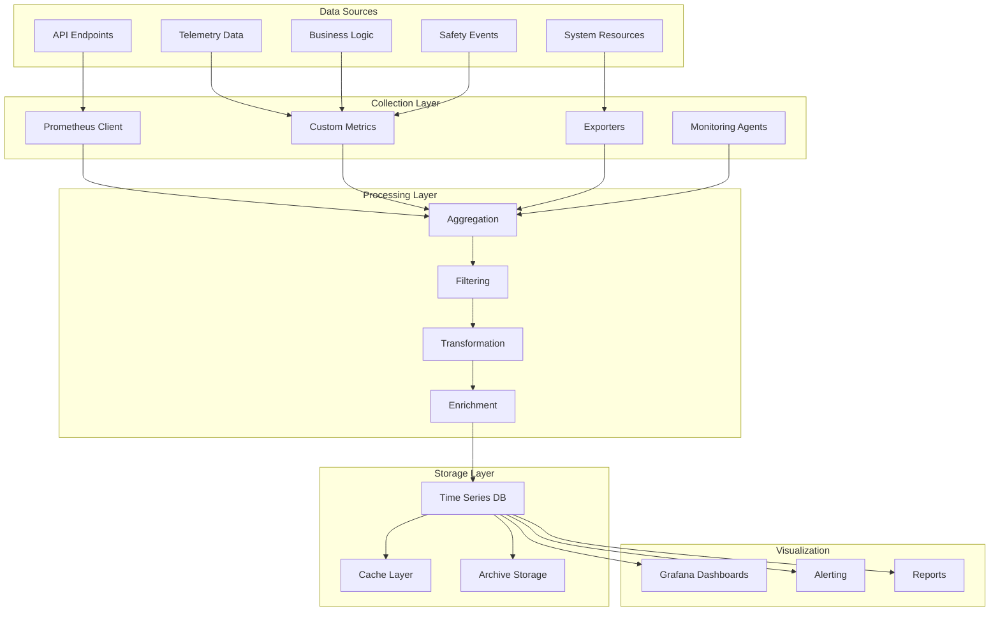

# Metrics Collection - OHT-50 Backend

## 📋 Tổng quan
Tài liệu này mô tả hệ thống thu thập metrics cho OHT-50 Backend, bao gồm các loại metrics, collection methods và storage strategies.

## 📊 Metrics Architecture



## 🔧 Core Metrics Categories

### 1. System Metrics
```python
from prometheus_client import Counter, Gauge, Histogram, Summary
from typing import Dict, Any

# System Resource Metrics
class SystemMetrics:
    # CPU Usage
    cpu_usage_percent = Gauge(
        'oht50_cpu_usage_percent',
        'CPU usage percentage',
        ['core', 'type']
    )
    
    # Memory Usage
    memory_usage_bytes = Gauge(
        'oht50_memory_usage_bytes',
        'Memory usage in bytes',
        ['type']
    )
    
    # Disk Usage
    disk_usage_bytes = Gauge(
        'oht50_disk_usage_bytes',
        'Disk usage in bytes',
        ['mount_point', 'type']
    )
    
    # Network I/O
    network_bytes_total = Counter(
        'oht50_network_bytes_total',
        'Total network bytes',
        ['interface', 'direction']
    )
    
    # System Load
    system_load = Gauge(
        'oht50_system_load',
        'System load average',
        ['period']
    )

# Application Metrics
class ApplicationMetrics:
    # Request Counters
    http_requests_total = Counter(
        'oht50_http_requests_total',
        'Total HTTP requests',
        ['method', 'endpoint', 'status_code']
    )
    
    # Request Duration
    http_request_duration_seconds = Histogram(
        'oht50_http_request_duration_seconds',
        'HTTP request duration',
        ['method', 'endpoint']
    )
    
    # Active Connections
    websocket_connections_active = Gauge(
        'oht50_websocket_connections_active',
        'Active WebSocket connections',
        ['channel']
    )
    
    # Database Connections
    database_connections_active = Gauge(
        'oht50_database_connections_active',
        'Active database connections'
    )
    
    # Queue Size
    mission_queue_size = Gauge(
        'oht50_mission_queue_size',
        'Mission queue size',
        ['priority']
    )
```

### 2. Business Metrics
```python
class BusinessMetrics:
    # Mission Metrics
    missions_total = Counter(
        'oht50_missions_total',
        'Total missions',
        ['type', 'status']
    )
    
    mission_duration_seconds = Histogram(
        'oht50_mission_duration_seconds',
        'Mission duration',
        ['type']
    )
    
    mission_success_rate = Gauge(
        'oht50_mission_success_rate',
        'Mission success rate',
        ['type']
    )
    
    # Safety Metrics
    safety_events_total = Counter(
        'oht50_safety_events_total',
        'Total safety events',
        ['type', 'severity']
    )
    
    safety_response_time_seconds = Histogram(
        'oht50_safety_response_time_seconds',
        'Safety event response time',
        ['type']
    )
    
    # Telemetry Metrics
    telemetry_data_points_total = Counter(
        'oht50_telemetry_data_points_total',
        'Total telemetry data points',
        ['data_type', 'module_id']
    )
    
    telemetry_latency_seconds = Histogram(
        'oht50_telemetry_latency_seconds',
        'Telemetry data latency',
        ['data_type']
    )
    
    # Configuration Metrics
    config_changes_total = Counter(
        'oht50_config_changes_total',
        'Total configuration changes',
        ['config_type']
    )
    
    config_validation_errors_total = Counter(
        'oht50_config_validation_errors_total',
        'Configuration validation errors',
        ['config_type']
    )
```

### 3. Performance Metrics
```python
class PerformanceMetrics:
    # API Performance
    api_response_time_seconds = Histogram(
        'oht50_api_response_time_seconds',
        'API response time',
        ['endpoint', 'method']
    )
    
    api_throughput_requests_per_second = Gauge(
        'oht50_api_throughput_requests_per_second',
        'API requests per second',
        ['endpoint']
    )
    
    # Database Performance
    database_query_duration_seconds = Histogram(
        'oht50_database_query_duration_seconds',
        'Database query duration',
        ['query_type', 'table']
    )
    
    database_connections_pool_size = Gauge(
        'oht50_database_connections_pool_size',
        'Database connection pool size'
    )
    
    # Cache Performance
    cache_hit_rate = Gauge(
        'oht50_cache_hit_rate',
        'Cache hit rate',
        ['cache_type']
    )
    
    cache_size_bytes = Gauge(
        'oht50_cache_size_bytes',
        'Cache size in bytes',
        ['cache_type']
    )
    
    # Memory Performance
    memory_allocation_bytes = Gauge(
        'oht50_memory_allocation_bytes',
        'Memory allocation',
        ['type']
    )
    
    garbage_collection_duration_seconds = Histogram(
        'oht50_garbage_collection_duration_seconds',
        'Garbage collection duration'
    )
```

## 📈 Collection Methods

### 1. Prometheus Integration
```python
from prometheus_client import start_http_server, generate_latest, CONTENT_TYPE_LATEST
from fastapi import FastAPI, Response
import asyncio
import psutil
import time

class MetricsCollector:
    def __init__(self):
        self.system_metrics = SystemMetrics()
        self.business_metrics = BusinessMetrics()
        self.performance_metrics = PerformanceMetrics()
    
    async def collect_system_metrics(self):
        """Collect system-level metrics"""
        while True:
            try:
                # CPU metrics
                cpu_percent = psutil.cpu_percent(interval=1, percpu=True)
                for i, percent in enumerate(cpu_percent):
                    self.system_metrics.cpu_usage_percent.labels(
                        core=f"cpu_{i}", type="user"
                    ).set(percent)
                
                # Memory metrics
                memory = psutil.virtual_memory()
                self.system_metrics.memory_usage_bytes.labels(
                    type="used"
                ).set(memory.used)
                self.system_metrics.memory_usage_bytes.labels(
                    type="available"
                ).set(memory.available)
                
                # Disk metrics
                disk = psutil.disk_usage('/')
                self.system_metrics.disk_usage_bytes.labels(
                    mount_point="/", type="used"
                ).set(disk.used)
                self.system_metrics.disk_usage_bytes.labels(
                    mount_point="/", type="free"
                ).set(disk.free)
                
                # Network metrics
                net_io = psutil.net_io_counters()
                self.system_metrics.network_bytes_total.labels(
                    interface="total", direction="sent"
                ).inc(net_io.bytes_sent)
                self.system_metrics.network_bytes_total.labels(
                    interface="total", direction="recv"
                ).inc(net_io.bytes_recv)
                
                await asyncio.sleep(30)  # Collect every 30 seconds
                
            except Exception as e:
                print(f"Error collecting system metrics: {e}")
                await asyncio.sleep(60)  # Wait longer on error
    
    async def collect_business_metrics(self):
        """Collect business-level metrics"""
        while True:
            try:
                # Mission metrics
                active_missions = await self.get_active_missions_count()
                self.business_metrics.mission_queue_size.labels(
                    priority="high"
                ).set(active_missions.get('high', 0))
                self.business_metrics.mission_queue_size.labels(
                    priority="normal"
                ).set(active_missions.get('normal', 0))
                
                # Safety metrics
                unresolved_safety_events = await self.get_unresolved_safety_events_count()
                self.business_metrics.safety_events_total.labels(
                    type="unresolved", severity="critical"
                ).inc(unresolved_safety_events.get('critical', 0))
                
                await asyncio.sleep(60)  # Collect every minute
                
            except Exception as e:
                print(f"Error collecting business metrics: {e}")
                await asyncio.sleep(120)  # Wait longer on error

# FastAPI integration
app = FastAPI()
metrics_collector = MetricsCollector()

@app.on_event("startup")
async def startup_event():
    # Start metrics collection tasks
    asyncio.create_task(metrics_collector.collect_system_metrics())
    asyncio.create_task(metrics_collector.collect_business_metrics())

@app.get("/metrics")
async def metrics_endpoint():
    """Prometheus metrics endpoint"""
    return Response(
        content=generate_latest(),
        media_type=CONTENT_TYPE_LATEST
    )
```

### 2. Custom Metrics Collection
```python
from dataclasses import dataclass
from datetime import datetime
from typing import Dict, Any, List
import json

@dataclass
class MetricPoint:
    name: str
    value: float
    timestamp: datetime
    labels: Dict[str, str]
    metric_type: str

class CustomMetricsCollector:
    def __init__(self):
        self.metrics_buffer: List[MetricPoint] = []
        self.buffer_size = 1000
    
    def record_metric(self, name: str, value: float, labels: Dict[str, str] = None, metric_type: str = "gauge"):
        """Record a custom metric"""
        metric = MetricPoint(
            name=name,
            value=value,
            timestamp=datetime.utcnow(),
            labels=labels or {},
            metric_type=metric_type
        )
        
        self.metrics_buffer.append(metric)
        
        # Flush buffer if full
        if len(self.metrics_buffer) >= self.buffer_size:
            self.flush_metrics()
    
    def flush_metrics(self):
        """Flush metrics buffer to storage"""
        if not self.metrics_buffer:
            return
        
        # Convert to JSON for storage
        metrics_data = []
        for metric in self.metrics_buffer:
            metrics_data.append({
                "name": metric.name,
                "value": metric.value,
                "timestamp": metric.timestamp.isoformat(),
                "labels": metric.labels,
                "metric_type": metric.metric_type
            })
        
        # Store to database or send to external system
        self.store_metrics(metrics_data)
        
        # Clear buffer
        self.metrics_buffer.clear()
    
    async def store_metrics(self, metrics_data: List[Dict[str, Any]]):
        """Store metrics to database"""
        # Implementation depends on storage backend
        pass

# Usage example
custom_collector = CustomMetricsCollector()

def record_mission_metric(mission_id: str, duration: float, success: bool):
    """Record mission completion metrics"""
    custom_collector.record_metric(
        name="mission_duration_seconds",
        value=duration,
        labels={"mission_id": mission_id, "success": str(success)},
        metric_type="histogram"
    )
    
    custom_collector.record_metric(
        name="mission_success",
        value=1.0 if success else 0.0,
        labels={"mission_id": mission_id},
        metric_type="counter"
    )
```

### 3. Real-time Metrics Streaming
```python
import asyncio
from typing import AsyncGenerator
import json

class MetricsStreamer:
    def __init__(self):
        self.subscribers: List[asyncio.Queue] = []
    
    async def subscribe(self) -> asyncio.Queue:
        """Subscribe to real-time metrics stream"""
        queue = asyncio.Queue()
        self.subscribers.append(queue)
        return queue
    
    async def unsubscribe(self, queue: asyncio.Queue):
        """Unsubscribe from metrics stream"""
        if queue in self.subscribers:
            self.subscribers.remove(queue)
    
    async def broadcast_metric(self, metric_data: Dict[str, Any]):
        """Broadcast metric to all subscribers"""
        message = {
            "type": "metric",
            "data": metric_data,
            "timestamp": datetime.utcnow().isoformat()
        }
        
        # Send to all subscribers
        for queue in self.subscribers:
            try:
                await queue.put(message)
            except asyncio.QueueFull:
                # Remove full queues
                self.subscribers.remove(queue)
    
    async def stream_metrics(self) -> AsyncGenerator[str, None]:
        """Stream metrics for WebSocket"""
        queue = await self.subscribe()
        try:
            while True:
                message = await queue.get()
                yield json.dumps(message)
        finally:
            await self.unsubscribe(queue)

# WebSocket endpoint
@app.websocket("/ws/metrics")
async def metrics_websocket(websocket: WebSocket):
    await websocket.accept()
    streamer = MetricsStreamer()
    
    try:
        async for message in streamer.stream_metrics():
            await websocket.send_text(message)
    except WebSocketDisconnect:
        pass
```

## 🗄️ Storage Strategies

### 1. Time Series Database Schema
```sql
-- Metrics table for time series data
CREATE TABLE metrics (
    id INTEGER PRIMARY KEY AUTOINCREMENT,
    metric_name VARCHAR(100) NOT NULL,
    metric_value REAL NOT NULL,
    timestamp TIMESTAMP NOT NULL,
    labels JSON,
    metric_type VARCHAR(20) NOT NULL,
    
    INDEX idx_metrics_name_timestamp (metric_name, timestamp),
    INDEX idx_metrics_timestamp (timestamp)
);

-- Aggregated metrics table
CREATE TABLE metrics_aggregated (
    id INTEGER PRIMARY KEY AUTOINCREMENT,
    metric_name VARCHAR(100) NOT NULL,
    aggregation_type VARCHAR(20) NOT NULL, -- avg, sum, min, max, count
    metric_value REAL NOT NULL,
    start_time TIMESTAMP NOT NULL,
    end_time TIMESTAMP NOT NULL,
    labels JSON,
    
    INDEX idx_agg_metric_time (metric_name, start_time, end_time)
);

-- Metrics retention policy
CREATE TABLE metrics_retention (
    metric_name VARCHAR(100) PRIMARY KEY,
    retention_days INTEGER NOT NULL DEFAULT 30,
    aggregation_interval VARCHAR(20) NOT NULL DEFAULT '1h', -- 1m, 5m, 1h, 1d
    enabled BOOLEAN DEFAULT TRUE
);
```

### 2. Metrics Aggregation
```python
class MetricsAggregator:
    def __init__(self):
        self.aggregation_rules = {
            "1m": 60,    # 1 minute
            "5m": 300,   # 5 minutes
            "1h": 3600,  # 1 hour
            "1d": 86400  # 1 day
        }
    
    async def aggregate_metrics(self, metric_name: str, interval: str):
        """Aggregate metrics for given interval"""
        if interval not in self.aggregation_rules:
            raise ValueError(f"Invalid interval: {interval}")
        
        seconds = self.aggregation_rules[interval]
        end_time = datetime.utcnow()
        start_time = end_time - timedelta(seconds=seconds)
        
        # Get raw metrics for interval
        raw_metrics = await self.get_metrics_for_interval(
            metric_name, start_time, end_time
        )
        
        if not raw_metrics:
            return
        
        # Calculate aggregations
        values = [m['value'] for m in raw_metrics]
        aggregations = {
            'avg': sum(values) / len(values),
            'sum': sum(values),
            'min': min(values),
            'max': max(values),
            'count': len(values)
        }
        
        # Store aggregated metrics
        for agg_type, value in aggregations.items():
            await self.store_aggregated_metric(
                metric_name=metric_name,
                aggregation_type=agg_type,
                metric_value=value,
                start_time=start_time,
                end_time=end_time,
                interval=interval
            )
    
    async def get_metrics_for_interval(self, metric_name: str, start_time: datetime, end_time: datetime):
        """Get raw metrics for time interval"""
        query = """
        SELECT metric_value, timestamp, labels
        FROM metrics
        WHERE metric_name = ? AND timestamp BETWEEN ? AND ?
        ORDER BY timestamp
        """
        # Implementation depends on database
        pass
```

## 📊 Visualization & Alerting

### 1. Grafana Dashboard Configuration
```json
{
  "dashboard": {
    "title": "OHT-50 Backend Metrics",
    "panels": [
      {
        "title": "System CPU Usage",
        "type": "graph",
        "targets": [
          {
            "expr": "oht50_cpu_usage_percent",
            "legendFormat": "CPU {{core}}"
          }
        ]
      },
      {
        "title": "API Response Time",
        "type": "graph",
        "targets": [
          {
            "expr": "rate(oht50_http_request_duration_seconds_sum[5m]) / rate(oht50_http_request_duration_seconds_count[5m])",
            "legendFormat": "{{endpoint}}"
          }
        ]
      },
      {
        "title": "Mission Success Rate",
        "type": "stat",
        "targets": [
          {
            "expr": "oht50_mission_success_rate",
            "legendFormat": "{{type}}"
          }
        ]
      },
      {
        "title": "Safety Events",
        "type": "table",
        "targets": [
          {
            "expr": "increase(oht50_safety_events_total[1h])",
            "legendFormat": "{{type}} - {{severity}}"
          }
        ]
      }
    ]
  }
}
```

### 2. Alert Rules
```yaml
groups:
  - name: oht50_backend_alerts
    rules:
      - alert: HighCPUUsage
        expr: oht50_cpu_usage_percent > 80
        for: 5m
        labels:
          severity: warning
        annotations:
          summary: "High CPU usage detected"
          description: "CPU usage is above 80% for 5 minutes"
      
      - alert: HighMemoryUsage
        expr: oht50_memory_usage_bytes / oht50_memory_total_bytes > 0.9
        for: 5m
        labels:
          severity: warning
        annotations:
          summary: "High memory usage detected"
          description: "Memory usage is above 90%"
      
      - alert: HighAPIResponseTime
        expr: histogram_quantile(0.95, rate(oht50_http_request_duration_seconds_bucket[5m])) > 1
        for: 2m
        labels:
          severity: warning
        annotations:
          summary: "High API response time"
          description: "95th percentile response time is above 1 second"
      
      - alert: SafetyEventCritical
        expr: increase(oht50_safety_events_total{severity="critical"}[5m]) > 0
        labels:
          severity: critical
        annotations:
          summary: "Critical safety event detected"
          description: "Critical safety event occurred in the last 5 minutes"
      
      - alert: MissionFailureRate
        expr: rate(oht50_missions_total{status="failed"}[10m]) / rate(oht50_missions_total[10m]) > 0.1
        for: 5m
        labels:
          severity: warning
        annotations:
          summary: "High mission failure rate"
          description: "Mission failure rate is above 10%"
```

## 🔧 Configuration

### 1. Metrics Configuration
```yaml
metrics:
  collection:
    system_metrics_interval: 30s
    business_metrics_interval: 60s
    performance_metrics_interval: 10s
  
  storage:
    retention_days: 30
    aggregation_intervals: ["1m", "5m", "1h", "1d"]
    compression_enabled: true
  
  alerting:
    enabled: true
    notification_channels:
      - type: email
        recipients: ["admin@oht50.local"]
      - type: slack
        webhook_url: "https://hooks.slack.com/..."
  
  visualization:
    grafana_url: "http://localhost:3000"
    dashboard_auto_refresh: 30s
    default_time_range: "1h"
```

### 2. Custom Metrics Configuration
```python
METRICS_CONFIG = {
    "system": {
        "enabled": True,
        "collection_interval": 30,
        "metrics": ["cpu", "memory", "disk", "network"]
    },
    "business": {
        "enabled": True,
        "collection_interval": 60,
        "metrics": ["missions", "safety_events", "telemetry"]
    },
    "performance": {
        "enabled": True,
        "collection_interval": 10,
        "metrics": ["api_response_time", "database_performance", "cache_performance"]
    },
    "custom": {
        "enabled": True,
        "buffer_size": 1000,
        "flush_interval": 60
    }
}
```

---

**Changelog v1.0:**
- ✅ Created comprehensive metrics collection system
- ✅ Added system, business, and performance metrics
- ✅ Implemented Prometheus integration
- ✅ Added custom metrics collection
- ✅ Created real-time metrics streaming
- ✅ Added storage strategies and aggregation
- ✅ Included visualization and alerting configuration
- ✅ Added configuration management
