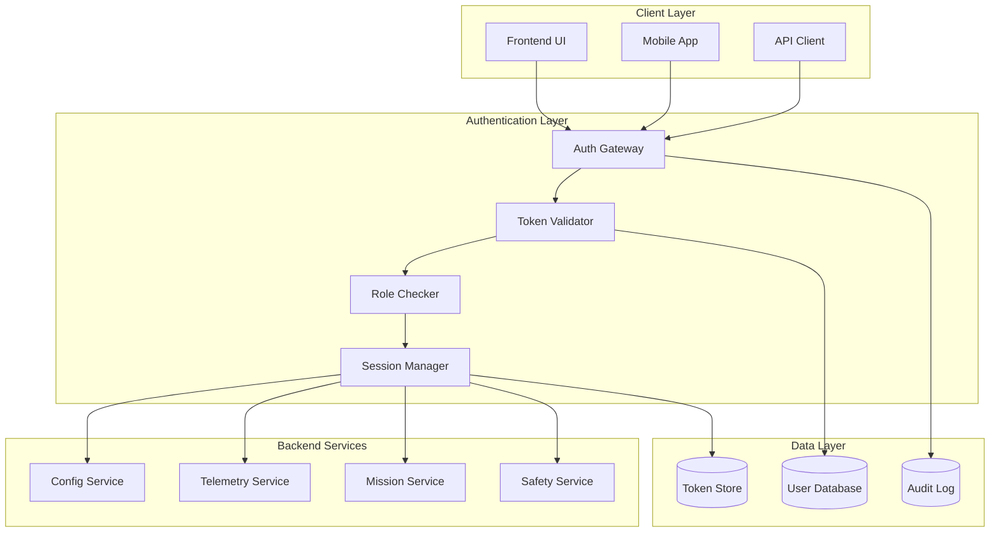

# Authentication System - OHT-50 Backend

## 📋 Tổng quan
Hệ thống xác thực và phân quyền cho OHT-50 Backend, đảm bảo bảo mật cho tất cả API endpoints và hệ thống.

## 🔐 Authentication Architecture



## 🔑 Authentication Methods

### 1. Bearer Token Authentication
```http
Authorization: Bearer <jwt_token>
```

**Token Format:**
```json
{
  "header": {
    "alg": "HS256",
    "typ": "JWT"
  },
  "payload": {
    "sub": "user_id",
    "role": "admin",
    "permissions": ["config:read", "config:write"],
    "exp": 1640995200,
    "iat": 1640908800
  },
  "signature": "HMACSHA256(...)"
}
```

### 2. API Key Authentication (Future)
```http
X-API-Key: <api_key>
```

### 3. Session-based Authentication (Development)
```http
Cookie: session_id=<session_token>
```

## 👥 User Roles & Permissions

### Role Hierarchy
```
Super Admin
├── Admin
│   ├── Operator
│   └── Viewer
└── System
```

### Role Definitions

#### 1. Super Admin
- **Permissions**: All permissions
- **Access**: Full system control
- **Use Cases**: System administration, emergency access

#### 2. Admin
- **Permissions**:
  - `config:*` - Full configuration management
  - `telemetry:*` - Full telemetry access
  - `mission:*` - Mission management
  - `safety:*` - Safety system control
  - `user:read` - User management (read-only)
- **Access**: System administration
- **Use Cases**: Daily operations, configuration changes

#### 3. Operator
- **Permissions**:
  - `config:read` - Read configuration
  - `telemetry:read` - Read telemetry data
  - `mission:create` - Create missions
  - `mission:read` - Read mission status
  - `safety:read` - Read safety status
- **Access**: Operational control
- **Use Cases**: Daily operations, mission execution

#### 4. Viewer
- **Permissions**:
  - `config:read` - Read configuration
  - `telemetry:read` - Read telemetry data
  - `mission:read` - Read mission status
  - `safety:read` - Read safety status
- **Access**: Read-only access
- **Use Cases**: Monitoring, reporting

#### 5. System
- **Permissions**: Internal system operations
- **Access**: Automated processes
- **Use Cases**: Background tasks, system integration

## 🔒 Permission Matrix

| Resource | Super Admin | Admin | Operator | Viewer | System |
|----------|-------------|-------|----------|--------|--------|
| `config:read` | ✅ | ✅ | ✅ | ✅ | ✅ |
| `config:write` | ✅ | ✅ | ❌ | ❌ | ❌ |
| `config:delete` | ✅ | ✅ | ❌ | ❌ | ❌ |
| `telemetry:read` | ✅ | ✅ | ✅ | ✅ | ✅ |
| `telemetry:write` | ✅ | ✅ | ❌ | ❌ | ✅ |
| `mission:read` | ✅ | ✅ | ✅ | ✅ | ✅ |
| `mission:create` | ✅ | ✅ | ✅ | ❌ | ✅ |
| `mission:update` | ✅ | ✅ | ❌ | ❌ | ✅ |
| `mission:delete` | ✅ | ✅ | ❌ | ❌ | ❌ |
| `safety:read` | ✅ | ✅ | ✅ | ✅ | ✅ |
| `safety:control` | ✅ | ✅ | ❌ | ❌ | ✅ |
| `user:read` | ✅ | ✅ | ❌ | ❌ | ❌ |
| `user:write` | ✅ | ❌ | ❌ | ❌ | ❌ |

## 🛡️ Security Features

### 1. Token Security
- **JWT Signing**: HMAC-SHA256 với secret key
- **Token Expiration**: Configurable TTL (default: 24 hours)
- **Refresh Tokens**: Automatic token renewal
- **Token Rotation**: Regular token refresh

### 2. Password Security
- **Hashing**: bcrypt với salt rounds
- **Password Policy**: Minimum requirements
- **Account Lockout**: After failed attempts
- **Password History**: Prevent reuse

### 3. Session Security
- **Session Timeout**: Automatic logout
- **Concurrent Sessions**: Limit active sessions
- **Session Invalidation**: On logout/security events
- **IP Binding**: Session tied to IP address

### 4. Audit Logging
- **Authentication Events**: Login, logout, failed attempts
- **Authorization Events**: Permission checks, access denied
- **Security Events**: Token creation, password changes
- **System Events**: Configuration changes, safety events

## 🔧 Implementation Details

### 1. Token Validation Middleware
```python
async def verify_token(token: str = Depends(oauth2_scheme)):
    try:
        payload = jwt.decode(token, SECRET_KEY, algorithms=["HS256"])
        user_id = payload.get("sub")
        if user_id is None:
            raise credentials_exception
        return payload
    except JWTError:
        raise credentials_exception
```

### 2. Permission Checker
```python
def check_permission(required_permission: str):
    def permission_checker(token: dict = Depends(verify_token)):
        user_permissions = token.get("permissions", [])
        if required_permission not in user_permissions:
            raise HTTPException(
                status_code=403,
                detail="Insufficient permissions"
            )
        return token
    return permission_checker
```

### 3. Role-based Access Control
```python
def require_role(required_role: str):
    def role_checker(token: dict = Depends(verify_token)):
        user_role = token.get("role")
        role_hierarchy = {
            "super_admin": 4,
            "admin": 3,
            "operator": 2,
            "viewer": 1,
            "system": 0
        }
        
        if role_hierarchy.get(user_role, 0) < role_hierarchy.get(required_role, 0):
            raise HTTPException(
                status_code=403,
                detail="Insufficient role privileges"
            )
        return token
    return role_checker
```

## 📊 API Endpoints

### Authentication Endpoints

#### POST /api/v1/auth/login
```http
POST /api/v1/auth/login
Content-Type: application/json

{
  "username": "admin",
  "password": "secure_password"
}
```

**Response:**
```json
{
  "success": true,
  "access_token": "eyJ0eXAiOiJKV1QiLCJhbGciOiJIUzI1NiJ9...",
  "refresh_token": "eyJ0eXAiOiJKV1QiLCJhbGciOiJIUzI1NiJ9...",
  "token_type": "bearer",
  "expires_in": 86400,
  "user": {
    "id": "user_123",
    "username": "admin",
    "role": "admin",
    "permissions": ["config:read", "config:write", ...]
  }
}
```

#### POST /api/v1/auth/refresh
```http
POST /api/v1/auth/refresh
Authorization: Bearer <refresh_token>
```

#### POST /api/v1/auth/logout
```http
POST /api/v1/auth/logout
Authorization: Bearer <access_token>
```

#### GET /api/v1/auth/me
```http
GET /api/v1/auth/me
Authorization: Bearer <access_token>
```

### Protected Endpoints Example

#### Configuration API
```python
@router.get("/config/")
async def get_config(
    token: dict = Depends(check_permission("config:read"))
):
    return {"config": current_config}

@router.put("/config/")
async def update_config(
    config: SystemConfig,
    token: dict = Depends(check_permission("config:write"))
):
    return {"success": True, "config": updated_config}
```

## 🔄 Token Lifecycle

### 1. Token Creation
```
User Login → Validate Credentials → Generate JWT → Return Token
```

### 2. Token Usage
```
API Request → Extract Token → Validate Token → Check Permissions → Process Request
```

### 3. Token Refresh
```
Token Expired → Use Refresh Token → Generate New Token → Update Session
```

### 4. Token Invalidation
```
User Logout → Invalidate Token → Clear Session → Update Audit Log
```

## 🚨 Security Best Practices

### 1. Token Management
- **Short Expiration**: Access tokens expire quickly
- **Refresh Rotation**: Regular refresh token rotation
- **Secure Storage**: Tokens stored securely in client
- **HTTPS Only**: All authentication over HTTPS

### 2. Password Security
- **Strong Passwords**: Enforce password complexity
- **Regular Changes**: Periodic password updates
- **No Plain Text**: Never store passwords in plain text
- **Brute Force Protection**: Rate limiting on login attempts

### 3. Session Security
- **Secure Cookies**: HttpOnly, Secure flags
- **CSRF Protection**: Cross-site request forgery protection
- **Session Timeout**: Automatic session expiration
- **Logout Everywhere**: Invalidate all sessions on logout

### 4. Monitoring & Alerting
- **Failed Login Alerts**: Monitor failed authentication attempts
- **Suspicious Activity**: Detect unusual access patterns
- **Token Abuse**: Monitor token usage patterns
- **Security Events**: Log all security-related events

## 📋 Configuration

### Environment Variables
```bash
# Authentication
SECRET_KEY=your-secret-key-here
JWT_ALGORITHM=HS256
ACCESS_TOKEN_EXPIRE_MINUTES=1440  # 24 hours
REFRESH_TOKEN_EXPIRE_DAYS=30

# Security
PASSWORD_MIN_LENGTH=8
PASSWORD_REQUIRE_UPPERCASE=true
PASSWORD_REQUIRE_LOWERCASE=true
PASSWORD_REQUIRE_DIGITS=true
PASSWORD_REQUIRE_SPECIAL=true

# Session
SESSION_TIMEOUT_MINUTES=30
MAX_CONCURRENT_SESSIONS=5
ACCOUNT_LOCKOUT_ATTEMPTS=5
ACCOUNT_LOCKOUT_DURATION_MINUTES=15
```

### Security Headers
```python
# CORS Configuration
CORS_ORIGINS = ["https://frontend.oht50.com"]
CORS_ALLOW_CREDENTIALS = True

# Security Headers
SECURITY_HEADERS = {
    "X-Frame-Options": "DENY",
    "X-Content-Type-Options": "nosniff",
    "X-XSS-Protection": "1; mode=block",
    "Strict-Transport-Security": "max-age=31536000; includeSubDomains"
}
```

## 🔍 Troubleshooting

### Common Issues

#### 1. Token Expired
**Symptoms**: 401 Unauthorized errors
**Solution**: Use refresh token to get new access token

#### 2. Insufficient Permissions
**Symptoms**: 403 Forbidden errors
**Solution**: Check user role and permissions

#### 3. Invalid Token
**Symptoms**: 401 Unauthorized errors
**Solution**: Re-authenticate user

#### 4. Session Timeout
**Symptoms**: Automatic logout
**Solution**: Re-login with credentials

### Debug Mode
```python
# Development only
DEBUG_AUTH = True  # Skip authentication in development
```

## 📈 Future Enhancements

### Planned Features
1. **Multi-Factor Authentication**: SMS/Email verification
2. **OAuth Integration**: Google, Microsoft authentication
3. **API Key Management**: Service-to-service authentication
4. **Advanced RBAC**: Fine-grained permission control
5. **Single Sign-On**: SSO integration
