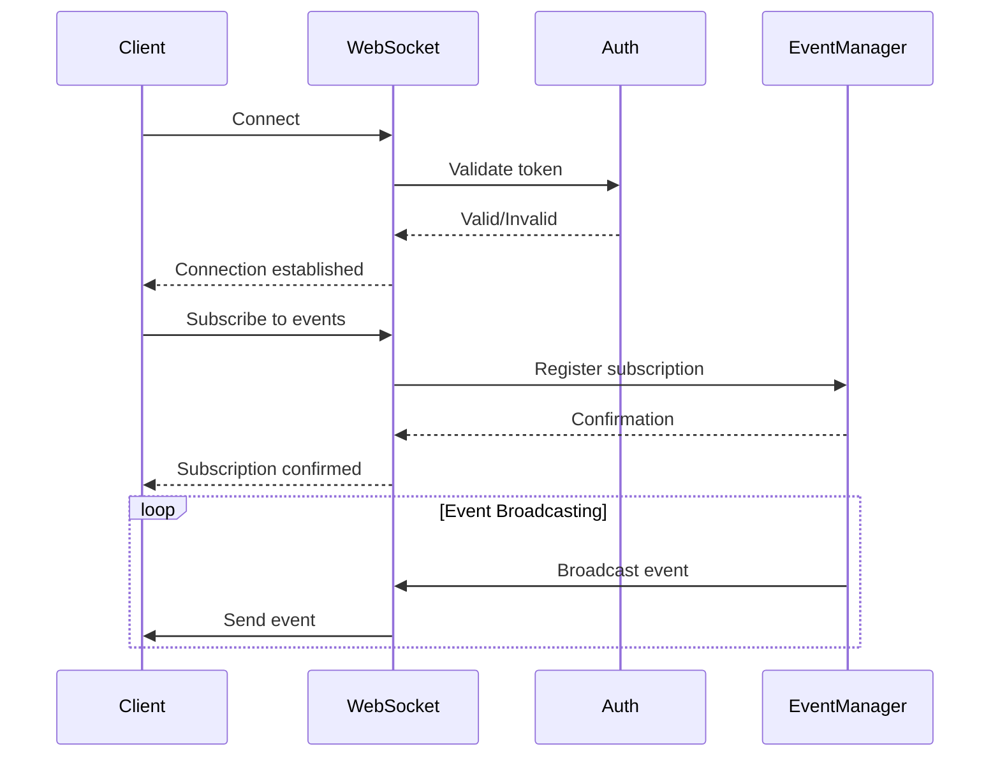
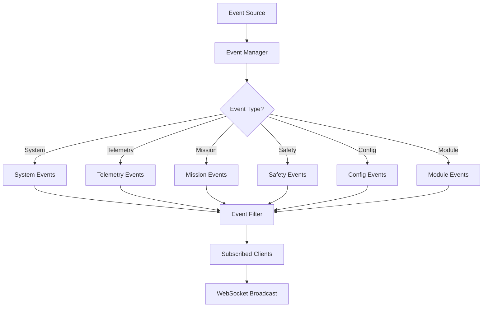

# WEBSOCKET EVENTS - OHT-50 Backend v2.0

**Phiên bản:** v2.0  
**Phạm vi:** WebSocket events và real-time communication cho Architecture v2.0  
**Cập nhật:** 2025-01-28

---

## 📋 **Tổng quan**

Tài liệu này định nghĩa các WebSocket events cho hệ thống OHT-50 Architecture v2.0, bao gồm real-time telemetry cho 5 mandatory modules, system status updates, safety events, location tracking, mission progress, và event-driven communication.

## 🔧 **Architecture v2.0 Features**
- **5 Mandatory Modules:** Power, Safety, Travel Motor, Dock & Location, Master Control
- **RS485 Communication:** Real-time module communication status
- **LiDAR USB Integration:** RPLIDAR A1M8 scan data streaming
- **24V System:** Power events với 24V nominal voltage
- **Safety Integration:** E-Stop, safety zones, emergency events
- **Mission Management:** Real-time mission progress tracking
- **State Machine:** System state transitions và monitoring

---

## 🔌 **1. WebSocket Connection**

### **1.1 Connection Endpoint**

```
ws://localhost:8000/ws/telemetry
wss://production.example.com/ws/telemetry  # Production
```

### **1.2 Authentication**

```json
{
  "type": "auth",
  "token": "eyJhbGciOiJIUzI1NiIsInR5cCI6IkpXVCJ9..."
}
```

### **1.3 Connection Parameters**

| Parameter | Type | Required | Description |
|-----------|------|----------|-------------|
| `token` | string | Yes | JWT authentication token |
| `client_id` | string | No | Client identifier |
| `subscription` | array | No | Event subscriptions |

---

## 📡 **2. Event Types**

### **2.1 System Events**

#### **System Status Update**
```json
{
  "type": "system.status",
  "timestamp": "2025-01-28T10:30:00Z",
  "data": {
    "system_state": {
      "current_state": "moving",
      "state_duration": 45.2,
      "previous_state": "idle",
      "state_transitions": 12
    },
    "modules": {
      "power": {"status": "online", "address": "0x01", "health": "healthy"},
      "safety": {"status": "online", "address": "0x02", "health": "healthy"},
      "travel_motor": {"status": "online", "address": "0x03", "health": "healthy"},
      "dock_location": {"status": "online", "address": "0x04", "health": "healthy"},
      "master_control": {"status": "online", "address": "0x05", "health": "healthy"}
    },
    "communication": {
      "rs485": {"status": "healthy", "error_rate": 0.001},
      "ethernet": {"status": "connected", "packet_loss": 0.0}
    },
    "system_health": {
      "overall_health": "healthy",
      "health_score": 0.95,
      "critical_alerts": 0,
      "warnings": 0
    },
    "performance": {
      "cpu_usage": 25.5,
      "memory_usage": 45.2,
      "disk_usage": 30.1,
      "network_latency": 0.05
    }
  }
}
```

#### **System Error**
```json
{
  "type": "system.error",
  "timestamp": "2024-12-19T10:30:00Z",
  "data": {
    "error_code": "SYS-001",
    "error_name": "Database Connection Failed",
    "severity": "P0",
    "description": "Cannot connect to database",
    "affected_services": ["api", "telemetry"]
  }
}
```

### **2.2 Module Events**

#### **Power Module Events**
```json
{
  "type": "module.power",
  "timestamp": "2025-01-28T10:30:00Z",
  "data": {
    "module_address": "0x01",
    "status": "online",
    "battery": {
      "voltage": 24.2,
      "current": 2.5,
      "soc": 85,
      "temperature": 25.5,
      "capacity": 50,
      "cycle_count": 150
    },
    "charging": {
      "status": "not_charging",
      "mode": "idle",
      "current": 0.0,
      "voltage": 24.2
    },
    "power_distribution": {
      "5v": {"voltage": 5.02, "current": 1.2, "status": "normal"},
      "12v": {"voltage": 12.05, "current": 3.5, "status": "normal"},
      "24v": {"voltage": 24.1, "current": 2.0, "status": "normal"}
    },
    "protection": {
      "overvoltage": false,
      "overcurrent": false,
      "overtemperature": false,
      "undervoltage": false
    }
  }
}
```

#### **Safety Module Events**
```json
{
  "type": "module.safety",
  "timestamp": "2025-01-28T10:30:00Z",
  "data": {
    "module_address": "0x02",
    "status": "online",
    "estop": {
      "status": "clear",
      "triggered_by": null,
      "trigger_time": null
    },
    "safety_zones": {
      "zone_1": {"status": "clear", "violations": 0},
      "zone_2": {"status": "clear", "violations": 0}
    },
    "speed_limits": {
      "current_speed": 500.0,
      "max_allowed": 1000.0,
      "zone_restriction": false
    },
    "system_health": {
      "estop_circuit": "healthy",
      "safety_sensors": "healthy",
      "communication": "healthy",
      "power_supply": "healthy"
    }
  }
}
```

#### **Travel Motor Module Events**
```json
{
  "type": "module.travel_motor",
  "timestamp": "2025-01-28T10:30:00Z",
  "data": {
    "module_address": "0x03",
    "status": "online",
    "motor": {
      "speed": 500.0,
      "direction": 45.0,
      "current": 2.1,
      "temperature": 35.2,
      "status": "running"
    },
    "encoder": {
      "count": 123456,
      "speed": 500.0,
      "position": 1250.5,
      "health": "healthy"
    },
    "controller": {
      "pid_status": "active",
      "target_speed": 500.0,
      "error": 0.0,
      "output": 75.0
    }
  }
}
```

#### **Dock & Location Module Events**
```json
{
  "type": "module.dock_location",
  "timestamp": "2025-01-28T10:30:00Z",
  "data": {
    "module_address": "0x04",
    "status": "online",
    "position": {
      "x": 1250.5,
      "y": 850.2,
      "z": 0.0,
      "accuracy": 2.0,
      "confidence": 0.95
    },
    "orientation": {
      "yaw": 45.2,
      "pitch": 0.1,
      "roll": 0.0,
      "accuracy": 1.5
    },
    "navigation": {
      "mode": "autonomous",
      "target": "dock_01",
      "distance_to_target": 150.5,
      "estimated_arrival": "2025-01-28T10:32:00Z"
    },
    "sensors": {
      "lidar": {
        "status": "active",
        "scan_frequency": 5.5,
        "points_per_scan": 360,
        "last_scan": "2025-01-28T10:30:00Z"
      },
      "rfid": {
        "status": "active",
        "tags_detected": 3,
        "last_read": "2025-01-28T10:29:55Z"
      },
      "imu": {
        "status": "active",
        "calibration": "calibrated",
        "drift_rate": 0.1
      }
    }
  }
}
```

#### **Master Control Module Events**
```json
{
  "type": "module.master_control",
  "timestamp": "2025-01-28T10:30:00Z",
  "data": {
    "module_address": "0x05",
    "status": "online",
    "mission": {
      "current_mission": "mission_002",
      "mission_status": "in_progress",
      "progress": 0.35,
      "estimated_completion": "2025-01-28T10:32:00Z"
    },
    "coordination": {
      "modules_online": 4,
      "modules_offline": 0,
      "average_response_time": 0.045,
      "total_errors": 0
    }
  }
}
```

### **2.3 Safety Events**

#### **E-Stop Events**
```json
{
  "type": "safety.estop",
  "timestamp": "2025-01-28T10:30:00Z",
  "data": {
    "event_type": "estop_triggered",
    "severity": "critical",
    "triggered_by": "hardware",
    "reason": "emergency_button",
    "emergency_level": "critical",
    "system_response": {
      "motors_stopped": true,
      "brakes_activated": true,
      "safety_lights_on": true,
      "alert_sent": true
    }
  }
}
```

#### **Safety Zone Violations**
```json
{
  "type": "safety.zone_violation",
  "timestamp": "2025-01-28T10:30:00Z",
  "data": {
    "event_type": "zone_violation",
    "severity": "warning",
    "zone_id": "zone_1",
    "violation_type": "speed_limit_exceeded",
    "details": {
      "current_speed": 250.0,
      "max_allowed": 200.0,
      "position": {"x": 50, "y": 25}
    },
    "action_taken": "speed_reduction",
    "resolved": true,
    "resolution_time": "2025-01-28T10:30:05Z"
  }
}
```

### **2.4 Location & Navigation Events**

#### **Position Updates**
```json
{
  "type": "location.position_update",
  "timestamp": "2025-01-28T10:30:00Z",
  "data": {
    "position": {
      "x": 1250.5,
      "y": 850.2,
      "z": 0.0,
      "accuracy": 2.0,
      "confidence": 0.95
    },
    "orientation": {
      "yaw": 45.2,
      "pitch": 0.1,
      "roll": 0.0,
      "accuracy": 1.5
    },
    "velocity": {
      "linear": 0.5,
      "angular": 0.1,
      "direction": 45.2
    },
    "sources": {
      "primary": "lidar_slam",
      "secondary": "rfid",
      "backup": "imu"
    }
  }
}
```

#### **LiDAR Scan Events**
```json
{
  "type": "location.lidar_scan",
  "timestamp": "2025-01-28T10:30:00Z",
  "data": {
    "scan_id": "scan_001",
    "sensor_info": {
      "model": "RPLIDAR_A1M8",
      "interface": "USB_2.0",
      "scan_frequency": 5.5,
      "points_per_scan": 360
    },
    "scan_data": {
      "points_count": 360,
      "obstacles_detected": 1,
      "map_updated": true,
      "quality_score": 0.95
    },
    "obstacles": [
      {
        "id": "obs_001",
        "position": {"x": 1300.0, "y": 900.0},
        "distance": 150.0,
        "angle": 45.0,
        "size": "small",
        "confidence": 0.92
      }
    ]
  }
}
```

### **2.5 Mission Events**

#### **Mission Progress Updates**
```json
{
  "type": "mission.progress",
  "timestamp": "2025-01-28T10:30:00Z",
  "data": {
    "mission_id": "mission_002",
    "mission_name": "Transport to Loading Station",
    "status": "in_progress",
    "progress": 0.35,
    "current_waypoint": 2,
    "distance_remaining": 550.5,
    "estimated_arrival": "2025-01-28T10:32:00Z",
    "waypoints": [
      {
        "id": "wp_001",
        "x": 1250.5,
        "y": 850.2,
        "action": "start",
        "status": "completed",
        "completion_time": "2025-01-28T10:30:05Z"
      },
      {
        "id": "wp_002",
        "x": 2000.0,
        "y": 1500.0,
        "action": "dock",
        "status": "in_progress",
        "estimated_completion": "2025-01-28T10:32:00Z"
      }
    ],
    "metrics": {
      "distance_traveled": 550.5,
      "time_elapsed": 65.0,
      "battery_consumed": 5.2,
      "obstacles_avoided": 2,
      "safety_violations": 0
    }
  }
}
```

### **2.6 State Machine Events**

#### **State Transitions**
```json
{
  "type": "state.transition",
  "timestamp": "2025-01-28T10:30:05Z",
  "data": {
    "transition_id": "trans_001",
    "from_state": "idle",
    "to_state": "moving",
    "trigger": "mission_start",
    "timestamp": "2025-01-28T10:30:05Z",
    "validation_passed": true,
    "conditions_met": [
      "all_modules_healthy",
      "battery_sufficient",
      "safety_clear"
    ]
  }
}
```

### **2.7 Communication Events**

#### **RS485 Communication Status**
```json
{
  "type": "communication.rs485",
  "timestamp": "2025-01-28T10:30:00Z",
  "data": {
    "status": "healthy",
    "baudrate": 115200,
    "error_rate": 0.001,
    "response_time": 0.045,
    "bus_load": 0.25,
    "modules": {
      "power": {"status": "online", "response_time": 0.05},
      "safety": {"status": "online", "response_time": 0.03},
      "travel_motor": {"status": "online", "response_time": 0.04},
      "dock_location": {"status": "online", "response_time": 0.06},
      "master_control": {"status": "online", "response_time": 0.04}
    }
  }
}
```
      "angular": 0.0
    },
    "orientation": {
      "roll": 0.0,
      "pitch": 0.0,
      "yaw": 0.0
    },
    "sensors": {
      "battery": 85.2,
      "temperature": 42.5,
      "humidity": 45.8
    }
  }
}
```

#### **Telemetry Status**
```json
{
  "type": "telemetry.status",
  "timestamp": "2024-12-19T10:30:00Z",
  "data": {
    "streaming": true,
    "rate": 10,
    "connected_clients": 3,
    "last_update": "2024-12-19T10:29:59Z"
  }
}
```

### **2.3 Mission Events**

#### **Mission Started**
```json
{
  "type": "mission.started",
  "timestamp": "2024-12-19T10:30:00Z",
  "data": {
    "mission_id": "mission-123",
    "mission_type": "transport|inspection|maintenance",
    "start_position": {
      "x": 0.0,
      "y": 0.0,
      "z": 0.0
    },
    "target_position": {
      "x": 1250.5,
      "y": 0.0,
      "z": 0.0
    },
    "estimated_duration": 180
  }
}
```

#### **Mission Progress**
```json
{
  "type": "mission.progress",
  "timestamp": "2024-12-19T10:30:00Z",
  "data": {
    "mission_id": "mission-123",
    "progress": 65.5,
    "current_position": {
      "x": 820.3,
      "y": 0.0,
      "z": 0.0
    },
    "remaining_distance": 430.2,
    "estimated_completion": "2024-12-19T10:33:00Z"
  }
}
```

#### **Mission Completed**
```json
{
  "type": "mission.completed",
  "timestamp": "2024-12-19T10:33:00Z",
  "data": {
    "mission_id": "mission-123",
    "status": "success|failed|cancelled",
    "completion_time": 180,
    "final_position": {
      "x": 1250.5,
      "y": 0.0,
      "z": 0.0
    },
    "summary": {
      "distance_traveled": 1250.5,
      "energy_consumed": 2.3,
      "errors_encountered": 0
    }
  }
}
```

### **2.4 Safety Events**

#### **Safety Zone Entered**
```json
{
  "type": "safety.zone_entered",
  "timestamp": "2024-12-19T10:30:00Z",
  "data": {
    "zone_id": "zone-001",
    "zone_type": "restricted|warning|safe",
    "position": {
      "x": 820.3,
      "y": 0.0,
      "z": 0.0
    },
    "action": "slow_down|stop|alert"
  }
}
```

#### **E-Stop Activated**
```json
{
  "type": "safety.estop",
  "timestamp": "2024-12-19T10:30:00Z",
  "data": {
    "estop_id": "estop-001",
    "trigger_type": "hardware|software|remote",
    "position": {
      "x": 820.3,
      "y": 0.0,
      "z": 0.0
    },
    "emergency_level": "critical|warning",
    "auto_recovery": false
  }
}
```

#### **Safety Clear**
```json
{
  "type": "safety.clear",
  "timestamp": "2024-12-19T10:30:00Z",
  "data": {
    "cleared_by": "operator|system|auto",
    "position": {
      "x": 820.3,
      "y": 0.0,
      "z": 0.0
    },
    "next_action": "resume|return_home|manual_control"
  }
}
```

### **2.5 Configuration Events**

#### **Configuration Updated**
```json
{
  "type": "config.updated",
  "timestamp": "2024-12-19T10:30:00Z",
  "data": {
    "config_id": "config-123",
    "version": "1.2.3",
    "updated_by": "operator@example.com",
    "changes": {
      "max_velocity": "1.5 -> 2.0",
      "safety_zones": "added zone-001"
    },
    "status": "applied|pending|failed"
  }
}
```

#### **Configuration Rollback**
```json
{
  "type": "config.rollback",
  "timestamp": "2024-12-19T10:30:00Z",
  "data": {
    "from_version": "1.2.3",
    "to_version": "1.2.2",
    "reason": "performance_issue|safety_concern",
    "rolled_back_by": "system|operator",
    "status": "completed|failed"
  }
}
```

### **2.6 Module Events**

#### **Module Discovered**
```json
{
  "type": "module.discovered",
  "timestamp": "2024-12-19T10:30:00Z",
  "data": {
    "module_id": "module-001",
    "module_type": "motor|sensor|actuator",
    "address": "192.168.1.100",
    "firmware_version": "2.1.0",
    "status": "online|offline|error"
  }
}
```

#### **Module Status Change**
```json
{
  "type": "module.status_change",
  "timestamp": "2024-12-19T10:30:00Z",
  "data": {
    "module_id": "module-001",
    "old_status": "online",
    "new_status": "error",
    "error_code": "MOD-001",
    "error_description": "Communication timeout"
  }
}
```

---

## 📨 **3. Client Commands**

### **3.1 Subscription Commands**

#### **Subscribe to Events**
```json
{
  "type": "subscribe",
  "events": ["telemetry.realtime", "system.status", "mission.*"],
  "rate": 10
}
```

#### **Unsubscribe from Events**
```json
{
  "type": "unsubscribe",
  "events": ["telemetry.realtime"]
}
```

### **3.2 Control Commands**

#### **Set Telemetry Rate**
```json
{
  "type": "set_telemetry_rate",
  "rate": 5
}
```

#### **Request System Status**
```json
{
  "type": "get_system_status",
  "request_id": "req-123"
}
```

#### **Emergency Stop**
```json
{
  "type": "emergency_stop",
  "reason": "manual_trigger",
  "request_id": "req-124"
}
```

---

## 🔄 **4. Event Flow**

### **4.1 Connection Flow**



### **4.2 Event Broadcasting**



---

## 📊 **5. Performance & Limits**

### **5.1 Connection Limits**

| Limit | Value | Description |
|-------|-------|-------------|
| **Max Connections** | 100 | Tổng số kết nối đồng thời |
| **Max Events/sec** | 1000 | Tổng số events/giây |
| **Max Payload Size** | 16KB | Kích thước message tối đa |
| **Connection Timeout** | 300s | Timeout kết nối |
| **Ping Interval** | 30s | Ping để giữ kết nối |

### **5.2 Rate Limiting**

| Event Type | Rate Limit | Description |
|------------|------------|-------------|
| **telemetry.realtime** | 10 Hz | Real-time telemetry |
| **system.status** | 1 Hz | System status updates |
| **mission.*** | 5 Hz | Mission events |
| **safety.*** | 1 Hz | Safety events |
| **config.*** | 0.1 Hz | Configuration events |

---

## 🛡️ **6. Security**

### **6.1 Authentication**

- **JWT Token:** Required cho tất cả connections
- **Token Expiration:** 15-30 phút
- **Refresh Token:** Auto-refresh khi gần hết hạn
- **Rate Limiting:** Per-client rate limiting

### **6.2 Data Protection**

- **Encryption:** TLS 1.2+ cho production
- **Message Validation:** Tất cả messages được validate
- **Access Control:** Role-based event access
- **Audit Logging:** Tất cả connections và events được log

---

## 🔧 **7. Error Handling**

### **7.1 Connection Errors**

```json
{
  "type": "error",
  "error_code": "WS-001",
  "error_name": "Authentication Failed",
  "description": "Invalid or expired token",
  "timestamp": "2024-12-19T10:30:00Z"
}
```

### **7.2 Event Errors**

```json
{
  "type": "error",
  "error_code": "WS-002",
  "error_name": "Invalid Event Type",
  "description": "Unknown event type: invalid.event",
  "timestamp": "2024-12-19T10:30:00Z"
}
```

### **7.3 Rate Limit Errors**

```json
{
  "type": "error",
  "error_code": "WS-003",
  "error_name": "Rate Limit Exceeded",
  "description": "Too many events per second",
  "timestamp": "2024-12-19T10:30:00Z"
}
```

---

## 📚 **8. Client Examples**

### **8.1 JavaScript Client**

```javascript
const ws = new WebSocket('ws://localhost:8000/ws/telemetry');

ws.onopen = function() {
    // Authenticate
    ws.send(JSON.stringify({
        type: 'auth',
        token: 'your-jwt-token'
    }));
    
    // Subscribe to events
    ws.send(JSON.stringify({
        type: 'subscribe',
        events: ['telemetry.realtime', 'system.status'],
        rate: 10
    }));
};

ws.onmessage = function(event) {
    const data = JSON.parse(event.data);
    
    switch(data.type) {
        case 'telemetry.realtime':
            updateTelemetry(data.data);
            break;
        case 'system.status':
            updateSystemStatus(data.data);
            break;
        case 'error':
            handleError(data);
            break;
    }
};
```

### **8.2 Python Client**

```python
import asyncio
import websockets
import json

async def websocket_client():
    uri = "ws://localhost:8000/ws/telemetry"
    
    async with websockets.connect(uri) as websocket:
        # Authenticate
        auth_message = {
            "type": "auth",
            "token": "your-jwt-token"
        }
        await websocket.send(json.dumps(auth_message))
        
        # Subscribe to events
        subscribe_message = {
            "type": "subscribe",
            "events": ["telemetry.realtime", "system.status"],
            "rate": 10
        }
        await websocket.send(json.dumps(subscribe_message))
        
        # Listen for events
        async for message in websocket:
            data = json.loads(message)
            
            if data["type"] == "telemetry.realtime":
                update_telemetry(data["data"])
            elif data["type"] == "system.status":
                update_system_status(data["data"])
            elif data["type"] == "error":
                handle_error(data)

asyncio.run(websocket_client())
```

---

## 📚 **9. References**

### **9.1 Related Documents**
- [Telemetry API](TELEMETRY_API.md) - REST API cho telemetry
- [Configuration API](CONFIG_API.md) - Configuration management
- [Integration Center](INTEGRATION_CENTER.md) - External integrations

### **9.2 Tools & Libraries**
- **WebSocket Libraries:**
  - Python: `websockets`, `fastapi`
  - JavaScript: `WebSocket` (native), `ws`
  - Java: `Java WebSocket`
  - C#: `System.Net.WebSockets`

## 📝 **Notes**

- **Real-time Communication:** WebSocket events cho real-time updates
- **Module-specific Events:** Events cho từng module riêng biệt
- **Safety Integration:** Safety events và violations tracking
- **Location Tracking:** Position và navigation events
- **Mission Progress:** Real-time mission tracking
- **LiDAR Integration:** LiDAR scan events streaming
- **24V System:** Power events với 24V nominal voltage
- **RS485 Communication:** Module communication events
- **State Machine:** System state transition events

## 🔒 **Security & Performance**

### **Security Considerations:**
- **Authentication:** JWT token required cho tất cả connections
- **Authorization:** Role-based access control cho events
- **Rate Limiting:** Prevent abuse và overload
- **Data Encryption:** TLS/SSL cho production environments

### **Performance Considerations:**
- **Event Filtering:** Subscribe chỉ events cần thiết
- **Rate Control:** Adjust event frequency based on needs
- **Connection Management:** Proper connection lifecycle
- **Error Handling:** Graceful degradation khi có lỗi

---

**Changelog v2.0:**
- ✅ Updated to Architecture v2.0
- ✅ Added 5 mandatory modules events
- ✅ Added module-specific event types
- ✅ Added safety events (E-Stop, zone violations)
- ✅ Added location & navigation events
- ✅ Added mission progress events
- ✅ Added state machine events
- ✅ Added RS485 communication events
- ✅ Standardized to 24V nominal voltage
- ✅ Added LiDAR USB integration events
- ✅ Enhanced security và performance considerations
