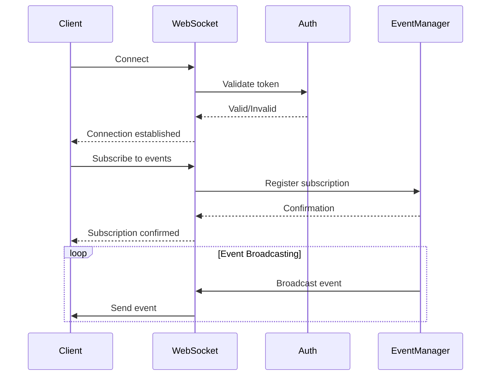
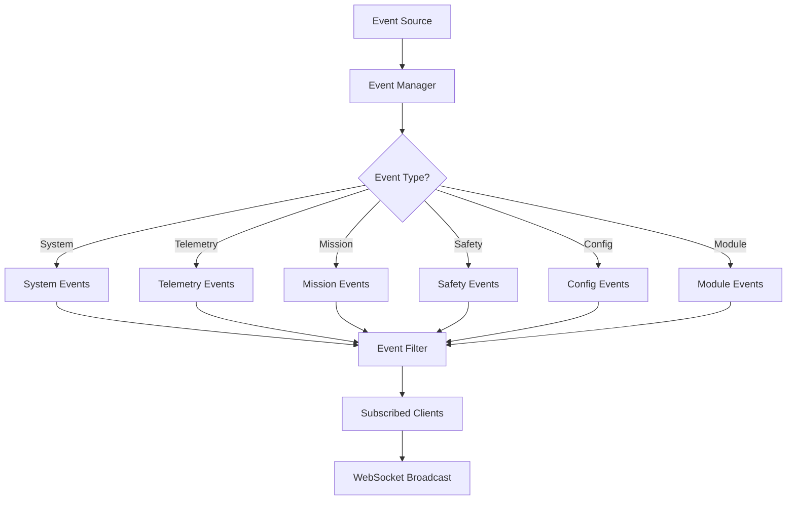

# WEBSOCKET EVENTS - OHT-50 Backend

**Phiên bản:** v1.0  
**Phạm vi:** WebSocket events và real-time communication  
**Cập nhật:** 2024-12-19

---

## 📋 **Tổng quan**

Tài liệu này định nghĩa các WebSocket events cho hệ thống OHT-50, bao gồm real-time telemetry, system status updates, và event-driven communication.

---

## 🔌 **1. WebSocket Connection**

### **1.1 Connection Endpoint**

```
ws://localhost:8000/ws/telemetry
wss://production.example.com/ws/telemetry  # Production
```

### **1.2 Authentication**

```json
{
  "type": "auth",
  "token": "eyJhbGciOiJIUzI1NiIsInR5cCI6IkpXVCJ9..."
}
```

### **1.3 Connection Parameters**

| Parameter | Type | Required | Description |
|-----------|------|----------|-------------|
| `token` | string | Yes | JWT authentication token |
| `client_id` | string | No | Client identifier |
| `subscription` | array | No | Event subscriptions |

---

## 📡 **2. Event Types**

### **2.1 System Events**

#### **System Status Update**
```json
{
  "type": "system.status",
  "timestamp": "2024-12-19T10:30:00Z",
  "data": {
    "status": "idle|moving|docking|fault|estop",
    "state": "ready|busy|error|maintenance",
    "uptime": 86400,
    "version": "1.2.3",
    "health": {
      "cpu": 45.2,
      "memory": 67.8,
      "disk": 23.1,
      "temperature": 42.5
    }
  }
}
```

#### **System Error**
```json
{
  "type": "system.error",
  "timestamp": "2024-12-19T10:30:00Z",
  "data": {
    "error_code": "SYS-001",
    "error_name": "Database Connection Failed",
    "severity": "P0",
    "description": "Cannot connect to database",
    "affected_services": ["api", "telemetry"]
  }
}
```

### **2.2 Telemetry Events**

#### **Real-time Telemetry**
```json
{
  "type": "telemetry.realtime",
  "timestamp": "2024-12-19T10:30:00Z",
  "data": {
    "position": {
      "x": 1250.5,
      "y": 0.0,
      "z": 0.0
    },
    "velocity": {
      "linear": 0.8,
      "angular": 0.0
    },
    "acceleration": {
      "linear": 0.2,
      "angular": 0.0
    },
    "orientation": {
      "roll": 0.0,
      "pitch": 0.0,
      "yaw": 0.0
    },
    "sensors": {
      "battery": 85.2,
      "temperature": 42.5,
      "humidity": 45.8
    }
  }
}
```

#### **Telemetry Status**
```json
{
  "type": "telemetry.status",
  "timestamp": "2024-12-19T10:30:00Z",
  "data": {
    "streaming": true,
    "rate": 10,
    "connected_clients": 3,
    "last_update": "2024-12-19T10:29:59Z"
  }
}
```

### **2.3 Mission Events**

#### **Mission Started**
```json
{
  "type": "mission.started",
  "timestamp": "2024-12-19T10:30:00Z",
  "data": {
    "mission_id": "mission-123",
    "mission_type": "transport|inspection|maintenance",
    "start_position": {
      "x": 0.0,
      "y": 0.0,
      "z": 0.0
    },
    "target_position": {
      "x": 1250.5,
      "y": 0.0,
      "z": 0.0
    },
    "estimated_duration": 180
  }
}
```

#### **Mission Progress**
```json
{
  "type": "mission.progress",
  "timestamp": "2024-12-19T10:30:00Z",
  "data": {
    "mission_id": "mission-123",
    "progress": 65.5,
    "current_position": {
      "x": 820.3,
      "y": 0.0,
      "z": 0.0
    },
    "remaining_distance": 430.2,
    "estimated_completion": "2024-12-19T10:33:00Z"
  }
}
```

#### **Mission Completed**
```json
{
  "type": "mission.completed",
  "timestamp": "2024-12-19T10:33:00Z",
  "data": {
    "mission_id": "mission-123",
    "status": "success|failed|cancelled",
    "completion_time": 180,
    "final_position": {
      "x": 1250.5,
      "y": 0.0,
      "z": 0.0
    },
    "summary": {
      "distance_traveled": 1250.5,
      "energy_consumed": 2.3,
      "errors_encountered": 0
    }
  }
}
```

### **2.4 Safety Events**

#### **Safety Zone Entered**
```json
{
  "type": "safety.zone_entered",
  "timestamp": "2024-12-19T10:30:00Z",
  "data": {
    "zone_id": "zone-001",
    "zone_type": "restricted|warning|safe",
    "position": {
      "x": 820.3,
      "y": 0.0,
      "z": 0.0
    },
    "action": "slow_down|stop|alert"
  }
}
```

#### **E-Stop Activated**
```json
{
  "type": "safety.estop",
  "timestamp": "2024-12-19T10:30:00Z",
  "data": {
    "estop_id": "estop-001",
    "trigger_type": "hardware|software|remote",
    "position": {
      "x": 820.3,
      "y": 0.0,
      "z": 0.0
    },
    "emergency_level": "critical|warning",
    "auto_recovery": false
  }
}
```

#### **Safety Clear**
```json
{
  "type": "safety.clear",
  "timestamp": "2024-12-19T10:30:00Z",
  "data": {
    "cleared_by": "operator|system|auto",
    "position": {
      "x": 820.3,
      "y": 0.0,
      "z": 0.0
    },
    "next_action": "resume|return_home|manual_control"
  }
}
```

### **2.5 Configuration Events**

#### **Configuration Updated**
```json
{
  "type": "config.updated",
  "timestamp": "2024-12-19T10:30:00Z",
  "data": {
    "config_id": "config-123",
    "version": "1.2.3",
    "updated_by": "operator@example.com",
    "changes": {
      "max_velocity": "1.5 -> 2.0",
      "safety_zones": "added zone-001"
    },
    "status": "applied|pending|failed"
  }
}
```

#### **Configuration Rollback**
```json
{
  "type": "config.rollback",
  "timestamp": "2024-12-19T10:30:00Z",
  "data": {
    "from_version": "1.2.3",
    "to_version": "1.2.2",
    "reason": "performance_issue|safety_concern",
    "rolled_back_by": "system|operator",
    "status": "completed|failed"
  }
}
```

### **2.6 Module Events**

#### **Module Discovered**
```json
{
  "type": "module.discovered",
  "timestamp": "2024-12-19T10:30:00Z",
  "data": {
    "module_id": "module-001",
    "module_type": "motor|sensor|actuator",
    "address": "192.168.1.100",
    "firmware_version": "2.1.0",
    "status": "online|offline|error"
  }
}
```

#### **Module Status Change**
```json
{
  "type": "module.status_change",
  "timestamp": "2024-12-19T10:30:00Z",
  "data": {
    "module_id": "module-001",
    "old_status": "online",
    "new_status": "error",
    "error_code": "MOD-001",
    "error_description": "Communication timeout"
  }
}
```

---

## 📨 **3. Client Commands**

### **3.1 Subscription Commands**

#### **Subscribe to Events**
```json
{
  "type": "subscribe",
  "events": ["telemetry.realtime", "system.status", "mission.*"],
  "rate": 10
}
```

#### **Unsubscribe from Events**
```json
{
  "type": "unsubscribe",
  "events": ["telemetry.realtime"]
}
```

### **3.2 Control Commands**

#### **Set Telemetry Rate**
```json
{
  "type": "set_telemetry_rate",
  "rate": 5
}
```

#### **Request System Status**
```json
{
  "type": "get_system_status",
  "request_id": "req-123"
}
```

#### **Emergency Stop**
```json
{
  "type": "emergency_stop",
  "reason": "manual_trigger",
  "request_id": "req-124"
}
```

---

## 🔄 **4. Event Flow**

### **4.1 Connection Flow**



### **4.2 Event Broadcasting**



---

## 📊 **5. Performance & Limits**

### **5.1 Connection Limits**

| Limit | Value | Description |
|-------|-------|-------------|
| **Max Connections** | 100 | Tổng số kết nối đồng thời |
| **Max Events/sec** | 1000 | Tổng số events/giây |
| **Max Payload Size** | 16KB | Kích thước message tối đa |
| **Connection Timeout** | 300s | Timeout kết nối |
| **Ping Interval** | 30s | Ping để giữ kết nối |

### **5.2 Rate Limiting**

| Event Type | Rate Limit | Description |
|------------|------------|-------------|
| **telemetry.realtime** | 10 Hz | Real-time telemetry |
| **system.status** | 1 Hz | System status updates |
| **mission.*** | 5 Hz | Mission events |
| **safety.*** | 1 Hz | Safety events |
| **config.*** | 0.1 Hz | Configuration events |

---

## 🛡️ **6. Security**

### **6.1 Authentication**

- **JWT Token:** Required cho tất cả connections
- **Token Expiration:** 15-30 phút
- **Refresh Token:** Auto-refresh khi gần hết hạn
- **Rate Limiting:** Per-client rate limiting

### **6.2 Data Protection**

- **Encryption:** TLS 1.2+ cho production
- **Message Validation:** Tất cả messages được validate
- **Access Control:** Role-based event access
- **Audit Logging:** Tất cả connections và events được log

---

## 🔧 **7. Error Handling**

### **7.1 Connection Errors**

```json
{
  "type": "error",
  "error_code": "WS-001",
  "error_name": "Authentication Failed",
  "description": "Invalid or expired token",
  "timestamp": "2024-12-19T10:30:00Z"
}
```

### **7.2 Event Errors**

```json
{
  "type": "error",
  "error_code": "WS-002",
  "error_name": "Invalid Event Type",
  "description": "Unknown event type: invalid.event",
  "timestamp": "2024-12-19T10:30:00Z"
}
```

### **7.3 Rate Limit Errors**

```json
{
  "type": "error",
  "error_code": "WS-003",
  "error_name": "Rate Limit Exceeded",
  "description": "Too many events per second",
  "timestamp": "2024-12-19T10:30:00Z"
}
```

---

## 📚 **8. Client Examples**

### **8.1 JavaScript Client**

```javascript
const ws = new WebSocket('ws://localhost:8000/ws/telemetry');

ws.onopen = function() {
    // Authenticate
    ws.send(JSON.stringify({
        type: 'auth',
        token: 'your-jwt-token'
    }));
    
    // Subscribe to events
    ws.send(JSON.stringify({
        type: 'subscribe',
        events: ['telemetry.realtime', 'system.status'],
        rate: 10
    }));
};

ws.onmessage = function(event) {
    const data = JSON.parse(event.data);
    
    switch(data.type) {
        case 'telemetry.realtime':
            updateTelemetry(data.data);
            break;
        case 'system.status':
            updateSystemStatus(data.data);
            break;
        case 'error':
            handleError(data);
            break;
    }
};
```

### **8.2 Python Client**

```python
import asyncio
import websockets
import json

async def websocket_client():
    uri = "ws://localhost:8000/ws/telemetry"
    
    async with websockets.connect(uri) as websocket:
        # Authenticate
        auth_message = {
            "type": "auth",
            "token": "your-jwt-token"
        }
        await websocket.send(json.dumps(auth_message))
        
        # Subscribe to events
        subscribe_message = {
            "type": "subscribe",
            "events": ["telemetry.realtime", "system.status"],
            "rate": 10
        }
        await websocket.send(json.dumps(subscribe_message))
        
        # Listen for events
        async for message in websocket:
            data = json.loads(message)
            
            if data["type"] == "telemetry.realtime":
                update_telemetry(data["data"])
            elif data["type"] == "system.status":
                update_system_status(data["data"])
            elif data["type"] == "error":
                handle_error(data)

asyncio.run(websocket_client())
```

---

## 📚 **9. References**

### **9.1 Related Documents**
- [Telemetry API](TELEMETRY_API.md) - REST API cho telemetry
- [Configuration API](CONFIG_API.md) - Configuration management
- [Integration Center](INTEGRATION_CENTER.md) - External integrations

### **9.2 Tools & Libraries**
- **WebSocket Libraries:**
  - Python: `websockets`, `fastapi`
  - JavaScript: `WebSocket` (native), `ws`
  - Java: `Java WebSocket`
  - C#: `System.Net.WebSockets`

---

**Changelog v1.0:**
- ✅ Created comprehensive WebSocket events documentation
- ✅ Defined all event types and formats
- ✅ Added client commands and examples
- ✅ Included security and performance considerations
- ✅ Added error handling and client examples
- ✅ Referenced related documents and tools
