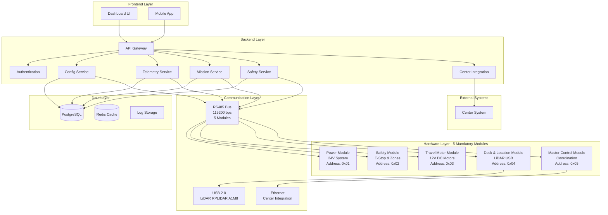

# System Architecture - OHT-50 Backend v2.0

## 📋 Tổng quan
Tài liệu này mô tả kiến trúc tổng thể của OHT-50 Backend Architecture v2.0, bao gồm các component chính, luồng dữ liệu và tương tác giữa các hệ thống với 5 mandatory modules.

## 🔧 **Architecture v2.0 Features**
- **5 Mandatory Modules:** Power, Safety, Travel Motor, Dock & Location, Master Control
- **RS485 Communication:** Standardized cho tất cả modules
- **LiDAR USB Integration:** RPLIDAR A1M8 qua USB 2.0
- **24V System:** Power management với 24V nominal voltage
- **Safety Integration:** E-Stop, safety zones, emergency procedures
- **Mission Management:** Complete mission lifecycle
- **State Machine:** System state management
- **Real-time Coordination:** Master Control Module orchestration

## 🏗️ Kiến trúc tổng thể



## 🔧 Core Components

### 1. API Gateway
- **Chức năng**: Entry point cho tất cả requests
- **Responsibility**: 
  - Route requests đến services phù hợp
  - Rate limiting và throttling
  - Request/Response logging
  - CORS handling
- **Technology**: FastAPI với middleware

### 2. Authentication Service
- **Chức năng**: Xác thực và phân quyền
- **Responsibility**:
  - Token validation (Bearer token)
  - Role-based access control
  - Session management
  - Security audit logging
- **Technology**: JWT tokens, Pydantic models

### 3. Configuration Service
- **Chức năng**: Quản lý cấu hình hệ thống
- **Responsibility**:
  - CRUD operations cho system config
  - Version control và rollback
  - Validation và schema management
  - Configuration distribution
- **Technology**: Pydantic models, JSON/YAML storage

### 4. Telemetry Service
- **Chức năng**: Thu thập và xử lý dữ liệu telemetry
- **Responsibility**:
  - Real-time data collection
  - WebSocket streaming
  - Data aggregation và analysis
  - Performance metrics
- **Technology**: WebSocket, async processing

### 5. Mission Service
- **Chức năng**: Quản lý nhiệm vụ và lập kế hoạch
- **Responsibility**:
  - Mission creation và scheduling
  - Path planning và optimization
  - Progress tracking
  - Mission history
  - Module coordination
- **Technology**: Graph algorithms, state machines

### 6. Module Management Service
- **Chức năng**: Quản lý 5 mandatory modules
- **Responsibility**:
  - Module discovery và registration
  - RS485 communication management
  - Module health monitoring
  - Auto-discovery và hot-swap
- **Technology**: RS485 protocol, Modbus RTU

### 7. Safety Service
- **Chức năng**: Quản lý an toàn hệ thống
- **Responsibility**:
  - E-Stop management
  - Safety zones monitoring
  - Emergency procedures
  - Safety violations tracking
- **Technology**: Real-time monitoring, event-driven

### 8. Location & Navigation Service
- **Chức năng**: Quản lý vị trí và điều hướng
- **Responsibility**:
  - LiDAR data processing
  - Position tracking
  - Path planning
  - Obstacle detection
- **Technology**: SLAM algorithms, USB 2.0 integration

### 6. Safety Service
- **Chức năng**: Đảm bảo an toàn hệ thống
- **Responsibility**:
  - E-Stop handling
  - Safety zone monitoring
  - Collision detection
  - Emergency procedures
- **Technology**: Real-time monitoring, safety protocols

### 7. Center Integration Service
- **Chức năng**: Tích hợp với hệ thống Center
- **Responsibility**:
  - Mission reception
  - Status reporting
  - Permission requests
  - Data synchronization
- **Technology**: HTTP client, async communication

## 📊 Data Flow

### 1. Configuration Flow
```
User Request → API Gateway → Auth → Config Service → Database
                                    ↓
                              Response ← Config Data
```

### 2. Telemetry Flow
```
Firmware → Telemetry Service → Database
                ↓
        WebSocket → Frontend (Real-time)
                ↓
        Analytics → Performance Monitoring
```

### 3. Mission Flow
```
Center → Mission Service → Safety Check → Firmware
                ↓
        Progress Tracking → Database
                ↓
        Status Updates → Center
```

### 4. Safety Flow
```
Firmware → Safety Service → Emergency Actions
                ↓
        Alert System → Frontend/Center
                ↓
        Logging → Audit Trail
```

## 🔐 Security Architecture

### Authentication Layers
1. **API Level**: Bearer token validation
2. **Service Level**: Internal service authentication
3. **Data Level**: Database access control
4. **Network Level**: HTTPS/TLS encryption

### Authorization Model
- **Role-based**: Admin, Operator, Viewer
- **Resource-based**: API endpoints, data access
- **Context-based**: Time, location, mission status

## 📈 Performance Architecture

### Scalability Patterns
- **Horizontal Scaling**: Multiple backend instances
- **Load Balancing**: API Gateway distribution
- **Caching**: Redis for frequently accessed data
- **Async Processing**: Background tasks và queues

### Monitoring Points

## 🔧 **5 Mandatory Modules Architecture**

### **1. Power Module (Address: 0x01)**
- **Chức năng**: Quản lý nguồn điện 24V system
- **Hardware**: LiFePO4 battery pack, power distribution
- **Features**:
  - Battery management (50Ah capacity)
  - Power distribution (5V, 12V, 24V outputs)
  - Charging control và protection
  - Temperature monitoring
- **Communication**: RS485 Modbus RTU
- **Voltage**: 24V nominal (28.8V max, 20V min)

### **2. Safety Module (Address: 0x02)**
- **Chức năng**: Quản lý an toàn hệ thống
- **Hardware**: E-Stop buttons, safety sensors, light curtains
- **Features**:
  - E-Stop dual-channel safety
  - Safety zones monitoring
  - Speed limit enforcement
  - Emergency brake control
- **Communication**: RS485 Modbus RTU
- **Safety Level**: SIL2 compliance

### **3. Travel Motor Module (Address: 0x03)**
- **Chức năng**: Điều khiển động cơ di chuyển
- **Hardware**: 12V DC brushed motors, encoders
- **Features**:
  - PID speed control
  - Encoder feedback
  - Motor protection
  - Speed monitoring
- **Communication**: RS485 Modbus RTU
- **Motors**: 2x 12V DC, 100W each

### **4. Dock & Location Module (Address: 0x04)**
- **Chức năng**: Định vị và điều hướng
- **Hardware**: LiDAR RPLIDAR A1M8, IMU, RFID
- **Features**:
  - LiDAR mapping và localization
  - Position tracking
  - Navigation control
  - Obstacle detection
- **Communication**: RS485 Modbus RTU + USB 2.0 (LiDAR)
- **LiDAR**: RPLIDAR A1M8 via USB 2.0

### **5. Master Control Module (Address: 0x05)**
- **Chức năng**: Điều phối toàn bộ hệ thống
- **Hardware**: Orange Pi 5B, communication interfaces
- **Features**:
  - System state management
  - Mission coordination
  - Module communication
  - Center integration
- **Communication**: RS485 + Ethernet + WiFi
- **Platform**: Orange Pi 5B (RK3588)

## 🔌 **Communication Architecture**

### **RS485 Bus Configuration**
- **Protocol**: Modbus RTU
- **Baudrate**: 115200 bps
- **Addresses**: 0x01 - 0x05 (5 mandatory modules)
- **Topology**: Master-Slave (Master Control as master)
- **Termination**: 120Ω resistors
- **Cable**: Shielded twisted pair

### **USB 2.0 Integration**
- **LiDAR Connection**: RPLIDAR A1M8
- **Interface**: USB 2.0
- **Data Rate**: Up to 480 Mbps
- **Integration**: Connected to Dock & Location Module

### **Ethernet Integration**
- **Center Communication**: HTTP/WebSocket
- **Protocol**: REST API + WebSocket
- **Security**: SSL/TLS encryption
- **Authentication**: JWT tokens

## 🔄 **Data Flow v2.0**

### **1. Module Communication Flow**
```
Master Control → RS485 Bus → Power/Safety/Motor/Dock Modules
                ↓
        Real-time Status Updates → Telemetry Service
                ↓
        WebSocket Events → Frontend
```

### **2. LiDAR Data Flow**
```
RPLIDAR A1M8 → USB 2.0 → Dock & Location Module
                ↓
        Scan Data → Location Service
                ↓
        Position Updates → Navigation Service
```

### **3. Safety Flow v2.0**
```
Safety Module → E-Stop Events → Safety Service
                ↓
        Emergency Actions → All Modules
                ↓
        Alert System → Frontend/Center
```

### **4. Mission Flow v2.0**
```
Center → Mission Service → Master Control Module
                ↓
        Module Coordination → All Modules
                ↓
        Progress Tracking → Telemetry Service
```
- **API Response Times**: P95 < 100ms
- **Database Performance**: Query optimization

---

**Changelog v2.0:**
- ✅ Updated to Architecture v2.0
- ✅ Added 5 mandatory modules architecture
- ✅ Added RS485 communication configuration
- ✅ Added LiDAR USB integration
- ✅ Standardized to 24V nominal voltage
- ✅ Added module addresses và communication protocols
- ✅ Enhanced data flow diagrams
- ✅ Added communication architecture details
- ✅ Updated system components for v2.0
- ✅ Added safety integration details
- ✅ Added mission management flow
- ✅ Enhanced security và performance architecture
- **Memory Usage**: Resource monitoring
- **Network Latency**: Connection quality

## 🗄️ Data Architecture

### Storage Strategy
- **Configuration**: JSON/YAML files với versioning
- **Telemetry**: Time-series database
- **Missions**: Relational database
- **Logs**: Structured logging với rotation

### Data Models
- **System Config**: Hardware, safety, telemetry settings
- **Telemetry Data**: Position, velocity, status, metrics
- **Mission Data**: Tasks, progress, results
- **Safety Data**: Events, alerts, audit trail

## 🔄 Integration Patterns

### External Systems
1. **Firmware**: RS485/Modbus RTU communication
2. **Center**: HTTP REST API integration
3. **Frontend**: WebSocket real-time updates
4. **Mobile**: REST API với push notifications

### Internal Services
1. **Service-to-Service**: Internal API calls
2. **Event-driven**: Async event processing
3. **Database**: Shared data access
4. **Cache**: Distributed caching

## 🚀 Deployment Architecture

### Environment Strategy
- **Development**: Local development với hot reload
- **Staging**: Production-like testing environment
- **Production**: High availability với redundancy

### Infrastructure
- **Containerization**: Docker containers
- **Orchestration**: Docker Compose/Kubernetes
- **Monitoring**: Health checks và metrics
- **Backup**: Automated backup procedures

## 📋 Technology Stack

### Backend Framework
- **FastAPI**: High-performance web framework
- **Pydantic**: Data validation và serialization
- **SQLAlchemy**: Database ORM
- **WebSocket**: Real-time communication

### Data Storage
- **SQLite**: Development database
- **PostgreSQL**: Production database
- **Redis**: Caching và session storage
- **File System**: Configuration files

### Communication
- **HTTP/REST**: API endpoints
- **WebSocket**: Real-time streaming
- **RS485/Modbus**: Hardware communication
- **JSON**: Data serialization

## 🔧 Configuration Management

### Environment Variables
- `DEBUG`: Development mode flag
- `SECRET_KEY`: Authentication secret
- `DATABASE_URL`: Database connection
- `CENTER_URL`: Center system URL

### Configuration Files
- `config/development.yaml`: Development settings
- `config/production.yaml`: Production settings
- `config/security.yaml`: Security configuration

## 📊 Monitoring & Observability

### Metrics Collection
- **Application Metrics**: Response times, error rates
- **System Metrics**: CPU, memory, disk usage
- **Business Metrics**: Mission completion, safety events
- **Custom Metrics**: Hardware status, communication quality

### Logging Strategy
- **Structured Logging**: JSON format với correlation IDs
- **Log Levels**: DEBUG, INFO, WARNING, ERROR
- **Log Rotation**: Automated log management
- **Centralized Logging**: ELK stack integration

## 🚨 Error Handling

### Error Categories
1. **Validation Errors**: Invalid input data
2. **Authentication Errors**: Invalid credentials
3. **Authorization Errors**: Insufficient permissions
4. **System Errors**: Internal failures
5. **External Errors**: Third-party service failures

### Error Response Format
```json
{
  "success": false,
  "error_code": "VALIDATION_ERROR",
  "message": "Invalid configuration data",
  "details": {
    "field": "motor.vmax_mms",
    "value": -100,
    "constraint": "must be positive"
  }
}
```

## 🔄 Future Enhancements

### Planned Improvements
1. **Microservices**: Service decomposition
2. **Event Sourcing**: Event-driven architecture
3. **CQRS**: Command Query Responsibility Segregation
4. **GraphQL**: Flexible data querying
5. **Machine Learning**: Predictive analytics

### Scalability Roadmap
1. **Horizontal Scaling**: Load balancer implementation
2. **Database Sharding**: Data distribution
3. **Caching Strategy**: Multi-level caching
4. **CDN Integration**: Content delivery optimization
