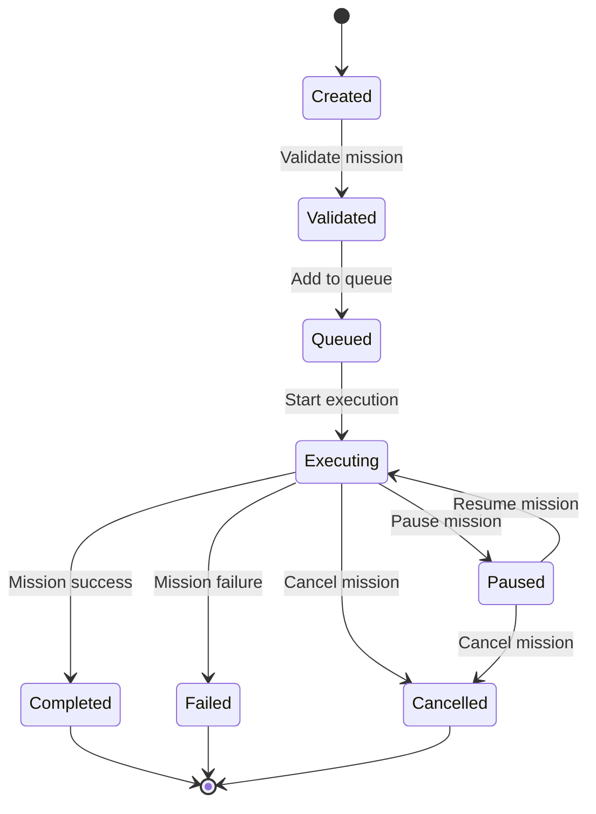
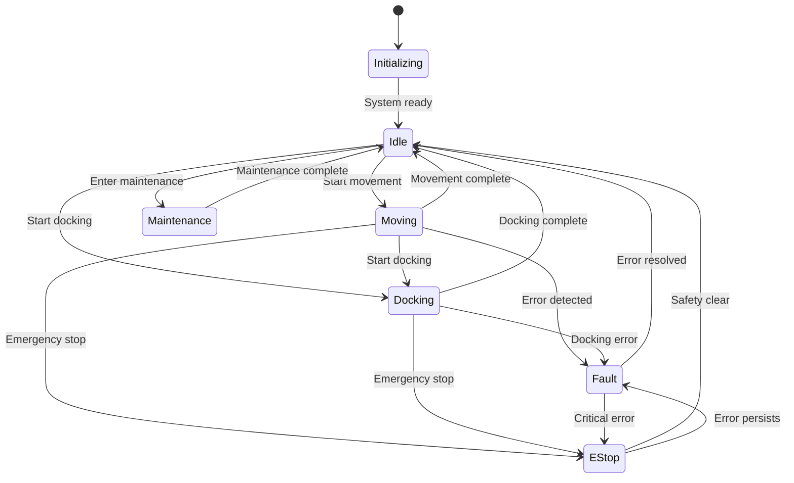

# BUSINESS LOGIC SPECIFICATION - OHT-50 Backend

**Phiên bản:** v1.0  
**Phạm vi:** Core business logic cho hệ thống OHT-50  
**Cập nhật:** 2024-12-19

---

## 📋 **Tổng quan**

Tài liệu này định nghĩa core business logic cho hệ thống OHT-50, bao gồm quản lý mission, safety management, movement control, và system state management.

---

## 🎯 **1. Mission Management**

### **1.1 Mission Lifecycle**



### **1.2 Mission Types**

#### **Transport Mission**
```python
class TransportMission:
    start_position: Position
    target_position: Position
    payload: Optional[Payload]
    priority: Priority
    estimated_duration: int  # seconds
    safety_requirements: List[SafetyRequirement]
```

#### **Inspection Mission**
```python
class InspectionMission:
    inspection_points: List[Position]
    inspection_type: InspectionType
    camera_settings: CameraConfig
    data_collection: DataCollectionConfig
```

#### **Maintenance Mission**
```python
class MaintenanceMission:
    maintenance_points: List[Position]
    maintenance_type: MaintenanceType
    tools_required: List[Tool]
    safety_procedures: List[SafetyProcedure]
```

### **1.3 Mission Validation Rules**

| Rule | Description | Validation |
|------|-------------|------------|
| **Position Validation** | Kiểm tra vị trí trong phạm vi hoạt động | `0 <= x <= max_x`, `y == 0`, `z == 0` |
| **Safety Zone Check** | Đảm bảo không vi phạm safety zones | Kiểm tra collision với restricted zones |
| **Payload Validation** | Kiểm tra payload capacity | `payload_weight <= max_capacity` |
| **Battery Check** | Đảm bảo đủ pin cho mission | `estimated_consumption <= current_battery` |
| **Time Validation** | Kiểm tra thời gian thực hiện | `estimated_duration <= max_mission_time` |

---

## 🛡️ **2. Safety Management**

### **2.1 Safety Zones**

#### **Zone Types**
```python
class SafetyZone:
    zone_id: str
    zone_type: ZoneType  # restricted, warning, safe
    boundaries: List[Position]
    max_speed: float
    required_actions: List[SafetyAction]
```

#### **Zone Hierarchy**
1. **Restricted Zones:** Không được phép vào
2. **Warning Zones:** Giảm tốc độ, cảnh báo
3. **Safe Zones:** Hoạt động bình thường

### **2.2 E-Stop Handling**

#### **E-Stop Triggers**
- **Hardware E-Stop:** Nút vật lý trên thiết bị
- **Software E-Stop:** Lệnh từ software
- **Remote E-Stop:** Lệnh từ center system
- **Automatic E-Stop:** Safety violation detection

#### **E-Stop Response**
```python
def emergency_stop(trigger_type: EStopTrigger):
    # 1. Immediate stop
    stop_all_motors()
    
    # 2. Activate safety systems
    activate_brakes()
    enable_safety_lights()
    
    # 3. Notify stakeholders
    send_estop_notification(trigger_type)
    
    # 4. Log incident
    log_safety_incident(trigger_type)
    
    # 5. Enter safe state
    transition_to_safe_state()
```

### **2.3 Safety Rules**

| Rule | Description | Action |
|------|-------------|--------|
| **Obstacle Detection** | Phát hiện vật cản trong phạm vi 2m | Giảm tốc độ, dừng nếu cần |
| **Speed Limit** | Không vượt quá tốc độ tối đa | Enforce speed limits |
| **Zone Violation** | Vi phạm safety zone | Immediate stop |
| **Battery Low** | Pin dưới 20% | Return to charging station |
| **Communication Loss** | Mất kết nối center | Enter safe mode |

---

## 🚀 **3. Movement Control**

### **3.1 Trajectory Planning**

#### **S-Curve Profile**
```python
class SCurveProfile:
    max_velocity: float      # m/s
    max_acceleration: float  # m/s²
    max_jerk: float         # m/s³
    distance: float         # m
    
    def calculate_profile(self) -> Trajectory:
        # Calculate S-curve trajectory
        # Ensure smooth acceleration/deceleration
        pass
```

#### **Trajectory Validation**
- **Velocity Limits:** Không vượt quá `v_max`
- **Acceleration Limits:** Không vượt quá `a_max`
- **Jerk Limits:** Không vượt quá `j_max`
- **Position Accuracy:** Dừng trong ±2mm

### **3.2 Speed Profiles**

#### **Normal Operation**
```python
class SpeedProfile:
    cruise_speed: float = 2.0    # m/s
    acceleration: float = 1.0    # m/s²
    deceleration: float = 1.0    # m/s²
    jerk: float = 0.5           # m/s³
```

#### **Safety Mode**
```python
class SafetySpeedProfile:
    cruise_speed: float = 0.5    # m/s
    acceleration: float = 0.3    # m/s²
    deceleration: float = 0.3    # m/s²
    jerk: float = 0.2           # m/s³
```

### **3.3 Position Control**

#### **PID Controller**
```python
class PositionController:
    kp: float = 10.0    # Proportional gain
    ki: float = 0.1     # Integral gain
    kd: float = 1.0     # Derivative gain
    
    def control(self, target: Position, current: Position) -> ControlSignal:
        error = target - current
        # PID control algorithm
        pass
```

---

## 🔄 **4. Module Coordination**

### **4.1 Module Manager**

#### **Module Discovery**
```python
class ModuleManager:
    def discover_modules(self) -> List[Module]:
        # Scan network for modules
        # Validate module compatibility
        # Register modules
        pass
    
    def monitor_modules(self) -> ModuleStatus:
        # Check module health
        # Monitor communication
        # Handle failures
        pass
```

#### **Module Communication**
- **RS485 Protocol:** Modbus RTU cho motor control
- **Ethernet:** TCP/IP cho high-level commands
- **Heartbeat:** Regular status updates
- **Error Handling:** Automatic retry và failover

### **4.2 Failure Handling**

#### **Failure Types**
1. **Communication Failure:** Mất kết nối module
2. **Hardware Failure:** Lỗi phần cứng
3. **Software Failure:** Lỗi firmware
4. **Safety Failure:** Vi phạm safety rules

#### **Recovery Procedures**
```python
def handle_module_failure(module: Module, failure_type: FailureType):
    # 1. Assess impact
    impact = assess_failure_impact(module, failure_type)
    
    # 2. Implement safety measures
    if impact.is_critical():
        emergency_stop()
    
    # 3. Attempt recovery
    if failure_type.is_recoverable():
        attempt_recovery(module)
    
    # 4. Notify stakeholders
    notify_failure(module, failure_type, impact)
    
    # 5. Log incident
    log_failure_incident(module, failure_type)
```

---

## 🎛️ **5. System State Management**

### **5.1 State Machine**



### **5.2 State Transitions**

#### **Valid Transitions**
| From State | To State | Condition | Action |
|------------|----------|-----------|--------|
| `Initializing` | `Idle` | System ready | Initialize services |
| `Idle` | `Moving` | Mission started | Start movement control |
| `Moving` | `Idle` | Mission complete | Stop movement |
| `Moving` | `Docking` | Docking requested | Start docking sequence |
| `Any` | `EStop` | Safety violation | Emergency stop |
| `EStop` | `Idle` | Safety clear | Resume normal operation |

#### **State Validation**
```python
def validate_state_transition(from_state: SystemState, to_state: SystemState) -> bool:
    valid_transitions = {
        SystemState.INITIALIZING: [SystemState.IDLE],
        SystemState.IDLE: [SystemState.MOVING, SystemState.DOCKING, SystemState.MAINTENANCE],
        SystemState.MOVING: [SystemState.IDLE, SystemState.DOCKING, SystemState.FAULT, SystemState.ESTOP],
        SystemState.DOCKING: [SystemState.IDLE, SystemState.FAULT, SystemState.ESTOP],
        SystemState.MAINTENANCE: [SystemState.IDLE],
        SystemState.FAULT: [SystemState.IDLE, SystemState.ESTOP],
        SystemState.ESTOP: [SystemState.IDLE, SystemState.FAULT]
    }
    
    return to_state in valid_transitions.get(from_state, [])
```

### **5.3 State Persistence**

#### **State Storage**
```python
class StateManager:
    def save_state(self, state: SystemState):
        # Save to database
        # Update configuration
        # Log state change
        pass
    
    def load_state(self) -> SystemState:
        # Load from database
        # Validate state
        # Restore system state
        pass
    
    def get_state_history(self) -> List[StateChange]:
        # Retrieve state change history
        # For audit và debugging
        pass
```

---

## 📊 **6. Business Rules & Constraints**

### **6.1 Operational Rules**

| Rule | Description | Implementation |
|------|-------------|----------------|
| **Single Mission** | Chỉ thực hiện 1 mission tại một thời điểm | Mission queue management |
| **Safety First** | Safety rules override tất cả operations | Safety validation trước mọi action |
| **Battery Management** | Không start mission nếu pin < 30% | Battery level check |
| **Speed Limits** | Tốc độ tối đa theo zone và condition | Dynamic speed control |
| **Position Accuracy** | Dừng chính xác trong ±2mm | High-precision control |

### **6.2 Business Constraints**

#### **Physical Constraints**
- **Track Length:** 0 ≤ x ≤ 1500m
- **Speed Limits:** 0 ≤ v ≤ 2.0 m/s
- **Acceleration:** 0 ≤ a ≤ 1.0 m/s²
- **Payload Capacity:** ≤ 50kg
- **Battery Capacity:** 0-100%

#### **Operational Constraints**
- **Operating Hours:** 24/7 với maintenance windows
- **Environmental:** Temperature -10°C to +50°C
- **Safety:** SIL2 compliance
- **Reliability:** 99.9% uptime target

### **6.3 Validation Rules**

#### **Mission Validation**
```python
def validate_mission(mission: Mission) -> ValidationResult:
    errors = []
    
    # Position validation
    if not is_valid_position(mission.start_position):
        errors.append("Invalid start position")
    
    if not is_valid_position(mission.target_position):
        errors.append("Invalid target position")
    
    # Safety validation
    if not check_safety_zones(mission):
        errors.append("Mission violates safety zones")
    
    # Resource validation
    if not check_resources(mission):
        errors.append("Insufficient resources")
    
    return ValidationResult(errors)
```

---

## 🔧 **7. Integration Points**

### **7.1 Center System Integration**

#### **Mission Reception**
```python
def receive_mission_from_center(mission_data: dict) -> Mission:
    # Validate mission data
    # Convert to internal format
    # Add to mission queue
    # Notify stakeholders
    pass
```

#### **Status Reporting**
```python
def report_status_to_center(status: SystemStatus):
    # Prepare status data
    # Send to center
    # Handle communication errors
    # Retry if needed
    pass
```

### **7.2 Firmware Integration**

#### **Command Execution**
```python
def execute_firmware_command(command: FirmwareCommand):
    # Validate command
    # Send to firmware
    # Monitor execution
    # Handle response
    pass
```

#### **Data Collection**
```python
def collect_firmware_data() -> TelemetryData:
    # Request data from firmware
    # Validate data format
    # Process và store
    # Update system state
    pass
```

---

## 📈 **8. Performance Requirements**

### **8.1 Response Times**

| Operation | Target | Maximum | Notes |
|-----------|--------|---------|-------|
| **Mission Start** | < 5s | < 10s | Từ lệnh đến bắt đầu |
| **Emergency Stop** | < 100ms | < 200ms | Critical safety |
| **Status Update** | < 1s | < 2s | Real-time monitoring |
| **Configuration Apply** | < 10s | < 30s | System reconfiguration |
| **Data Processing** | < 100ms | < 500ms | Telemetry processing |

### **8.2 Throughput Requirements**

| Metric | Target | Maximum | Notes |
|--------|--------|---------|-------|
| **Missions/Day** | 100 | 200 | Normal operation |
| **Telemetry Rate** | 10 Hz | 20 Hz | Real-time data |
| **Concurrent Users** | 10 | 50 | Dashboard access |
| **API Requests/sec** | 100 | 500 | REST API |
| **WebSocket Connections** | 20 | 100 | Real-time updates |

---

## 📚 **9. References**

### **9.1 Related Documents**
- [Core Architecture](architecture/CORE_ARCHITECTURE.md) - System architecture
- [API Specifications](api-specs/README.md) - API documentation
- [Configuration Management](api-specs/CONFIG_API.md) - Config management

### **9.2 Standards & Guidelines**
- **Safety Standards:** IEC 61508, SIL2
- **Performance Standards:** ISO 13482
- **Communication Protocols:** Modbus RTU, TCP/IP
- **Data Formats:** JSON, YAML, Protocol Buffers

---

**Changelog v1.0:**
- ✅ Created comprehensive business logic specification
- ✅ Defined mission management lifecycle
- ✅ Added safety management procedures
- ✅ Included movement control algorithms
- ✅ Added module coordination logic
- ✅ Defined system state management
- ✅ Added business rules and constraints
- ✅ Referenced related documents and standards
