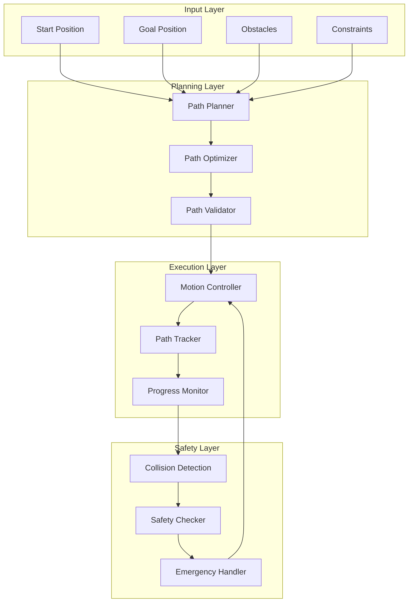

# Path Planning - OHT-50 Backend

## 📋 Tổng quan
Tài liệu này mô tả hệ thống lập kế hoạch đường đi cho OHT-50 Backend, bao gồm các thuật toán path planning, collision avoidance và motion control.

## 🗺️ Path Planning Architecture



## 🔧 Core Path Planning Components

### 1. Path Planning Algorithms

#### A* Algorithm Implementation
```python
import heapq
from typing import List, Tuple, Optional, Dict, Any
import numpy as np

class Node:
    def __init__(self, position: Tuple[float, float], g_cost: float = float('inf'), h_cost: float = 0):
        self.position = position
        self.g_cost = g_cost  # Cost from start to current node
        self.h_cost = h_cost  # Heuristic cost from current to goal
        self.f_cost = g_cost + h_cost  # Total cost
        self.parent = None
    
    def __lt__(self, other):
        return self.f_cost < other.f_cost

class AStarPlanner:
    def __init__(self, grid_size: Tuple[int, int], resolution: float = 0.1):
        self.grid_size = grid_size
        self.resolution = resolution
        self.grid = np.zeros(grid_size, dtype=bool)  # True = obstacle
        self.directions = [
            (-1, -1), (-1, 0), (-1, 1),
            (0, -1),           (0, 1),
            (1, -1),  (1, 0),  (1, 1)
        ]
    
    def set_obstacles(self, obstacles: List[Tuple[float, float]]):
        """Set obstacles in the grid"""
        for obstacle in obstacles:
            grid_pos = self.world_to_grid(obstacle)
            if self.is_valid_position(grid_pos):
                self.grid[grid_pos] = True
    
    def plan_path(self, start: Tuple[float, float], goal: Tuple[float, float]) -> Optional[List[Tuple[float, float]]]:
        """Plan path using A* algorithm"""
        start_grid = self.world_to_grid(start)
        goal_grid = self.world_to_grid(goal)
        
        if not self.is_valid_position(start_grid) or not self.is_valid_position(goal_grid):
            return None
        
        if self.grid[start_grid] or self.grid[goal_grid]:
            return None
        
        # Initialize open and closed sets
        open_set = []
        closed_set = set()
        
        # Create start node
        start_node = Node(start_grid, g_cost=0, h_cost=self.heuristic(start_grid, goal_grid))
        heapq.heappush(open_set, start_node)
        
        # Keep track of nodes for path reconstruction
        all_nodes = {start_grid: start_node}
        
        while open_set:
            current_node = heapq.heappop(open_set)
            
            if current_node.position == goal_grid:
                return self.reconstruct_path(current_node)
            
            closed_set.add(current_node.position)
            
            # Check all neighbors
            for dx, dy in self.directions:
                neighbor_pos = (current_node.position[0] + dx, current_node.position[1] + dy)
                
                if not self.is_valid_position(neighbor_pos):
                    continue
                
                if neighbor_pos in closed_set:
                    continue
                
                if self.grid[neighbor_pos]:
                    continue
                
                # Calculate cost to neighbor
                cost = np.sqrt(dx*dx + dy*dy) * self.resolution
                tentative_g_cost = current_node.g_cost + cost
                
                if neighbor_pos not in all_nodes:
                    neighbor_node = Node(neighbor_pos)
                    all_nodes[neighbor_pos] = neighbor_node
                else:
                    neighbor_node = all_nodes[neighbor_pos]
                
                if tentative_g_cost >= neighbor_node.g_cost:
                    continue
                
                # Update neighbor node
                neighbor_node.parent = current_node
                neighbor_node.g_cost = tentative_g_cost
                neighbor_node.h_cost = self.heuristic(neighbor_pos, goal_grid)
                neighbor_node.f_cost = tentative_g_cost + neighbor_node.h_cost
                
                # Add to open set if not already there
                if neighbor_pos not in [node.position for node in open_set]:
                    heapq.heappush(open_set, neighbor_node)
        
        return None  # No path found
    
    def heuristic(self, pos1: Tuple[int, int], pos2: Tuple[int, int]) -> float:
        """Calculate heuristic cost (Euclidean distance)"""
        dx = pos1[0] - pos2[0]
        dy = pos1[1] - pos2[1]
        return np.sqrt(dx*dx + dy*dy) * self.resolution
    
    def world_to_grid(self, world_pos: Tuple[float, float]) -> Tuple[int, int]:
        """Convert world coordinates to grid coordinates"""
        x = int(world_pos[0] / self.resolution)
        y = int(world_pos[1] / self.resolution)
        return (x, y)
    
    def grid_to_world(self, grid_pos: Tuple[int, int]) -> Tuple[float, float]:
        """Convert grid coordinates to world coordinates"""
        x = grid_pos[0] * self.resolution
        y = grid_pos[1] * self.resolution
        return (x, y)
    
    def is_valid_position(self, pos: Tuple[int, int]) -> bool:
        """Check if position is within grid bounds"""
        return 0 <= pos[0] < self.grid_size[0] and 0 <= pos[1] < self.grid_size[1]
    
    def reconstruct_path(self, goal_node: Node) -> List[Tuple[float, float]]:
        """Reconstruct path from goal node to start node"""
        path = []
        current = goal_node
        
        while current is not None:
            world_pos = self.grid_to_world(current.position)
            path.append(world_pos)
            current = current.parent
        
        return list(reversed(path))
```

#### RRT (Rapidly-exploring Random Tree) Algorithm
```python
import random
from typing import List, Tuple, Optional
import numpy as np

class RRTNode:
    def __init__(self, position: Tuple[float, float], parent=None):
        self.position = position
        self.parent = parent
        self.children = []

class RRTPlanner:
    def __init__(self, bounds: Tuple[Tuple[float, float], Tuple[float, float]], 
                 obstacles: List[Tuple[float, float]], step_size: float = 0.5):
        self.bounds = bounds  # ((x_min, y_min), (x_max, y_max))
        self.obstacles = obstacles
        self.step_size = step_size
        self.nodes = []
        self.max_iterations = 10000
    
    def plan_path(self, start: Tuple[float, float], goal: Tuple[float, float]) -> Optional[List[Tuple[float, float]]]:
        """Plan path using RRT algorithm"""
        # Initialize tree with start node
        start_node = RRTNode(start)
        self.nodes = [start_node]
        
        for i in range(self.max_iterations):
            # Generate random point
            random_point = self.generate_random_point()
            
            # Find nearest neighbor
            nearest_node = self.find_nearest_neighbor(random_point)
            
            # Extend tree towards random point
            new_node = self.extend_tree(nearest_node, random_point)
            
            if new_node is None:
                continue
            
            # Check if goal is reached
            if self.distance(new_node.position, goal) < self.step_size:
                goal_node = RRTNode(goal, parent=new_node)
                return self.reconstruct_path(goal_node)
        
        return None  # No path found
    
    def generate_random_point(self) -> Tuple[float, float]:
        """Generate random point within bounds"""
        x_min, y_min = self.bounds[0]
        x_max, y_max = self.bounds[1]
        
        x = random.uniform(x_min, x_max)
        y = random.uniform(y_min, y_max)
        
        return (x, y)
    
    def find_nearest_neighbor(self, point: Tuple[float, float]) -> RRTNode:
        """Find nearest node to given point"""
        nearest_node = None
        min_distance = float('inf')
        
        for node in self.nodes:
            distance = self.distance(node.position, point)
            if distance < min_distance:
                min_distance = distance
                nearest_node = node
        
        return nearest_node
    
    def extend_tree(self, from_node: RRTNode, to_point: Tuple[float, float]) -> Optional[RRTNode]:
        """Extend tree from node towards point"""
        direction = self.normalize(self.subtract(to_point, from_node.position))
        new_position = self.add(from_node.position, 
                               self.multiply(direction, self.step_size))
        
        # Check if path is collision-free
        if not self.is_collision_free(from_node.position, new_position):
            return None
        
        # Create new node
        new_node = RRTNode(new_position, parent=from_node)
        from_node.children.append(new_node)
        self.nodes.append(new_node)
        
        return new_node
    
    def is_collision_free(self, start: Tuple[float, float], end: Tuple[float, float]) -> bool:
        """Check if path between two points is collision-free"""
        # Simple collision checking - can be improved with more sophisticated methods
        for obstacle in self.obstacles:
            if self.distance_to_line(start, end, obstacle) < 0.1:  # Safety margin
                return False
        return True
    
    def distance_to_line(self, line_start: Tuple[float, float], line_end: Tuple[float, float], 
                        point: Tuple[float, float]) -> float:
        """Calculate distance from point to line segment"""
        # Vector from line_start to line_end
        line_vec = self.subtract(line_end, line_start)
        # Vector from line_start to point
        point_vec = self.subtract(point, line_start)
        
        # Project point_vec onto line_vec
        line_length_sq = self.dot(line_vec, line_vec)
        if line_length_sq == 0:
            return self.distance(line_start, point)
        
        t = max(0, min(1, self.dot(point_vec, line_vec) / line_length_sq))
        
        # Closest point on line segment
        closest_point = self.add(line_start, self.multiply(line_vec, t))
        
        return self.distance(point, closest_point)
    
    def reconstruct_path(self, goal_node: RRTNode) -> List[Tuple[float, float]]:
        """Reconstruct path from goal node to start node"""
        path = []
        current = goal_node
        
        while current is not None:
            path.append(current.position)
            current = current.parent
        
        return list(reversed(path))
    
    # Utility functions
    def distance(self, p1: Tuple[float, float], p2: Tuple[float, float]) -> float:
        return np.sqrt((p1[0] - p2[0])**2 + (p1[1] - p2[1])**2)
    
    def subtract(self, p1: Tuple[float, float], p2: Tuple[float, float]) -> Tuple[float, float]:
        return (p1[0] - p2[0], p1[1] - p2[1])
    
    def add(self, p1: Tuple[float, float], p2: Tuple[float, float]) -> Tuple[float, float]:
        return (p1[0] + p2[0], p1[1] + p2[1])
    
    def multiply(self, p: Tuple[float, float], scalar: float) -> Tuple[float, float]:
        return (p[0] * scalar, p[1] * scalar)
    
    def normalize(self, p: Tuple[float, float]) -> Tuple[float, float]:
        length = np.sqrt(p[0]**2 + p[1]**2)
        if length == 0:
            return (0, 0)
        return (p[0] / length, p[1] / length)
    
    def dot(self, p1: Tuple[float, float], p2: Tuple[float, float]) -> float:
        return p1[0] * p2[0] + p1[1] * p2[1]
```

### 2. Path Optimization

#### Path Smoothing
```python
class PathOptimizer:
    def __init__(self, max_curvature: float = 0.1):
        self.max_curvature = max_curvature
    
    def smooth_path(self, path: List[Tuple[float, float]]) -> List[Tuple[float, float]]:
        """Smooth path using B-spline interpolation"""
        if len(path) < 3:
            return path
        
        # Convert path to numpy array
        path_array = np.array(path)
        
        # Create B-spline
        from scipy.interpolate import splprep, splev
        
        # Parameterize the curve
        tck, u = splprep([path_array[:, 0], path_array[:, 1]], s=0, k=2)
        
        # Generate smooth path
        u_new = np.linspace(0, 1, len(path) * 2)
        smooth_path = splev(u_new, tck)
        
        # Convert back to list of tuples
        return list(zip(smooth_path[0], smooth_path[1]))
    
    def optimize_for_speed(self, path: List[Tuple[float, float]], 
                          max_speed: float, max_acceleration: float) -> List[Dict[str, Any]]:
        """Optimize path for speed and acceleration constraints"""
        optimized_path = []
        
        for i, point in enumerate(path):
            if i == 0:
                speed = 0.0
            elif i == len(path) - 1:
                speed = 0.0
            else:
                # Calculate optimal speed based on curvature
                curvature = self.calculate_curvature(path, i)
                speed = min(max_speed, max_acceleration / curvature) if curvature > 0 else max_speed
            
            optimized_path.append({
                'position': point,
                'speed': speed,
                'index': i
            })
        
        return optimized_path
    
    def calculate_curvature(self, path: List[Tuple[float, float]], index: int) -> float:
        """Calculate curvature at given path index"""
        if index <= 0 or index >= len(path) - 1:
            return 0.0
        
        p1 = np.array(path[index - 1])
        p2 = np.array(path[index])
        p3 = np.array(path[index + 1])
        
        # Calculate vectors
        v1 = p2 - p1
        v2 = p3 - p2
        
        # Calculate curvature
        cross_product = np.cross(v1, v2)
        v1_norm = np.linalg.norm(v1)
        v2_norm = np.linalg.norm(v2)
        
        if v1_norm == 0 or v2_norm == 0:
            return 0.0
        
        curvature = abs(cross_product) / (v1_norm * v2_norm)
        return curvature
```

### 3. Motion Control

#### Trajectory Generation
```python
class TrajectoryGenerator:
    def __init__(self, max_speed: float = 1.0, max_acceleration: float = 0.5):
        self.max_speed = max_speed
        self.max_acceleration = max_acceleration
    
    def generate_trajectory(self, path: List[Tuple[float, float]], 
                           target_speed: float = None) -> List[Dict[str, Any]]:
        """Generate trajectory with velocity and acceleration profiles"""
        if target_speed is None:
            target_speed = self.max_speed
        
        trajectory = []
        current_time = 0.0
        current_speed = 0.0
        
        for i in range(len(path) - 1):
            current_pos = path[i]
            next_pos = path[i + 1]
            
            # Calculate distance to next point
            distance = self.distance(current_pos, next_pos)
            
            # Calculate optimal speed for this segment
            segment_speed = min(target_speed, self.max_speed)
            
            # Calculate time for this segment
            if segment_speed > 0:
                segment_time = distance / segment_speed
            else:
                segment_time = 0.0
            
            # Generate trajectory points for this segment
            num_points = max(1, int(segment_time * 10))  # 10 Hz sampling
            
            for j in range(num_points):
                t = j / num_points
                interpolated_pos = self.interpolate(current_pos, next_pos, t)
                
                # Calculate velocity and acceleration
                if i == 0 and j == 0:
                    velocity = 0.0
                    acceleration = self.max_acceleration
                elif i == len(path) - 2 and j == num_points - 1:
                    velocity = 0.0
                    acceleration = -self.max_acceleration
                else:
                    velocity = segment_speed
                    acceleration = 0.0
                
                trajectory.append({
                    'time': current_time,
                    'position': interpolated_pos,
                    'velocity': velocity,
                    'acceleration': acceleration
                })
                
                current_time += segment_time / num_points
        
        return trajectory
    
    def distance(self, p1: Tuple[float, float], p2: Tuple[float, float]) -> float:
        return np.sqrt((p1[0] - p2[0])**2 + (p1[1] - p2[1])**2)
    
    def interpolate(self, p1: Tuple[float, float], p2: Tuple[float, float], t: float) -> Tuple[float, float]:
        return (p1[0] + t * (p2[0] - p1[0]), p1[1] + t * (p2[1] - p1[1]))
```

### 4. Path Validation

#### Collision Detection
```python
class PathValidator:
    def __init__(self, obstacles: List[Tuple[float, float]], safety_margin: float = 0.1):
        self.obstacles = obstacles
        self.safety_margin = safety_margin
    
    def validate_path(self, path: List[Tuple[float, float]]) -> Dict[str, Any]:
        """Validate path for safety and feasibility"""
        validation_result = {
            'valid': True,
            'collisions': [],
            'safety_violations': [],
            'constraint_violations': []
        }
        
        # Check for collisions
        for i in range(len(path) - 1):
            segment_start = path[i]
            segment_end = path[i + 1]
            
            collision = self.check_segment_collision(segment_start, segment_end)
            if collision:
                validation_result['collisions'].append({
                    'segment_index': i,
                    'start': segment_start,
                    'end': segment_end,
                    'obstacle': collision
                })
                validation_result['valid'] = False
        
        # Check safety constraints
        safety_violations = self.check_safety_constraints(path)
        validation_result['safety_violations'] = safety_violations
        if safety_violations:
            validation_result['valid'] = False
        
        # Check motion constraints
        constraint_violations = self.check_motion_constraints(path)
        validation_result['constraint_violations'] = constraint_violations
        if constraint_violations:
            validation_result['valid'] = False
        
        return validation_result
    
    def check_segment_collision(self, start: Tuple[float, float], 
                               end: Tuple[float, float]) -> Optional[Tuple[float, float]]:
        """Check if line segment collides with any obstacle"""
        for obstacle in self.obstacles:
            distance = self.distance_to_line(start, end, obstacle)
            if distance < self.safety_margin:
                return obstacle
        return None
    
    def distance_to_line(self, line_start: Tuple[float, float], line_end: Tuple[float, float], 
                        point: Tuple[float, float]) -> float:
        """Calculate distance from point to line segment"""
        # Vector from line_start to line_end
        line_vec = (line_end[0] - line_start[0], line_end[1] - line_start[1])
        # Vector from line_start to point
        point_vec = (point[0] - line_start[0], point[1] - line_start[1])
        
        # Project point_vec onto line_vec
        line_length_sq = line_vec[0]**2 + line_vec[1]**2
        if line_length_sq == 0:
            return self.distance(line_start, point)
        
        t = max(0, min(1, (point_vec[0] * line_vec[0] + point_vec[1] * line_vec[1]) / line_length_sq))
        
        # Closest point on line segment
        closest_point = (line_start[0] + t * line_vec[0], line_start[1] + t * line_vec[1])
        
        return self.distance(point, closest_point)
    
    def distance(self, p1: Tuple[float, float], p2: Tuple[float, float]) -> float:
        return np.sqrt((p1[0] - p2[0])**2 + (p1[1] - p2[1])**2)
    
    def check_safety_constraints(self, path: List[Tuple[float, float]]) -> List[Dict[str, Any]]:
        """Check safety constraints (minimum distance from obstacles, etc.)"""
        violations = []
        
        for i, point in enumerate(path):
            for obstacle in self.obstacles:
                distance = self.distance(point, obstacle)
                if distance < self.safety_margin:
                    violations.append({
                        'point_index': i,
                        'position': point,
                        'obstacle': obstacle,
                        'distance': distance,
                        'min_required': self.safety_margin
                    })
        
        return violations
    
    def check_motion_constraints(self, path: List[Tuple[float, float]]) -> List[Dict[str, Any]]:
        """Check motion constraints (maximum curvature, etc.)"""
        violations = []
        
        for i in range(1, len(path) - 1):
            curvature = self.calculate_curvature(path, i)
            if curvature > 0.5:  # Maximum curvature threshold
                violations.append({
                    'point_index': i,
                    'position': path[i],
                    'curvature': curvature,
                    'max_allowed': 0.5
                })
        
        return violations
    
    def calculate_curvature(self, path: List[Tuple[float, float]], index: int) -> float:
        """Calculate curvature at given path index"""
        if index <= 0 or index >= len(path) - 1:
            return 0.0
        
        p1 = np.array(path[index - 1])
        p2 = np.array(path[index])
        p3 = np.array(path[index + 1])
        
        # Calculate vectors
        v1 = p2 - p1
        v2 = p3 - p2
        
        # Calculate curvature
        cross_product = np.cross(v1, v2)
        v1_norm = np.linalg.norm(v1)
        v2_norm = np.linalg.norm(v2)
        
        if v1_norm == 0 or v2_norm == 0:
            return 0.0
        
        curvature = abs(cross_product) / (v1_norm * v2_norm)
        return curvature
```

## 🔄 Path Planning Service

### Path Planning Service Integration
```python
from typing import List, Tuple, Optional, Dict, Any
import asyncio

class PathPlanningService:
    def __init__(self):
        self.astar_planner = AStarPlanner((1000, 1000), resolution=0.1)
        self.rrt_planner = RRTPlanner(((0, 0), (100, 100)), [])
        self.path_optimizer = PathOptimizer()
        self.trajectory_generator = TrajectoryGenerator()
        self.path_validator = PathValidator([])
    
    async def plan_path(self, start: Tuple[float, float], goal: Tuple[float, float], 
                       obstacles: List[Tuple[float, float]], algorithm: str = "astar") -> Dict[str, Any]:
        """Plan path from start to goal"""
        # Update obstacles
        self.astar_planner.set_obstacles(obstacles)
        self.rrt_planner.obstacles = obstacles
        self.path_validator.obstacles = obstacles
        
        # Plan path using selected algorithm
        if algorithm == "astar":
            raw_path = self.astar_planner.plan_path(start, goal)
        elif algorithm == "rrt":
            raw_path = self.rrt_planner.plan_path(start, goal)
        else:
            raise ValueError(f"Unsupported algorithm: {algorithm}")
        
        if raw_path is None:
            return {
                'success': False,
                'error': 'No path found'
            }
        
        # Optimize path
        optimized_path = self.path_optimizer.smooth_path(raw_path)
        
        # Validate path
        validation_result = self.path_validator.validate_path(optimized_path)
        
        if not validation_result['valid']:
            return {
                'success': False,
                'error': 'Path validation failed',
                'validation_result': validation_result
            }
        
        # Generate trajectory
        trajectory = self.trajectory_generator.generate_trajectory(optimized_path)
        
        return {
            'success': True,
            'path': optimized_path,
            'trajectory': trajectory,
            'validation_result': validation_result,
            'algorithm': algorithm
        }
    
    async def replan_path(self, current_position: Tuple[float, float], 
                         goal: Tuple[float, float], obstacles: List[Tuple[float, float]]) -> Dict[str, Any]:
        """Replan path from current position to goal"""
        return await self.plan_path(current_position, goal, obstacles)
    
    async def optimize_existing_path(self, path: List[Tuple[float, float]], 
                                   obstacles: List[Tuple[float, float]]) -> Dict[str, Any]:
        """Optimize existing path"""
        # Update obstacles
        self.path_validator.obstacles = obstacles
        
        # Optimize path
        optimized_path = self.path_optimizer.smooth_path(path)
        
        # Validate optimized path
        validation_result = self.path_validator.validate_path(optimized_path)
        
        if not validation_result['valid']:
            return {
                'success': False,
                'error': 'Optimized path validation failed',
                'validation_result': validation_result
            }
        
        # Generate trajectory
        trajectory = self.trajectory_generator.generate_trajectory(optimized_path)
        
        return {
            'success': True,
            'original_path': path,
            'optimized_path': optimized_path,
            'trajectory': trajectory,
            'validation_result': validation_result
        }
```

## 📊 Path Planning Metrics

### Performance Metrics
```python
from prometheus_client import Counter, Histogram, Gauge

class PathPlanningMetrics:
    def __init__(self):
        # Planning metrics
        self.planning_requests_total = Counter(
            'path_planning_requests_total',
            'Total path planning requests',
            ['algorithm', 'status']
        )
        
        self.planning_duration_seconds = Histogram(
            'path_planning_duration_seconds',
            'Path planning duration',
            ['algorithm']
        )
        
        # Path quality metrics
        self.path_length_meters = Histogram(
            'path_length_meters',
            'Path length in meters',
            ['algorithm']
        )
        
        self.path_smoothness = Histogram(
            'path_smoothness',
            'Path smoothness metric',
            ['algorithm']
        )
        
        # Validation metrics
        self.path_validation_failures_total = Counter(
            'path_validation_failures_total',
            'Total path validation failures',
            ['failure_type']
        )
        
        # Performance metrics
        self.active_planning_tasks = Gauge(
            'active_planning_tasks',
            'Number of active planning tasks'
        )
    
    def record_planning_request(self, algorithm: str, success: bool):
        """Record planning request"""
        status = 'success' if success else 'failure'
        self.planning_requests_total.labels(
            algorithm=algorithm,
            status=status
        ).inc()
    
    def record_planning_duration(self, algorithm: str, duration: float):
        """Record planning duration"""
        self.planning_duration_seconds.labels(algorithm=algorithm).observe(duration)
    
    def record_path_length(self, algorithm: str, length: float):
        """Record path length"""
        self.path_length_meters.labels(algorithm=algorithm).observe(length)
    
    def record_path_smoothness(self, algorithm: str, smoothness: float):
        """Record path smoothness"""
        self.path_smoothness.labels(algorithm=algorithm).observe(smoothness)
    
    def record_validation_failure(self, failure_type: str):
        """Record validation failure"""
        self.path_validation_failures_total.labels(failure_type=failure_type).inc()
    
    def set_active_tasks(self, count: int):
        """Set number of active planning tasks"""
        self.active_planning_tasks.set(count)
```

---

**Changelog v1.0:**
- ✅ Created comprehensive path planning guide
- ✅ Added A* algorithm implementation
- ✅ Implemented RRT algorithm
- ✅ Added path optimization
- ✅ Created trajectory generation
- ✅ Added path validation
- ✅ Implemented collision detection
- ✅ Created path planning service
- ✅ Added performance metrics
- ✅ Included safety constraints
