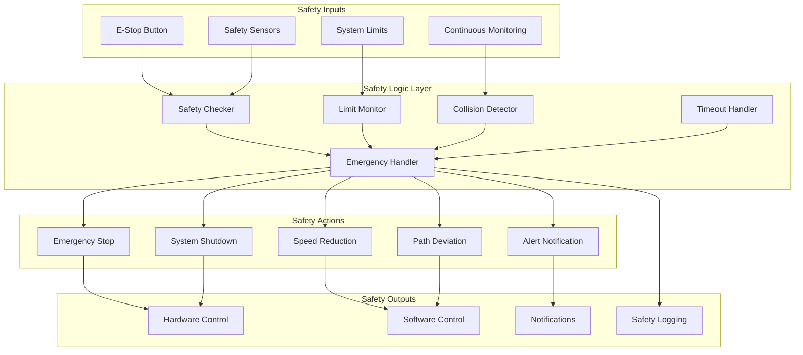

# Safety Logic - OHT-50 Backend

## 📋 Tổng quan
Tài liệu này mô tả hệ thống logic an toàn cho OHT-50 Backend, bao gồm các cơ chế bảo vệ, kiểm tra an toàn và xử lý sự cố.

## 🛡️ Safety Architecture



## 🔧 Core Safety Components

### 1. Safety State Machine
```python
from enum import Enum
from dataclasses import dataclass
from typing import Optional, Dict, Any
from datetime import datetime

class SafetyState(str, Enum):
    SAFE = "safe"
    WARNING = "warning"
    CRITICAL = "critical"
    EMERGENCY = "emergency"
    SHUTDOWN = "shutdown"

class SafetyEventType(str, Enum):
    E_STOP_PRESSED = "e_stop_pressed"
    SPEED_LIMIT_EXCEEDED = "speed_limit_exceeded"
    POSITION_LIMIT_EXCEEDED = "position_limit_exceeded"
    COLLISION_DETECTED = "collision_detected"
    COMMUNICATION_TIMEOUT = "communication_timeout"
    HARDWARE_ERROR = "hardware_error"
    SOFTWARE_ERROR = "software_error"

@dataclass
class SafetyEvent:
    event_type: SafetyEventType
    severity: str
    description: str
    timestamp: datetime
    source: str
    data: Optional[Dict[str, Any]] = None

class SafetyStateMachine:
    def __init__(self):
        self.current_state = SafetyState.SAFE
        self.previous_state = SafetyState.SAFE
        self.state_history = []
        self.active_events = []
        
    def transition_to(self, new_state: SafetyState, reason: str = None):
        """Transition to new safety state"""
        if new_state == self.current_state:
            return
        
        self.previous_state = self.current_state
        self.current_state = new_state
        
        # Log state transition
        self.state_history.append({
            "from_state": self.previous_state,
            "to_state": self.current_state,
            "timestamp": datetime.utcnow(),
            "reason": reason
        })
        
        # Execute state-specific actions
        self._execute_state_actions(new_state)
    
    def _execute_state_actions(self, state: SafetyState):
        """Execute actions for specific safety state"""
        actions = {
            SafetyState.SAFE: self._actions_safe,
            SafetyState.WARNING: self._actions_warning,
            SafetyState.CRITICAL: self._actions_critical,
            SafetyState.EMERGENCY: self._actions_emergency,
            SafetyState.SHUTDOWN: self._actions_shutdown
        }
        
        if state in actions:
            actions[state]()
    
    def _actions_safe(self):
        """Actions when system is in safe state"""
        # Resume normal operations
        pass
    
    def _actions_warning(self):
        """Actions when system is in warning state"""
        # Reduce speed, increase monitoring
        pass
    
    def _actions_critical(self):
        """Actions when system is in critical state"""
        # Stop movement, prepare for emergency
        pass
    
    def _actions_emergency(self):
        """Actions when system is in emergency state"""
        # Immediate stop, activate safety systems
        pass
    
    def _actions_shutdown(self):
        """Actions when system is in shutdown state"""
        # Complete system shutdown
        pass
```

### 2. Safety Limits & Constraints
```python
from dataclasses import dataclass
from typing import Dict, Any

@dataclass
class SafetyLimits:
    # Speed limits
    max_speed: float = 1000.0  # mm/s
    max_acceleration: float = 500.0  # mm/s²
    max_jerk: float = 1000.0  # mm/s³
    
    # Position limits
    max_position_x: float = 10000.0  # mm
    max_position_y: float = 10000.0  # mm
    max_position_z: float = 1000.0   # mm
    
    # Time limits
    max_mission_duration: int = 3600  # seconds
    max_communication_timeout: int = 30  # seconds
    max_response_time: int = 100  # milliseconds
    
    # Safety margins
    collision_margin: float = 100.0  # mm
    emergency_stop_distance: float = 50.0  # mm
    
    # System limits
    max_temperature: float = 80.0  # °C
    min_battery_level: float = 20.0  # %
    max_current: float = 10.0  # A

class SafetyLimitChecker:
    def __init__(self, limits: SafetyLimits):
        self.limits = limits
        self.violations = []
    
    def check_speed_limits(self, current_speed: float) -> bool:
        """Check if current speed is within limits"""
        if current_speed > self.limits.max_speed:
            self.violations.append({
                "type": "speed_limit_exceeded",
                "current": current_speed,
                "limit": self.limits.max_speed,
                "timestamp": datetime.utcnow()
            })
            return False
        return True
    
    def check_position_limits(self, position: Dict[str, float]) -> bool:
        """Check if current position is within limits"""
        violations = []
        
        if abs(position.get('x', 0)) > self.limits.max_position_x:
            violations.append("x_position_exceeded")
        if abs(position.get('y', 0)) > self.limits.max_position_y:
            violations.append("y_position_exceeded")
        if abs(position.get('z', 0)) > self.limits.max_position_z:
            violations.append("z_position_exceeded")
        
        if violations:
            self.violations.append({
                "type": "position_limit_exceeded",
                "violations": violations,
                "position": position,
                "limits": {
                    "max_x": self.limits.max_position_x,
                    "max_y": self.limits.max_position_y,
                    "max_z": self.limits.max_position_z
                },
                "timestamp": datetime.utcnow()
            })
            return False
        return True
    
    def check_system_limits(self, system_data: Dict[str, float]) -> bool:
        """Check system parameters against limits"""
        violations = []
        
        if system_data.get('temperature', 0) > self.limits.max_temperature:
            violations.append("temperature_exceeded")
        if system_data.get('battery_level', 100) < self.limits.min_battery_level:
            violations.append("battery_low")
        if system_data.get('current', 0) > self.limits.max_current:
            violations.append("current_exceeded")
        
        if violations:
            self.violations.append({
                "type": "system_limit_exceeded",
                "violations": violations,
                "system_data": system_data,
                "timestamp": datetime.utcnow()
            })
            return False
        return True
    
    def get_violations(self) -> List[Dict[str, Any]]:
        """Get all current violations"""
        return self.violations.copy()
    
    def clear_violations(self):
        """Clear all violations"""
        self.violations.clear()
```

### 3. Collision Detection System
```python
import numpy as np
from typing import List, Tuple, Optional

@dataclass
class Obstacle:
    id: str
    position: Tuple[float, float, float]
    size: Tuple[float, float, float]
    velocity: Optional[Tuple[float, float, float]] = None
    type: str = "static"

@dataclass
class CollisionZone:
    center: Tuple[float, float, float]
    radius: float
    priority: int = 1

class CollisionDetector:
    def __init__(self, safety_margin: float = 100.0):
        self.safety_margin = safety_margin
        self.obstacles = []
        self.collision_zones = []
        self.detection_history = []
    
    def add_obstacle(self, obstacle: Obstacle):
        """Add obstacle to detection system"""
        self.obstacles.append(obstacle)
    
    def remove_obstacle(self, obstacle_id: str):
        """Remove obstacle from detection system"""
        self.obstacles = [obs for obs in self.obstacles if obs.id != obstacle_id]
    
    def add_collision_zone(self, zone: CollisionZone):
        """Add collision zone to detection system"""
        self.collision_zones.append(zone)
    
    def check_collision(self, current_position: Tuple[float, float, float], 
                       target_position: Tuple[float, float, float]) -> Dict[str, Any]:
        """Check for potential collisions along path"""
        collisions = []
        
        # Check static obstacles
        for obstacle in self.obstacles:
            if self._check_obstacle_collision(current_position, target_position, obstacle):
                collisions.append({
                    "type": "obstacle_collision",
                    "obstacle_id": obstacle.id,
                    "obstacle_type": obstacle.type,
                    "severity": "high"
                })
        
        # Check collision zones
        for zone in self.collision_zones:
            if self._check_zone_collision(current_position, target_position, zone):
                collisions.append({
                    "type": "zone_collision",
                    "zone_priority": zone.priority,
                    "severity": "medium" if zone.priority < 3 else "high"
                })
        
        # Check dynamic obstacles (predictive)
        dynamic_collisions = self._check_dynamic_collisions(current_position, target_position)
        collisions.extend(dynamic_collisions)
        
        return {
            "collision_detected": len(collisions) > 0,
            "collisions": collisions,
            "timestamp": datetime.utcnow()
        }
    
    def _check_obstacle_collision(self, start: Tuple[float, float, float], 
                                 end: Tuple[float, float, float], 
                                 obstacle: Obstacle) -> bool:
        """Check if path intersects with obstacle"""
        # Calculate distance from line segment to obstacle center
        line_vec = np.array(end) - np.array(start)
        point_vec = np.array(obstacle.position) - np.array(start)
        
        line_length = np.linalg.norm(line_vec)
        if line_length == 0:
            return np.linalg.norm(point_vec) <= (obstacle.size[0] / 2 + self.safety_margin)
        
        # Project point onto line
        t = np.dot(point_vec, line_vec) / (line_length ** 2)
        t = max(0, min(1, t))  # Clamp to line segment
        
        # Closest point on line segment
        closest_point = np.array(start) + t * line_vec
        
        # Distance to obstacle
        distance = np.linalg.norm(np.array(obstacle.position) - closest_point)
        
        return distance <= (obstacle.size[0] / 2 + self.safety_margin)
    
    def _check_zone_collision(self, start: Tuple[float, float, float], 
                             end: Tuple[float, float, float], 
                             zone: CollisionZone) -> bool:
        """Check if path intersects with collision zone"""
        # Calculate distance from line segment to zone center
        line_vec = np.array(end) - np.array(start)
        point_vec = np.array(zone.center) - np.array(start)
        
        line_length = np.linalg.norm(line_vec)
        if line_length == 0:
            return np.linalg.norm(point_vec) <= zone.radius
        
        # Project point onto line
        t = np.dot(point_vec, line_vec) / (line_length ** 2)
        t = max(0, min(1, t))  # Clamp to line segment
        
        # Closest point on line segment
        closest_point = np.array(start) + t * line_vec
        
        # Distance to zone
        distance = np.linalg.norm(np.array(zone.center) - closest_point)
        
        return distance <= zone.radius
    
    def _check_dynamic_collisions(self, start: Tuple[float, float, float], 
                                 end: Tuple[float, float, float]) -> List[Dict[str, Any]]:
        """Check for potential collisions with moving obstacles"""
        collisions = []
        
        for obstacle in self.obstacles:
            if obstacle.velocity is None:
                continue
            
            # Predict obstacle position at different times
            path_time = np.linalg.norm(np.array(end) - np.array(start)) / 500.0  # Assume 500 mm/s
            
            for t in np.linspace(0, path_time, 10):
                predicted_position = (
                    obstacle.position[0] + obstacle.velocity[0] * t,
                    obstacle.position[1] + obstacle.velocity[1] * t,
                    obstacle.position[2] + obstacle.velocity[2] * t
                )
                
                if self._check_obstacle_collision(start, end, 
                                                Obstacle(obstacle.id, predicted_position, obstacle.size)):
                    collisions.append({
                        "type": "dynamic_collision",
                        "obstacle_id": obstacle.id,
                        "predicted_time": t,
                        "severity": "high"
                    })
                    break
        
        return collisions
```

### 4. Emergency Stop Handler
```python
from typing import Callable, List
import asyncio

class EmergencyStopHandler:
    def __init__(self):
        self.is_emergency_active = False
        self.emergency_callbacks: List[Callable] = []
        self.recovery_callbacks: List[Callable] = []
        self.emergency_history = []
    
    def register_emergency_callback(self, callback: Callable):
        """Register callback to be called during emergency stop"""
        self.emergency_callbacks.append(callback)
    
    def register_recovery_callback(self, callback: Callable):
        """Register callback to be called during recovery"""
        self.recovery_callbacks.append(callback)
    
    async def trigger_emergency_stop(self, reason: str = "unknown"):
        """Trigger emergency stop sequence"""
        if self.is_emergency_active:
            return  # Already in emergency state
        
        self.is_emergency_active = True
        
        # Log emergency event
        emergency_event = {
            "type": "emergency_stop_triggered",
            "reason": reason,
            "timestamp": datetime.utcnow()
        }
        self.emergency_history.append(emergency_event)
        
        # Execute emergency callbacks
        for callback in self.emergency_callbacks:
            try:
                if asyncio.iscoroutinefunction(callback):
                    await callback(emergency_event)
                else:
                    callback(emergency_event)
            except Exception as e:
                # Log callback error but continue with other callbacks
                print(f"Emergency callback error: {e}")
        
        # Send emergency notification
        await self._send_emergency_notification(emergency_event)
    
    async def clear_emergency_stop(self, reason: str = "manual_clear"):
        """Clear emergency stop state"""
        if not self.is_emergency_active:
            return  # Not in emergency state
        
        self.is_emergency_active = False
        
        # Log recovery event
        recovery_event = {
            "type": "emergency_stop_cleared",
            "reason": reason,
            "timestamp": datetime.utcnow()
        }
        self.emergency_history.append(recovery_event)
        
        # Execute recovery callbacks
        for callback in self.recovery_callbacks:
            try:
                if asyncio.iscoroutinefunction(callback):
                    await callback(recovery_event)
                else:
                    callback(recovery_event)
            except Exception as e:
                print(f"Recovery callback error: {e}")
        
        # Send recovery notification
        await self._send_recovery_notification(recovery_event)
    
    async def _send_emergency_notification(self, event: Dict[str, Any]):
        """Send emergency notification to all subscribers"""
        # Implementation depends on notification system
        pass
    
    async def _send_recovery_notification(self, event: Dict[str, Any]):
        """Send recovery notification to all subscribers"""
        # Implementation depends on notification system
        pass
    
    def get_emergency_status(self) -> Dict[str, Any]:
        """Get current emergency status"""
        return {
            "is_emergency_active": self.is_emergency_active,
            "last_emergency": self.emergency_history[-1] if self.emergency_history else None,
            "emergency_count": len([e for e in self.emergency_history if e["type"] == "emergency_stop_triggered"])
        }
```

## 🔄 Safety Integration

### 1. Safety Service Integration
```python
from fastapi import APIRouter, Depends, HTTPException
from typing import List

class SafetyService:
    def __init__(self):
        self.state_machine = SafetyStateMachine()
        self.limit_checker = SafetyLimitChecker(SafetyLimits())
        self.collision_detector = CollisionDetector()
        self.emergency_handler = EmergencyStopHandler()
        
        # Register emergency callbacks
        self.emergency_handler.register_emergency_callback(self._on_emergency_stop)
        self.emergency_handler.register_recovery_callback(self._on_emergency_recovery)
    
    async def check_safety_status(self) -> Dict[str, Any]:
        """Check overall safety status"""
        return {
            "current_state": self.state_machine.current_state,
            "limit_violations": self.limit_checker.get_violations(),
            "emergency_status": self.emergency_handler.get_emergency_status(),
            "timestamp": datetime.utcnow()
        }
    
    async def process_safety_event(self, event: SafetyEvent):
        """Process safety event and update state"""
        # Add event to active events
        self.state_machine.active_events.append(event)
        
        # Determine new state based on event
        new_state = self._determine_state_from_event(event)
        
        # Transition to new state
        self.state_machine.transition_to(new_state, event.description)
        
        # Take appropriate action
        await self._take_safety_action(event, new_state)
    
    def _determine_state_from_event(self, event: SafetyEvent) -> SafetyState:
        """Determine new safety state based on event"""
        if event.event_type == SafetyEventType.E_STOP_PRESSED:
            return SafetyState.EMERGENCY
        elif event.event_type == SafetyEventType.COLLISION_DETECTED:
            return SafetyState.CRITICAL
        elif event.event_type == SafetyEventType.SPEED_LIMIT_EXCEEDED:
            return SafetyState.WARNING
        elif event.event_type == SafetyEventType.COMMUNICATION_TIMEOUT:
            return SafetyState.WARNING
        else:
            return SafetyState.SAFE
    
    async def _take_safety_action(self, event: SafetyEvent, state: SafetyState):
        """Take appropriate action based on safety event and state"""
        if state == SafetyState.EMERGENCY:
            await self.emergency_handler.trigger_emergency_stop(event.description)
        elif state == SafetyState.CRITICAL:
            # Reduce speed, prepare for emergency
            pass
        elif state == SafetyState.WARNING:
            # Increase monitoring, reduce speed
            pass
    
    async def _on_emergency_stop(self, event: Dict[str, Any]):
        """Callback when emergency stop is triggered"""
        # Update state machine
        self.state_machine.transition_to(SafetyState.EMERGENCY, "Emergency stop triggered")
        
        # Stop all missions
        # Implementation depends on mission service
        
        # Notify all connected clients
        # Implementation depends on WebSocket service
    
    async def _on_emergency_recovery(self, event: Dict[str, Any]):
        """Callback when emergency stop is cleared"""
        # Update state machine
        self.state_machine.transition_to(SafetyState.SAFE, "Emergency stop cleared")
        
        # Resume normal operations
        # Implementation depends on mission service

# FastAPI router
router = APIRouter()

@router.get("/safety/status")
async def get_safety_status(safety_service: SafetyService = Depends()):
    """Get current safety status"""
    return await safety_service.check_safety_status()

@router.post("/safety/emergency-stop")
async def trigger_emergency_stop(
    reason: str = "manual_trigger",
    safety_service: SafetyService = Depends()
):
    """Manually trigger emergency stop"""
    await safety_service.emergency_handler.trigger_emergency_stop(reason)
    return {"message": "Emergency stop triggered", "reason": reason}

@router.post("/safety/clear-emergency")
async def clear_emergency_stop(
    reason: str = "manual_clear",
    safety_service: SafetyService = Depends()
):
    """Clear emergency stop state"""
    await safety_service.emergency_handler.clear_emergency_stop(reason)
    return {"message": "Emergency stop cleared", "reason": reason}
```

### 2. Mission Integration
```python
class MissionSafetyIntegration:
    def __init__(self, safety_service: SafetyService):
        self.safety_service = safety_service
        
        # Register safety callbacks
        self.safety_service.emergency_handler.register_emergency_callback(self._on_emergency_stop)
        self.safety_service.emergency_handler.register_recovery_callback(self._on_emergency_recovery)
    
    async def validate_mission_safety(self, mission_data: Dict[str, Any]) -> Dict[str, Any]:
        """Validate mission for safety compliance"""
        safety_issues = []
        
        # Check speed limits
        if mission_data.get('speed', 0) > self.safety_service.limit_checker.limits.max_speed:
            safety_issues.append({
                "type": "speed_limit_exceeded",
                "current": mission_data.get('speed'),
                "limit": self.safety_service.limit_checker.limits.max_speed
            })
        
        # Check position limits
        target_position = mission_data.get('target_position', {})
        if not self.safety_service.limit_checker.check_position_limits(target_position):
            safety_issues.append({
                "type": "position_limit_exceeded",
                "position": target_position
            })
        
        # Check for collisions
        current_position = mission_data.get('current_position', {'x': 0, 'y': 0, 'z': 0})
        collision_check = self.safety_service.collision_detector.check_collision(
            (current_position['x'], current_position['y'], current_position['z']),
            (target_position['x'], target_position['y'], target_position['z'])
        )
        
        if collision_check['collision_detected']:
            safety_issues.append({
                "type": "collision_detected",
                "collisions": collision_check['collisions']
            })
        
        return {
            "safe_to_execute": len(safety_issues) == 0,
            "safety_issues": safety_issues,
            "timestamp": datetime.utcnow()
        }
    
    async def _on_emergency_stop(self, event: Dict[str, Any]):
        """Handle emergency stop during mission execution"""
        # Stop current mission
        # Implementation depends on mission execution engine
        
        # Log emergency event
        # Implementation depends on logging service
    
    async def _on_emergency_recovery(self, event: Dict[str, Any]):
        """Handle emergency recovery"""
        # Resume mission if appropriate
        # Implementation depends on mission execution engine
```

## 📊 Safety Monitoring & Reporting

### 1. Safety Metrics Collection
```python
from prometheus_client import Counter, Gauge, Histogram

class SafetyMetrics:
    # Safety events
    safety_events_total = Counter(
        'oht50_safety_events_total',
        'Total safety events',
        ['event_type', 'severity']
    )
    
    # Emergency stops
    emergency_stops_total = Counter(
        'oht50_emergency_stops_total',
        'Total emergency stops',
        ['reason']
    )
    
    # Safety state
    safety_state = Gauge(
        'oht50_safety_state',
        'Current safety state',
        ['state']
    )
    
    # Response times
    safety_response_time_seconds = Histogram(
        'oht50_safety_response_time_seconds',
        'Safety system response time',
        ['event_type']
    )

class SafetyMonitor:
    def __init__(self, safety_service: SafetyService):
        self.safety_service = safety_service
        self.metrics = SafetyMetrics()
    
    async def record_safety_event(self, event: SafetyEvent):
        """Record safety event metrics"""
        self.metrics.safety_events_total.labels(
            event_type=event.event_type.value,
            severity=event.severity
        ).inc()
        
        # Update safety state metric
        self.metrics.safety_state.labels(
            state=self.safety_service.state_machine.current_state.value
        ).set(1)
    
    async def record_emergency_stop(self, reason: str):
        """Record emergency stop metrics"""
        self.metrics.emergency_stops_total.labels(reason=reason).inc()
    
    async def record_response_time(self, event_type: str, response_time: float):
        """Record safety response time"""
        self.metrics.safety_response_time_seconds.labels(event_type=event_type).observe(response_time)
```

### 2. Safety Reporting
```python
class SafetyReporter:
    def __init__(self, safety_service: SafetyService):
        self.safety_service = safety_service
    
    async def generate_safety_report(self, start_time: datetime, end_time: datetime) -> Dict[str, Any]:
        """Generate safety report for time period"""
        # Get safety events in time period
        events = [e for e in self.safety_service.state_machine.state_history 
                 if start_time <= e['timestamp'] <= end_time]
        
        # Calculate statistics
        emergency_stops = len([e for e in events if e['to_state'] == SafetyState.EMERGENCY.value])
        warnings = len([e for e in events if e['to_state'] == SafetyState.WARNING.value])
        critical_events = len([e for e in events if e['to_state'] == SafetyState.CRITICAL.value])
        
        # Calculate uptime
        total_time = (end_time - start_time).total_seconds()
        safe_time = sum([(e['timestamp'] - events[i-1]['timestamp']).total_seconds() 
                        for i, e in enumerate(events) 
                        if e['to_state'] == SafetyState.SAFE.value])
        uptime_percentage = (safe_time / total_time) * 100 if total_time > 0 else 100
        
        return {
            "period": {
                "start": start_time.isoformat(),
                "end": end_time.isoformat()
            },
            "statistics": {
                "emergency_stops": emergency_stops,
                "warnings": warnings,
                "critical_events": critical_events,
                "uptime_percentage": uptime_percentage
            },
            "events": events,
            "generated_at": datetime.utcnow().isoformat()
        }
```

## 🔧 Configuration

### 1. Safety Configuration
```yaml
safety:
  limits:
    max_speed: 1000.0  # mm/s
    max_acceleration: 500.0  # mm/s²
    max_jerk: 1000.0  # mm/s³
    max_position_x: 10000.0  # mm
    max_position_y: 10000.0  # mm
    max_position_z: 1000.0  # mm
    max_temperature: 80.0  # °C
    min_battery_level: 20.0  # %
    max_current: 10.0  # A
  
  collision_detection:
    safety_margin: 100.0  # mm
    detection_frequency: 10  # Hz
    prediction_horizon: 5.0  # seconds
  
  emergency_stop:
    response_time: 100  # milliseconds
    auto_recovery_enabled: false
    manual_clear_required: true
  
  monitoring:
    metrics_enabled: true
    reporting_interval: 3600  # seconds
    alert_thresholds:
      emergency_stops_per_hour: 1
      warnings_per_hour: 5
      uptime_minimum: 95.0  # %
```

### 2. Safety Testing
```python
import pytest
from unittest.mock import Mock, AsyncMock

class TestSafetySystem:
    @pytest.fixture
    def safety_service(self):
        return SafetyService()
    
    @pytest.fixture
    def emergency_handler(self):
        return EmergencyStopHandler()
    
    async def test_emergency_stop_trigger(self, emergency_handler):
        """Test emergency stop triggering"""
        callback_called = False
        
        def test_callback(event):
            nonlocal callback_called
            callback_called = True
            assert event['type'] == 'emergency_stop_triggered'
        
        emergency_handler.register_emergency_callback(test_callback)
        await emergency_handler.trigger_emergency_stop("test_reason")
        
        assert emergency_handler.is_emergency_active
        assert callback_called
    
    async def test_safety_limit_checking(self, safety_service):
        """Test safety limit checking"""
        # Test speed limit
        assert safety_service.limit_checker.check_speed_limits(500.0)  # Should pass
        assert not safety_service.limit_checker.check_speed_limits(1500.0)  # Should fail
        
        # Test position limit
        position = {'x': 5000.0, 'y': 5000.0, 'z': 500.0}
        assert safety_service.limit_checker.check_position_limits(position)  # Should pass
        
        position = {'x': 15000.0, 'y': 5000.0, 'z': 500.0}
        assert not safety_service.limit_checker.check_position_limits(position)  # Should fail
    
    async def test_collision_detection(self, safety_service):
        """Test collision detection"""
        # Add obstacle
        obstacle = Obstacle(
            id="test_obstacle",
            position=(1000.0, 1000.0, 0.0),
            size=(200.0, 200.0, 200.0)
        )
        safety_service.collision_detector.add_obstacle(obstacle)
        
        # Test collision detection
        start_pos = (0.0, 0.0, 0.0)
        end_pos = (2000.0, 2000.0, 0.0)
        
        collision_result = safety_service.collision_detector.check_collision(start_pos, end_pos)
        assert collision_result['collision_detected']
        assert len(collision_result['collisions']) > 0
```

---

**Changelog v1.0:**
- ✅ Created comprehensive safety logic system
- ✅ Added safety state machine
- ✅ Implemented safety limits and constraints
- ✅ Added collision detection system
- ✅ Created emergency stop handler
- ✅ Added safety service integration
- ✅ Included mission safety integration
- ✅ Added safety monitoring and reporting
- ✅ Created safety configuration
- ✅ Added safety testing framework
