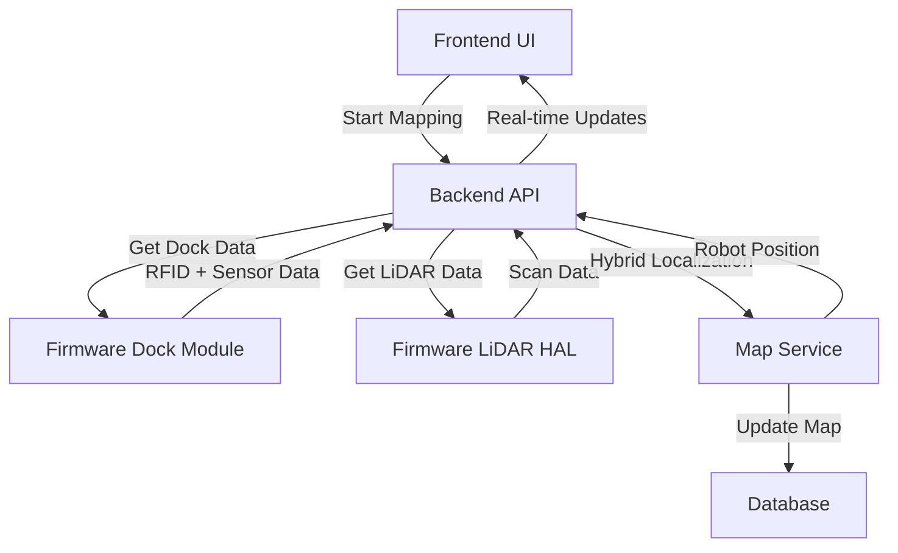
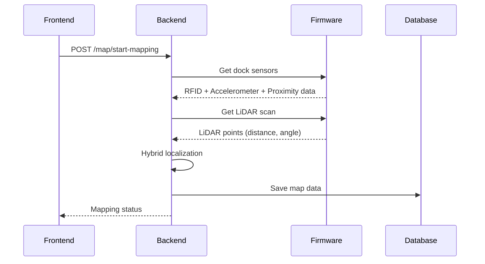

# 🗺️ MAP & LOCALIZATION IMPLEMENTATION PLAN - PHƯƠNG ÁN 3 (HYBRID)

**Phiên bản:** 1.0  
**Ngày:** 2025-01-28  
**Mục tiêu:** Implement hybrid mapping và localization system cho OHT-50  
**Phương án:** Kết hợp Dock Location + LiDAR HAL  

---

## 📋 **TỔNG QUAN PHƯƠNG ÁN 3 (HYBRID)**

### **🎯 Mục tiêu chính:**
- Tạo map của môi trường làm việc
- Định vị robot chính xác trên map
- Kết hợp ưu điểm của Dock Location và LiDAR
- Xử lý cả 2 trường hợp: đã có map và chưa có map

### **🔧 Công nghệ sử dụng:**
- **Dock Location Module:** RFID location + Accelerometer + Proximity sensors
- **LiDAR HAL:** Quét môi trường, phát hiện obstacles
- **Hybrid Algorithm:** Kết hợp RFID + LiDAR + Sensor fusion
- **Occupancy Grid:** Lưu trữ map dạng grid

---

## 🏗️ **KIẾN TRÚC HỆ THỐNG**

### **1. Frontend → Backend → Firmware Flow:**



### **2. Data Flow:**



---

## 📊 **2 TRƯỜNG HỢP XỬ LÝ**

### **🔍 TRƯỜNG HỢP 1: CHƯA CÓ MAP**

#### **Quy trình:**
1. **Frontend:** User click "Start New Map"
2. **Backend:** Tạo map mới với tên được chỉ định
3. **Firmware:** Lấy RFID location làm reference point
4. **Backend:** Bắt đầu mapping loop với sensor fusion
5. **LiDAR:** Quét môi trường và cập nhật occupancy grid
6. **Backend:** Lưu map vào database

#### **Ưu điểm:**
- Map mới, không có dữ liệu cũ
- RFID location làm reference chính xác
- Mapping từ đầu, đầy đủ thông tin

#### **Nhược điểm:**
- Mất thời gian mapping toàn bộ
- Cần di chuyển robot để quét đầy đủ

### **🔄 TRƯỜNG HỢP 2: ĐÃ CÓ MAP**

#### **Quy trình:**
1. **Frontend:** User click "Continue Mapping" hoặc "Load Map"
2. **Backend:** Tải map hiện có từ database
3. **Firmware:** Lấy RFID location hiện tại
4. **Backend:** So sánh với RFID locations đã lưu
5. **Backend:** Tiếp tục mapping trên map hiện có
6. **LiDAR:** Cập nhật map với dữ liệu mới

#### **Ưu điểm:**
- Tiếp tục từ map đã có
- Không mất thời gian mapping lại
- Cập nhật map với thông tin mới

#### **Nhược điểm:**
- Cần xử lý map cũ
- Có thể có conflict giữa dữ liệu cũ và mới

---

## 🎯 **HYBRID LOCALIZATION ALGORITHM**

### **1. Ưu tiên RFID Location (Độ tin cậy cao):**
```python
if rfid_confidence > 0.8:
    robot_position = rfid_position
    source = "rfid"
    confidence = 0.9
```

### **2. Sử dụng Sensor Fusion (RFID + Accelerometer + Proximity):**
```python
elif sensor_fusion_confidence > 0.6:
    robot_position = sensor_fusion_localization()
    source = "sensor_fusion"
    confidence = 0.7
```

### **3. Sử dụng LiDAR (Khi sensors không khả dụng):**
```python
elif lidar_confidence > 0.5:
    robot_position = lidar_localization()
    source = "lidar"
    confidence = 0.6
```

### **4. Fallback (Khi cả 3 đều không khả dụng):**
```python
else:
    robot_position = last_known_position
    source = "fallback"
    confidence = 0.1
```

---

## 📡 **API ENDPOINTS CẦN IMPLEMENT**

### **1. Map Management:**
- `POST /map/start-mapping` - Bắt đầu mapping
- `POST /map/stop-mapping` - Dừng mapping
- `GET /map/status` - Trạng thái mapping
- `GET /map/current` - Map hiện tại
- `POST /map/load/{map_id}` - Tải map

### **2. Localization:**
- `GET /map/robot-position` - Vị trí robot
- `GET /map/occupancy-grid` - Occupancy grid
- `GET /map/trajectory` - Quỹ đạo robot

### **3. Map Storage:**
- `GET /map/list` - Danh sách maps
- `DELETE /map/{map_id}` - Xóa map
- `PUT /map/{map_id}` - Cập nhật map

---

## 🗄️ **DATABASE SCHEMA**

### **1. Maps Table:**
```sql
CREATE TABLE maps (
    id INTEGER PRIMARY KEY,
    map_id VARCHAR(50) UNIQUE,
    name VARCHAR(100),
    resolution FLOAT,
    width INTEGER,
    height INTEGER,
    occupancy_grid JSON,
    robot_trajectory JSON,
    dock_positions JSON,
    created_at TIMESTAMP,
    updated_at TIMESTAMP
);
```

### **2. Map Sessions Table:**
```sql
CREATE TABLE map_sessions (
    id INTEGER PRIMARY KEY,
    map_id VARCHAR(50),
    session_id VARCHAR(50) UNIQUE,
    start_time TIMESTAMP,
    end_time TIMESTAMP,
    is_active BOOLEAN,
    total_scans INTEGER,
    mapping_quality FLOAT
);
```

### **3. Robot Positions Table:**
```sql
CREATE TABLE robot_positions (
    id INTEGER PRIMARY KEY,
    map_id VARCHAR(50),
    x FLOAT,
    y FLOAT,
    theta FLOAT,
    confidence FLOAT,
    source VARCHAR(20),
    timestamp TIMESTAMP
);
```

---

## 🔄 **QUY TRÌNH IMPLEMENTATION**

### **Phase 1: Core Services (1 tuần)**
- [ ] Tạo MapService class
- [ ] Implement hybrid localization
- [ ] Tạo database models
- [ ] Basic map storage

### **Phase 2: API Endpoints (1 tuần)**
- [ ] Map management APIs
- [ ] Localization APIs
- [ ] Map storage APIs
- [ ] Authentication & authorization

### **Phase 3: Integration (1 tuần)**
- [ ] Firmware integration
- [ ] Real-time updates
- [ ] Error handling
- [ ] Performance optimization

### **Phase 4: Testing & Validation (1 tuần)**
- [ ] Unit tests
- [ ] Integration tests
- [ ] E2E tests
- [ ] Performance tests

---

## 📈 **PERFORMANCE REQUIREMENTS**

### **Response Time:**
- Map status: < 50ms
- Robot position: < 100ms
- Map data: < 200ms
- Start/stop mapping: < 500ms

### **Throughput:**
- LiDAR processing: 10Hz
- Map updates: 5Hz
- Position updates: 20Hz

### **Accuracy:**
- Dock localization: ±10mm
- LiDAR localization: ±50mm
- Hybrid localization: ±20mm

---

## 🚨 **RISK ASSESSMENT**

### **High Risk:**
- Firmware integration complexity
- Real-time performance requirements
- Map data synchronization

### **Medium Risk:**
- Database performance với large maps
- Memory usage với occupancy grid
- Coordinate transformation accuracy

### **Low Risk:**
- API endpoint implementation
- Frontend integration
- Basic map storage

---

## 💰 **RESOURCE REQUIREMENTS**

### **Development Time:**
- Backend development: 3-4 tuần
- Testing & validation: 1 tuần
- Integration: 1 tuần
- **Total: 5-6 tuần**

### **Team Members:**
- Backend developer: 1 người
- Firmware developer: 0.5 người (support)
- QA tester: 0.5 người
- **Total: 2 người**

### **Hardware Requirements:**
- Database storage: 1GB per map
- Memory: 512MB for map processing
- CPU: Moderate (real-time processing)

---

## 📋 **DELIVERABLES**

### **1. Code:**
- MapService class
- API endpoints
- Database models
- Integration tests

### **2. Documentation:**
- API documentation
- Integration guide
- User manual
- Technical specifications

### **3. Testing:**
- Unit test suite
- Integration test suite
- Performance benchmarks
- Validation reports

---

## 🎯 **SUCCESS CRITERIA**

### **Functional:**
- ✅ Tạo map thành công
- ✅ Định vị robot chính xác
- ✅ Xử lý cả 2 trường hợp (có/không có map)
- ✅ Real-time updates

### **Performance:**
- ✅ Response time < requirements
- ✅ Memory usage < 512MB
- ✅ CPU usage < 60%

### **Quality:**
- ✅ Test coverage > 90%
- ✅ Zero critical bugs
- ✅ Documentation complete

---

## 📞 **NEXT STEPS**

### **Immediate (Tuần 1):**
1. **PM Review:** Review và approve plan
2. **Team Assignment:** Assign developers
3. **Environment Setup:** Setup development environment
4. **Database Design:** Finalize database schema

### **Short-term (Tuần 2-3):**
1. **Core Development:** Implement MapService
2. **API Development:** Create endpoints
3. **Integration:** Connect với firmware
4. **Testing:** Unit và integration tests

### **Long-term (Tuần 4-6):**
1. **Performance Optimization:** Optimize real-time processing
2. **E2E Testing:** Complete system testing
3. **Documentation:** Complete technical docs
4. **Deployment:** Production deployment

---

**🚨 Lưu ý:** Tài liệu này cần được PM review và approve trước khi bắt đầu implementation. Mọi thay đổi về scope hoặc timeline cần được thông báo và approve lại.

**Changelog v1.0:**
- ✅ Created comprehensive implementation plan
- ✅ Defined 2 scenarios (with/without existing map)
- ✅ Detailed hybrid localization algorithm
- ✅ Specified API endpoints và database schema
- ✅ Outlined implementation phases và timeline
- ✅ Identified risks và resource requirements
- ✅ Set success criteria và deliverables

